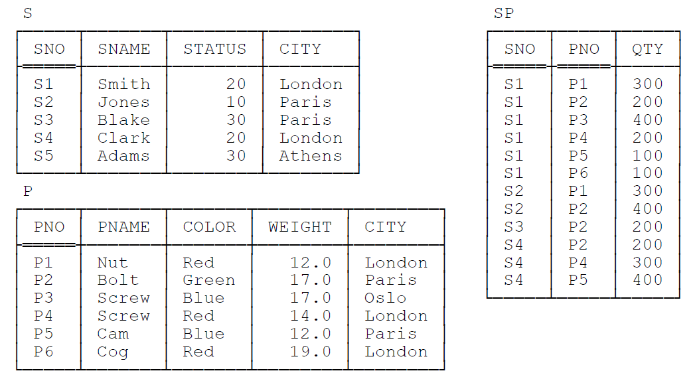

Chapter 1 - A Motivating Example
==

第1章 趣味入门示例
==

	Example is always more efficacious than precept
	— Samuel Johnson: Rasselas (1759)

	例子总是比规则更有效
	//身教重于言教
			—— 塞缪尔·约翰逊: 《拉塞勒斯》(1759)

Examples throughout this book are based for the most part on the familiar (not to say hackneyed) suppliers-and-parts database. I apologize for dragging out this old warhorse yet one more time, but as I’ve said elsewhere, I believe using the same example in a variety of different publications can be a help, not a hindrance, in learning. In SQL terms[1],the database contains three tables— more specifically, three base tables—called S (“suppliers”), P (“parts”), and SP (“shipments”), respectively. Sample values are shown in Fig. 1.1.

本书中的示例大多基于常见(而不老套)的汽车配件与供应商(suppliers-and-parts)数据库。 很惭愧我一直都在使用这个例子,但就如我曾多次提到, 在各个地方使用同样的例子可以快速掌握核心知识,而不因背景知识的不同而成为学习的阻碍。用SQL专业术语来说[1], 这个数据库(database)包含三张表(table) —— 更确切地说,是三张基本表,分别是: S(“供应商”,suppliers)、P(“配件”,parts), 以及SP(“供货单”,shipments)。示例数据如图1.1所示。

Fig. 1.1: The suppliers-and-parts database—sample values

表 1.1 : 供应商(S, suppliers)与配件(P, parts)表结构及相关数据

1' I use SQL and SQL-style syntax in this introductory chapter for reasons of familiarity, despite the fact that it’s not really to my taste, and (more to the point, perhaps) despite the fact that it actually makes the motivating example harder to explain properly.

1' 在本章中使用了SQL以及SQL风格的语法,为了熟悉和方便,作者觉得不这样的话会对精彩的入门示例学习造成一些学习障碍.

The semantics (in outline) are as follows:

每张表所代表的含义如下:

Table S represents suppliers under contract. Each supplier has one supplier number (SNO), unique to that supplier; one name (SNAME), not necessarily unique (though the sample values shown in Fig. 1.1 do happen to be unique); one status value (STATUS); and one location (CITY). Note: In the rest of this book I’ll abbreviate “suppliers under contract,” most of the time, to just suppliers.

表 **S** 对应的是合同供应商. 每个供应商都有一个唯一编号(SNO, supplier number); 一个名字(SNAME),名字不要求是唯一的(碰巧图1.1中的示例数据中没有重复的名字);  一个状态值(STATUS); 以及一个地理位置(CITY). 请注意: 在本书中,一般将 合同供应商(suppliers under contract) 简写为 供应商(suppliers).

Table P represents kinds of parts. Each kind of part has one part number (PNO), which is unique; one name (PNAME); one color (COLOR); one weight (WEIGHT); and one location where parts of that kind are stored (CITY). Note: In the rest of this book I’ll abbreviate “kinds of parts,” most of the time, to just parts.

表 **P** 代表各种配件. 每种配件有一个唯一的 配件编号(PNO, part number); 一个名字(PNAME); 一种颜色(COLOR); 一个重量值(WEIGHT); 以及这种类型的配件存放的位置(CITY). 请注意: 在本书中,一般将 配件种类(kinds of parts) 简写为 配件(parts).

Table SP represents shipments—it shows which parts are shipped, or supplied, by which suppliers. Each shipment has one supplier number (SNO); one part number (PNO); and one quantity (QTY). Also, there’s at most one shipment at any given time for a given supplier and given part, and so the combination of supplier number and part number is unique to any given shipment. Note: In the rest of this book I’ll assume QTY values are
always greater than zero.

表 **SP** 表示的是运送关系. 即每种类型的配件,由 哪个供应商送货/供货. 每条运送关系包括一个供应商编号(SNO); 一个配件种类编号(PNO); 以及运送数量(QTY). 当然,同一种货物与同一个供应商只会有一条记录,所以供应商编号与配件种类编号两者组合起来就是唯一的. 请注意: 在本书中, 假设 QTY 的值都是正整数.

Now I want to focus on table S specifically; for the rest of this chapter, in fact, I’ll mostly ignore tables P and SP, except for an occasional remark here and there. Here’s an SQL definition for that table S:

下面,我们看看表 S 的定义; 本章主要着重讲 S 表, 而对 P 表和 SP 表则会一笔带过. 

	CREATE TABLE S
		(	SNO VARCHAR(5) NOT NULL ,
			SNAME VARCHAR(25) NOT NULL ,
			STATUS INTEGER NOT NULL ,
			CITY VARCHAR(20) NOT NULL ,
			UNIQUE ( SNO ) ) ;

As I’ve said, table S is a base table, but of course we can define any number of views “on top of” that base table. Here are a couple of examples—LS (“London suppliers”) and NLS (“non London suppliers”):

如前面所说, S 表是一张基础表, 但我们可以在这张基础表“之上”定义多个视图. 例如,我们可以定义两个视图, LS(“London suppliers”,伦敦供应商) 和 NLS (“non London suppliers”,非伦敦供应商):

	CREATE VIEW LS /* London suppliers */ AS
		(	SELECT SNO , SNAME , STATUS , CITY
			FROM S
			WHERE CITY = ‘London’ ) ;

	CREATE VIEW NLS /* non London suppliers */ AS
		(	SELECT SNO , SNAME , STATUS , CITY
			FROM S
			WHERE CITY <> ‘London’ ) ;

Sample values for these views corresponding to the value of table S in Fig. 1.1 are shown
in Fig. 1.2.

与图1.1中S表相对应的视图数据如图1.2所示:

Fig. 1.2: Views LS and NLS—sample values

图1.2 视图 LS 与 NLS 的示例数据

Views LS and NLS are the ones I want to use in this initial chapter as the basis for my
motivating example. In essence, what I want to do with that example is try to give you some preliminary idea as to why I believe that—contrary to popular opinion and most conventional wisdom in this area—all views are updatable. (Note, however, that I must immediately qualify this very strong claim by making it clear that I’m necessarily speaking rather loosely at this stage. Later chapters will elaborate.)

视图 LS 与 NLS 是本章节的基础. 

使用这些例子的本意,是尽量让你初步意识到,为什么**我相信所有的视图都是可更新的**(而这与传统的思想和观念恰恰相反,但我必须在这里立即着重强调, 明确声明, 虽然不是很正式。后面的章节会详细介绍)。

### THE PRINCIPLE OF INTERCHANGEABILITY

### 可交换原则

So far, then, table S is a base table and tables LS and NLS are views. Observe now, however, that it could have been the other way around—that is, I could have made LS and NLS base tables and S a view, like this:

我们知道, S 表是一张基本表, 而 LS 以及 NLS 是两个视图。现在请注意观察, 我们可以将他们之间的关系交换过来,即: 把 LS 与 NLS作为基本表,而将 S 作为一个视图, SQL代码如下所示:

	CREATE TABLE LS
		(	SNO VARCHAR(5) NOT NULL ,
			SNAME VARCHAR(25) NOT NULL ,
			STATUS INTEGER NOT NULL ,
			CITY VARCHAR(20) NOT NULL ,
			UNIQUE ( SNO ) ) ;
	CREATE TABLE NLS
		(	SNO VARCHAR(5) NOT NULL ,
			SNAME VARCHAR(25) NOT NULL ,
			STATUS INTEGER NOT NULL ,
			CITY VARCHAR(20) NOT NULL ,
			UNIQUE ( SNO ) ) ;
	CREATE VIEW S AS
		(	SELECT SNO , SNAME , STATUS , CITY
			FROM LS
			UNION
			SELECT SNO , SNAME , STATUS , CITY
			FROM NLS ) ;

Note: In order to guarantee that this design is formally equivalent to the original one, I should really state, and have the DBMS enforce, certain integrity constraints—including in particular constraints to the effect that every CITY value in LS is London and no CITY value in NLS is—but I want to ignore such details for the moment. I’ll have a lot more to say about such matters in a little while, I promise you.

Anyway, the message of the example is that, in general, which tables are base ones and which ones are views is arbitrary (at least from a formal point of view). In other words, in the case at hand, we could design the database in at least two different ways—ways, that is, that are logically distinct but information equivalent. (By information equivalent here, I mean the two designs represent the same information, implying among other things that for any query on one, there’s a logically equivalent query on the other. Chapter 3 elaborates on this concept.) And The Principle of Interchangeability is a logical consequence of such considerations:

- Definition: The Principle of Interchangeability states that there must be no arbitrary and unnecessary distinctions between base tables and views; in other words, views should—as far as possible—“look and feel” just like base tables so far as users are concerned.

Here are some implications of this principle:

下面是这个原则的一些引申:

- As I’ve already suggested, views are subject to integrity constraints, just like base tables. (We usually think of integrity constraints as applying to base tables specifically, but The Principle of Interchangeability shows this position isn’t really tenable.)
- In particular, views have keys (and so I ought really to have included some key specifications in my view definitions; unfortunately, however, SQL doesn’t permit such specifications).2 They might also have foreign keys, and foreign keys might refer to them.
- Many SQL products, and the SQL standard, provide some kind of “row ID” feature (in the standard, that feature goes by the name of REF types and reference values). If that feature is available for base tables but not for views—which in practice is quite likely—then it clearly violates The Principle of Interchangeability.
- Perhaps most important of all, we must be able to update views—because if not, then that fact in itself would constitute the clearest possible violation of The Principle of Interchangeability.

2' Throughout this book I use the term key, unqualified, to mean a candidate key, not necessarily a primary key specifically. In fact, Tutorial D—see Chapter 2—has no syntax for distinguishing between primary and other keys. For reasons of familiarity, however, I use double underlining in figures like Fig. 1.1 to suggest that the attributes so underlined can be thought of as primary key attributes, if you like.

### BASE TABLES ONLY: CONSTRAINTS

### 只有基本表才有: 约束

One thing that follows from The Principle of Interchangeability is that the behavior of tables S, LS, and NLS shouldn’t depend on which if any are base tables and which if any are views. Until further notice, therefore, let’s suppose they’re all base tables:

	CREATE TABLE S ( ... , UNIQUE ( SNO ) ) ;
	CREATE TABLE LS ( ... , UNIQUE ( SNO ) ) ;
	CREATE TABLE NLS ( ... , UNIQUE ( SNO ) ) ;

Now, these tables, like all tables, are clearly subject to a number of constraints.
Unfortunately, most of those constraints are quite awkward to formulate in SQL, so I’ll content myself for present purposes with stating them in natural language only (and pretty informal natural language at that, for the most part). Here they are:

- {SNO} is a key for each of the tables; also, {SNO} in each of tables LS and NLS is a foreign key, referencing the key {SNO} in table S. Note: For an explanation of why I use braces “{” and “}” here, please refer to SQL and Relational Theory.3
- At any given time, table LS is equal to that restriction of table S where the CITY value is London, and table NLS is equal to that restriction of table S where the CITY value isn’t London. Moreover, every row of table LS has CITY value London,4 and no row of table NLS does.
- At any given time, table S is equal to the union of tables LS and NLS; moreover, that union is disjoint (i.e., the corresponding intersection is empty)—no row in S appears in both LS and NLS. To spell the point out in detail: Every row in S also appears in exactly one of LS and NLS, and every row in either LS or NLS also appears in S.
- Finally, the previous constraint and the constraint that {SNO} is a key for all three tables, taken together, imply that every supplier number (not just every row) in S also appears in exactly one of LS and NLS, and every supplier number in either LS or NLS also appears in S.

Of course, as the immediately preceding bullet point illustrates, the foregoing constraints aren’t all independent of one another—some of them are logical consequences of others.

3' I remind you from the preface that throughout this book I use “SQL and Relational Theory” as an abbreviated form of reference to my book SQL and Relational Theory: How to Write Accurate SQL Code (2nd edition, O’Reilly, 2012).

4' Precisely because of this fact, a more realistic version of view LS would probably drop the CITY attribute. I choose not to do so here, in order to keep the example simple.

**BASE TABLES ONLY: COMPENSATORY ACTIONS**

Now, in order to ensure that the constraints outlined in the previous section continue to hold
when certain updates are done, certain compensatory actions need to be in effect. In general, a
compensatory action—also known as a compensating action—is an additional update (over and
above some update explicitly requested by the user) that’s performed automatically by the
DBMS, precisely in order to avoid some integrity violation that might otherwise occur.5 Cascade
delete is a typical example.6 In the case at hand, in fact, it should be clear that cascading is
exactly what we need to deal with DELETE operations in particular. To be specific, deleting
rows from either LS or NLS clearly needs to cascade to cause those same rows to be deleted
from S. So we might imagine a couple of compensatory actions—actually cascade delete
rules—that look something like this (hypothetical syntax):

	ON DELETE d FROM LS : DELETE d FROM S ;
	ON DELETE d FROM NLS : DELETE d FROM S ;

Likewise, deleting rows from S clearly needs to cascade to cause those same rows to be
deleted from whichever of LS or NLS they appear in:

	ON DELETE d FROM S :	DELETE ( d WHERE CITY = ‘London’ ) FROM LS ,
							DELETE ( d WHERE CITY <> ‘London’ ) FROM NLS ;

As an aside, I remark that, given that an attempt to delete a nonexistent row has no effect—or so
I’m going to assume, at any rate—we could replace each of the expressions in parentheses in the
foregoing rule by just d. However, the expressions in parentheses are perhaps preferable, at least
inasmuch as they’re clearly more specific.
Analogously, we’ll need some compensatory actions (“cascade insert rules”) for INSERT
operations:

	ON INSERT i INTO LS : INSERT i INTO S ;
	ON INSERT i INTO NLS : INSERT i INTO S ;
	ON INSERT i INTO S :	INSERT ( i WHERE CITY = ‘London’ ) INTO LS ,
							INSERT ( i WHERE CITY <> ‘London’ ) INTO NLS ;

5' One reviewer asked why I chose the term compensatory action for this construct. Well, I should have thought the answer was
obvious, but in case it isn’t, let me spell it out: The reason I call such actions “compensatory” is because they cause a second
update to be done to compensate for the effects of the first (speaking a trifle loosely, of course).

6' Cascade delete is usually thought of as applying to foreign key constraints specifically; however, the concept of compensatory
actions is actually more general and applies to constraints of many kinds.

Note: The concept of cascade insert doesn’t usually arise in connection with foreign key
constraints, of course, but that’s no reason not to support such a concept in general. More
important, don’t get the idea that compensatory actions must always take the form of simple
cascades. While the ones discussed in this introductory chapter do all happen to take that form,
more complicated cases are likely to require actions of some less straightforward form, as we’ll
see in later chapters.
As for UPDATE operations, they can be regarded, at least in the case at hand, as a
DELETE and an INSERT taken in combination; as a consequence, the necessary compensatory
actions are just a combination of the corresponding delete and insert actions, loosely speaking.
For example, consider the following UPDATE on table S:

	UPDATE S
	SET CITY = ‘Oslo’
	WHERE SNO = ‘S1’ ;

What happens here is this:

1. The existing row for supplier S1 is deleted from table S and a new row for that supplier,
with CITY value Oslo, is inserted into that same table.
2. The existing row for supplier S1 is deleted from table LS as well, thanks to the cascade
delete rule from S to LS, and the new row for that supplier, with CITY value Oslo, is
inserted into table NLS as well, thanks to the cascade insert rule from S to NLS. In other
words, the row for supplier S1 has “migrated” from table LS to table NLS! (Of course,
here I’m speaking very loosely indeed.)

Suppose now that the original UPDATE had been directed at table LS rather than table S:

	UPDATE LS
	SET CITY = ‘Oslo’
	WHERE SNO = ‘S1’ ;

Now what happens is this:

1. The existing row for supplier S1 is deleted from table LS.
2. An attempt is made to insert a new row for supplier S1, with CITY value Oslo, into table
LS. That attempt fails, however, because it violates the constraint on table LS that the
CITY value in that table must always be London. So the update fails overall; the previous
step (viz., deleting the original row for supplier S1 from LS) is undone, and the net effect is
that the database remains unchanged.

**VIEWS: CONSTRAINTS AND COMPENSATORY ACTIONS**

Now I come to the real point of this chapter: Everything I’ve said in the previous two sections
applies pretty much unchanged if some or all of the tables concerned are views. For example,
suppose as we originally did that S is a base table and LS and NLS are views:

	CREATE TABLE S ( .............. , UNIQUE ( SNO ) ) ;
	CREATE VIEW LS AS ( SELECT ... WHERE CITY = ‘London’ ) ;
	CREATE VIEW NLS AS ( SELECT ... WHERE CITY <> ‘London’ ) ;

Now consider a user who sees only views LS and NLS, but wants to be able to behave as if
those views were actually base tables. As far as that user is concerned, then, those tables have
semantics as follows:

  LS: Supplier SNO is under contract, is named SNAME, has status STATUS, and is located in city CITY (which is London).
  NLS: Supplier SNO is under contract, is named SNAME, has status STATUS, and is located in city CITY (which is not London).

That same user will also be aware of the following constraints (note that these constraints
make no mention of table S, because the user in question doesn’t even know table S exists):
- {SNO} is a key for both LS and NLS.
- Every row in LS has CITY value London, and no row in NLS does.
- No supplier number appears in both LS and NLS.
However, that user won’t be aware of any compensatory actions as such, precisely because
he or she isn’t aware that LS and NLS are actually views of S; indeed, as I’ve already said, the
user isn’t even aware of the existence of S (which is why that user is also unaware of the
constraint to the effect that the union of LS and NLS is equal to S). But updates by that user on
LS and NLS will all work as far as that user is concerned exactly as if LS and NLS really were
base tables. Also, of course, updates by that user on LS and NLS will have the appropriate
effects on S, even though those effects won’t be directly visible to that user.

THERE’S NO MAGIC

Now consider a user who sees only, say, view LS (i.e., not view NLS and not base table S).
Presumably this user still wants to be able to behave as if LS were a base table. Of course, this
user will certainly know the semantics of that table—
LS: Supplier SNO is under contract, is named SNAME, has status STATUS, and is located
in city CITY (which is London).
—and will also be aware of the following constraints:
- {SNO} is a key for LS.
- Every row in LS has CITY value London.
Clearly, this user can’t be allowed to insert rows into this table—nor to update supplier
numbers within this table—because such operations have the potential to violate constraints of
which this user is unaware (and must be unaware).7 But if LS really were a base table, it would
surely be possible to insert rows into it, wouldn’t it? Indeed, if it weren’t, then the table would
always be empty! So doesn’t the foregoing state of affairs constitute a violation of The Principle
of Interchangeability?
In fact it does not. While it’s true that this particular user can’t be allowed to insert rows
into the table, that’s not the same as saying no user is allowed to do so. The basic reason why
this particular user can’t insert rows into LS is that this user is seeing only part of the picture, as
it were. Contrast a user who does see both LS and NLS, which in combination are information
equivalent to the original table S; as we saw in the previous section, such a user certainly can
insert rows into LS (and/or NLS). But the user who sees only LS is seeing something that isn’t
information equivalent to the original table S, and so it’s only to be expected that there’ll be
certain operations that he or she can’t be allowed to do.
In closing, it’s worth pointing out that even here there are parallels with the situation in
which all tables involved really are base tables. That is, even when the tables in question are all
base tables, it’ll sometimes be the case that certain users will be prohibited from performing
certain updates on certain tables. By way of example, consider a user who sees only base table
SP and not base table S. Like the user who sees only table LS, that user can’t be allowed to
perform insert operations, because such operations have the potential to violate constraints of
which that user is unaware (and must be unaware)—to be specific, the foreign key constraints
from SP to tables S and P.

7' I suppose the user might be allowed to perform such operations if he or she is also prepared to accept occasional error messages
to the effect that an operation is rejected simply “because the system says so,” without further explanation. See Chapter 4 for
further discussion of this point.

### CONCLUDING REMARKS

### 结束语

This brings me to the end of the discussion of the motivating example. Now, that example is extremely simple, and the conclusions I’ve drawn from it are perhaps all very obvious; but what I’m suggesting is that thinking of views as base tables “living alongside” the tables in terms of which they’re defined is a fruitful way to think about the view updating problem in general—
indeed, not just a fruitful way, but a way I believe is logically correct.8 The overall idea is thus
as follows:

1. The view defining expressions imply certain constraints. For example, the view defining expression for view LS (“London suppliers”) implies a constraint to the effect that LS is equal to that restriction of table S where the CITY value is London.
2. Such constraints in turn imply certain compensatory actions (i.e., actions that need to be performed, over and above updates that are explicitly requested by the user, in order to avoid some integrity violation that might otherwise occur). For example, the constraints on tables S, LS, and NLS imply certain cascade deletes and cascade inserts, as we’ve seen.

By the way, I’d really like to stress this latter point—the point, that is, that it should be possible for the compensatory actions that apply in a given situation to be determined by the DBMS from the pertinent view defining expression. In other words, what I’m not suggesting is that such actions need to be specified explicitly, thereby imposing yet another administrative burden on the already overworked DBA.9 But this issue, like many others I’ve touched on briefly in this introductory chapter, will be explored in more detail in later parts of the book.

In closing, let me suggest that if (like most people) you skipped the preface and started straight in on this first chapter, now would be a good time to go back and read the preface, before you move on to the next chapter. Among other things, the preface includes an outline of the structure of the book overall. It also spells out certain important technical assumptions that I’ll be relying on in the chapters to come, and hence that you need to be aware of.

8' Acknowledgments here to David McGoveran, who first got me thinking along these lines several years ago.

9' DBA = 数据库管理员(database administrator).
