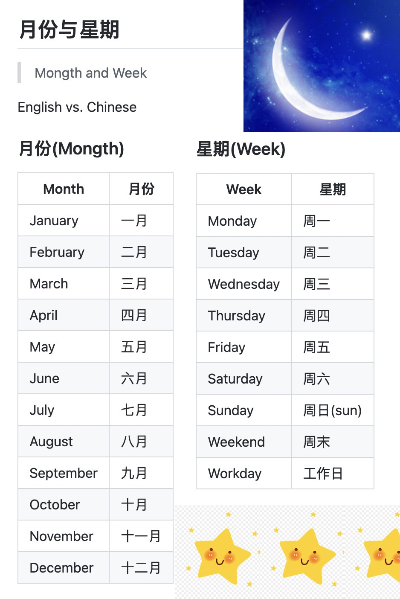

## 月份与星期

> Mongth and Week

English vs. Chinese

### 月份(Mongth)

| Month         | 月份           |
| ------------- | ------------- |
| January       | 一月           |
| February      | 二月           |
| March         | 三月           |
| April         | 四月           |
| May           | 五月           |
| June          | 六月           |
| July          | 七月           |
| August        | 八月           |
| September     | 九月           |
| October       | 十月           |
| November      | 十一月         |
| December      | 十二月         |

### 星期(Week)

| Week          | 星期           |
| ------------- | ------------- |
| Monday        | 周一           |
| Tuesday       | 周二           |
| Wednesday     | 周三           |
| Thursday      | 周四           |
| Friday        | 周五           |
| Saturday      | 周六           |
| Sunday        | 周日(sun)      |
| Weekend       | 周末           |
| Workday       | 工作日         |

图片待完善:

更多欢迎补充

