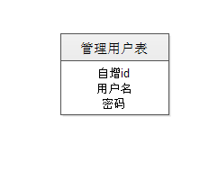
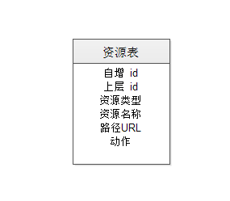
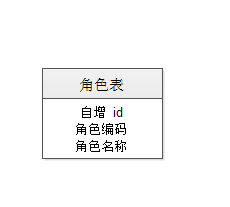
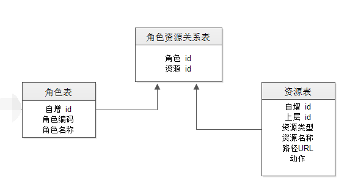
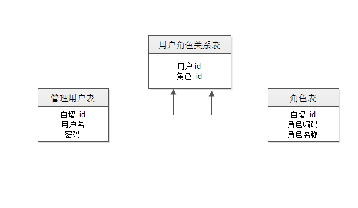
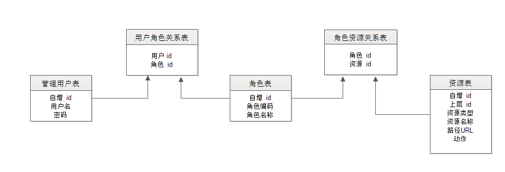

# 后台管理系统-用户_权限表设计

一般来说,WEB系统的权限,分为展示层权限, MVC层权限,以及服务层权限。根据具体的业务需求和投资成本,可以对单个层次或多个层次进行权限控制。

一般来说,为了解耦,以及设计上的简洁抽象,权限控制只控制可访问性,至于具体的数据层级的可见性,则由业务规则进行控制。

展示层的权限,也就是界面显示控制,很好理解。用户登陆以后可以看见的菜单(树),就是最基本的展示层权限。此外,还可以对界面,按钮等界面元素进行禁用/隐藏等设置。

MVC层权限主要就是URL的访问控制。一般来说,普通的静态资源是不进入权限控制的,一是为了效率,二是为了维护方便。

服务层也是同样的道理, 特别是有了Spring或者类似的代码织入技术以后,进行权限判断的代码也不用和业务逻辑代码混杂在一起了。如果没有Spring怎么办?那就只能采用统一入口,然后进行分发之类的策略了。 WebService实现也是同样的道理，目的就是将权限控制代码抽离出来,进行重用。

程序开发和设计,都是为了满足一定的需求。一般来说,满足需求即可,没有最好的设计,最合适的才是最好的。世界千变万化,需求也千变万化。功能需求，成本约束，时间人力资源约束等等，其实约束也是一种需求，比如人们对廉价优质商品的需求一样，何尝不是一种约束呢。

那么进入正题。

##1. 登录用户

这就可以将问题简化,先登录,再校验权限。

登录和用户判定,需要有管理用户数据,也就是必须有管理员户表。
管理用户表需要哪些字段?

按最少设计原则,需要有: 用户名和密码这两个字段。
此外,为了开发,维护和设计的方便,以及根据设计经验,需要有id,
以及用户基本信息,可能会有10个字段左右。这就根据需要进行添加。

当然,为了管理和维护的目的,后台管理系统的表,一般都会有固定的附加字段,

如: 创建人,创建时间,(最后)修改人,修改时间,删除标志,可用状态等。
如果要记录谁做了什么操作,那么就是审计日志的范围了。

看看最基本的用户表结构:

MySQL建表语句如下:

	CREATE TABLE `manage_user` (
		`id` INT(10) UNSIGNED NOT NULL AUTO_INCREMENT COMMENT '自增ID',
		`username` VARCHAR(128) NOT NULL COMMENT '用户名,唯一键',
		`password` VARCHAR(128) NOT NULL COMMENT '密码,加密加盐',
		PRIMARY KEY (`id`),
		UNIQUE INDEX `username` (`username`)
	)
	COMMENT='后台管理用户表'
	COLLATE='utf8_general_ci'
	ENGINE=InnoDB;

其中, id 是主键,用户名是唯一索引,该表使用的排序规则为 `utf8_general_ci`, 也就是认为大小写相等。

密码不存储明文,一般是进行几次单向加密之后存储进数据库,以后用户登录时也采用同样的加密规则,然后比对这两个加密后的字符串,相等即可。

这里有一个小坑, Oracle 的MD5加密算法得出的字符串是大写的,而MySQL, Java, JavaScript等其他系统算出的 md5 值是小写的,所以如果多次加密则需要转换为纯小写. 

常用的单向加密(不可逆)算法有 md5, sha1, sha256等,为了安全,通常是多个进行组合,然后对加密后的数据再进行多次加密,这样可以一定程度上防止彩虹表之类的暴力破解。密码一般还需要进行加盐,这是针对较短密码的一种措施。

## 2. 权限/资源

简单起见，权限点和资源可以认为是同一回事。如果复杂一点,那么可能是一种打包的关系。

那么我们需要有一个资源表。资源的要素，包括： 类型,名称,树形关系, URL。

使用时, 根据类型,以及对应的值进行判定. 比如类型可能是: 菜单,按钮, URL, 服务等。当然,对应的还有一些附加参数,需要根据需求决定。一般字段不太多的话,一对一的关系,最好是放到同一张表里面,所以实际使用时会有很多附加字段。以方便使用和判定。

比如, 排序顺序,是否显示, icon,以及其他信息。

资源表结构如下:

MySQL建表语句如下:

	CREATE TABLE `manage_resource` (
		`id` INT(10) UNSIGNED NOT NULL AUTO_INCREMENT COMMENT '自增ID',
		`resource_title` VARCHAR(256) NOT NULL COMMENT '资源名称',
		`resource_type` INT(10) UNSIGNED NOT NULL DEFAULT '0' COMMENT '资源类型ID',
		`parent_id` INT(10) UNSIGNED NOT NULL DEFAULT '0' COMMENT '父资源ID',
		`url` VARCHAR(1024) NULL DEFAULT NULL COMMENT '对应的URL,根据type决定',
		`action` VARCHAR(256) NULL DEFAULT NULL COMMENT '对应的action,由type决定',
		PRIMARY KEY (`id`)
	)
	COMMENT='后台资源，资源也就是权限'
	COLLATE='utf8_general_ci'
	ENGINE=InnoDB;

对于树型结构,一般在数据库设计时使用的是 ID - PID 设计,这样对于父子关系就可以很容易进行存储。

资源表一般会有很多字段为空,这是为了使用方便。也是为了查询效率, 实践证明,可以牺牲数据修改的性能和复杂性,来优化查询的效率和便捷性。 这就是根据需要和具体情况违反关系数据第三范式。

## 3. 角色

根据对实际情况的分析和总结,我们发现, 很多用户的权限都是一模一样的。为了实现这种归类的方法,我们将某一类用户的权限进行分组,打包,合并为角色。

角色是一个虚拟的概念,只是一个标识。

多个用户可以使用同一个角色, 这样做简化了授权和控制的复杂性。角色的要素包括: 编号,名称。

角色表结构如下:

MySQL建表语句如下:

	CREATE TABLE `manage_role` (
		`id` INT(10) UNSIGNED NOT NULL AUTO_INCREMENT COMMENT '自增ID',
		`role_code` VARCHAR(128) NOT NULL DEFAULT '0' COMMENT '角色编码',
		`role_title` VARCHAR(256) NOT NULL DEFAULT '0' COMMENT '角色名称',
		PRIMARY KEY (`id`),
		UNIQUE INDEX `role_code` (`role_code`)
	)
	COMMENT='管理员角色'
	COLLATE='utf8_general_ci'
	ENGINE=InnoDB;

当然,一个角色对应多个资源。而且会有多个角色,所以角色和资源之间的关系为： 多对多关系。

多对多关系，一般采用中间表的形式。这里我们使用 **角色资源关系表**。

角色资源关系表的 MySQL建表语句如下:

	CREATE TABLE `manage_role_res` (
		`id` INT(10) UNSIGNED NOT NULL AUTO_INCREMENT COMMENT '自增ID',
		`role_id` INT(10) UNSIGNED NOT NULL COMMENT '角色ID',
		`resource_id` INT(10) UNSIGNED NOT NULL COMMENT '资源ID',
		PRIMARY KEY (`id`)
	)
	COMMENT='角色_资源关系表'
	COLLATE='utf8_general_ci'
	ENGINE=InnoDB;

同样的道理, 用户与角色之间的关系也是多对多。

用户_角色关系表的 MySQL建表语句如下:

	CREATE TABLE `manage_user_role` (
		`id` INT(10) UNSIGNED NOT NULL AUTO_INCREMENT COMMENT '自增ID',
		`user_id` INT(10) UNSIGNED NOT NULL COMMENT '用户ID',
		`role_id` INT(10) UNSIGNED NOT NULL COMMENT '角色ID',
		PRIMARY KEY (`id`)
	)
	COMMENT='管理员用户_角色关系表'
	COLLATE='utf8_general_ci'
	ENGINE=InnoDB;

本文简要叙述了用户权限的数据库表设计。以及分析了这样设计的一些原因。

总共涉及到5张表,其中主体是用户和资源。 

角色表, 用户角色关系表,以及角色资源关系表,都算是中间表,用来将用户和权限进行关联，以及比较容易进行维护而附加的表。

整体关系如下所示:

当然,系统要能使用,需要有程序，有初始数据，才能跑起来。

请听下回分解，以及本文的完善和修正。

GitHub版本: [https://github.com/cncounter/translation/blob/master/design/role_user/02_RoleAndUserDesign.md](https://github.com/cncounter/translation/blob/master/design/role_user/02_RoleAndUserDesign.md)

作者: [铁锚 http://blog.csdn.net/renfufei](http://blog.csdn.net/renfufei)

日期: 2015年07月09日
