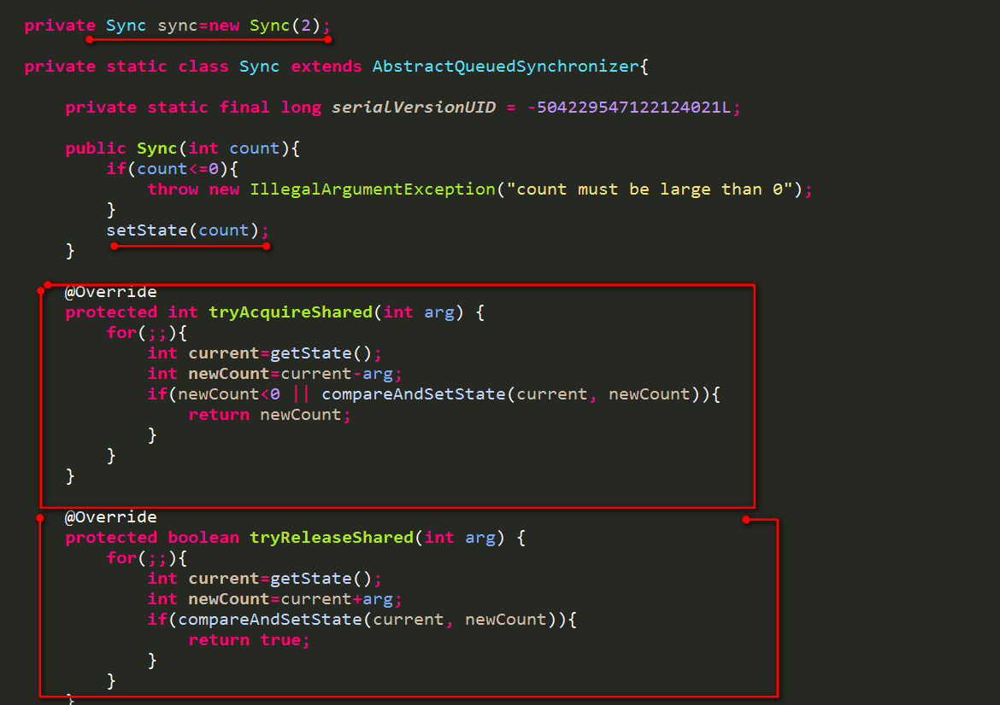
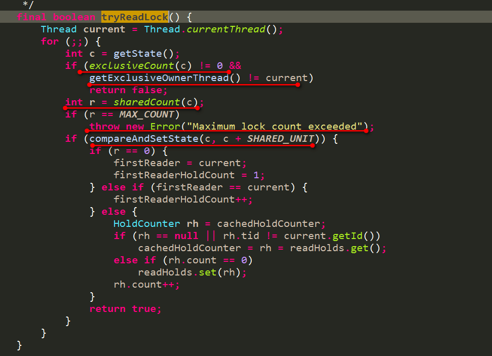
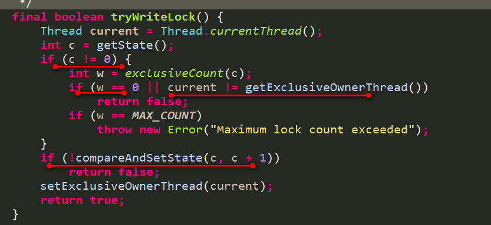
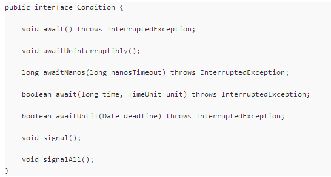
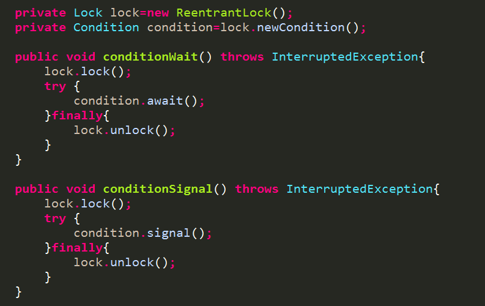
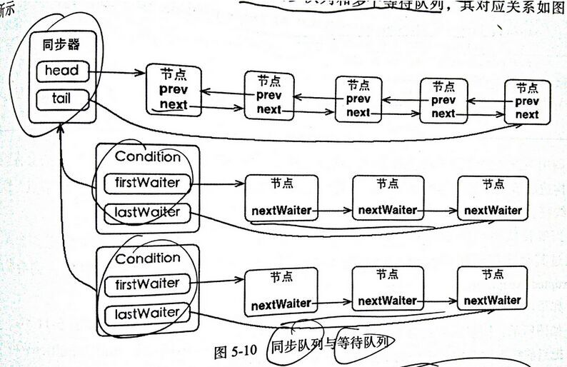
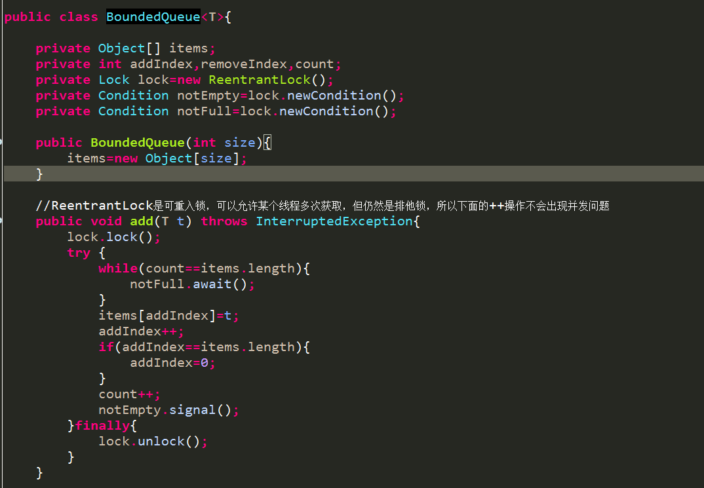
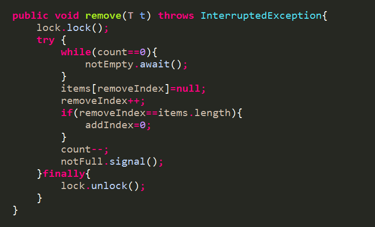

# 读写锁和Condition的原理

## by: QQ群【java框架源码研究 345731741】, 2015年9月23日

####【乒乓狂魔】: 

> 今晚来讨论下读写锁和Condition的原理，有兴趣的提前准备下

####【乒乓狂魔】:  

> 先来说说共享锁

####【乒乓狂魔】: 

> 我们之前说了独占锁

####【乒乓狂魔】: 

> 独占锁说的是只能有一个线程来获取锁，如果是不可重入的话，则同步器的status最大是1

####【乒乓狂魔】: 

> 这点明白不？

晨晨: 

> 锁，没研究过

####【乒乓狂魔】: 

> 我就不管了，自己说了

####【乒乓狂魔】: 

> 独占锁如果是可重入的，则表示获取锁的线程可以再次获取这个锁，则每获取一次，同步器的status+1，每释放一次锁，status-1

>即使上述独占锁是可以被多次获取的，但是只能被一个线程获取

####【乒乓狂魔】: 

> 而共享锁的概念就是：  可以被多个线程同时获取

WMings: 

> 可重入锁：一个线程多次获得锁，共享锁：不同线程同时获取到一个锁

####【乒乓狂魔】: 

> 对于同步器的status，同样是获取锁时status+1，释放锁时，status-1

####【乒乓狂魔】: 

> 这时候可以定义共享锁的最大获取次数

####【乒乓狂魔】: 

> 如最多被获取5次，也可以不定义无限制

####【乒乓狂魔】: 

> 比如说一个面试题，让你实现一个共享锁，最大获取次数是5，你怎么写？

WMings: 

> 每次获得共享锁 status+1 到5抛异常~

我们都是小孩纸: 

> 到5就不能休息会么 

####【乒乓狂魔】: 

####【乒乓狂魔】: 

> 这是同步器的代码

####【乒乓狂魔】: 

> 如最大次数是5，每获取一次锁就进行CAS形式的-1操作

####【乒乓狂魔】: 

> 共享锁，大家都要竞争，必须要使用CAS操作

####【乒乓狂魔】: 

> 只有当CAS  减一操作执行成功才表示你获取了共享锁

####【乒乓狂魔】: 

> 上面的tryAcquireShared是可能被多线程同时执行的

####【乒乓狂魔】: 

> 必须要CAS操作来修改status的状态

####【乒乓狂魔】: 

> 共享锁也了解了，下面就要说说读写锁了

####【乒乓狂魔】: 

> 首先想想读写锁该怎么基于AQS同步器来设计？

####【乒乓狂魔】: 

> 目前AQS同步器，只有一个private volatile int state;属性

####【乒乓狂魔】: 

> 并且读写锁要满足的要求是：允许多个读锁同时进行，但是一旦有写锁的时候，其他读锁或者写锁必须阻塞

晴天等烟雨: 

> 有写锁之前的读锁也要释放吧

####【乒乓狂魔】: 

> 上面说的不准确，严格的说：一旦获取了写锁，其他线程不能再获取读锁和写锁。一旦某个线程获取了读锁，其他线程不能获取写锁，但是可以获取到读锁

####【乒乓狂魔】: 

> 再明确一点就是： 读锁是可以被多个线程同时获取的，所以是一个共享锁

####【乒乓狂魔】: 

> 写锁是只能被一个线程获取的，所以是一个独占锁，但是可以允许重入，并且允许已经获取写锁的线程再次获取读锁

####【乒乓狂魔】: 

> 但是不允许已经获取读锁的线程再次获取写锁

####【乒乓狂魔】: 

> 锁降级是如下现象： 某个线程获取了写锁，然后又获取了读锁，然后又释放了写锁。这个过程，最初该线程是排他的，然后在写锁释放后，变成了读锁，此时其他线程又可以去获取读锁了

####【乒乓狂魔】: 

> 不是你说的先释放写锁然后再获取读锁的过程

####【乒乓狂魔】: 

> 而是在获取写锁后，立马又获取了读锁，经过一些操作，然后又释放了写锁

####【乒乓狂魔】: 

> 有啥不明白的地方？

我们都是小孩纸: 

> 为什么叫降级锁了 , 锁分等级吗 , 为什么说锁降级了

happy: 

> 应该说下，什么场景用什么级别的锁

我们都是小孩纸: 

> 锁降级。。是。由独占锁。变成了。共享锁的吗

晴天等烟雨: 

> 这个地方有点绕没太明白

####【乒乓狂魔】: 

> 我也没太明白为什么把这个地方叫做锁降级

####【乒乓狂魔】: 

> 谁知道？

我们都是小孩纸: 

> 锁降级。说的是。由独占锁。变成了。共享锁的吗

####【乒乓狂魔】: 

> 写锁降级成为了读锁，估计可以按照你上面的说吧

我们都是小孩纸: 

> 锁经常用的吗。什么情况下用什么样的锁呢

####【乒乓狂魔】: 

> 之前写锁并发程度低，要求严格，理解为锁比较难以打开，变成读锁后，锁要求的不严了，锁相对容易打开，并发性变高了。所以叫做锁降级了

####【乒乓狂魔】: 

> 回归正题，读写锁的实现

####【乒乓狂魔】: 

> 我们知道了，写锁是一个独占锁，读锁是一个共享锁

####【乒乓狂魔】: 

> 如何体现在同步器的state上呢？

####【乒乓狂魔】: 

> `private volatile int state;` 之前都写错了，是state不是status

####【乒乓狂魔】: 

> 一个int 32位，高16位来记录读锁的值，低16位来记录写锁的值

####【乒乓狂魔】: 

> 这样的话，就可以用同步器的state来表达读写锁的值了

####【乒乓狂魔】: 

> 如果获取到读锁就将高16位的值+1,释放读锁将高16位的值-1

####【乒乓狂魔】: 

> 如果获取到写锁就将低16位的值+1,释放写锁就将低16位的值-1

####【乒乓狂魔】: 

> 来看下获取读锁的代码

####【乒乓狂魔】: 

####【乒乓狂魔】: 

> 在 `ReentrantReadWriteLock` 中 `final boolean tryReadLock()` 方法中

####【乒乓狂魔】: 

> 首先获取低16位，看看低16位是不是为0即是否有写锁

####【乒乓狂魔】: 

> 如果不为0，表示写锁已经被获取了，此时要判断已经获取写锁的线程是不是本线程，如果是本线程获取了写锁，是允许本线程再次获取读锁的

####【乒乓狂魔】: 

> 如果获取写锁的线程不是本线程，则返回false，表示获取读锁失败，因为已经有线程获取了读锁

我们都是小孩纸: 

> 第3个if呢, 什么意思

WMings: 

>   ` if (compareAndSetState(c, c + SHARED_UNIT))`

> 你是问这个？

####【乒乓狂魔】: 

> 第三个if不就是多个线程同时竞争获取读锁，CAS操作可能失败啊，如果失败表示没有竞争到读锁，再次for循环执行

####【乒乓狂魔】: 

> 如果CAS操作成功就表示该线程成功获取到读锁了

WMings: 

> `c + SHARED_UNIT` 相当于读锁+1

####【乒乓狂魔】: 

> 再来看看获取写锁的过程

####【乒乓狂魔】: 

####【乒乓狂魔】: 

> 首先是获取同步器的state，如果state等于0，则表示既没有读锁也没有写锁，此时要获取写锁，只需向低16位进行CAS操作+1即可，

####【乒乓狂魔】: 

> 如果state不等于0，此时有两种情况，情况1：读锁不等于0 情况2：写锁不等于0

晴天等烟雨: 

> 为什么是new error 呢, 不是exception 

风之殇♂: 

> 有读锁的情况下不能获取写锁了, 是不是这个意思

我们都是小孩纸: 

> 写锁是独占的

风之殇♂: 

> 很多都是直接抛出 error

####【乒乓狂魔】: 

> 如果state！=0 但是 写锁==0 ,说明读锁不为0，也就是此时存在读锁，所以就不能获取写锁

风之殇♂: 

> 但是本线程可以是不是

风之殇♂: 

> 他们共享一个高速缓冲里的信息

####【乒乓狂魔】: 

> 如果state！=0 ,写锁！=0,说明此时已经有写锁了，再次获取写锁，就需要判断下已经获取写锁的线程是不是本线程，如果是本线程则可以再次获取写锁，如果不是本线程，则不能获取写锁

晴天等烟雨: 

> 为什么是new error 呢

####【乒乓狂魔】: 

> 本线程获取了读锁，本线程再次获取写锁是获取不到的

####【乒乓狂魔】: 

> 因为本线程获取了读锁，可能其他线程也获取了读锁

####【乒乓狂魔】: 

> 所以此时就不能再获取写锁了

####【乒乓狂魔】: 

> 如果本线程获取了写锁，此时本线程再次获取读锁，是可以的

晴天等烟雨: 

> Error 是程序不可修复的异常

晴天等烟雨: 

> 为什么会用error 呢

####【乒乓狂魔】: 

> 如果次数超出，则读写锁的值全部紊乱了，读写锁就没效果了，必然出无法恢复的错误了

晴天等烟雨: 

> 哦 那个最大值是个8位最大值

####【乒乓狂魔】: 

> 不是16位？

晴天等烟雨: 

> 16位说错了

####【乒乓狂魔】: 

> int 32位，高16位记录读值，低16位记录写值

####【乒乓狂魔】: 

> 好了，读写锁也基本差不多了，对于读写锁的释放的代码，下去自己在看看

毅静: 

> 什么样的锁是不可重入的？

####【乒乓狂魔】: 

> 重入性：之前就说过了

####【乒乓狂魔】: 

> 接下来看看Condition

####【乒乓狂魔】: 

> 之前特地的讲过这几个概念，重入性  公平和非公平

晴天等烟雨: 

> 公平讲的是同步队列中同步

晴天等烟雨: 

> 非公平是外来锁直接跟同步队列head 竞争

####【乒乓狂魔】: 

> 来看看Condition

####【乒乓狂魔】: 

> 每一个Object都提供了wait 和notify方法

####【乒乓狂魔】: 

> 就是调用了wait方法会阻塞，等待notify方法来唤醒

####【乒乓狂魔】: 

> 具体是咋实现的，我现在也不了解

####【乒乓狂魔】: 

> 谁了解可以说下

风之殇♂: 

> 这个是因为有个对象锁

####【乒乓狂魔】: 

> 估计是

风之殇♂: 

> 对象有个监听器, 监听失败了就进同步队列

####【乒乓狂魔】: 

> 但是这一部分是native方法，没有java代码的

风之殇♂: 

> 还有个等待队列, 具体我看到了资料

####【乒乓狂魔】: 

> 现在来说说我们可以看得见代码的Condition

####【乒乓狂魔】: 

####【乒乓狂魔】: 

毅静: 

> condition的应用场景是什么

毅静: 

> 和semphore有什么联系和区别？

####【乒乓狂魔】: 

> condition在使用前，先要获取 lock

####【乒乓狂魔】: 

> 一个lock可以有多个Condition

####【乒乓狂魔】: 

> 来看下`condition.await()` 执行了哪些操作

####【乒乓狂魔】: 

> 一个Condition包含了一个自己的等待队列，来看下完整的一个锁中的同步队列和等待队列，来自书上

####【乒乓狂魔】: 

####【乒乓狂魔】: 

> 一个锁，自身有一个同步队列，这个锁产生的Condition有一个等待队列。一个锁可以产生多个Condition

风之殇♂: 

> 都是双向链表？

####【乒乓狂魔】: 

> condition.await()操作简单来说就是先释放了锁，然后将当前线程加入condition的等待队列的尾部

####【乒乓狂魔】: 

> 然后阻塞

####【乒乓狂魔】: 

> 同步队列是双向链表，等待队列是单向链表

####【乒乓狂魔】: 

> 当另外一个线程获取了锁，调用了condition的signal方法，会将condition等待队列中的首节点取出然后放到同步队列中

####【乒乓狂魔】: 

> 只有当刚才放到同步队列中的线程最终变成了头结点获取到了锁，此时 `condition.await()` 操作才算彻底完成，继续执行 `condition.await()` 下面的代码

####【乒乓狂魔】: 

> 也就是说 `condition.await()` 一旦完成之后，同样是已经获取到了锁

风之殇♂: 

> 等待队列优先？

####【乒乓狂魔】: 

> `condition.await()`：包含这么几个过程：  

> 1 先释放锁，加入到condition的等待队列尾部   

> 2   别的线程获取到锁，执行signal方法将condition中的等待队列的头结点唤醒，放到同步队列中    

> 3  等待上述线程再同步队列中获取到锁

####【乒乓狂魔】: 

> 所以await方法先释放了锁，最终又获取了锁

####【乒乓狂魔】: 

> 案例就是使用Condition来实现一个有界队列。一个线程生产数据，一个消费数据，当没有数据时，消费阻塞。当数据满了，无法再存放时，生产阻塞

####【乒乓狂魔】: 

####【乒乓狂魔】: 

风之殇♂: 

> 感谢分享
