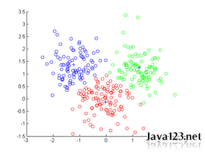

KimmKing机器学习入门笔记
==
日期: 2014-12-19

欢迎加入: [脚本娃娃-桃花岛:83163037](http://jq.qq.com/?_wv=1027&k=YSw5AV)

####KK 14:37:09 
这一会儿没事儿，给大家讲点技术吧

####KK 14:38:17 
讲点高大上领域里，你们能听懂的知识
####Tarot 14:38:27 
今天讲啥

####太空飞猪 14:38:39 
机器学习
####黄厂理工 14:39:13 
MVCC
####小钟 14:39:21 
设计模式
####黄厂理工 14:39:24 
我昨天看了下这个，  网上讲得清楚的不多啊 
####KK 14:39:52 
猜对了
####KK 14:40:01 
讲ML领域的东西
####KK 14:40:13 
MVCC有啥好讲的
####黄厂理工 14:40:21 
原理没搞明白
####黄厂理工 14:40:28 
之前你让下去看看
####KK 14:40:29 
先去了解数据库的事务和隔离级别
####KK 14:40:37 
然后就能看懂MVCC了
####KK 14:40:59 
今天讲个入门的机器学习领域知识
####黄厂理工 14:41:03 
好吧，我想看几种锁的实现
####黄厂理工 14:41:04 
嗯嗯
####KK 14:41:06 
说实话，我懂的也有限
####KK 14:41:11 
大家相互讨论
####KK 14:41:19 
今天讲讲简单的分类聚类
####小钟 14:41:30 
分类聚类
####小钟 14:41:44 
这个我听过 但是不是太明白
####小钟 14:42:08 
还是分词算法的时候听的
####KK 14:43:53 
分类和聚类 有什么区别
####十年磨一贱 14:44:39 
一个是拆 一个是合？
####小钟 14:46:14 
不记得了  当时是一个算法工程师给我们讲的
####小钟 14:47:40 
好像 电商用的场景聚类
####KK 14:47:45 
分类是你知道有几个类，类有什么特点
####小钟 14:47:48 
分析买东西的组合
####KK 14:47:53 
聚类是你丫不知道怎么分类
####KK 14:48:10 
一般说来，聚类更难
####小钟 14:48:10 
也不知道  我就听了个热闹 
你讲吧
####小钟 14:48:15 
恩
####小钟 14:48:16 
是的
####KK 14:48:30 
给你一堆数据，告诉你，分两类把
####KK 14:48:33 
这就是分类
####KK 14:49:18 
给你同样一堆数据，告诉你，给我分成几类吧，这就是聚类
####KK 14:49:37 
跟机器学习，模式识别的关系
####KK 14:50:14 
给你一堆数据，告诉你他们分别是属于哪几类的，然后再给你一堆数据，让你也分到这几个类里去，

####KK 14:50:47 
这就是一种基于样本的分类
####KK 14:52:35 
怎么分呢，一般需要从现有分好类的样本
####KK 14:52:40 
里提取一些模式，
####KK 14:53:11 
然后用这个模式，再去计算样本分类的准确度
####KK 14:53:40 
可以通过一些技术手段，反复的来改进这个过程，
####KK 14:54:01 
从而让我们提取的模式特征，能准备的代表现有样本的分类规律
####KK 14:54:25 
最后用这些个模式特征来处理待分类的数据，即可。
####KK 14:54:27 
明白了吗
####KK 14:54:34 
这个过程，就是机器学习。
####KK 14:54:49 
最后分类数据，就是模式识别。
####Tarot 14:54:58 

####KK 14:55:05 
机器学习是模式识别的手段。
####KK 14:55:11 
举个简单例子
####KK 14:55:28 
ps 模式识别是人工智能的一部分
####黄厂理工 14:55:31 
貌似 垃圾邮件 有用
####KK 14:55:40 
举个栗子
####KK 14:56:54 
给一组数据，   

	1  2  3 4 5    -->  分类0
	10  11  12 13  14    -->  分类1

####KK 14:57:21 
显然，我们可以用模式 > 9 作为分类器
####Tarot 14:57:42 
额
####KK 14:58:17 
大于9，属于分类1,；小于等于9，属于0
####KK 14:59:01 
此时，给一个新数据，8，，，则其属于分类0
####KK 14:59:05 
并且，我们可以用 <6 作为分类器，
####KK 14:59:31 
这时候，对原来的样本也都是OK的
####KK 14:59:46 
but，给一个新数据8，，，它就属于分类1了。
####KK 15:00:58 
第一个知识点：模式的选择，直接影响分类结果。相同的条件下，选择不同的模式，可能会导致分类结果不同。
####KK 15:01:50 
我们再来看看，如果样本变成：

	1  2  3 4 5 6 7 9   -->  分类0
	10  11  12 13  14    -->  分类1

####KK 15:02:08 
那么，明显给了8，我们就知道更匹配分类0。
####KK 15:02:54 
第二个知识点：样本数据越丰富，则我们可以做到更精确的分类。
####KK 15:03:07 
这两个知识，跟我们的常识是一致的。
####KK 15:03:22 
不同的角度，不同立场，对人的评价是不同的。
####KK 15:03:38 
对一件事儿的看法也可能会完全两样。
####KK 15:04:08 
但是，如果我们得到的信息越全面，角度越多，我们做出的判断就会越准确。
####铁锚 15:05:42 
哇。机器学习的人实在是太聪明了
####铁锚 15:05:56 
这么分类下去，数据肯定都是有一定规律的啊。
####铁锚 15:06:09 
就像客观世界都是守规矩的一样。
####铁锚 15:06:34 
然后让分类不合理的个体死去，这就是进化?
####KK 15:07:15 
稍安勿躁，这还没有进入正题。
####铁锚 15:07:23 
加上评分交互系统，把不合理的路径给干掉，那不是越来越聪明?
####KK 15:07:56 
实际数据都是海量的，非常复杂的，没有表面联系的，你怎么得到 >9  <6 这种模式？
####KK 15:08:33 
稍等，我们说完第三个知识点，就讲具体的分类聚类
####KK 15:09:00 
先说问题，原则，然后引入相应的方案。
####KK 15:09:02 
方法。
####KK 15:09:24 
第三个知识点，我们的模式可能会不能完全覆盖样本。
####小钟 15:10:10 
我来整理
####KK 15:10:18 
我们再来看看，如果样本变成：

	1  2  3  4   5   9    -->  分类0
	7  10  11  12 13 14    -->  分类1

####KK 15:10:31 
请问，用什么模式来分类？
####KK 15:10:37 
8属于哪个？
####Tarot 15:11:03 
>7 <9?
####KK 15:11:47 
最简单的办法是>7， 那么模式0里的9 就不满足模式了
####KK 15:12:47 
对原来的样本分类，这个模式的准确率只有 `11/12 ~ 92%`
####KK 15:13:23 
再进一步，如果我们用>5来分类，
####KK 15:13:33 
那么正确率只有 84%了
####KK 15:13:53 
分类0中的 5和9 是不满足的。
####KK 15:14:01 
准确率 = 10/12
####KK 15:14:35 
所以，我们说分类器 >7比 >5要好。
####KK 15:15:20 
我们还可以考虑一个新分类器
####KK 15:15:35 
<=5 | = 9
####KK 15:15:57 
这个分类器是不是就可以满足分类0 的所有数据了
####KK 15:16:04 
其他的算分类1，
####KK 15:16:31 
则我们说这个分类器能完全的区分给定的样本，准确率 = 100%

####KK 15:17:40 
考虑下对于一个具体问题，如果开始我们给一个分类很差的分类器，然后一点点的优化它，变成准备率高的分类器，
####KK 15:18:05 
是不是就可以实现好的分类效果了？
####KK 15:19:02 
第三个知识点，我们的模式可能会不能完全覆盖样本，不同模式对样本的区分效果是不同的。
####KK 15:20:09 
其实还可以引申一点，如果我们有一批分类器对给定样本的区分能力都一般，但是对待分类数据的分类效果，可能还是跟我们预期的不太一样。
####KK 15:20:57 
还了，前面都说完了。
####KK 15:21:03 
说具体办法。
####KK 15:21:25 
最简单的就是用属性分类。
####KK 15:21:39 
丫的给我一坨数据，每个数据都打上标签，
####KK 15:21:44 
按标签分类呗。
####KK 15:23:00 
数据（这个杀手不太冷，电影，喜剧）（三体，书籍，科幻）
####KK 15:23:12 
这都是最简单最明显的层次分类法
####铁锚 15:25:35 
双击查看原图
####KK 15:25:48 
再复杂点的是最邻近距离的分类法
####KK 15:26:18 
比如

	1  2  3 4 5  9    -->  分类0
	
	7  10  11  12 13 14    -->  分类1

8分哪一类？
####KK 15:26:37 
我们求下分类0和分类1的平均数，
####KK 15:27:43 
4.3和11.3，
####KK 15:28:12 
我们定义距离 = | X- 样本平均数|
####KK 15:28:47 
则数据8到两个分类的距离分别是  3.7和3.3，
####KK 15:28:59 
明显8跟分类2更近。
####KK 15:29:14 
明显8跟分类1更近。所以，分到分类1.
####KK 15:29:51 
数据复杂的时候，比如说是多维的，那么可以采用更高位的距离定义。
####KK 15:29:55 
比如欧式距离，
####KK 15:31:09 
如果数据都是二维的，找样本的中心点 (x0,y0)  (x1,y1)
####KK 15:31:52 
则要分类的点 (x,y), 取 sqrt{(x0-x1)^2+(y0-y1)^2}
####KK 15:32:06 
错了
####KK 15:32:28 
sqrt{(x-x1)^2+(y-y1)^2} 与 sqrt{(x-x0)^2+(y-y0)^2} 的最小值
####KK 15:32:35 
就是距离近的那个。
####KK 15:33:06 
数学就是这么排上用场的。
####KK 15:34:17 
简单说就是把样本的分类看做是几个不同的点（求平均值或中心点都是为了把样本分类里的数据映射到一个点），
####KK 15:34:38 
然后算待分类的点，到哪个点的距离近。
####KK 15:34:48 
好，
####KK 15:34:56 
简单的分类到此为止。
####KK 15:35:00 
高大上来了。
####KK 15:35:04 
讲两个，
####KK 15:35:34 
一个是SVM，支持向量机
####KK 15:36:27 

####KK 15:36:33 
是时候上这个图了
####KK 15:37:04 
我们看到一个2分类的数据样本，
####KK 15:37:42 
在上面粉线和蓝线中间，可以找无数根线作为分类器，
####KK 15:38:00 
都能100%的把这两类数据正确区分。
####KK 15:38:15 
但是，哪一根线的分类效果最好呢？
####KK 15:39:05 
SVM给出了一个评价指标，
####KK 15:40:32 
旋转这三根平行直线，是他们恰好在数据分类正确的边缘位置（即上线两个线肯定碰到边缘的点），
####KK 15:41:13 
然后所有这些平行线里，上下线之间的垂直距离最大的时候，就是最好的分类状态。
####KK 15:41:37 
即，如果我们把这个平行的带状区域看做是两个类别的区分度，
####KK 15:42:06 
那么这个带状区域最宽的时候，说明我们给出的评价指标的区分度最大。
####KK 15:42:29 
这时我们选择他们的中间位置的直线，作为分类器即可。
####KK 15:42:52 
这根线到两个样本的距离相等，并且最大。
####KK 15:43:09 
懂了咩，这就是SVM的原理。
####Tarot 15:43:26 

####KK 15:43:59 
如果把复杂的数据看做多维，分类的不是直线，而是平面或高维向量，
####KK 15:44:09 
就可以把SVM应用到复杂数据了。
####KK 15:45:21 
如果样本的点所在区域有重合，我们可以把100%的区分样本准确率降低一点点，就是相当于忽略那少量的非标准的点，则可以把SVM应用到实际的带有各种误差的数据样本上。
####KK 15:45:45 
SVM的好处，简单有效，分类效果好。
####KK 15:46:24 
劣处，上面可以看到只能分两类，只支持数据的2分类问题。
####KK 15:47:20 
有个变通办法，先二分，再二分，，，，就可以解决一些多分问题了。
####KK 15:47:51 
第二个高大上的方法 K-means

####KK 15:50:34 
K-means算法是最为经典的基于划分的聚类方法，是十大经典数据挖掘算法之一。

####KK 15:51:21 
k-means可以把数据分成k类，而且不需要样本。
####Tarot 15:51:30 
双击查看原图
####Tarot 15:51:33 
这么屌
####KK 15:51:40 
k表示分类数目
####KK 15:52:40 
means表示均值
####KK 15:53:04 
原理很简单，而且很有意思
####铁锚 15:53:27 
去脚本娃娃问问啊。
####铁锚 15:53:39 
本群只有你和飞猪是PHP的吧?
####KK 15:53:39 

####KK 15:53:50 
如上，相对这一整个数据分3类。
####KK 15:53:59 
想对这一整个数据分3类。
####KK 15:54:32 
先随机的选3个点，作为中心点。
####KK 15:54:48 
kmeans最牛逼的是这三个点的位置无所谓。
####KK 15:55:25 
算法会慢慢的把它们迭代到合适的分类、并且是分类里合适的中心点上。
####KK 15:57:54 

####KK 15:58:12 
就像这个图的动态过程一样。
####KK 15:58:45 
三个点的动态图，我没找到了。
####KK 15:58:52 
就拿2点的来说吧。
####KK 15:59:07 
先随便找2个点。
####KK 15:59:20 
然后计算所有的其他点，
####KK 15:59:37 
到这两个点P1,P2的距离，
####KK 15:59:53 
如果一个点X到P1的距离小于到P2的距离，
####KK 16:00:30 
则X就属于P1为中心点的这一类 S1，否则属于S2
####KK 16:00:37 
这一点懂了吧。
####铁锚 16:00:46 
双击查看原图
####KK 16:01:05 
就是第一次标颜色的那个画面。
####KK 16:01:31 
这时候所有的点，分了两类，，但是不正确。
####KK 16:01:32 
没关系。
####KK 16:02:15 
我们再来计算这两个不同类的点里面的中心点是什么，也就是接近平均值的点。
####铁锚 16:02:21 
这么说就看明白那个图了
####KK 16:02:46 
这样，就把中心点P1、P2往实际的中心点移动了一段距离。
####KK 16:03:17 
开始选的是随机的，没关系，现在我们就把整个数据集所有的数据位置用上了。
####KK 16:03:39 
基于这个信息和最开始的分类信息，我们让中心点靠近了数据集。
####KK 16:03:53 
然后基于这两个新的中心点，重新分类数据。
####KK 16:03:58 
又分两类。
####KK 16:04:10 
继续迭代找新分类的中心点。
####KK 16:04:33 
一直到，新中心点和上一轮的旧中心点相同，
####KK 16:04:41 
迭代结束。
####KK 16:04:57 
这时候，P1和P2就是最佳的中心点。
####KK 16:05:04 
S1和S2就是分好的类。
####KK 16:06:11 
优点是简单，速度快。
####KK 16:06:22 
缺点是需要指定要分几类。
####KK 16:07:00 
and~ 如果数据集区分度不大（例子里的这个明显是分开成两大坨），
####KK 16:07:14 
那么分类结果跟初始点选择的位置有关系。
####KK 16:07:42 
即如果数据时给定的一个圆内的1000个随机点。
####KK 16:08:45 
那么分两类，开始选的2个点不同，分类结果会完全不同。
####KK 16:08:56 
不过这个情况下，数据本身是没有区分度的，。
####KK 16:09:10 
怎么分成几类，都可能没有特殊意义。
####KK 16:09:32 
如果数据本身是有区分度的，即时成离散的几大团，
####KK 16:10:00 
那么kmeans算法能够高效的把这几团区分出来。
####KK 16:10:08 
今天的内容讲完了。
####KK 16:10:12 
累死了。
####KK 16:10:16 
干会活儿
####Tarot 16:11:01 
太忙了 还没仔细听 这次谁整理啊
####铁锚 16:13:10 
感谢K神，对机器学习算法有了那么一点理解
####铁锚 16:13:31 
那么问题来了，数据挖掘和机器学习有什么相同的地方?

####KK 16:15:48 
数据挖掘和人工智能是应用领域
####KK 16:16:03 
机器学习和模式识别是技术领域
####KK 16:17:01 
数据挖掘是通过数据化分析方法，拿到新的知识和结论
####KK 16:17:09 
可以用机器学习或其他方法
####KK 16:17:39 
机器学习是模拟人类的学习模式的能力
####KK 16:18:37 
自组织，反馈，训练，监督，建立合适的模式体系
####KK 16:19:30 
模式识别则是人类认知能力的模仿
####KK 16:19:52 
模式识别也会用到机器学习技术
####KK 16:20:59 
输入数据，定义指标，抽取特征，然后通过机器学习从这些特征中拿到特定模式的分类器，
####KK 16:21:04 
然后作用于新的数据。
####KK 16:21:10 
比如面部识别。
####KK 16:22:12 
拿一个88*88大小的图像，先黑白二值化处理，然后使用LGBP算子提取特征，大概是几十万维的特征数据。

####KK  16:25:38
然后通过adaboost之类的学习算法，形成一个有效的强分类器。

最终用这个分类器来处理待检测的新图像。

over
