宇宙深处看地月情缘
==

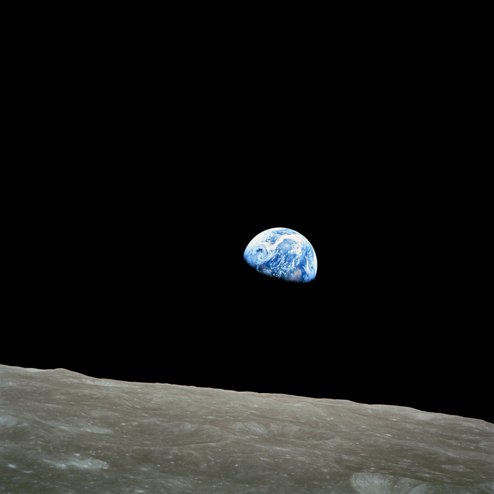

1968年,威廉·安德斯(William Anders of Apollo 8)在首个绕月飞行器阿波罗8号上拍下了这张著名的照片 ——  NASA(美国宇航局)将其命名为“地球升起”(Earthrise),这可能是有史以来人类拍摄的第一张最具影响力的照片, 从外太空看到了美丽地球的彩色照片, 衬托在广袤无边的宇宙背景下, 突然看见我们的地球是这么渺小。如果展开身为人类天马行空般的思维,就会想到地球每天的升起与降落(旋转)其实触发了整个社会环境和人文的发展,直至今日依然深深地影响着整个社会的政治和文化。

《地球升起》有着巨大的影响力,而类似的照片也是很罕见的。 想要将整个地球瞄准,得先飞到地球几千英里以外,遗憾的是, 发射飞船到深层太空并不容易。 除了40年前就结束的阿波罗计划外,人类向地球轨道之外发射的宇宙飞船也屈指可数。 大多数太空发射任务的目标都是将卫星投放到低层地球轨道,又或者将货物运输到国际空间站(International Space Station) —— 但这些地方都离地球很近,也就很难拍到璀璨银河背景下的地球靓照。

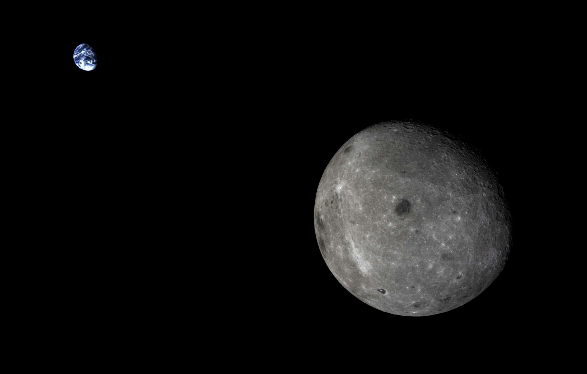

这张照片里月球背面与地球一起悬浮在太空中。 由中国的嫦娥五号T1试验飞行器拍摄,距离地球约200000英里.

幸运的是,近年来人类又重拾回到深层太空的兴趣—— 计划先发射一些无人探测器与巡视器(probes and rovers),最终将进行载人飞行。 比如中国的嫦娥计划。 去年嫦娥3号的任务是 [将玉兔探测器送到月球上](http://www.extremetech.com/extreme/175410-chinas-lunar-rover-yutu-says-goodnight-humanity-in-creepy-farewell-letter-before-freezing-to-death) —— 这是人类40年来第一个软着陆在月球上的设备! —— 现在, [嫦娥5号-T1](http://en.wikipedia.org/wiki/Chang%27e_5-T1) 罕见地完成了飞越到月球远端的任务,抓拍了一张令人惊叹的照片: 月亮的远端和地球出现在了同一个镜头中。

在看完月球远端的这张照片以后, 下面还有更多从外太空拍摄的地球照片分享给你 —— 包括著名的《蓝色弹珠》(Blue Marble),以及卡尔·萨根(Carl Sagan)最喜欢的《暗淡蓝点》(Pale Blue Dot),这是有史以来拍摄到的最遥远的地球照片(悲剧的是,可能接下来的几十年里这也是最遥远的地球照片了).

##

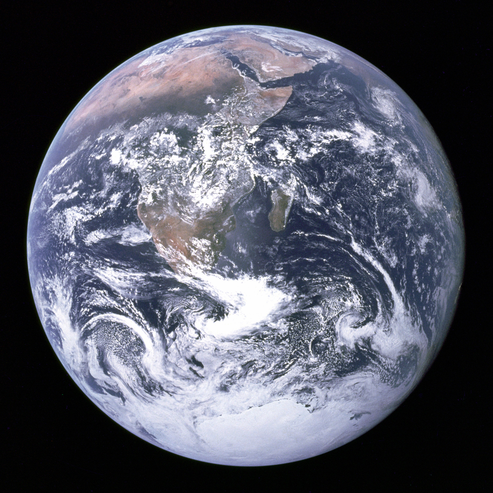

蓝色弹珠, 1972年由阿波罗17号的宇航员拍摄

## 蓝色弹珠 ##

虽然《地球升起》是第一张从外太空拍摄的彩色地球照片, 但1972年阿波罗17号拍摄的《蓝色弹珠》可能更有名一些。

这张照片拍摄时距离地球大约28000英里(即45000公里),当时正是阿波罗17号和宇航员们驶向月球的途中。 和NASA的其他早期任务一样,使用的是修改版的70毫米哈苏胶片相机。

NASA后来也将蓝色弹珠用来称呼其他类似的地球照片,这些照片由现代的低空高分辨率卫星图像合成。

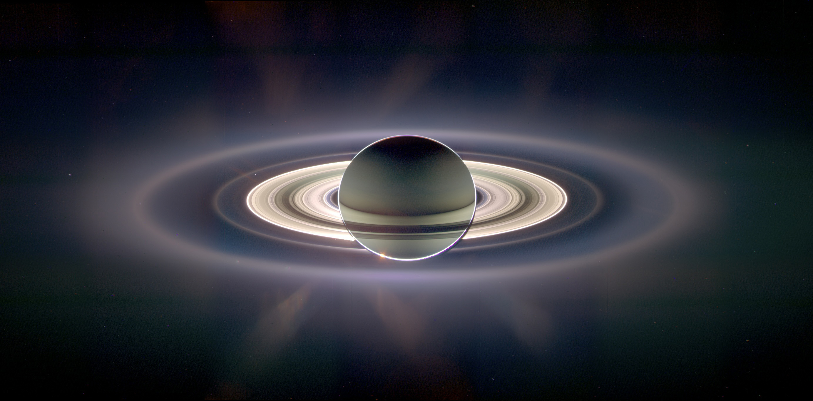

地球,由卡西尼号拍摄, 目前正运行在土星轨道上。 地球是10点钟方向的亮点(点击图片放大)。
土星光环

这张照片——可能是我最喜欢的——由卡西尼号于2006年拍摄,当时它正从土星的阴影中穿过。 在这里,卡西尼号距离土星约130万英里, 距离地球大约9亿英里(15亿公里)。 太阳正好位于土星背后, 这就是为什么地球及其光环边缘会被照得如此惊人地明亮。 (NASA也对其做了大幅增强处理。)

卡西尼号在2013年也拍摄了类似的照片, 你可以更清楚地辨认出地球和月亮:

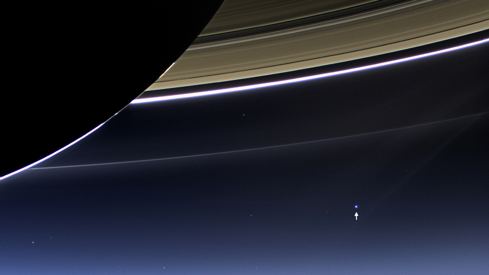

从卡西尼号看到的、位于土星阴影中的地球和月球。 月亮是那个白色亮点边缘上的小突起。

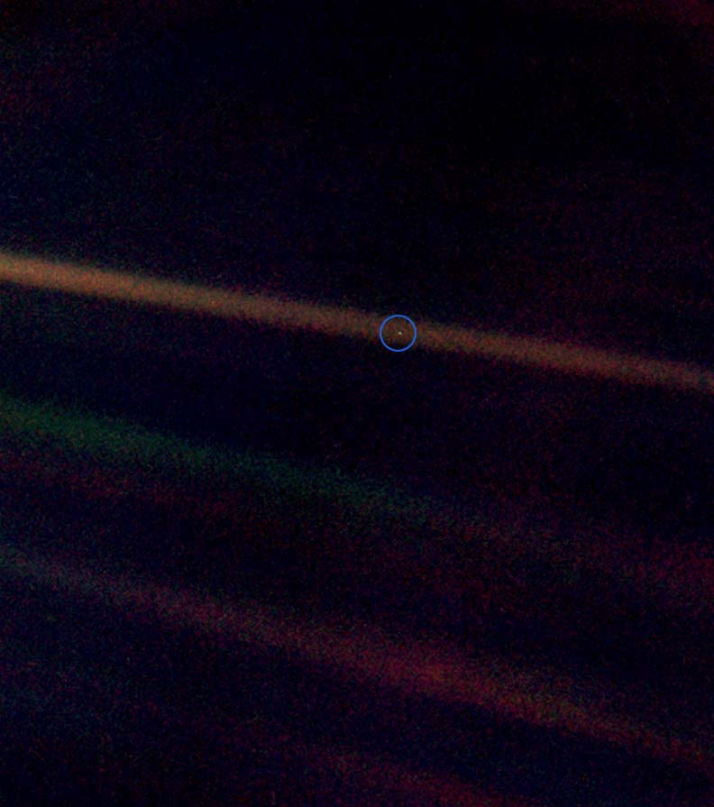

暗淡蓝点(地球),由旅行者1号拍摄 —— 这是从太阳系边缘的告别之作,距离地球40亿英里
暗淡蓝点

这张照片由旅行者1号在越过冥王星和海王星轨道之后拍摄,是地球最遥远的一幅影像(当然,除非某些外星种族从更远处拍到了我们)。 这张照片摄于1990年,当时“航行者”号距离地球约37亿英里,即60亿公里。 那些奇怪的、色彩斑斓的光线其实没什么好激动的,很不幸,它们只是明亮的阳光造成的衍射图案(光晕)。

暗淡蓝点是最极端的例子,说明我们是多么微不足道,提醒我们或许应该收敛一点自己的狂妄。 人类有史以来所做的一切,都发生在这个微小的斑点上。 这个相当令人羞辱的领悟,让卡尔·萨根为这个淡蓝色小点写下了这段美丽而深刻的思考:

点击观看[Youtube视频: Carl Sagan's Famous 'Pale Blue Dot' Quote in "Cosmos: A Spacetime Odyssey" (HD with subtitles) ](http://www.youtube.com/embed/b58SfRphkKc)可能需要翻墙

24年以来, 旅行者1号终于离开了太阳系, 几天前, 它距离太阳的光行时已经达到18小时, 也就是大约120亿英里远。 记住, 离地球最近的恒星, 因而也是最有可能存在生命的最近行星系统 —— 半人马座阿尔法星, 大约有4光年之遥。 现在你明白为什么我们需要尽早开发曲速引擎(Warp Drive)了吧?

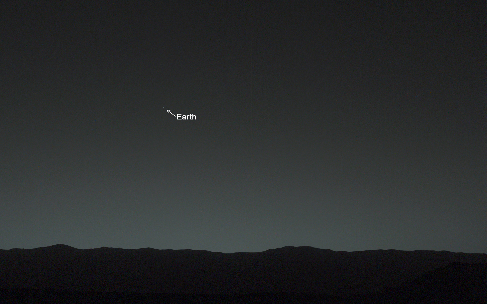

从火星表面看到的地球, 由好奇号拍摄
更多来自外太空的、奇妙的地球照片

最后, 我将留给你一些奇怪的地球照片, 它们来自整个太阳系中各种各样奇怪的位置。 上面的图片是由美国宇航局的好奇号火星车拍摄的; 通常探测器不会仰望天空(它的相机也不适合做这种事), 但这仍然是一张相当酷的照片。

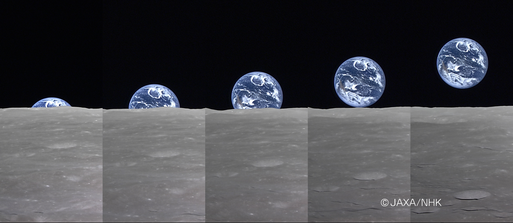

“全地球上升”, 日本“月亮女神号”月球探测器
早在2007年, 日本的“月亮女神号”月球探测器就用它的HDTV视频相机复刻了美国宇航局的这张原始照片。

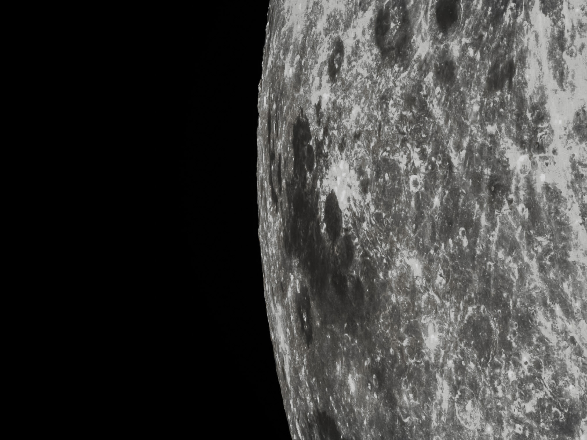

月球右下方的月海(Marginis), 由中国“嫦娥5-T1号”拍摄
好吧, 这张不是地球, 但它是几天前由中国“嫦娥5-T1号”拍到的、非常酷/怪异的一张月球照片。 右下方的月海 Marginis —— 字面意思就是大海的边缘 —— 位于月球靠近边缘的位置, 因此我们通常无法看到它。

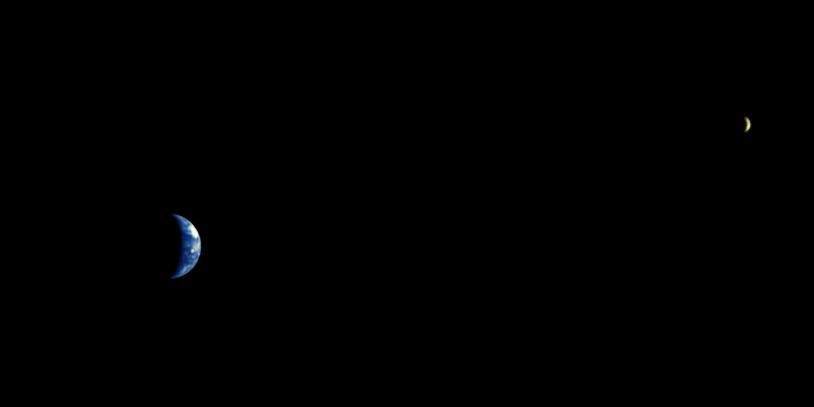

从火星上的火星快车号看到的地球和月球
这张清晰而美丽的照片, 是欧洲火星快车探测器早在2003年、它还在火星上时拍摄的。 当时这艘飞船距离地球约500万英里(800万公里)。

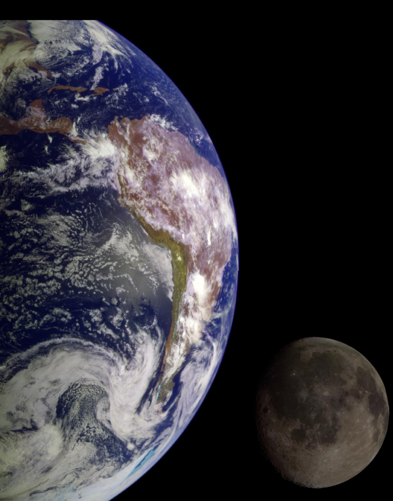

地球和月球, 由NASA的伽利略号在飞往木星的途中拍摄
这是我保留的(也是最奇怪的?)一张图。 这张照片是合成图, 但其比例和相对颜色/反照率(亮度/反射率)是正确的。 早在1992年, 飞往木星的伽利略号探测器还离地球相当近, 它转过身来, 拍了一些漂亮的照片。 我不确定这张照片是从一个奇怪的角度拍摄的, 还是NASA把月球贴到了图像上; NASA官员对此的描述也不清楚。

本文中所有的照片都可以点击放大。 我认为几乎所有照片的分辨率都足够高, 如果你愿意, 可以拿它们当桌面壁纸。 如果你觉得我们漏掉了一张特别棒的、来自外太空的地球照片, 欢迎在评论中告诉我们!

##

继续阅读: [The Space Shuttle legacy, in pictures](http://www.extremetech.com/extreme/90710-the-space-shuttle-legacy-in-pictures)

原文链接:  [The Earth and Moon, as seen from elsewhere in the universe](http://www.extremetech.com/extreme/193161-the-earth-and-moon-as-seen-from-elsewhere-in-the-universe)

原文日期: 2014年10月23日

翻译日期: 2014年10月24日

翻译人员: [书三生](http://t.qq.com/renfufei)
