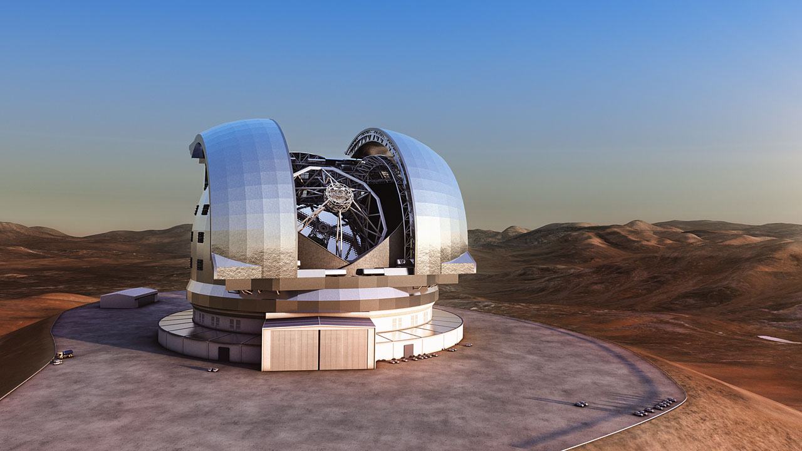
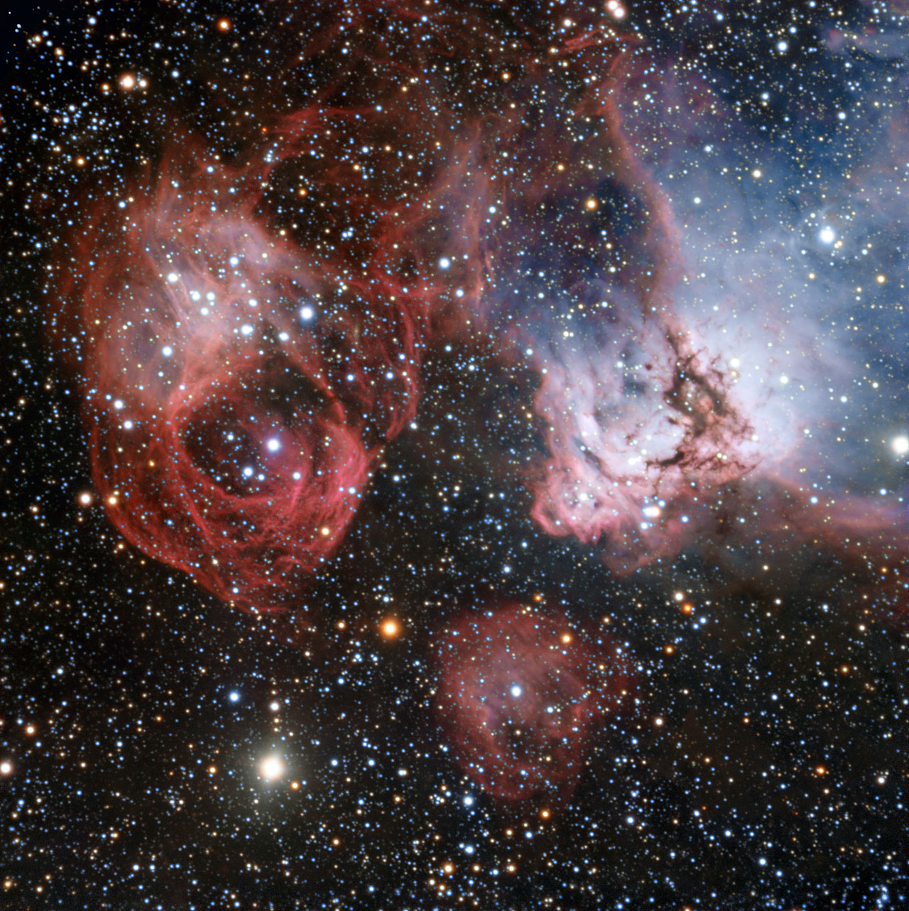

超级太空望远镜启动,能对光年外的类地行星成像
==

##

去寻找新的生活,探索越来越愚蠢的形容词… 智利的欧洲南方天文台已经宣布,它将开始建设超大望远镜,一个巨大的望远镜三十九公尺(128英尺)的主要镜子。 (愚蠢的)名字所暗示的,英语教学将是迄今为止世界上最大的可见光/近红外望远镜,发现岩石而激动人心的能力,类地行星环绕恒星光年。

欧洲南方天文台设有许多大型望远镜在阿塔卡马沙漠,北部370公里的圣地亚哥,智利。 阿塔卡马是世界上最好的地方之一天文观测,由于其高海拔(因此稀薄的大气层)和低水平的光污染。 欧洲南方天文台的望远镜捕捉到最有趣的银河系和宇宙的图片你看过ExtremeTech多年来,包括 [最近的一个新的太阳系诞生的形象](http://www.extremetech.com/extreme/193710-birth-of-a-solar-system-the-first-ever-high-resolution-image-of-planet-formation) , [银河系的9-gigapixel照片](http://www.extremetech.com/extreme/139329-9-gigapixels-84-million-stars-peer-into-the-worlds-most-detailed-photo-of-the-milky-way) 。

##

银河系的核心,ESO的VISTA望远镜

##

一个图像的大麦哲伦星云,由ESO的甚大望远镜(E-ELT的前体)

##

目前,甚大望远镜(VLT)——由四个人的口径镜子——是ESO最大的可见光望远镜。 当他们一起工作,他们是世界上最大的可见光望远镜。 新的欧洲超大望远镜(E-ELT)将有一个主镜直径39米,总光收集面积978平方米,约10500平方英尺,或大小的 两个篮球场 。 目前,世界上最大的single-mirror望远镜有光收集面积约70平方米。

简而言之,尽管它而讨厌的名字, 的E-ELT 真的是非常大,非常棒,太。 进入功能,E-ELT能够深入到太空的行星形成和获得高分辨率的图像,并检测水和其他有机分子在那些遥远的行星,行星。 虽然像开普勒太空望远镜可以找到这些太阳系外行星,我们需要高分辨率的望远镜就像E-ELT确认这些行星是否实际居住,推而广之,有多少宇宙中可能存在生命的行星。

读: [天文学家估计1000亿年居住的类地行星在银河系,宇宙中50千的七乘方](http://www.extremetech.com/extreme/152573-astronomers-estimate-100-billion-habitable-earth-like-planets-in-the-milky-way-50-sextillion-in-the-universe)

YouTuBe视频: [http://www.youtube.com/embed/LkxQ3mYfCPk](http://www.youtube.com/embed/LkxQ3mYfCPk)

主镜大小的比较。 注意TMT和E-ELT计划 多 比其他任何存在。
足够有趣,宣布E-ELT施工开始后仅仅几个月 [30米口径天文望远镜在夏威夷动工(TMT)](../telescope/telescope.md) 。 TMT E-ELT非常相似,但主要镜子是仅30米见方的——这实际上导致显著较小的光收集总面积(“只有”655平方米,比978 E-ELT)。 望远镜将操作可见/近红外光谱,但台湾海陆运输公司正在开发的主要是美国,中国,和日本,而E-ELT都是欧洲人。

E-ELT已经开始建设,与第一光(完成所有必要的部分)在2022年和2024年之间。 建筑本身必全然大规模,望远镜的主要结构——持有和操纵主镜,重达2800吨。

现在读: [外星人发现:到2020年,我们终于有能力找到life-harboring,外星行星](http://www.extremetech.com/extreme/170628-alien-spotting-by-2020-well-finally-have-the-ability-to-locate-habitable-alien-planets)

原文链接: [Work begins on Extremely Large Telescope](http://www.extremetech.com/extreme/195453-work-begins-on-extremely-large-telescope-will-be-able-to-image-tiny-earth-like-planets-from-light-years-away)

原文日期: 2014-12-05

翻译日期: 2014-12-08

翻译人员: [书三生](http://t.qq.com/renfufei)
