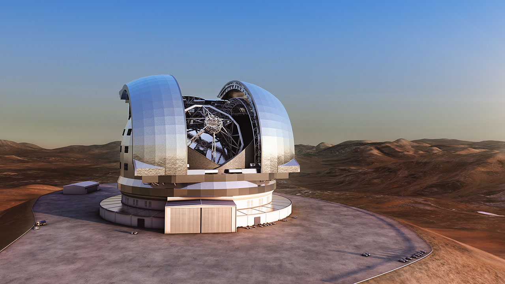
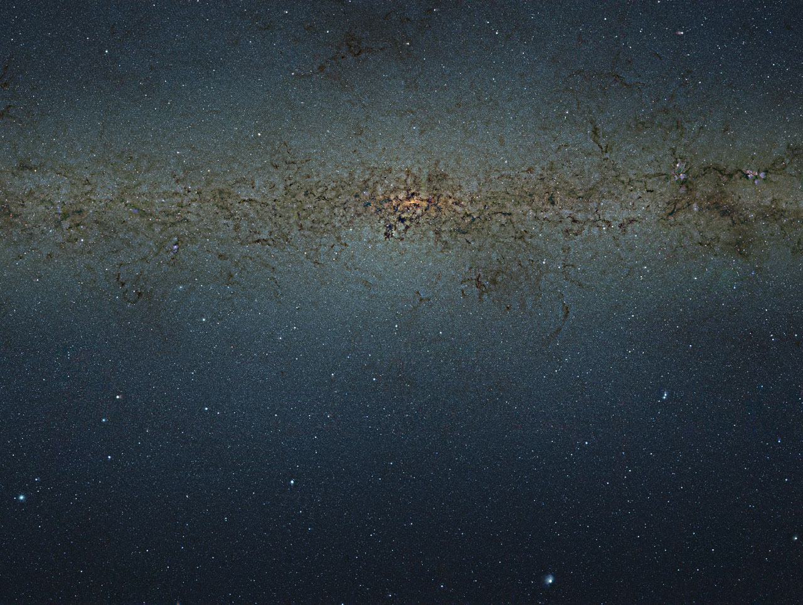
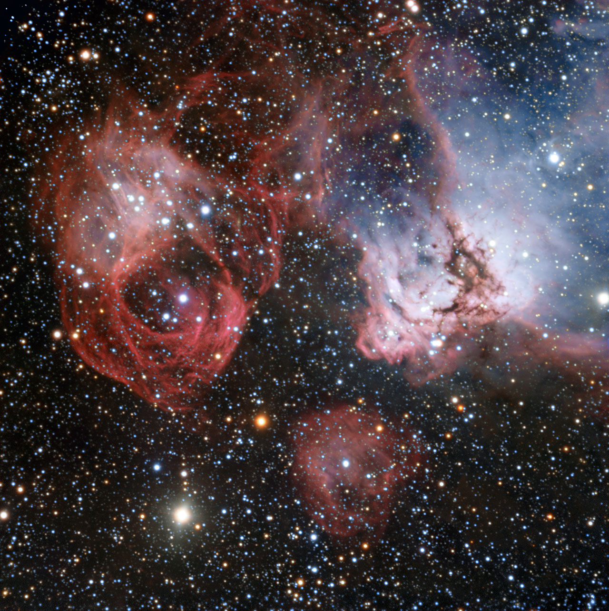
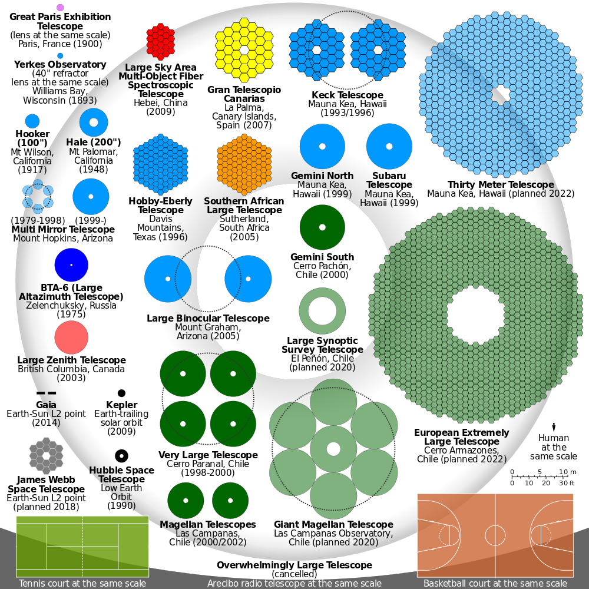

超级太空望远镜启动,能对光年外的类地行星成像
==

##

别管什么寻找新生命、以及那些越来越离谱的形容词了…… 智利的欧洲南方天文台(ESO)已经宣布,将开始建造超大望远镜(Extremely Large Telescope),这台巨型望远镜的主镜口径达39米(128英尺)。 正如这个(离谱的)名字所暗示的,ELT 将是迄今为止世界上最大的可见光/近红外望远镜,能够对光年之外环绕恒星运行的岩石类、激动人心的类地行星进行成像。

欧洲南方天文台在智利圣地亚哥以北370公里的阿塔卡马沙漠中架设了许多大型望远镜。 阿塔卡马是世界上最好的天文观测地点之一,因为它海拔高(因而大气稀薄)、光污染水平低。 多年来,欧洲南方天文台的望远镜为 ExtremeTech 贡献了你所见过的最有趣的银河系和宇宙图片, 包括 [最近一张新的太阳系诞生的图像](http://www.extremetech.com/extreme/193710-birth-of-a-solar-system-the-first-ever-high-resolution-image-of-planet-formation) , 以及 [银河系的90亿像素照片](http://www.extremetech.com/extreme/139329-9-gigapixels-84-million-stars-peer-into-the-worlds-most-detailed-photo-of-the-milky-way) 。

##

银河系的核心,由ESO的VISTA望远镜拍摄

##

大麦哲伦星云的一张图像, 由ESO的甚大望远镜(ELT的前身)拍摄

##

目前,甚大望远镜(VLT)——由四面独立的镜子组成——是ESO最大的可见光望远镜。 当它们协同工作时,就是世界上最大的可见光望远镜。 新的欧洲超大望远镜(E-ELT)的主镜直径将达到39米,总集光面积978平方米,约10500平方英尺,相当于 两个篮球场 那么大。 目前,世界上最大的单镜面(single-mirror)望远镜集光面积约为70平方米。

简而言之,尽管这名字很招人烦, E-ELT 真的是非常非常大,非常棒。 就功能而言,E-ELT 能够深入太空观测行星的形成、获取高分辨率图像,并探测那些遥远行星上的水和其他有机分子。 虽然像开普勒太空望远镜这样的设备可以找到这些太阳系外行星,但我们仍需要像 E-ELT 这样的高分辨率望远镜来确认这些行星是否真的宜居,进而推断宇宙中可能有多少颗孕育生命的行星。

阅读: [天文学家估计银河系中有1000亿颗宜居的类地行星,宇宙中则有50 sextillion 颗](http://www.extremetech.com/extreme/152573-astronomers-estimate-100-billion-habitable-earth-like-planets-in-the-milky-way-50-sextillion-in-the-universe)

YouTube视频: [http://www.youtube.com/embed/LkxQ3mYfCPk](http://www.youtube.com/embed/LkxQ3mYfCPk)

主镜大小的比较。 注意 TMT 和 E-ELT 计划要比现存的任何望远镜都大得多。
有趣的是,宣布E-ELT开工仅仅几个月之后, [30米口径天文望远镜(TMT)在夏威夷动工](../telescope/telescope.md) 。 TMT 与 E-ELT 非常相似,但主镜口径只有30米见方 —— 这实际上导致其集光总面积明显更小("只有"655平方米,而E-ELT为978平方米)。 这两台望远镜都将工作在可见光/近红外波段,但 TMT 主要由美国、中国和日本开发,而 E-ELT 则完全是欧洲人的项目。

E-ELT 已经开始建设,预计在2022年到2024年之间实现首次观测(所有必要部件全部完工)。 建筑本身必定规模宏大 —— 望远镜的主体结构用于支撑和操控主镜,重达2800吨。

现在阅读: [发现外星人:到2020年,我们终于将有能力找到适宜生命存活的系外行星](http://www.extremetech.com/extreme/170628-alien-spotting-by-2020-well-finally-have-the-ability-to-locate-habitable-alien-planets)

原文链接: [Work begins on Extremely Large Telescope](http://www.extremetech.com/extreme/195453-work-begins-on-extremely-large-telescope-will-be-able-to-image-tiny-earth-like-planets-from-light-years-away)

原文日期: 2014-12-05

翻译日期: 2014-12-08

翻译人员: [书三生](http://t.qq.com/renfufei)
