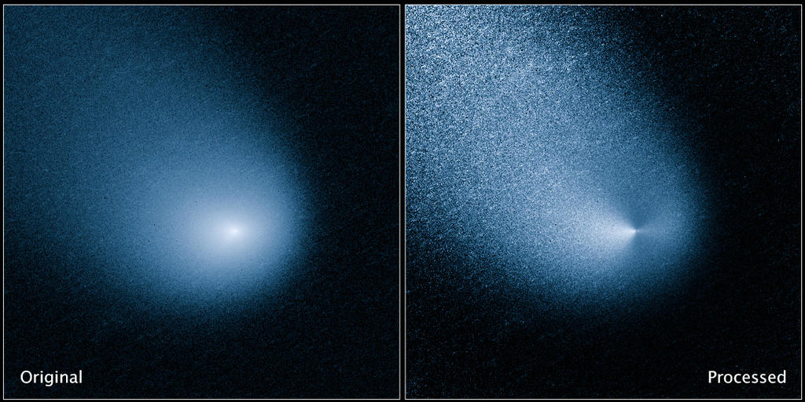
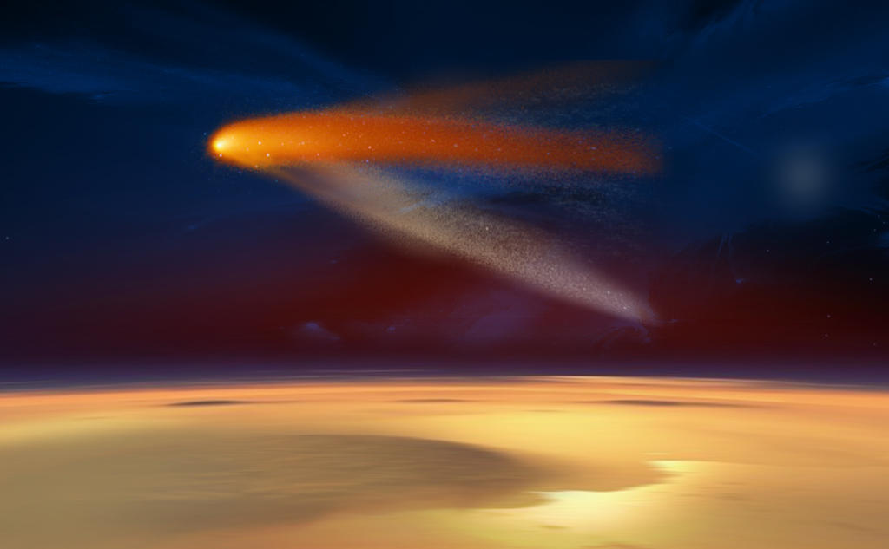
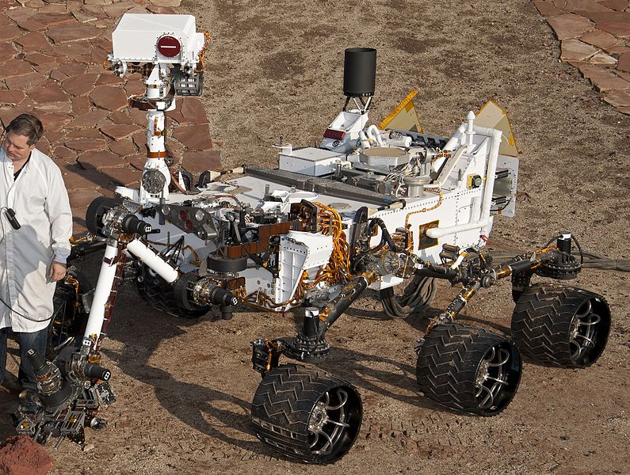
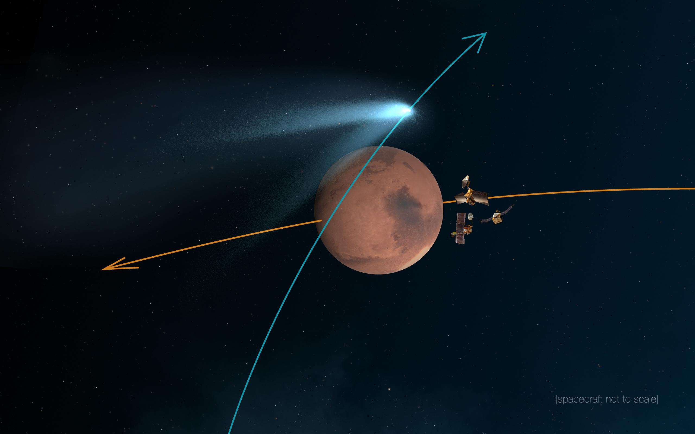

NASA火星探测器成功躲避赛丁泉彗星
====

赛丁泉彗星(comet Siding Spring)已安全通过了火星, NASA的三颗火星探测器都躲藏在这颗红色行星的背面,以防一个不小心就与彗星发生碰撞。我们收集到很多酷炫的照片,是由哈勃望远镜,以及地面上的望远镜拍摄的。下面分享给大家。

好奇号火星探测车的照相机对准上方,准备拍摄 Siding Spring通过火星的照片,但我们仍然期待从美国国家航空航天局(NASA)获得一些正面的清晰照。目前,我们也制作了一些塞丁泉彗星通过火星上空的效果图。奥德赛探测器(Odyssey)也应该会有一个很好的观测角度,但是,我们得等图像传送回地球才能确定.

**哈勃望远镜拍摄的 Siding Spring,左边是原始图像,右边是处理后的**

**NASA 的火星探测器, 正在躲避 Siding Spring**

Siding Spring在火星上空的艺术效果图。也许实际上没有这么魔幻,但我们充满期待

### 附: 好奇号火星探测车图片 ###

**好奇号在火星上**

**好奇号探测器**

##

## 下面是10月15日的原始文章,未修缮 ##

美国宇航局的MAVEN宇宙飞船到达火星,上个月,发回了第一个图片的红色行星的大气层受到大型太阳风暴。这些图像是同类中的第一个,为我们提供关于火星的臭氧层,脆弱的氧、碳、氢和电晕的火星的大气中。这些冠状物可以告诉我们火星上的条件可能已经喜欢在过去的四十亿年里,详细说明地球从温暖潮湿([完全适合窝藏生活](http://www.extremetech.com/extreme/150558-nasas-curiosity-rover-confirms-that-life-couldve-survived-on-mars)),寒冷,干燥,尘土飞扬的球体,这是今天。

MAVEN,代表火星大气与挥发物演化,只有插入三周前进入火星轨道。NASA还没检查完所有的轨道飞行器的各种仪器和传感器,看看他们在距离地球4.42亿英里的旅程。但是当太阳产生的太阳耀斑和日冕物质抛射(CME)直接领导的火星——就像9月26日5天后MAVEN的轨道插入——你启动你的相机和大量的图片首先,然后提问。

**火星的大气的氧、碳、氢泄漏进入太空。点击放大。**

这些第一图像,如上所述,显示地球的电晕原子碳,氢,氧逃离火星大气。我相信光明的右边缘的边缘是目前面对太阳,据推测,当火星是由太阳高能粒子轰击(9月),更多的碳,氧,氢泄漏进入太空。曾几何时,这些原子是分子的水(H2O)或二氧化碳(CO2),但是没有一种氛围他们自由只是泡沫进入太空。

NASA兴奋的图片:“所有的仪器显示数据质量比预期在这个早期阶段的任务,”布鲁斯说Jakosky,MAVEN的首席研究员。“所有的仪器已经被打开,尽管没有完全检出,名义上是功能。它是一个简单和直接的飞船飞,至少到目前为止。真的看起来好像我们前往一个激动人心的科学任务。”

**的火星飞越彗星偏袒春天,10月19日(周日)**

在其他新闻,MAVEN,[好奇心](http://www.extremetech.com/tag/curiosity),火星勘测轨道飞行器,[印度Mangalyaan](http://www.extremetech.com/extreme/190772-indias-first-mars-satellite-enters-orbit-costing-just-11-of-nasas-own-mars-mission)和所有其他各种航天器和火星机器人的居民都高度警惕的即将飞越彗星支持Spring周日(10月19日)。彗星,官方指定C / 2013 A1,将错过这颗红色星球仅以87000英里(140000公里),这是相当接近天文术语(月球的平均距离是239000英里)。它是外墙春认为,这源于奥尔特云在太阳系的边缘,没有以前接近太阳。其原始性质意味着,因为它经过火星和头向太阳,我们会得到一个视图对象的可能并没有改变太多,因为我们的星系是46亿年前——您可能猜到,[天文学家而兴奋](http://www.jpl.nasa.gov/news/news.php?feature=4332)

所有这些最初兴奋后,MAVEN将经过几周的仪器校准,然后开始认真的主要科学任务。与MAVEN,NASA希望最终确定火星——[可能是一次温暖和湿润的](http://www.extremetech.com/extreme/144769-the-other-blue-planet-what-mars-mightve-looked-like-billions-of-years-ago)——失去了其大气和地表水。最流行的假设是,火星的铁核心冷却,其防护磁场腐烂,使高能太阳粒子-像那些轰击地球上个月大气层烧掉。

现在读: [2012年的太阳风暴,几乎送我们回到石器时代的末日景象](http://www.extremetech.com/extreme/186805-the-solar-storm-of-2012-that-almost-sent-us-back-to-a-post-apocalyptic-stone-age)

原文链接: [NASA satellites safe as comet Siding Spring buzzes past Mars (updated)](http://www.extremetech.com/extreme/192001-maven-captures-first-images-of-mars-atmosphere-braces-for-close-comet-flyby)

原文日期: 2014年10月20日

翻译日期: 2014年10月22日

翻译人员: [书三生](http://t.qq.com/renfufei)
