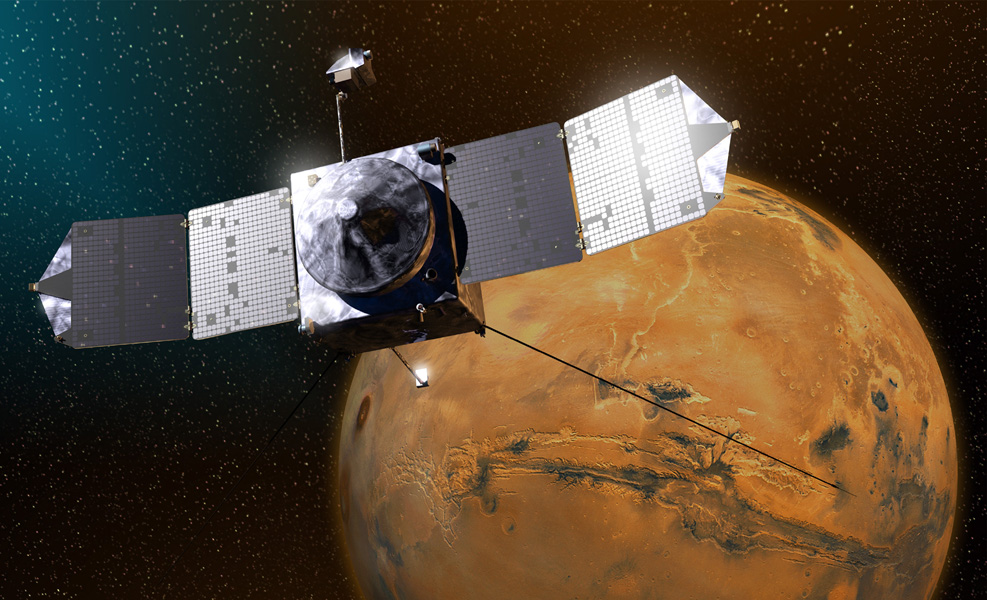
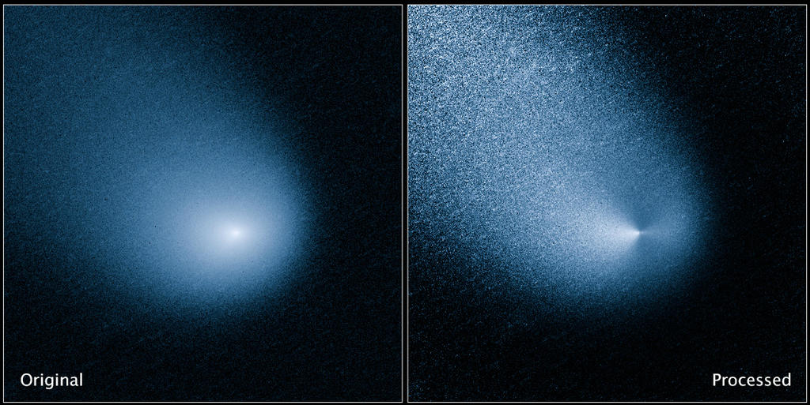
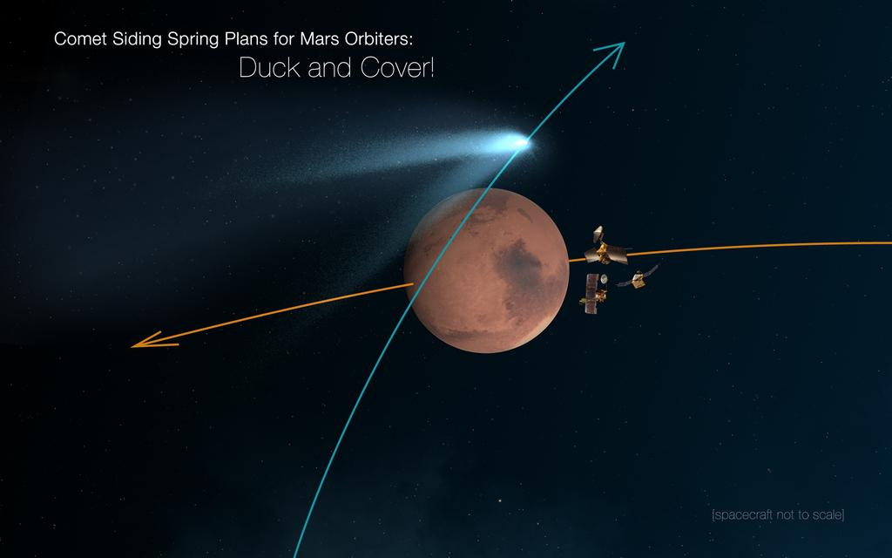
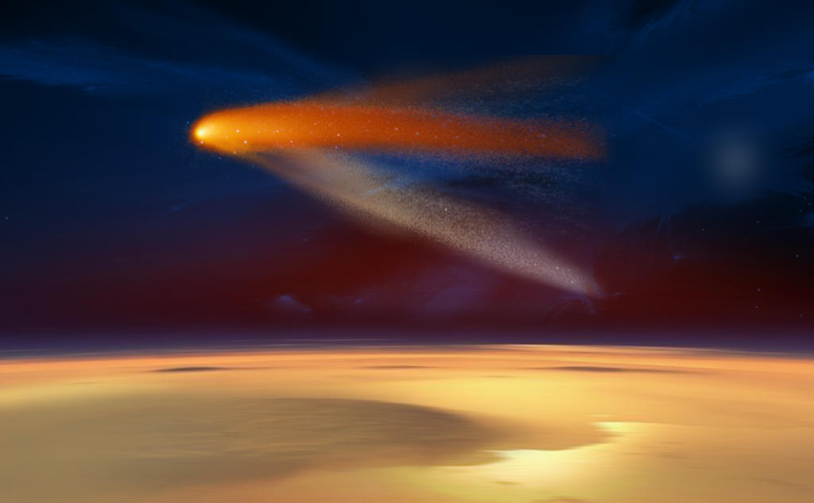
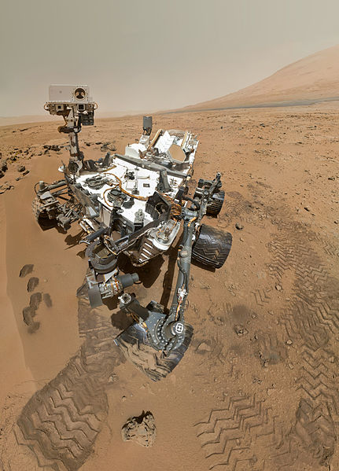
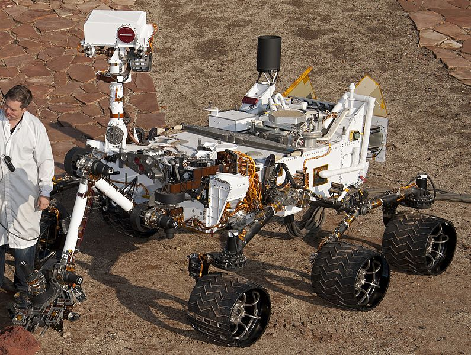
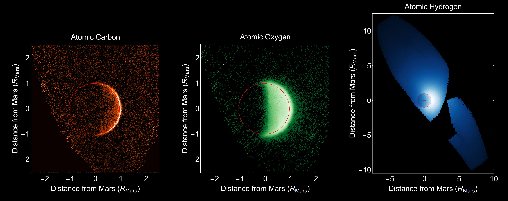
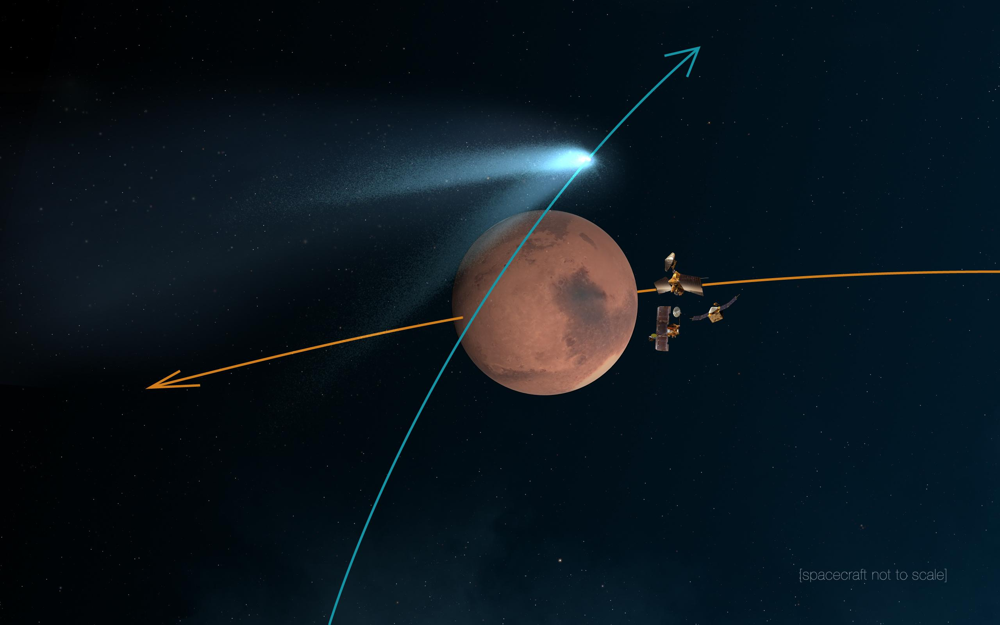
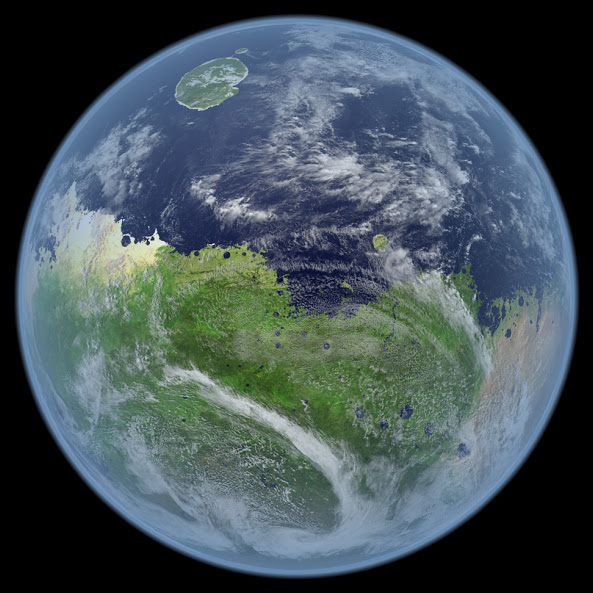

NASA火星探测器成功躲避赛丁泉彗星
====

赛丁泉彗星(comet Siding Spring)已安全通过了火星, NASA的三颗火星探测器都躲藏在这颗红色行星的背面,以防一个不小心就与彗星发生碰撞。我们收集到很多酷炫的照片,是由哈勃望远镜,以及地面上的望远镜拍摄的。下面分享给大家。

好奇号火星探测车的照相机对准上方,准备拍摄 Siding Spring通过火星的照片,但我们仍然期待从美国国家航空航天局(NASA)获得一些正面的清晰照。目前,我们也制作了一些赛丁泉彗星通过火星上空的效果图。奥德赛探测器(Odyssey)也应该会有一个很好的观测角度,但是,我们得等图像传送回地球才能确定.

**哈勃望远镜拍摄的 Siding Spring,左边是原始图像,右边是处理后的**

**NASA 的火星探测器, 正在躲避 Siding Spring**

Siding Spring在火星上空的艺术效果图。也许实际上没有这么魔幻,但我们充满期待

### 附: 好奇号火星探测车图片 ###

**好奇号在火星上**

**好奇号探测器**

##

## 下面是10月15日的原始文章 ##

美国宇航局的MAVEN宇宙飞船上个月抵达火星,发回了首批图像,展示了这颗红色行星的大气层遭受一场大型太阳风暴袭击的情景。这些图像是同类中的第一批,让我们得以一窥火星的臭氧层,以及火星大气中脆弱的氧、碳、氢和日冕。这些日冕可以告诉我们过去40亿年里火星上的条件可能是什么样的,详细呈现了这颗行星从温暖潮湿([可能孕育生命](http://www.extremetech.com/extreme/150558-nasas-curiosity-rover-confirms-that-life-couldve-survived-on-mars))的世界,演变成今天这个寒冷、干燥、尘土飞扬的球体的过程。

MAVEN,代表火星大气与挥发物演化(mars Atmosphere and Volatile EvolutioN),在仅仅三周前才进入火星轨道。NASA还没来得及检查完所有的轨道飞行器的各种仪器和传感器,看看它们在距离地球4.42亿英里的旅程后状态如何。但是当太阳产生的太阳耀斑和日冕物质抛射(CME)直接扑向火星时——就像9月26日、MAVEN入轨5天后的那一次——你会先打开相机拍下一大堆照片,然后再去提问。

**火星的大气的氧、碳、氢泄漏进入太空。点击放大。**

这些首批图像,如上所述,显示了碳、氢、氧原子构成的日冕从火星大气中逃逸。我相信右侧明亮的边缘就是当前正对着太阳的那一面;据推测,当火星受到太阳高能粒子轰击时(9月的那次),就有更多的碳、氧、氢泄漏进入太空。曾几何时,这些原子还是水分子(H2O)或二氧化碳(CO2)的一部分,但如今在没有大气束缚的情况下,它们自由地冒泡进入太空。

NASA对这批图像兴奋不已:“所有的仪器显示,在任务的这个早期阶段,数据质量比预期还要好,”MAVEN的首席研究员 Bruce Jakosky 说。“所有的仪器都已经被打开,尽管还没有完全校准,但名义上都能正常工作。至少到目前为止,这是一次简单而直接的飞船飞行。看起来我们确实正踏上一项激动人心的科学任务。”

**彗星飞掠火星: 赛丁泉彗星, 10月19日(周日)**

在其他新闻方面,MAVEN、[好奇号](http://www.extremetech.com/tag/curiosity)、火星勘测轨道飞行器、[印度Mangalyaan](http://www.extremetech.com/extreme/190772-indias-first-mars-satellite-enters-orbit-costing-just-11-of-nasas-own-mars-mission)和所有其他各种航天器和火星机器人的居民,都对这颗即将飞掠火星的彗星高度警惕,它就在周日(10月19日)到来。这颗彗星,官方编号为 C/2013 A1,与火星的最近距离仅有87000英里(140000公里),在天文学术语里算是相当接近了(月球的平均距离是239000英里)。它就是赛丁泉彗星(Siding Spring),被认为源自太阳系边缘的奥尔特云,此前从未如此接近过太阳。它的原始特性意味着,当它经过火星、朝太阳飞去时,我们将看到一个自46亿年前星系形成以来可能并未发生太大变化的天体——你大概猜到了,[天文学家们为此兴奋不已](http://www.jpl.nasa.gov/news/news.php?feature=4332)

在最初的兴奋之后,MAVEN将花几周时间校准仪器,然后开始认真的主要科学任务。借助MAVEN,NASA希望最终确定火星——[它可能曾经温暖而湿润](http://www.extremetech.com/extreme/144769-the-other-blue-planet-what-mars-mightve-looked-like-billions-of-years-ago)——是如何失去大气和地表水的。最流行的假设是,火星的铁核心冷却,其防护磁场逐渐瓦解,致使其大气层被高能太阳粒子烧蚀掉——就像上个月轰击火星的那些粒子一样。

现在读: [2012年的太阳风暴,几乎送我们回到石器时代的末日景象](http://www.extremetech.com/extreme/186805-the-solar-storm-of-2012-that-almost-sent-us-back-to-a-post-apocalyptic-stone-age)

原文链接: [NASA satellites safe as comet Siding Spring buzzes past Mars (updated)](http://www.extremetech.com/extreme/192001-maven-captures-first-images-of-mars-atmosphere-braces-for-close-comet-flyby)

原文日期: 2014年10月20日

翻译日期: 2014年10月22日

翻译人员: [书三生](http://t.qq.com/renfufei)
