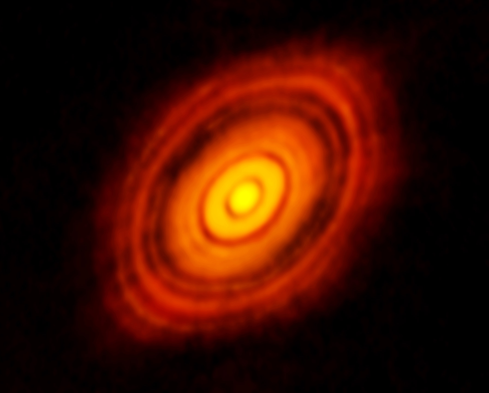
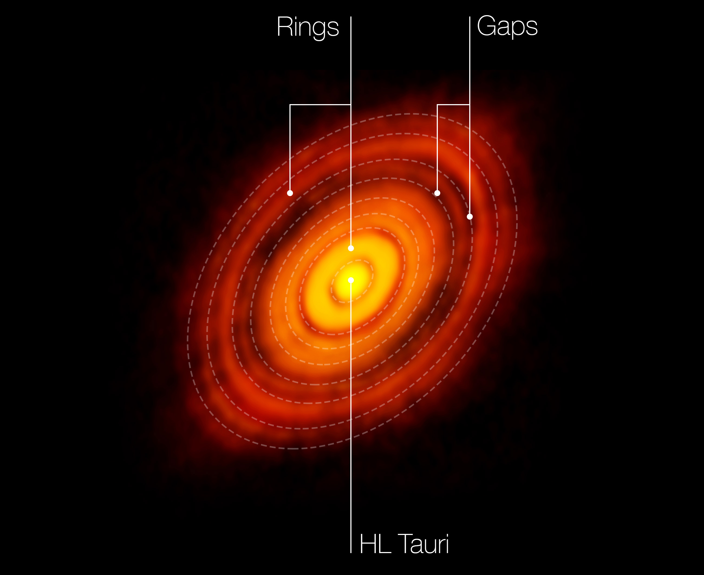
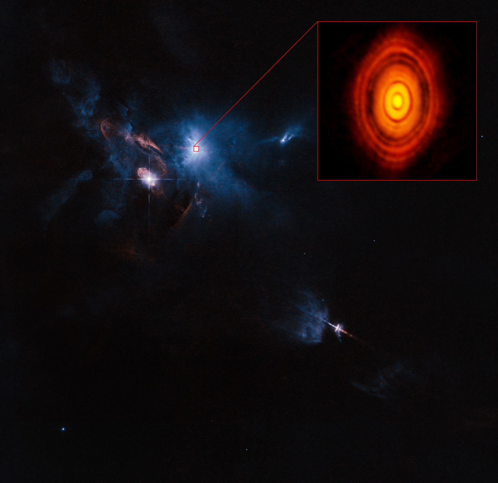
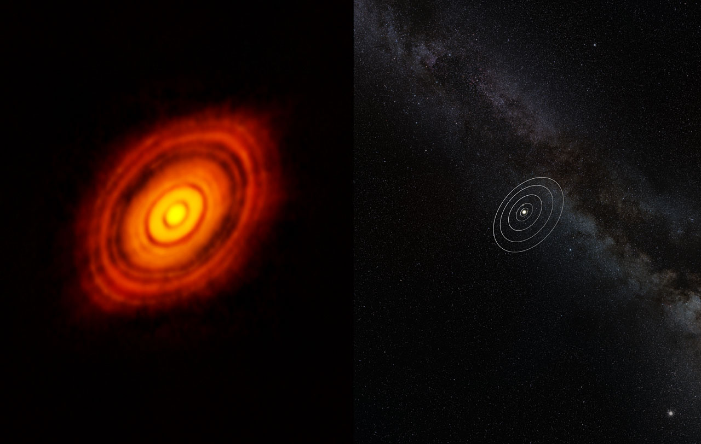
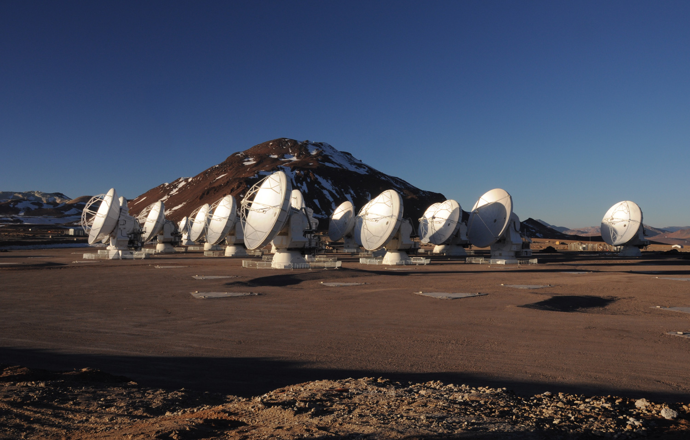

恒星星系的诞生: 首次拍到行星形成时的高清图像
==

请尽情欣赏吧,我的朋友们 —— 这是迄今为止最详细的年轻恒星及其行星盘图像。 在这里你可以看到年轻的恒星 HL Tau,它只有一百万年的历史,周围旋转的尘埃和气体正逐渐凝聚成行星和小行星。 不管你信不信,几十亿年前,我们自己的太阳系大概就是这个样子。

这张照片由ALMA(阿塔卡马大型毫米波/亚毫米波阵列)拍摄 —— 这是一台由66面独立天线组成的巨型望远镜,架设在智利北部的阿塔卡马沙漠的高处。 根据负责运营ALMA的欧洲南方天文台(ESO)的说法, [这张图片](http://www.eso.org/public/news/eso1436/) 来自该望远镜首次以“全新且最强大的配置”进行的观测(ALMA已经建设多年,但直到最近,他们才安装好足够多的天线,并把它们移动到合适的位置,以分辨深空影像)。

HL Tau行星盘的注释。 ([点击这里获取未经处理的高分辨率图像](http://www.extremetech.com/wp-content/uploads/2014/11/alma-hl-tau-protoplanetary-disk.jpg)。 )

图像正中央的 HL Tau,是一颗年轻的恒星,位于金牛座方向,距离我们大约450光年。 此前的观测告诉我们,HL Tau 周围有一团尘云,但直到ALMA凝视这颗恒星,这团尘埃云的真实性质才显现出来。 能如此细致地看到行星盘,堪称开创性的发现;而在一颗只有一百万年历史的恒星周围看到这样的盘,更是令人震惊。 我们一直以为,恒星的尘埃和气体需要通过引力凝聚成行星和小行星,会花费长得多的时间。

哈勃拍摄的HL Tau周边区域图像

这张图比较了太阳系的大小与HL Tau及其周围的原行星盘。 虽然这颗恒星比太阳小得多,但HL Tau周围的行星盘向外延伸的距离,几乎是海王星到太阳距离的三倍。

ALMA,位于智利阿塔卡马沙漠的高处,是一台相当大的望远镜
顺便说一下,行星盘环之间的空隙,是小行星和行星正在组装的信号。 靠引力越长越大的岩石和气体,会扫掠更多的尘埃和气体 —— 就像滚雪球一样,在盘面上雕刻出空白的缝隙,并继续环绕恒星运行。 这与 [土星环的形成 ](http://www.extremetech.com/extreme/180579-nasas-cassini-may-have-witnessed-the-birth-and-death-of-a-new-saturnian-moon) 是同样的过程。

回到地球这边,对HL Tau行星盘的这种高分辨率观测,有望告诉我们许多关于我们自己的太阳系在约40亿年前是如何形成的秘密。 以前,我们只能推测和模拟行星与恒星的形成,但现在,多亏了ALMA,我们可以近乎实时地看着它在现实世界中发生。 科学真让人敬畏。

相关阅读:  [90亿像素,8400万颗恒星: 窥视世界上最详细的银河系照片](http://www.extremetech.com/extreme/139329-9-gigapixels-84-million-stars-peer-into-the-worlds-most-detailed-photo-of-the-milky-way)

原文链接: [Birth of a solar system: The first ever high-resolution image of planet formation](http://www.extremetech.com/extreme/193710-birth-of-a-solar-system-the-first-ever-high-resolution-image-of-planet-formation)

原文日期: 2014-11-06

翻译日期: 2014-11-07

翻译人员: [书三生](http://t.qq.com/renfufei)
