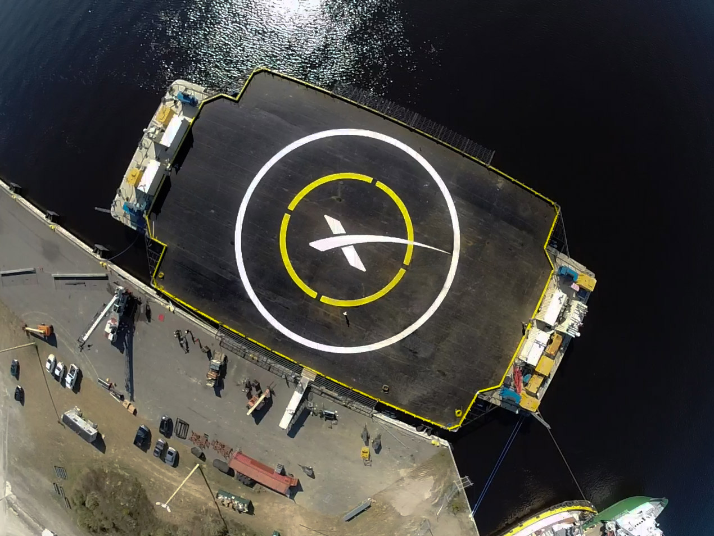
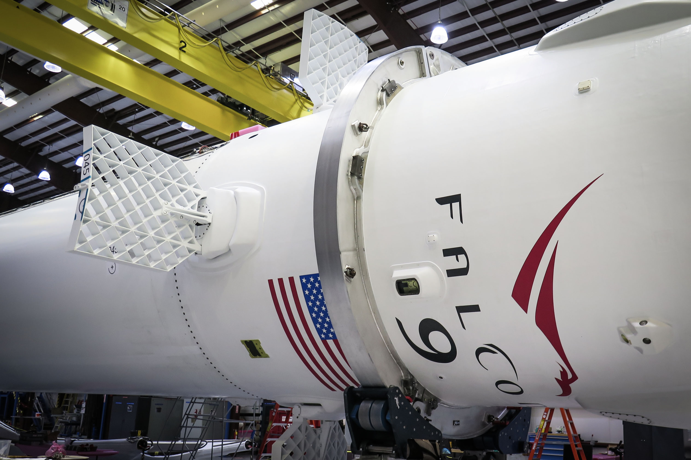

SpaceX尝试将猎鹰9号火箭降落到海面: 商业太空航行的重大一步
==

12月19日,星期五,SpaceX公司将尝试太空旅行史上最激动人心的一次操作:让猎鹰9号火箭的第一级降落在位于大西洋中部的一个巨大平台上。 猎鹰9号火箭在把龙飞船送入太空(前往国际空间站)之后,将自行控制返回地球。 通常情况下,第一级会直接坠入大海,再也不会被使用;而这一次,如果软着陆成功,火箭就可以重复使用,从而大幅削减太空发射的成本。

乍一看,这次任务 —— CRS-5,SpaceX的第五次国际空间站补给任务 —— 只是一个标准任务。 不过仔细看,你会看到猎鹰9号火箭略有不同:第一级的顶部装有四个 高超音速栅格翼 。 这些翼片在上升飞行时是收起的,但当火箭与第二级分离、开始向地面坠落时,它们会弹出,从而精确控制火箭的滚转、俯仰和偏航。

猎鹰9号全新的超音速栅格翼,展开状态
这次任务的另一项新内容,当然就是那个巨大的海洋平台(见上图),CRS-5火箭将尝试降落在它上面。 这是一艘“自主航天港无人船”(没错,SpaceX就是这么叫的),长约90米,宽50米(300英尺乘160英尺),但除此之外,我们对它知之甚少。据推测,出于安全原因,它是无人驾驶的。 我想,设计一艘能足够精确地保持位置、以承接海上着陆的船/驳船,是件很难的事 —— 另外,SpaceX还有一个用它来发射火箭的初步计划,那就更苛刻了。

发射与软着陆将如何进行

那么,这一切将如何进行呢。 如果天气良好,SpaceX的CRS-5任务将于12月19日东部时间下午1点左右从卡纳维拉尔角发射升空。 大约三分钟后,猎鹰9号火箭的第一级(也就是火箭的大部分)将完成燃烧,并与第二级分离。 第二级将点火,把龙飞船送往国际空间站。 而此时第一级正以大约每小时3000英里的速度飞行,并开始落回大西洋。

这时事情就开始变得复杂了。 第一级储箱里还会剩下少量火箭燃料(大约10%),但由于此时火箭已经很轻,控制降落并不需要太多燃料。 分离后将会有一系列三次点火:首先是 推进力点火 ,以阻止火箭继续下坠得更远;之后,在地球大气的协助下,会进行一次 超音速反推点火 ,让火箭减速,此时速度大约为每小时550英里;最后,当着陆腿展开、接近海洋平台时,会有一次 着陆点火 ,把火箭的垂直速度降到每小时仅几英里。

据SpaceX称,整个过程“最多有50%的成功机会”。 SpaceX已经在以往的猎鹰9号发射或其F9R测试(视频)中尝试过每一个单独的步骤,但现在是时候把它们串联起来、并祈求最好的结果了。 据我们所知,这也将是那艘自主航天港无人船第一次亮相 —— 如果非要我猜SpaceX信心为何不足,那大概就是因为这个海洋平台。 (它能足够精确地定位吗? 它会在着陆前受到海浪起伏的影响吗?)

如果一切顺利,SpaceX将朝着实现可重复使用航天器的梦想迈出(非常大的一步)。 太空发射成本高昂的一个主要原因就是,大多数火箭 —— 造价数百万美元 —— 只是简单地坠入海洋,或者变成轨道上的太空垃圾,再也不会被使用。 最终,SpaceX希望能把第一级和第二级都送回最初的发射台,加注燃料,然后再次送入太空。 几年前,这听起来还是一个非常崇高的目标,而现在,它已是近在眼前的现实。

现在阅读: [SpaceX发布龙飞船V2,世界上第一款可重复使用的商业载人飞船](http://www.extremetech.com/extreme/183349-spacex-unveils-dragon-v2-the-worlds-first-commercial-manned-reusable-spaceship)

原文链接: [SpaceX will attempt to land a Falcon 9 rocket on an ocean platform, a huge step towards cheap space travel](http://www.extremetech.com/extreme/196070-spacex-will-attempt-to-land-a-falcon-9-rocket-on-an-ocean-platform-a-huge-step-towards-cheap-space-travel)
