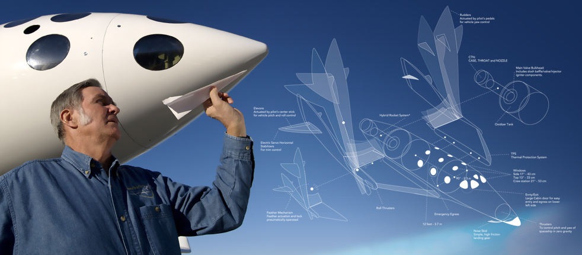
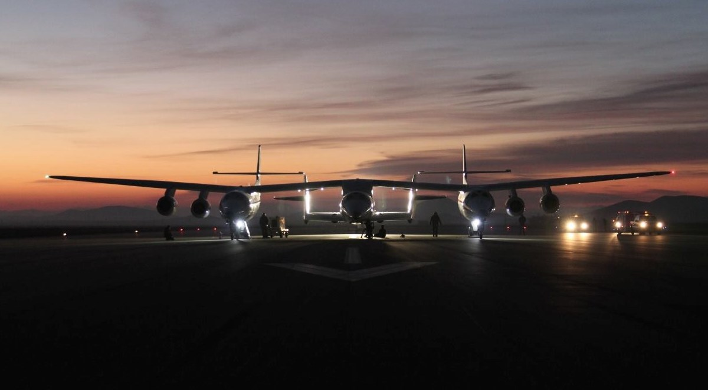
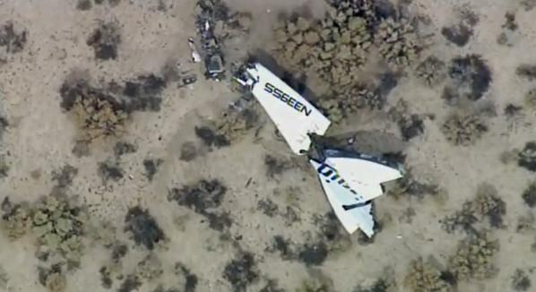

维珍银河二号宇宙飞船的坠毁并非是火箭发动机造成的
==

## 11月3日更新:

初步调查结果表明: 太空飞船二号解体的原因并非火箭发动机的故障或爆炸。 到目前为止,看起来似乎是由于“羽翼(feather)”系统 —— 展开后以增加空气阻力 —— 过早激活导致的。 “羽翼”本应由飞行员激活,但似乎是出了其他什么意外,导致它自行激活,从而引发了致命的空中解体。

## 10月31日版本:
 
对商业太空飞行来说这是悲惨的一个星期。 本周早些时候[当地时间10月28日],美国轨道科学公司的安塔瑞斯火箭(Antares rocket developed by Orbital Sciences Corporation) 在[起飞后爆炸](http://v.youku.com/v_show/id_XODE0OTA1NDg0.html),而今天[2014-10-31],维珍银河的太空船二号确认坠毁。 与SpaceX的 Dragon 或 Antares火箭不同, SpaceShipTwo 的设计目标是为了替代那架高度专用的载机 —— 白骑士二号(White Knight Two)。

据目前的报道,两名飞行员中有一人死亡,另一人严重受伤,正在接受治疗。 但和大多数突发事件报道一样,谣言满天飞,大量相互矛盾的信息和报道仍然充斥在我们周围。 一些报道称两位飞行员都没有被找到,而BBC则声称有一人还活着。

维珍的官方Twitter账号发布消息说,最初的发射在10点07分, 火箭点火几秒钟后(同一时间戳), 在10:13发生爆炸(官方将其定义为一次“异常,anomaly”)。 所有的报道都指出, 爆炸发生在发动机点火后不久。

与此同时,残骸的照片已经浮出水面:

Virgin Galactic’s SpaceShipTwo, 维珍银河二号宇宙飞船, 残骸

就“异常”而言,这已经算是好的了。 维珍承诺会发布一份更新声明,但只是表示,它将与当局合作调查航天器的损毁,并且最关心的是两名飞行员的命运。

今天的发射被宣传为一次胜利的回归测试,是自今年1月以来的首次。 本月早些时候,维珍银河的亚轨道飞行器成功进行了一次无动力试飞,理查德·布兰森甚至开玩笑说,要把去太空当作圣诞礼物。 该公司招致了媒体的大量批评以及批评人士的愤怒,他们声称其预售活动 —— 据说有名人、富豪预订了座位 —— 不过是面向轻信爱好者的募捐活动。

最初的太空飞船一号(SpaceShipOne)赢得了令人艳羡的安萨里X奖(Ansari X Prize),曾在两周内两次成功抵达太空;太空飞船二号正是基于这一设计。 维珍银河原本希望在2015年开始载人飞行,但随着所有目光都转向发射后的分析和救援工作,这一努力可能会暂停。

原文链接: [Virgin Galactic’s SpaceShipTwo crash wasn’t caused by faulty rocket engine (updated)](http://www.extremetech.com/extreme/193398-virgin-galactics-spaceshiptwo-suffers-catastrophic-failure-during-flight-test)

早期相关文章: [Virgin Galactic successfully tests re-entry, prepares for space tourism in 2014](http://www.extremetech.com/extreme/165943-virgin-galactic-successfully-tests-re-entry-prepares-for-space-tourism-in-2014)

原文日期: 2014年9月18日上午9:57

翻译日期: 2014-12-17

翻译人员: 书三生
