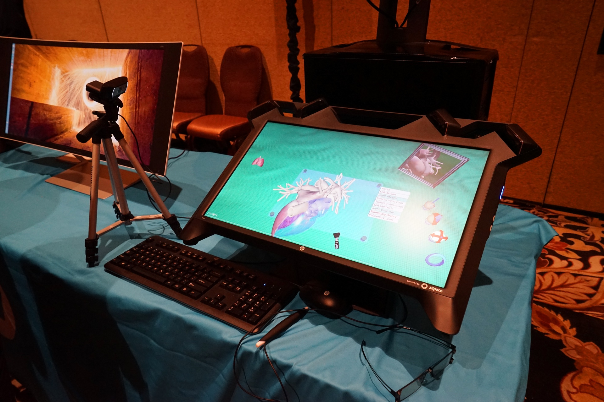
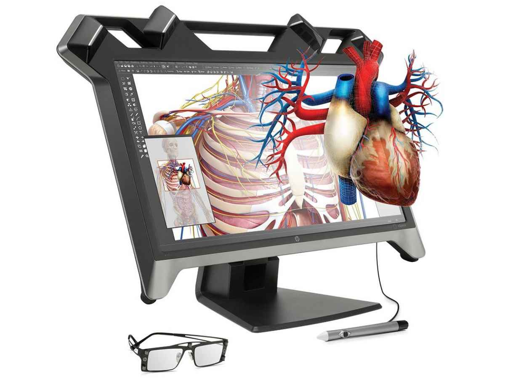

虚拟现实技术成功运行在桌面领域
==

The first time I donned a pair of special glasses and picked up a wired stylus to enter a virtual reality was over 25 years ago. It required extremely expensive hardware, and only allowed for a simple, low-resolution, experience of machining a part on a virtual lathe. But we were all sure that practical applications were just around the corner. It has taken much longer than most of us predicted, but with its new Zvr display, HP is bringing to market a practical and useful VR tool for educators, scientists, and other professionals that need to have accurate, simulated interactions with computer-generated models.

我第一次戴上一副特殊的眼镜、拿起一支有线手写笔进入 [虚拟现实](http://www.extremetech.com/tag/virtual-reality),那已经是25年多前的事了。 它需要极其昂贵的硬件,而且只能提供一种简单、低分辨率的体验 —— 在虚拟车床上加工一个零件。 但我们都确信,实际应用指日可待。 实际花的时间比我们大多数人预想的要长得多,不过,凭借全新的 Zvr 显示器,惠普正将一款实用、好用的 VR 工具推向市场,面向教育工作者、科学家,以及其他需要与计算机生成的模型进行精确模拟交互的专业人士。

The heart of the Zvr (if you’ll forgive the pun) is a special-purpose display from VR startup Zspace, which incorporates four cameras for head-tracking, a fully gyroscopic stylus that allows for both precise pointing and true 3D manipulation of objects, and a 3D display that uses special glasses. HP is also offering Zview software for the sharing of 3D content suitable for use on the Zvr.

Zvr 的核心(请原谅这个双关语)是一块来自 VR 初创公司 Zspace 的专用显示器,它集成了用于头部追踪的四个摄像头、一支能够精确指向并真正以 3D 方式操控物体的全陀螺仪手写笔,以及一块需要佩戴特殊眼镜观看的 3D 显示屏。 惠普还提供 Zview 软件,用于共享适用于 Zvr 的 3D 内容。

I got to use the Zvr to manipulate a model of a human heart, and was able to quickly and easily select different portions of the heart, and move it around simply by twisting my wrist — the way I would if I were actually holding it in my hand. The result was an experience that felt natural, and was also precise enough that I could imagine how powerful it could be as a learning tool for fields that require a detailed understanding of complex physical objects, such as anatomy or mechanical engineering.

我用 Zvr 操作了一个人类心脏模型,能够快速、轻松地选取心脏的不同部位,只要转动手腕就能移动它 —— 就像我真的用手捧着它一样。 结果是一种非常自然的体验,而且精度足够高,让我能够想象,对于那些需要对复杂物理对象有细致了解的领域(比如解剖学或机械工程)来说,它会是一款多么强大的学习工具。

### The stylus makes all the difference

### 手写笔是关键所在

What differentiates the Zvr — the magic behind the Zspace display that powers it — is the integrated 3D stylus. Gesture-based VR interfaces, like those [powered by Leap Motion](http://www.extremetech.com/extreme/161813-leap-motion-review) or Microsoft’s Kinect, suffer from a lack of precision, especially when it comes to twisting and turning objects using motions of your wrist and hand. Obviously, the need for a stylus does limit the use cases for the Zvr. It is not going to help you practice conducting an orchestra, or sculpt a clay statue using both hands. HP and Zspace are positioning the display primarily for science and technology related disciplines — especially for teaching them.

让 Zvr 与众不同的地方 —— 也就是它背后那套 Zspace 显示技术的神奇之处 —— 是它集成的 3D 手写笔。 基于手势的 VR 交互界面,比如 [由 Leap Motion 驱动的](http://www.extremetech.com/extreme/161813-leap-motion-review) 那些,或是微软的 Kinect,都存在精度不足的问题,尤其是在需要用手腕和手部的动作来翻转、转动物体的时候。 显然,对手写笔的依赖确实限制了 Zvr 的使用场景。 它没法帮你练习指挥一支管弦乐队,也没法让你用双手雕刻一座泥塑。 惠普和 Zspace 主要把这台显示器定位在与科学技术相关的学科 —— 尤其是用于教学。

The high-resolution display and 3D manipulation require a fair amount of compute power. You need an HP Z-Series (or similar) workstation to run it. Along with its large size, that means it is not suitable for any type of mobile application. The viewing angle is also very limited. Even wearing the glasses, when I stood behind the person seated at the display I didn’t get any of the 3D effect. However, when I sat down, the virtual heart on the display popped into a nearly holographic 3D form. HP and Zspace have not announced a price or exact availability date, but they expect it to be in the market this spring. I’m sure it will find a home at quite a few high schools and colleges, but its ultimate success is likely to be tied to whether the VR it brings to the classroom and the lab is worth the price.

高分辨率显示和 3D 操作需要相当强的计算能力。 你需要一台惠普 Z 系列(或类似)的工作站才能运行它。 再加上它庞大的体积,这意味着它不适合任何形式的移动应用。 它的可视角度也非常有限 —— 即使戴着眼镜,当我站在坐在显示器前的人身后时,也完全感受不到 3D 效果。 然而,当我坐下来时,显示器上的虚拟心脏立刻呈现出近乎全息的 3D 形态。 惠普和 Zspace 尚未公布价格或确切的上市日期,但他们预计今年春天就会上市。 我相信它会在不少高中和大学找到用武之地,但它最终能否成功,很可能取决于它带进课堂和实验室的 VR 体验是否值这个价。

Now read: [Hyper haptics: Invisible, touchable 3D shapes created with blasts of ultrasound](http://www.extremetech.com/extreme/195394-3d-shapes-with-ultrasound)

继续阅读: [超级触觉: 超声波爆炸形成摸得着却看不见的3D形状](http://www.extremetech.com/extreme/195394-3d-shapes-with-ultrasound)

##

原文链接: [Virtual reality comes to the desktop, thanks to HP and Zspace](http://www.extremetech.com/computing/196837-virtual-reality-comes-to-the-desktop-thanks-to-hp-and-zspace)

相关链接: [CNCounter翻译文章目录](https://github.com/cncounter/translation)

原文日期: 2015年01月06日

翻译日期: 2015年01月07日

翻译人员: [书三生](http://t.qq.com/renfufei)
