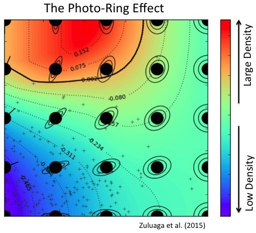

#The next frontier in planet science : exo-rings

## 下一个地球科学前沿:exo-rings

Saturn is, of course, famous for its rings, but in our solar system there are actually four planets with ring systems of one size or another. Every gas giant in our solar system has a ring — that is to say, right now the evidence suggests that every gas giant could have a ring. As mankind begins to look directly at the planets of the universe outside our own solar system, any universal rule of that sort will be vitally important. Now, astronomers are gearing up to start counting gas giants outside our solar system, as a new technique allows identification of planetary rings from light-years away.

当然,土星是闻名的戒指,但实际上在我们的太阳系 四个 行星环的大小或另一个系统。 每个太阳系中天然气巨头都有环,也就是说,现在有证据表明, 每一个 天然气巨头可以有一个戒指。 当人类开始直视我们太阳系外行星的宇宙,任何这类的普遍规则将至关重要。 现在,天文学家正准备开始计数气态巨行星在太阳系外,作为一种新的技术允许识别光年的行星环。

The technique is as [simple as could be](http://arxiv.org/abs/1502.07818), and could even be applied to existing readings to get new information out of old studies. Right now, planets are identified mostly by looking at the change in luminosity of their parent star when the planet moves between that star and the Earth; these readings are called “transits.” The silhouette is recorded as a rather abstract graph, and if the graph shows that a planet blocks more light from its star than it ought to, given predictions for its size, there are two basic possibilities: Either your predictions were wrong in some way, or the object’s apparent size is expanded somehow — say, with rings.

这项技术是 [简单的可以](http://arxiv.org/abs/1502.07818) ,甚至可以应用于现有的数据从旧的研究获得新的信息。 现在,行星识别主要通过观察恒星的光度变化当行星,恒星和地球之间,这些数据被称为“凌日。 “轮廓记录为一个相当抽象的图形,如果图显示,一颗行星块比它应该光从它的恒星,鉴于预测它的大小,有两种基本的可能性:在某些方面你的预测是错误的,或对象的表观尺寸扩大——比如说,与戒指。

The researchers want to go back at look at numerous results that earlier studies discarded as “false positives” to see whether they might have been planets encircled by rings. If they find that their work can explain historical results more accurately than current theory (or at all), astronomers might end up building a list of previously abandoned celestial bodies to revisit.

研究人员想要回去看看很多,早期的研究结果丢弃,“假阳性”,看看他们可能是行星环包围。 如果他们发现他们的工作能更准确地解释历史结果比现有理论(或全部),天文学家们可能会建立一个列表之前放弃天体重温。

Ringed [exoplanets](http://www.extremetech.com/tag/exoplanets) came to prominence recently, as a so-called “super-Saturn” was found with rings many times the size and mass of Saturn’s (artist’s rendition at top of page). The actual identity of J1407b is not quite known, however; it could be a dwarf star, and the rings still-forming planets. Additionally, while this method can prove the existence of rings, it can’t prove the non-existence of them. In other words, just because this technique doesn’t see an expansion in the transit readings, doesn’t mean there aren’t rings. All it really means is that if there are rings, they must be quite thin.

环 [系外行星](http://www.extremetech.com/tag/exoplanets) 最近,所谓“super-Saturn”多次发现了戒指的大小和质量土星(艺术家的引渡在页面的顶部)。 的实际身份J1407b并不完全知道,然而,这可能是矮星,戒指仍在形成行星。 此外,该方法可以证明环的存在,它不能证明他们的不存在。 换句话说,仅仅因为这种技术并不看到一个扩张交通数据,并不意味着没有戒指。 它真正的意思是,如果有戒指,他们必须非常薄。

####

The light-blocking effect changes based on the angle of the rings to the Earth.

遮光效果变化基于环地球的角度。

Thus, this technique can’t be used in any case where astronomers can’t get a second size reading by a different method of measurement than transit. Without that second measurement, there’s no way to tell if the planet’s transit is blocking more light than it ought to.

因此,这种技术不能使用在任何情况下,天文学家们找不到第二个大小阅读比交通由不同的测量方法。 没有第二次测量,没有办法知道地球的交通比它应该阻止更多的光。

Why should astronomers care about rings, specifically? Firstly, because they could provide a window into the past of whichever solar system we end up finding them within. Rings can be very diverse in their makeup and, more importantly, often let a fair amount of light through. Astronomers are great at working with partially blocked light — just recently, insight into planetary atmospheres and ever weather patterns was gleaned from light leaking around the edges of a distant planet.

具体来说,为什么天文学家关心戒指? 首先,因为他们可以提供一个窗口到过去的太阳系我们最终找到他们。 戒指是很多样化的化妆,更重要的是,经常让大量的光线通过。 天文学家们擅长使用部分屏蔽光——就在最近,洞察行星大气和气候模式是边缘光泄漏后得出的一个遥远的星球。

Rings are also often associated with moons. Ancient moon-planet collisions are one possible source of planetary rings, but moons also sometimes enforce the edges and details of a planetary ring. By orbiting in a similar plane to the rings themselves, a large body like a moon can “sweep” up any small particulate matter simply by running into it. So far there have been no exo-moons found, but perhaps a ringed system could alert astronomers to a good potential candidate.

戒指也常常与月亮有关。 古代moon-planet碰撞是行星环的一个可能的来源,但月亮有时也会执行一个行星环的边缘和细节。 轨道在类似的平面环本身,大量像月亮可以“扫描”任何小颗粒物只需运行。 到目前为止没有exo-moons发现,但也许环绕系统提醒天文学家有良好的潜在候选人。

Exo-planetology is undoubtedly the fastest-growing area of astronomy. The [Kepler planet-hunter](http://www.extremetech.com/extreme/196199-after-lengthy-hiatus-nasas-kepler-has-found-another-planet-a-super-earth) was NASA’s very first attempt at finding planets by their transit signatures, and it found thousands. Now, the next generation transit finder, the Transiting Exoplanet Survey Satellite (TESS,  is preparing to launch in 2017 and continue that quest. If exo-rings do end up being a major source of interest for astronomers, TESS is specifically the satellite that will be used to capture them.

Exo-planetology无疑是天文学中增长最快的地区。 的 开普勒行星猎人 美国宇航局非常第一次尝试寻找行星交通签名,和它发现 成千上万的 。 下一代交通仪,凌日行星调查卫星(苔丝,正准备在2017年发射,继续探索。 如果exo-rings最终被天文学家感兴趣的主要来源,苔丝是专门的卫星将用来捕获它们。

##

原文链接: [The next frontier in planet science: exo-rings](http://www.extremetech.com/extreme/200806-the-next-frontier-in-planet-science-exo-rings)

相关链接: [CNCounter翻译文章目录](https://github.com/cncounter/translation)

原文日期: 2015年03月10日

翻译日期: 2015年03月11日

翻译人员: [书三生](http://t.qq.com/renfufei)
