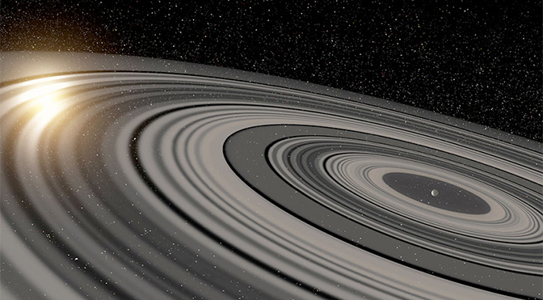
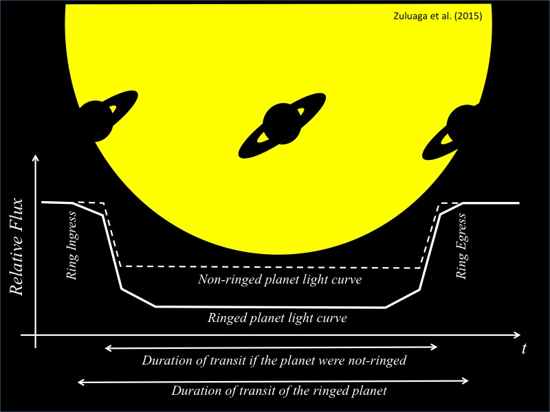
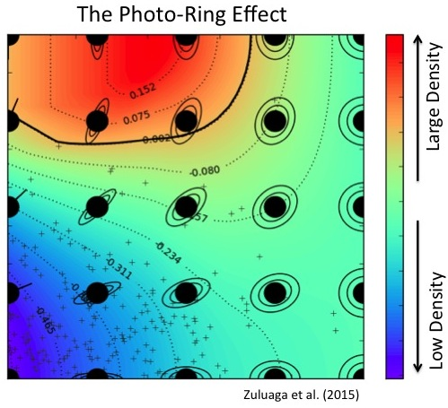

# The next frontier in planet science: exo-rings

## 行星科学的下一个前沿: 系外行星环(exo-rings)

Saturn is, of course, famous for its rings, but in our solar system there are actually four planets with ring systems of one size or another. Every gas giant in our solar system has a ring — that is to say, right now the evidence suggests that every gas giant could have a ring. As mankind begins to look directly at the planets of the universe outside our own solar system, any universal rule of that sort will be vitally important. Now, astronomers are gearing up to start counting gas giants outside our solar system, as a new technique allows identification of planetary rings from light-years away.

当然,土星以它那著名的光环闻名,但实际上在我们的太阳系里,一共有四颗行星拥有大小不一的环系统。 太阳系中的每一颗气态巨行星都有环 —— 也就是说,目前的证据表明,每一颗气态巨行星都可能有一个环。 当人类开始直接观测我们太阳系之外的宇宙行星时,这类普遍规律将至关重要。 现在,天文学家正准备开始统计太阳系外的气态巨行星,因为一种新技术使我们能够从光年之外辨认出行星环。

The technique is as [simple as could be](http://arxiv.org/abs/1502.07818), and could even be applied to existing readings to get new information out of old studies. Right now, planets are identified mostly by looking at the change in luminosity of their parent star when the planet moves between that star and the Earth; these readings are called “transits.” The silhouette is recorded as a rather abstract graph, and if the graph shows that a planet blocks more light from its star than it ought to, given predictions for its size, there are two basic possibilities: Either your predictions were wrong in some way, or the object’s apparent size is expanded somehow — say, with rings.

这项技术 [再简单不过了](http://arxiv.org/abs/1502.07818) ,甚至可以应用到已有的观测数据上,从旧研究中挖掘出新的信息。 目前,行星的辨识主要依靠观测其母恒星的光度变化 —— 当行星运行到恒星与地球之间时,恒星亮度会发生变化; 这类读数被称为“凌日(transits)”。 恒星被遮挡的轮廓会被记录成一张相当抽象的曲线图,如果这张图显示某颗行星遮挡其恒星的光比根据其尺寸预测的还要多,那么就有两种基本可能:要么你的预测在某个环节出了错,要么这个天体的表观尺寸以某种方式被放大了 —— 比如,它带有环。

The researchers want to go back at look at numerous results that earlier studies discarded as “false positives” to see whether they might have been planets encircled by rings. If they find that their work can explain historical results more accurately than current theory (or at all), astronomers might end up building a list of previously abandoned celestial bodies to revisit.

研究人员想回过头去,重新审视许多早期研究当作“假阳性”而丢弃的结果,看看它们会不会其实是带环的行星。 如果他们发现自己的方法能比现有理论更准确地解释历史结果(甚至哪怕只是能解释一点点),天文学家们或许就会列出一份清单,把那些此前被放弃的天体重新拿出来研究。

Ringed [exoplanets](http://www.extremetech.com/tag/exoplanets) came to prominence recently, as a so-called “super-Saturn” was found with rings many times the size and mass of Saturn’s (artist’s rendition at top of page). The actual identity of J1407b is not quite known, however; it could be a dwarf star, and the rings still-forming planets. Additionally, while this method can prove the existence of rings, it can’t prove the non-existence of them. In other words, just because this technique doesn’t see an expansion in the transit readings, doesn’t mean there aren’t rings. All it really means is that if there are rings, they must be quite thin.

带环的 [系外行星](http://www.extremetech.com/tag/exoplanets) 最近备受关注,因为人们发现了一颗所谓的“超级土星”,它的环在大小和质量上都是土星环的许多倍(页面顶部是艺术家的想象图)。 不过,J1407b 的真实身份还不太清楚; 它可能是一颗矮星,而那些环则是仍在形成中的行星。 此外,这种方法虽然能证明环的存在,却无法证明环的不存在。 换句话说,仅仅因为这项技术没有在凌日数据中看到尺寸的扩张,并不意味着就没有环。 它真正说明的只是:如果有环,那些环一定非常薄。

####

The light-blocking effect changes based on the angle of the rings to the Earth.

遮光效果会随环相对于地球的角度而变化。

Thus, this technique can’t be used in any case where astronomers can’t get a second size reading by a different method of measurement than transit. Without that second measurement, there’s no way to tell if the planet’s transit is blocking more light than it ought to.

因此,凡是无法通过凌日之外的另一种测量方法获得第二个尺寸读数的情况,这种技术都用不上。 没有这第二次测量,我们就无从判断这颗行星的凌日是否遮挡了过多的光。

Why should astronomers care about rings, specifically? Firstly, because they could provide a window into the past of whichever solar system we end up finding them within. Rings can be very diverse in their makeup and, more importantly, often let a fair amount of light through. Astronomers are great at working with partially blocked light — just recently, insight into planetary atmospheres and ever weather patterns was gleaned from light leaking around the edges of a distant planet.

为什么天文学家要特别关注环呢? 首先,因为它们可以为我们提供一个窗口,窥视那个最终发现它们的太阳系的过去。 环的组成可以非常多样,更重要的是,它们往往会让相当多的光透过。 天文学家们非常擅长处理被部分遮挡的光 —— 就在最近,人们正是从一颗遥远行星边缘泄漏出来的光线中,获得了关于行星大气乃至天气模式的洞见。

Rings are also often associated with moons. Ancient moon-planet collisions are one possible source of planetary rings, but moons also sometimes enforce the edges and details of a planetary ring. By orbiting in a similar plane to the rings themselves, a large body like a moon can “sweep” up any small particulate matter simply by running into it. So far there have been no exo-moons found, but perhaps a ringed system could alert astronomers to a good potential candidate.

环也常常与卫星有关。 古代卫星与行星的碰撞是行星环的一个可能来源,但卫星有时也会塑造出行星环的边缘和细节。 像卫星这样的大天体,只要在与环本身相近的平面上运行,就能通过撞上环中的物质,把任何小颗粒“清扫”掉。 到目前为止,还没有发现过系外卫星(exo-moons),但也许一个带环的系统能提醒天文学家注意一个不错的潜在候选者。

Exo-planetology is undoubtedly the fastest-growing area of astronomy. The [Kepler planet-hunter](http://www.extremetech.com/extreme/196199-after-lengthy-hiatus-nasas-kepler-has-found-another-planet-a-super-earth) was NASA’s very first attempt at finding planets by their transit signatures, and it found thousands. Now, the next generation transit finder, the Transiting Exoplanet Survey Satellite (TESS,  is preparing to launch in 2017 and continue that quest. If exo-rings do end up being a major source of interest for astronomers, TESS is specifically the satellite that will be used to capture them.

系外行星学无疑是天文学中发展最快的领域。 [开普勒行星猎人](http://www.extremetech.com/extreme/196199-after-lengthy-hiatus-nasas-kepler-has-found-another-planet-a-super-earth) 是NASA第一次尝试通过凌日特征来寻找行星,它发现了成千上万颗。 如今,下一代的凌日探测者 —— 凌日系外行星巡天卫星(TESS)—— 正准备在2017年发射,继续这项探索。 如果系外行星环最终真的成为天文学家的重要兴趣点,那么 TESS 正是那颗将被用来捕捉它们的卫星。

##

原文链接: [The next frontier in planet science: exo-rings](http://www.extremetech.com/extreme/200806-the-next-frontier-in-planet-science-exo-rings)

相关链接: [CNCounter翻译文章目录](https://github.com/cncounter/translation)

原文日期: 2015年03月10日

翻译日期: 2015年03月11日

翻译人员: [书三生](http://t.qq.com/renfufei)
