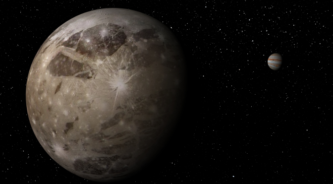
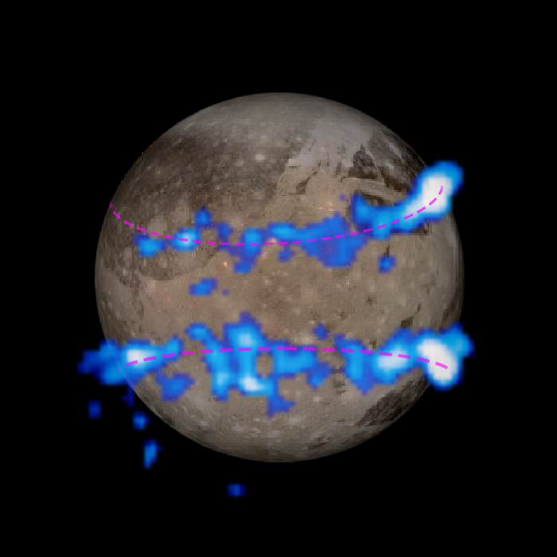
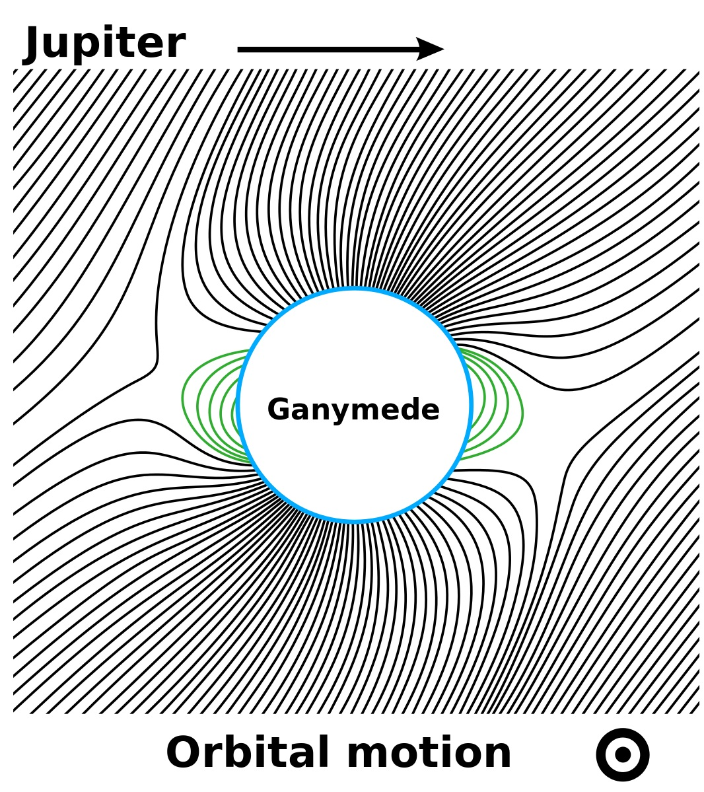
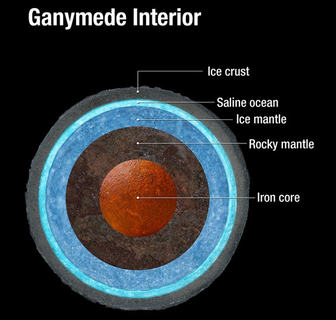

# NASA detects subsurface ocean on solar system’s largest moon

# 美国宇航局在太阳系中最大的卫星探测地下海洋

NASA scientists announced they’ve found evidence that Ganymede, the largest moon in the solar system, has a vast subsurface liquid ocean that contains more water than the Earth’s surface. Ganymede is already unique in other ways — it’s larger than the planet Mercury (but less than half Mercury’s mass), twice the mass of our own moon, and the only satellite known to have its own magnetosphere. Like Europa, Ganymede may have an incredibly thin atmosphere of oxygen. The discovery of a liquid ocean on Ganymede increases the chances that life exists or has existed within its depths.

美国宇航局的科学家们宣布,他们已找到证据,证明太阳系中最大的卫星木卫三(Ganymede)存在一片巨大的地下液态海洋,其中的水量比地球表面的水还多。 木卫三在别的方面本就独一无二 —— 它比水星还大(但质量不到水星的一半),质量是月球的两倍,而且是已知唯一拥有自身磁层的卫星。 和木卫二(Europa)一样,木卫三可能有一层极其稀薄的氧气大气。 在木卫三上发现液态海洋,增大了其深处存在过或正存在生命的可能性。

“This discovery marks a significant milestone, highlighting what only Hubble can accomplish,” said John Grunsfeld, associate administrator of NASA’s Science Mission Directorate at NASA Headquarters, Washington. “In its 25 years in orbit, Hubble has made many scientific discoveries in our own solar system. A deep ocean under the icy crust of Ganymede opens up further exciting possibilities for life beyond Earth.”

“这一发现是一个重要的里程碑,彰显了只有哈勃望远镜才能完成的成就,”位于华盛顿的NASA总部科学任务理事会副局长约翰·格伦斯菲尔德(John Grunsfeld)说。 “在轨的25年间,哈勃望远镜在我们自己的太阳系中取得了许多科学发现。 木卫三冰壳之下存在一片深海,为地外生命开启了更多激动人心的可能性。”

Ganymede’s magnetic field is the reason Hubble was able to [peer across the void](http://www.nasa.gov/press/2015/march/nasa-s-hubble-observations-suggest-underground-ocean-on-jupiters-largest-moon/) and detect the presence of subsurface water. Just as Earth has the northern and southern lights (Aurora Borealis and Aurora Australis), Ganymede has its own auroral belts, as shown below:

木卫三的磁场,正是哈勃望远镜得以 [穿越虚空进行观测](http://www.nasa.gov/press/2015/march/nasa-s-hubble-observations-suggest-underground-ocean-on-jupiters-largest-moon/) 并探测到地下水存在的原因。 就像地球有南北极光(北极光和南极光)一样,木卫三也有自己的极光带,如下图所示:

Water is what’s known as dimagnetic, meaning it generates a weak magnetic field in opposition to whatever magnetic field is applied to it. The aurora around Ganymede are expected to rock back and forth in response to Jupiter’s magnetic field (Ganymede’s self-generated magnetic field is embedded in Jupiter’s as shown below):

水是所谓的抗磁性物质,这意味着它会生成一个弱磁场,与施加于它的任何磁场相抗衡。 木卫三周围的极光本该随着木星的磁场来回摆动(木卫三自身产生的磁场嵌入在木星的磁场之中,如下图所示):

image courtesy of [Wikipedia](https://en.wikipedia.org/wiki/Ganymede_(moon))

图片由 [维基百科](https://en.wikipedia.org/wiki/Ganymede_(moon)) 提供

What the scientists found is that the rocking motion across the surface was much reduced compared to what they’d expect to see if there was no water underneath the surface of the moon. Current thinking is that the ocean is an estimated 60 miles deep, but buried 95 miles beneath the icy crust.

科学家们发现,相比于木卫三表面之下不存在水时他们预期会看到的情况,横贯表面的这种摆动幅度要小得多。 目前的主流看法是,这片海洋约有60英里深,埋藏在冰壳之下约95英里处。

We’ve known for decades that Ganymede contained significant amounts of water ice, but the presence of liquid oceans was less certain. At 95 miles below the surface, the oceans could run quite hot. For reference, the average temperature on the surface at the Kola Superdeep Borehole in July is just 52F / 11C, while the temperature at the bottom of the shaft, 49,000 feet below the surface, was 356F / 180C. At more than 10x the depth, Ganymede’s hypothetical ocean would be insulated from the cold vacuum of space and warmed by the moon’s active core.

几十年来,我们就知道木卫三含有大量的水冰,但液态海洋是否存在则不那么确定。 在表面以下95英里的地方,这片海洋可能会相当热。 作为参照,科拉超深钻孔(Kola Superdeep Borehole)在7月份地表的平均温度只有52华氏度/11摄氏度,而在其深达地表以下49000英尺的钻孔底部,温度高达356华氏度/180摄氏度。 在超过前者10倍的深度上,木卫三假想中的海洋会受到保护,隔绝于太空的寒冷真空之外,并被这颗卫星活跃的核心所加热。

### Enceladus shares the spotlight

### 土卫二也备受关注

Ganymede isn’t the only water-related news this week. NASA has also detected hot springs and hydrothermal vents operating beneath the icy crust, within subsurface oceans. It’s long been known that Enceladus had significant water reserves, the moon periodically emits particle blasts and we’ve detected cryovolcanoes — volcanos that emit frozen compounds rather than magma — actively on the surface.

本周与“水”有关的新闻并不只有木卫三这一条。 NASA还在冰壳之下的地下海洋中探测到正在活动的温泉和热液喷口。 长期以来我们就知道土卫二(Enceladus)拥有大量的水储备;这颗卫星会周期性地喷出粒子流,我们还在其表面探测到正在活动的冰火山(cryovolcanoes)——喷发的是冻结的化合物,而不是岩浆。

Finding hydrothermal vents, however, is still a first since Earth was previously the only planet known to have them. It’s not clear if Enceladus’ core is active or if proximity to Saturn and its orbital resonance with other moons keeps it warm via tidal heating, but either way, it’s another example of how we continue to learn about the planets and moons within the solar system. Recent years have proven that water — essential to human life and and to any future colonization efforts — is far more common within the solar system than was previously believed.

不过,发现热液喷口仍然是头一回,因为在此之前,地球是已知唯一拥有热液喷口的星球。 目前还不清楚,究竟是土卫二的核心在活动,还是它靠近土星、且与其他卫星存在轨道共振,从而通过潮汐加热保持温暖;但无论如何,这都是我们不断了解太阳系内行星和卫星的又一个例子。 近年来已经证明,水 —— 对人类生命以及未来任何殖民努力都至关重要 —— 在太阳系中的普遍程度远超我们此前的认知。

原文链接: [NASA detects subsurface ocean on solar system’s largest moon](http://www.extremetech.com/extreme/201093-nasa-detects-subsurface-ocean-on-solar-systems-largest-moon)
