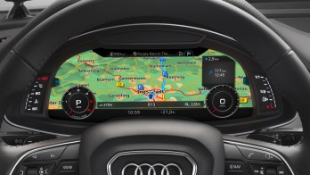
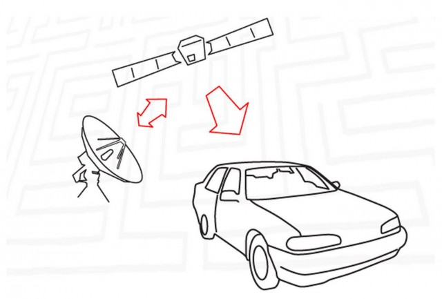
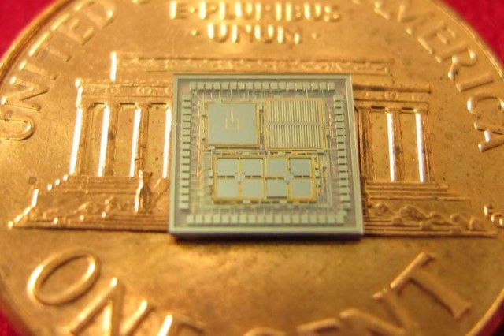
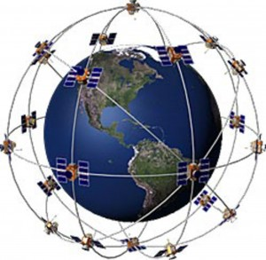
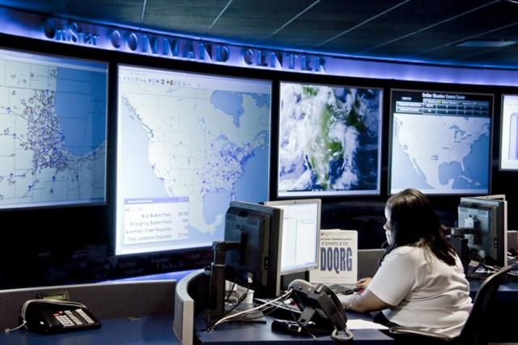
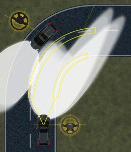
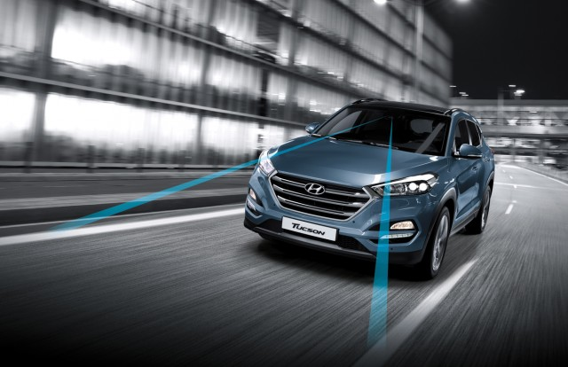
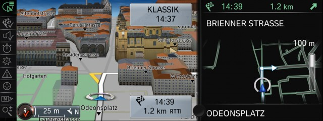

# 带你了解 GPS 的工作原理

开车迷路这件事,正在迅速变成一门失传的艺术。 车里的GPS导航系统、仪表板上的便携式导航设备,或者你智能手机里的导航,都能轻松调出地图,让你看清自己在哪里,或者要去哪里。 最难的部分,可能是语音输入或手动键入数据 —— 如果你的车机接口很笨拙,或者它不让你在车辆行驶时输入地址的话(哪怕你正开着出租车经过机场外某个治安欠佳的街区)。

Here’s a backgrounder on what GPS is, what it can do for you today in cars, and what’s possible in the near future. GPS will make you safer, route you around traffic delays, help you find nearby services, and help merchants reach out to sell you services you may or may not want.

本文将向您介绍什么是GPS，和汽车集成起来可以做些什么，以及在不远的将来可能会是什么状况。GPS会让你更安全、避开拥堵路段、找到附近的服务，并让服务商联系到你(其中有你喜欢的，也有你讨厌的)。

全球定位系统是如何工作的(简直超乎你的想象)

自1994年以来,24颗GPS卫星一直在距地面13000英里的轨道上运行,分为六组(或称六个轨道面)。 它们并不固定在头顶(同步),而是以每小时8000英里的速度由西向东飞行,每12小时绕地球一圈,因此每天会两次经过同一地点。 每颗卫星上都有一台原子钟,并持续报告以下信息:

伪随机码 ,每颗卫星的ID。
星历数据, 当前的日期和时间,以及卫星是否健康(“不健康”可能意味着卫星正在重新定位或重新鉴定;并不总是一个“偷懒”的家伙)。
年鉴数据, 卫星在任何时候应该处于的位置数据(每一颗GPS卫星也都有年鉴数据)。

你的GPS接收机捕捉信号的到达时间(time of arrival)和从卫星到接收机的飞行时间(TOF)。 由于光速已知,再加上信号的发送时间,GPS接收机就能计算出你的车、PND、徒步者用的GPS或智能手机在地球上的位置。 随着设备在公路上移动,它还会计算速度——通常会比汽车的里程表显示低几英里每小时(所以相信GPS的速度吧)——以及罗盘航向。 然后它把这些数据放到导航系统的移动地图上。 卫星信号穿过电离层时会被延迟,电离层是距地面40到600英里高度的地球上层大气;GPS系统会应用一个校正系数。

需要三个GPS信号才能确定接收机的位置(通过三边测量),第四个信号则用来计算高度。 如果接收机能捕捉到更多卫星(同一时间可以看到12颗,另一半则位于地球另一侧),位置定位的质量就会提高。 原子钟的漂移或其他误差,则由一个校正因子来处理。

系统中的第一颗GPS卫星于1978年发射。 目前GPS卫星大约能正常运行10年。 它们重约2000磅(在地面上),包含为卫星供电的太阳能电池板在内,直径约17英尺。 发射机的输出功率不超过50瓦。 替代卫星在不断建造和发射。 其他国家也有自己的GPS卫星。

更新一代的GPS系统( 地球上的接收器 )会更准确、更小、更便宜,甚至能在室内工作。 DARPA展示了一款比一美分硬币还小的芯片,其中集成了三个陀螺仪、三个加速度计和一个内部时钟(见上图右)。 其他研究则致力于提高卫星时钟的时间精度。 目标是把过去价值数千美元的GPS系统的精度,带进你汽车信息娱乐系统的中控主机(head unit)。

我的GPS接收器有多准?

GPS最初是作为一套军用卫星系统诞生的,目的是提高飞机、潜艇及其武器的精度。 直到2000年,提供给平民的信号都是经过降级的,精度更低。 未加密的时间信号被加入了随机的偏移以干扰非军事用户,使其精度不超过100米。 这被称为 选择可用性(Selective Availability) 。 这意味着,一辆车的位置可能会偏差一两个街区,“下一个路口右转”的提示可能早了一个街区或晚了一个街区。

差分全球定位系统(DGPS) 技术应运而生,它利用陆基参考站来校正信号,精度可达约15米(两三个车身长度),在最好的情况下甚至只有10厘米(4英寸),足以让测量员精确定位桩点。 与此同时,美国联邦航空局、海岸警卫队和交通部要求关闭SA。 2000年,克林顿总统下令取消“选择可用性”。 它就此一去不复返了。 政府的 GPS网站 说:“美国从未有意使用‘选择可用性’。”

如今,一辆车上的GPS接收器精度约为10到15米。 这是由一个成本仅几美元的卫星接收机模块实现的。 独立的GPS接收器可以做到3米(10英尺)的精度,而高成本的设备能达到几厘米。 一套25000美元的Trimble(天宝)全站仪GPS系统可以精确到不足一英寸。 这意味着什么呢? 高精度的GPS变体可以远程操控地球上的道路施工设备,把路面压实、刮平,从而开辟出一条车道。

如果你的车载导航系统比较旧、精度比不上15米,更精准的导航系统似乎会耍一个小花招。 如果你在高速公路上向北行驶,附近没有别的路,位置图标会被吸附到车道上;如果这是一条分隔式公路,也会被吸附到正确的车道上。 如果你走了一个弯道或一条曲线,导航系统也能自行调整。 GPS导航还会利用内置的指南针、运动传感器和速度计,在隧道里精确估算你的位置。 (在一条横跨两国的隧道里,你会看到当前位置图标跨越国界时,精度能保持在两个车身长度以内。)

除了把车显示在地图上,GPS还能为你的车做什么

显然,汽车GPS会在地图上显示一个闪动的点,告诉你车在哪里。 但还有更精彩的功能。 以下是一些例子:

自动碰撞通知(ACN)。 在一次事故中,如果你的车配备了通用汽车安吉星(OnStar)这类远程信息处理系统,它会自动呼叫远程信息处理呼叫中心,报告你的位置,然后再呼叫最近的PSAP(公共安全应答点,即911)。 通过福特和Sync,电话也可以经由蓝牙连接的手机拨打。 通常它也被称为“驾车经过911”,但这可能要等五分钟;如果你在公路旅行时冲出路面、翻下路堤、从人们的视线中消失,那可能就是永远了——如果警察不知道去哪里找你。 增强型ACN还会增加额外的非GPS信息,比如位置、碰撞的严重程度、乘客是否系了安全带、车辆是否翻滚过。 宝马(BMW)和通用汽车正在研发算法,以预测车主是否严重受伤;他们认为这些算法的准确性足以让他们告知安全官员派出医疗后送直升机(5000到15000美元)。 所有这一切都离不开GPS信号。

预测式前照灯。 最初是前照灯,然后是更好的前照灯(氙气、LED、激光),接着是随动转向大灯——在你转动方向盘时让灯光跟着转向,而如今的前照灯则能提前转向正确方向(如上图)。 它们利用GPS信号,在你刚刚开始察觉路边的鹿角、车辆、行人或障碍物时,就提前一两秒把车灯转过去。 福特正在推进 GPS-aimed前照灯 (由GPS瞄准的前照灯)技术。
混合动力车、电动车的续航。 汽车需要保留一部分电池储备电量,以便额外输出动力,否则电池就会耗尽。 假设你的丰田普锐斯在带轻微上坡的高速公路上、以每小时60英里的速度行驶时,一英里大约耗多少电。 如果地图数据加上当前的GPS定位,让汽车知道当前的电量,并知道爬完坡之后还有2.5英里的下坡,它就能推算接下来这段艰难路程的耗电——因为下坡行驶会给电池充电。
服务。 当你寻找最近的麦当劳而不是汉堡王时(也许你家孩子觉得BK的奖品更好),这需要GPS。 其中一些问题仍在完善之中。 许多第三方应用以及车载导航系统的数据库,还不能提前考虑到你可能想要的服务,直到开出去20英里才支持。
智能手机应用。 如果你的车带有嵌入式远程信息处理系统,它通常会有配套的智能手机应用功能,比如远程启动和远程解锁车门。 还有一个GPS定位应用,当你把车忘在体育场或商场的停车场时,它会引导你找到你的车。
智能车库门。 许多汽车已经能连接车库门开启器,这是近期公布的功能。 你不必再把汽车的遮阳板或后视镜弄得满是更多按钮,也不必用液晶屏上的虚拟按钮。 当GPS感应到车子离家大约半英里时,一个按钮就会从中央屏幕的底部弹出。
校准你的速度计。 联邦法规要求速度计不能低估你的车速,无论车上装的是哪种经过批准的轮胎尺寸。 你不想在以为自己只开了75的时候,却因为跑到78而吃到一张限速65的罚单;反过来,你可能其实只开到了72或73英里每小时。 集成GPS可以把你的速度计校准到绝对正确的速度——在装着这套轮胎、处于当前胎压的情况下。 它可以做到。 但汽车厂商通常不会这么做。 如果你有一个便携式导航设备,它通常就会显示你的速度。
最佳车道建议。 今天,好的导航系统会提供出口走廊视图,显示直行车道、出口车道,以及你应该在哪一条车道上。 更加精确的GPS甚至能感知到你何时需要驶离车道。

GPS和无人驾驶汽车

自动驾驶汽车依靠光学传感器(雷达)和3D地图来精确理解自身所处的位置和危险所在。 当定位精度能达到英寸级、而不是米级或5米级时,GPS就能发挥更大的作用。 这就是未来。 在至少12英尺宽的车道上,汽车需要让自身居中,而不是偏离中心多达一英尺。 一辆车宽6到7英尺。 再算上允许车身中心偏移一英尺,你只剩下1.5到2.0英尺的安全余量。 如今最好的光学系统通过追踪汽车相对于车道标线的位置,已经能够处理这一点。

有了超高精度的GPS,它还能充当汽车传感器的独立审计者——例如,如果它认为车道偏离预警(LDW)的表现不再完美。 在下雨或天气不佳时,光学系统会性能下降,或者车道标线被部分遮挡,此时GPS可以帮助汽车在一段时间内维持车道居中。 但最终它还是得关闭。

除雪车仍然可以在糟糕的天气里出勤,以温和的速度行驶,由GPS指引方向盘,或者在除雪车偏离航线、发生侧滑时警告司机。 在每小时60英里时不可能做到的事,在未来五年里,到了每小时30英里的速度也许就可行了。

购买建议

第一套嵌入式车载导航系统出现在1990年代中期的宝马7系上,价格约为2500美元(相当于2015年的4000美元)。 现在一些导航系统要价超过1000美元,也有很多只要500美元甚至更少,而且它们常常是5万美元以上车型的标配,因为一块彩色液晶中控屏几乎已经是必不可少的了。 嵌入式导航的主要优势是大屏幕(对角线7到10英寸)、仪表板或抬头显示器上的二级导航显示,以及(通常)比PND或智能手机更大的控制旋钮和按钮。 车顶的鲨鱼鳍天线可能会在刚启动时更快地完成定位。 车载导航系统几乎从不会被偷,也没有难看的线缆。

智能手机通常有更好的语音识别(“Siri,带我去英里高球场(Mile High Stadium)”)、更便宜或免费的应用,而且更新免费。 车载导航的更新可能要花100到200美元。

苹果的CarPlay和谷歌的Android Auto则把两者优越的一面结合起来:把你已经熟悉的嵌入式地图应用(比如iOS上的苹果地图、Android上的谷歌地图)显示在汽车的液晶屏上,并使用汽车上的一些按钮和旋钮来操作。

如果你要购买车载GPS导航,要知道它是有“半衰期”的:这意味着它今天的表现可能不如便携式设备,但随着时间的推移,它可能会超越便携式设备。 到目前为止,汽车制造商并不提供中控主机或GPS模块的更新。 如果你希望车里随时都有最新的GPS,那就租用它,而不是购买。

原文链接: [ExtremeTech explains: How does GPS work?](http://www.extremetech.com/extreme/210893-extremetech-explains-how-does-gps-work)

原文日期: 2015-07-28

翻译日期: 2015-07-29

翻译人员: [书三生](http://t.qq.com/renfufei)
