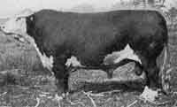

# Difference Between Bull and Ox

# 公牛(Bull)与役牛(Ox)的区别

 

**Bull vs Ox**

The difference between a bull and a ox goes further than just how we refer to livestock.  Ox, or oxen, are actually used for different purposes than bulls.  An ox is typically used for things like pulling.  In developing countries they are still, to this day, used for pulling a plow and harvesting crops.

公牛(bull)与役牛(ox)的区别,远不止我们如何称呼这些家畜这么简单。 役牛(oxen)的用途其实与公牛不同。 役牛通常用来干拉拽之类的活。 在发展中国家,直到今天,它们仍被用来拉犁和收割庄稼。

The bull is how we refer to cattle (or cows) when we speak of the male gender of the species.  The ox is scientifically coded as a sub-genus of the cattle.  Technically, this makes each a related species like cousins, but does not make them an identical species.

公牛,是我们说到该物种的雄性时所使用的称呼。 而役牛在科学分类上被划为牛的一个亚属。 严格来说,这使二者成为像表亲一样的近缘物种,但并不意味着它们是同一个物种。

With the exception of a few that are used for breeding, it is customary to castrate the ox.  Bulls, however, are almost never castrated.  The bulls found within livestock are used for breeding purposes, as well as for stock purposes.  This creates the [need](http://www.differencebetween.net/language/difference-between-a-want-and-a-need/) to produce more cattle at a faster rate.  Oxen are more controlled when it comes to breeding.  This is generally because they are simply not considered much of a popular food source, especially in developed countries.

除少数用于配种的以外,役牛按惯例都要阉割。 而公牛几乎从不被阉割。 畜群中的公牛用于配种,也用于存栏。 这就产生了 [需要](http://www.differencebetween.net/language/difference-between-a-want-and-a-need/) 以更快的速度繁育更多牛的情况。 而役牛在繁殖方面则更受控制。 这通常是因为它们根本算不上受欢迎的食物来源,尤其是在发达国家。

The ox is typically larger than a bull.  Oxen used as ‘draft’, or pulling animals, are usually beyond the age of four, to ensure that they are at their bulkiest and fullest, when it comes to their size.  Alternatively, most bulls are smaller than the ox, and beef cattle are generally slaughtered before they reach the age of four.

役牛通常比公牛大。 用作“挽畜”(draft animals)即拉拽牲畜的役牛,通常要长到四岁以上,以确保它们在体型上达到最壮实、最饱满的状态。 相比之下,大多数公牛都比役牛小,而肉牛一般在满四岁之前就被屠宰了。

Many mistakenly consider any castrated bull to be an ox.  However, this is inaccurate, as they share all of the bovine genes, but do have an actual distinctive genetic code that separates them from each other.

许多人误以为任何被阉割的公牛就是役牛。 然而这是不准确的:虽然它们共享牛类的全部基因,但确实存在一种真正独特的遗传密码,将二者彼此区分开来。

When it comes to symbolism, there are those cultures that consider them to be separate entities, and there are those that classify both bulls and oxen together.  The Chinese calendar offers representation to both the bull and the ox, for the years of birth including, but not limited to, 2009, 1997, and 1985.  Other cultures and religious affiliations often segregate the two animals.  Hindu celebrants recognize the ox.

说到象征意义,有些文化将它们视为彼此独立的实体,也有些文化把公牛和役牛归为一类。 中国的农历同时为公牛和役牛保留了代表年份,包括但不限于2009年、1997年和1985年。 其他文化和宗教信仰则往往把这两种动物区分开来。 印度教的庆典者崇敬役牛。

Summary:

简介:

1.    The oxen are draft or pulling animals, usually used for cart transportation, or to pull plows.

1. 役牛是挽畜,即拉拽用的牲畜,通常用于拉车运输或拉犁。

2.    While both are part of the bovine family, the oxen are a sub-genus of the male cattle, or bull.

2. 虽然二者都属于牛科,但役牛是雄性牛(公牛)的一个亚属。

3.    Oxen are castrated, and breeding is more controlled and selective.

3. 役牛会被阉割,其繁殖也受到更多控制和选择。

4.    The typical ox is larger than the typical bull

4. 典型的役牛比典型的公牛大。

5.    The ox and the bull have similar, yet unique, genetic DNA codes.

5. 役牛和公牛拥有相似却又各自独特的基因DNA编码。

6.    While they maintain religious and ethnic symbolism, they are often heralded separately.

6. 尽管二者都保有宗教和民族象征意义,它们通常被分开看待。

原文链接: [http://www.differencebetween.net/science/nature/difference-between-bull-and-ox/](http://www.differencebetween.net/science/nature/difference-between-bull-and-ox/)
