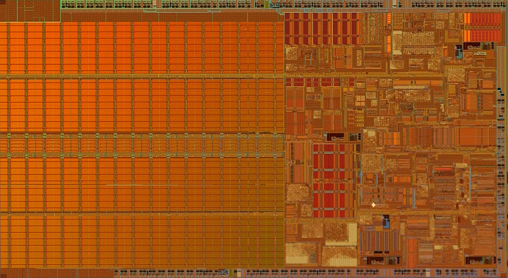
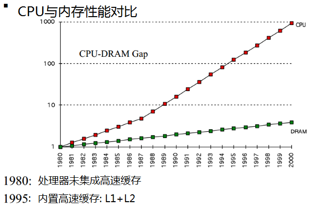
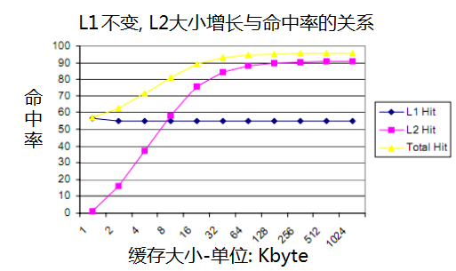

# How L1 and L2 CPU Caches Work, and Why They’re an Essential Part of Modern Chips

# CPU缓存-L1和L2的工作原理

> 说明: L1, 即 Level 1 Cache, 1级缓存; L2, 即 Level 2 Cache, 2级缓存。

> 漂亮的 Pentium M 处理器晶粒(Pentium_M-die), 可以看到其中排列着大量的缓存颗粒。

The development of caches and caching is one of the most significant events in the history of computing. Virtually every modern CPU core from ultra-low power chips like the ARM Cortex-A5 to the highest-end Intel Core i7 use caches. Even higher-end microcontrollers often have small caches or offer them as options — the performance benefits are too large to ignore, even in ultra low-power designs.

CPU的高速缓存是计算机发展史上一个重要的里程碑事件. 
基本上所有的现代CPU内核, 都使用了缓存, 囊括超低功耗的 ARM 架构, 以及 Intel Core 之类的顶级处理器。 
即使是更高端的微控制器(microcontrollers), 也会集成高速缓存, 或是可选定制项。

> 实在是因为缓存对CPU的性能提升太明显了, 即便是超低功耗的处理器芯片, 在设计时也会加入必要的缓存。

Caching was invented to solve a significant problem. In the early decades of computing, main memory was extremely slow and incredibly expensive — but CPUs weren’t particularly fast, either. Starting in the 1980s, the gap began to widen quickly. Microprocessor clock speeds took off, but memory access times improved far less dramatically. As this gap grew, it became increasingly clear that a new type of fast memory was needed to bridge the gap.

发明缓存主要是为了解决一件非常重要的事情。 

在计算机出现后的最初几十年, 内存的速度非常慢, 价格也非常昂贵, 当然, cpu也同样很慢. 但从1980年代开始, 两者之间的频率差距就迅速扩大了。

处理器的时钟频率迅猛发展, 内存的发展速度却跟不上了. 随着这种差距越来越大, 业界急需一种新型的存储模块来填平这道鸿沟。

> While it only runs up to 2000, the growing discrepancies of the 1980s led to the development of the first CPU caches

> 虽然图表只画到2000年, 但正是1980年代日益扩大的差距, 催生了第一代CPU缓存

## How caching works

## CPU缓存的原理

CPU caches are small pools of memory that store information the CPU is most likely to need next. Which information is loaded into cache depends on sophisticated algorithms and certain assumptions about programming code. The goal of the cache system is to ensure that the CPU has the next bit of data it will need already loaded into cache by the time it goes looking for it (also called a cache hit).

CPU缓存是一块很小的内存池, 其中存放着CPU接下来最有可能访问的信息. 

要将信息加载到缓存中, 需要依赖极端精巧的算法, 以及对程序代码的某种预判. 缓存系统的目标, 是提前将相关的数据或指令加载到缓存中, 确保CPU在需要时直接从缓存中获取(也称为缓存命中)。

A cache miss, on the other hand, means the CPU has to go scampering off to find the data elsewhere. This is where the L2 cache comes into play — while it’s slower, it’s also much larger. Some processors use an inclusive cache design (meaning data stored in the L1 cache is also duplicated in the L2 cache) while others are exclusive (meaning the two caches never share data). If data can’t be found in the L2 cache, the CPU continues down the chain to L3 (typically still on-die), then L4 (if it exists) and main memory (DRAM).

假若未命中缓存, 那么, 就意味着CPU需要到其他地方去寻找数据。

现在, L2高速缓存上场了, 虽然速度比L1要慢, 但容量要大很多倍.

某些处理器使用了包容性缓存设计, 即L1中的数据, 在L2高速缓存中也存在备份。 而另一些处理器则是单份存储, 即两个缓存间不共享数据.

如果在L2缓存中不能找到需要的数据, 则CPU继续往下找, 比如 L3, L4, 以及主内存(DRAM)。

This chart shows the relationship between an L1 cache with a constant hit rate, but a larger L2 cache. Note that the total hit rate goes up sharply as the size of the L2 increases. A larger, slower, cheaper L2 can provide all the benefits of a large L1 — but without the die size and power consumption penalty. Most modern L1 cache rates have hit rates far above the theoretical 50 percent shown here — Intel and AMD both typically field cache hit rates of 95 percent or higher.

该图展示的是: 保持L1高速缓存命中率不变, 而增大L2缓存的大小。 可以看到, 随着 L2 容量的增大, 总命中率会迅速上升。

体积更大、速度更慢、成本更低的L2, 可以提供大容量L1的所有好处 ——  而且不必承受芯片尺寸和功耗上的代价。 虽然L2速度比L1慢一点, 但容量与成本优势明显, 相对来说性价比很高.

现代CPU中, L1缓存的命中率远高于上图中的`50%`这个数值 —— Intel和AMD的产品的缓存命中率, 一般能达到95%以上。

The next important topic is the set-associativity. Every CPU contains a specific type of RAM called tag RAM. The tag RAM is a record of all the memory locations that can map to any given block of cache. If a cache is fully associative, it means that any block of RAM data can be stored in any block of cache. The advantage of such a system is that the hit rate is high, but the search time is extremely long — the CPU has to look through its entire cache to find out if the data is present before searching main memory.

另一个重要的主题是关联映射关系(set-associativity)。CPU中集成了一种特殊类型的 RAM, 称为 标记随机存储器(tag RAM). tag RAM 用于记录所有可以指向 cache 块的内存。如果缓存是完全关联的, 则意味着内存数据块可以存储到任意一个 cache 块中. 这种系统的优点是, 命中率非常高, 但检索时间比较长, CPU在检索内存之前, 为了确定缓存中是否存在需要的数据, 必须遍历整个cache。

At the opposite end of the spectrum we have direct-mapped caches. A direct-mapped cache is a cache where each cache block can contain one and only one block of main memory. This type of cache can be searched extremely quickly, but since it maps 1:1 to memory locations, it has a low hit rate. In between these two extremes are *n-*way associative caches. A 2-way associative cache (Piledriver’s L1 is 2-way) means that each main memory block can map to one of two cache blocks. An eight-way associative cache means that each block of main memory could be in one of eight cache blocks.

另一种方式, 我们称之为直接映射缓存(direct-mapped cache)。直接映射方式的缓存, 每个缓存块只可以映射到一个内存块. 这种类型的缓存, 检索速度非常快, 但由于它是 1:1 的方式映射到内存地址, 所以命中率就很低。在这两种极端之间, 存在一种多路关联缓存(*n-*way associative cache). 双路关联缓存(如 Piledriver的L1就是双路的), 就是说每个内存块可以映射到两个缓存块之中的一个. 而八路关联缓存则是说每个内存块可以加载到8个缓存块中的任意一个。

The next two slides show how hit rate improves with set associativity. Keep in mind that things like hit rate are highly particular — different applications will have different hit rates.

接下来的两张图展示命中率如何随关联度(set associativity)提高。 请记住, 像命中率这类指标是非常因具体场景而异的 —— 不同的应用程序会有不同的命中率。

## Why CPU caches keep getting larger

## 为什么CPU的缓存越来越大

So why add continually larger caches in the first place? Because each additional memory pool pushes back the need to access main memory and can improve performance in specific cases.

那么, 为什么一开始就要不断添加更大的缓存呢? 因为每一个额外的内存池都能推迟访问主存的必要, 并在特定情况下提升性能。

This chart from [Anandtech’s](http://www.anandtech.com/show/6993/intel-iris-pro-5200-graphics-review-core-i74950hq-tested/3) Haswell review is useful because it actually illustrates the performance impact of adding a huge (128MB) L4 cache as well as the conventional L1/L2/L3 structures. Each stair step represents a new level of cache. The red line is the chip with an L4 — note that for large file sizes, it’s still almost twice as fast as the other two Intel chips.

来自 [Anandtech的](http://www.anandtech.com/show/6993/intel-iris-pro-5200-graphics-review-core-i74950hq-tested/3) Haswell评测中的这张图表很有用, 因为它实际展示了添加一块巨大的(128MB)L4缓存, 以及传统的L1/L2/L3结构所带来的性能影响。 每一个台阶都代表一级新的缓存. 红线是带有L4的芯片 —— 请注意, 对于大文件尺寸, 它仍然几乎是另外两颗英特尔芯片的两倍。

It might seem logical, then, to devote huge amounts of on-die resources to cache — but it turns out there’s a diminishing marginal return to doing so. Larger caches are both slower and more expensive. At six transistors per bit of SRAM (6T), cache is also expensive (in terms of die size, and therefore dollar cost). Past a certain point, it makes more sense to spend the chip’s power budget and transistor count on more execution units, better branch prediction, or additional cores. At the top of the story you can see an image of the Pentium M (Centrino/Dothan) chip; the entire left side of the die is dedicated to a massive L2 cache.

那么, 把大量片上(on-die)资源投入缓存, 看起来似乎很合理 —— 但事实证明, 这样做存在边际收益递减。 更大的缓存既更慢, 也更昂贵. 以每个SRAM位需要六个晶体管(6T)来计算, 缓存也很昂贵(就芯片面积而言, 也就是美元成本). 超过某个临界点之后, 把芯片的功耗预算和晶体管数量投入到更多执行单元、更好的分支预测或更多核心上, 就更合理了. 本文顶部你可以看到奔腾M(Centrino/Dothan)芯片的图像; 芯片左侧整个区域都专门用于一块巨大的L2缓存。

## How cache design impacts performance

## 缓存设计如何影响性能

The performance impact of adding a CPU cache is directly related to its efficiency or hit rate; repeated cache misses can have a catastrophic impact on CPU performance. The following example is vastly simplified but should serve to illustrate the point.

添加CPU缓存对性能的影响, 与其效率(即命中率)直接相关; 反复出现缓存未命中, 会对CPU性能造成灾难性的影响. 下面这个例子做了大幅简化, 但足以说明这一点。

Imagine that a CPU has to load data from the L1 cache 100 times in a row. The L1 cache has a 1ns access latency and a 100% hit rate. It therefore takes our CPU 100 nanoseconds to perform this operation.

想象一个CPU需要连续100次从L1缓存加载数据。 L1缓存的访问延迟为1纳秒, 命中率为100%. 因此, 我们的CPU需要100纳秒来完成这个操作。

> Haswell-E die shot (click to zoom in). The repetitive structures in the middle of the chip are 20MB of shared L3 cache.

> Haswell-E芯片实拍图(点击放大)。 芯片中部那些重复的结构, 是20MB的共享L3缓存。

Now, assume the cache has a 99 percent hit rate, but the data the CPU actually needs for its 100th access is sitting in L2, with a 10-cycle (10ns) access latency. That means it takes the CPU 99 nanoseconds to perform the first 99 reads and 10 nanoseconds to perform the 100th. A 1 percent reduction in hit rate has just slowed the CPU down by 10 percent.

现在, 假设缓存的命中率是99%, 但CPU在第100次访问时实际需要的数据位于L2中, 访问延迟为10个时钟周期(10纳秒)。 这意味着, CPU执行前99次读取需要99纳秒, 而执行第100次读取需要10纳秒。 命中率仅仅下降1%, 就让CPU慢了10%。

In the real world, an L1 cache typically has a hit rate between 95 and 97 percent, but the *performance* impact of those two values in our simple example isn’t 2 percent — it’s 14 percent. Keep in mind, we’re assuming the missed data is always sitting in the L2 cache. If the data has been evicted from the cache and is sitting in main memory, with an access latency of 80-120ns, the performance difference between a 95 and 97 percent hit rate could nearly double the total time needed to execute the code.

在现实世界中, 一个L1缓存的命中率通常在95%到97%之间, 但在我们这个简单示例中, 这两个数值对*性能*的影响并不是2%, 而是14%. 请记住, 我们一直假设未命中的数据就存放在L2缓存中. 如果数据已经被逐出缓存、存放在主内存中, 而访问延迟为80到120纳秒, 那么95%与97%命中率之间的性能差距, 可能会让执行这段代码所需的总时间几乎翻倍。

Back when AMD’s Bulldozer family was compared with Intel’s processors, the topic of cache design and performance impact came up a great deal. It’s not clear [how much of Bulldozer’s lackluster performance](http://www.extremetech.com/computing/100583-analyzing-bulldozers-scaling-single-thread-performance) could be blamed on its relatively slow cache subsystem — in addition to having relatively high latencies, the Bulldozer family also suffered from a high amount of cache *contention.* Each Bulldozer/Piledriver/Steamroller module shared its L1 instruction cache, as shown below:

当年AMD的推土机(Bulldozer)家族与英特尔的处理器相比较时, 缓存设计与性能影响这个话题被大量提及. 目前还不清楚, 推土机那糟糕的表现有多少 [可以归咎于其相对缓慢的缓存子系统](http://www.extremetech.com/computing/100583-analyzing-bulldozers-scaling-single-thread-performance) —— 除了延迟相对较高之外, 推土机家族还饱受严重的缓存*争用(contention)*之苦. 每个推土机/打桩机(Piledriver)/压路机(Steamroller)模块都共享其L1指令缓存, 如下所示:

A cache is contended when two different threads are writing and overwriting data in the same memory space. It hurts performance of both threads — each core is forced to spend time writing its own preferred data into the L1, only for the other core promptly overwrite that information. AMD’S OLDER Steamroller still gets whacked by this problem, even though AMD increased the L1 code cache to 96KB and made it [three-way associative](http://www.extremetech.com/computing/177099-secrets-of-steamroller-digging-deep-into-amds-next-gen-core)instead of two. Later Ryzen CPUs do not share cache in this fashion and do not suffer from this problem.

当两个不同的线程在同一个内存空间中写入和覆盖数据时, 缓存就会发生争用. 它会损害两个线程的性能 —— 每个核心都被迫花时间把自己偏好的数据写入L1, 结果却被另一个核心迅速覆盖掉. AMD较老的压路机(Steamroller)仍然深受这个问题困扰, 尽管AMD把L1代码缓存增大到96KB, 并把它做成 [三路关联](http://www.extremetech.com/computing/177099-secrets-of-steamroller-digging-deep-into-amds-next-gen-core) 而不是两路。 后来的Ryzen CPU不再以这种方式共享缓存, 也就不再有这个问题了。

This graph shows how the hit rate of the Opteron 6276 (an original Bulldozer processor) [dropped off](http://www.anandtech.com/show/5057/the-bulldozer-aftermath-delving-even-deeper) when both cores were active, in at least some tests. Clearly, however, cache contention isn’t the only problem — the 6276 historically struggled to outperform the 6174 even when both processors had equal hit rates.

这张图显示了Opteron 6276(一款初代推土机处理器)在至少某些测试中、当两个核心都活跃时, 其命中率是如何 [下滑](http://www.anandtech.com/show/5057/the-bulldozer-aftermath-delving-even-deeper) 的. 不过很明显, 缓存争用并不是唯一的问题 —— 即使两颗处理器命中率相同, 6276在历史上也很难胜过6174。

## Caching out

## 缓存小结

Cache structure and design are still being fine-tuned as researchers look for ways to squeeze higher performance out of smaller caches. So far, manufacturers like Intel and AMD haven’t dramatically pushed for larger caches or taken designs all the way out to an L4 yet. There are some Intel CPUs with onboard EDRAM that have what amounts to an L4 cache, but this approach is unusual (that’s why we used the Haswell example above, even though that CPU is older at this point. Presumably, the benefits of an L4 cache do not yet outweigh the costs.

随着研究人员寻找从更小的缓存中挤出更高性能的办法, 缓存的结构和设计仍在不断微调. 到目前为止, Intel和AMD等制造商还没有大举推动更大的缓存, 也没有把设计一路做到L4. 有些Intel CPU带有板载EDRAM, 相当于一块L4缓存, 但这种方法并不常见(这就是为什么我们上面用了Haswell的例子, 尽管那颗CPU在如今已经算是老的了)。 据推测, L4缓存带来的好处还没有超过其成本。

Regardless, cache design, power consumption, and performance will be critical to the performance of future processors, and substantive improvements to current designs could boost the status of whichever company can implement them.

无论如何, 缓存设计、功耗和性能, 对未来的处理器性能都至关重要; 而对当前设计做出实质性的改进, 则能提升率先实现它们的公司的地位。

Check out our [ExtremeTech Explains](http://www.extremetech.com/tag/extremetech-explains) series for more in-depth coverage of today’s hottest tech topics.

浏览我们的 [ExtremeTech Explains](http://www.extremetech.com/tag/extremetech-explains) 系列, 深入了解当今最热门的技术话题。

参考: 

- <https://www.ibm.com/developerworks/cn/linux/l-cn-perf1/index.html>
- <http://opass.logdown.com/posts/249025-discussion-on-memory-cache>

原文链接:

- <https://www.extremetech.com/extreme/188776-how-l1-and-l2-cpu-caches-work-and-why-theyre-an-essential-part-of-modern-chips>
