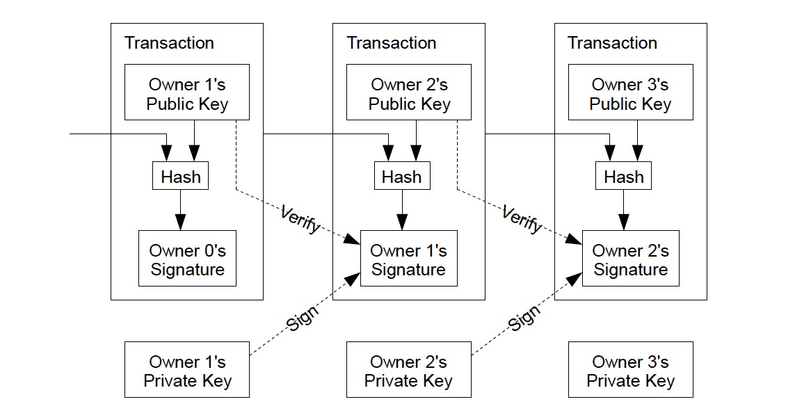
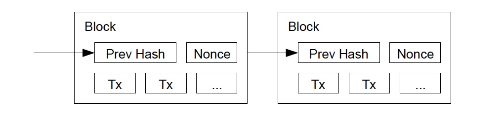
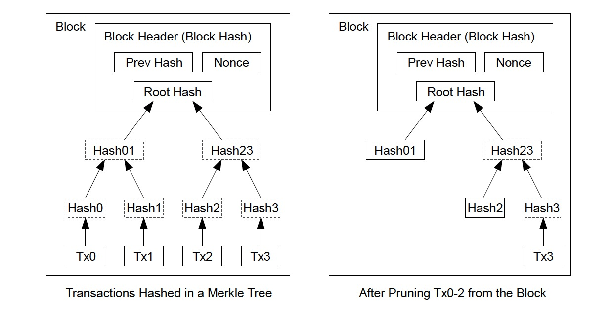
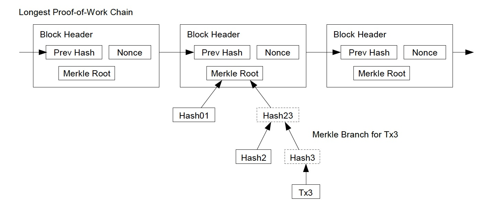
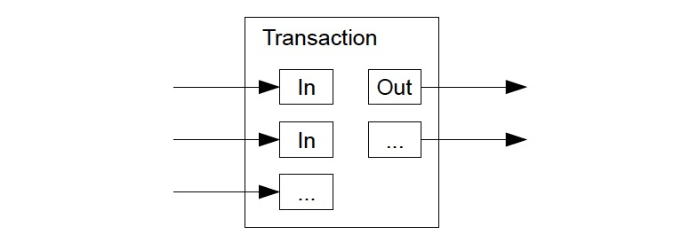
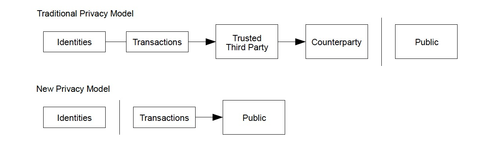
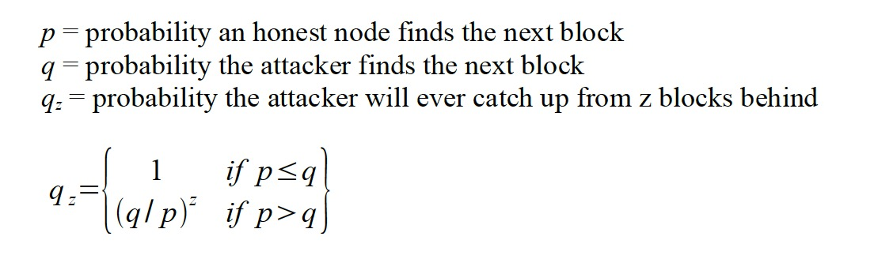
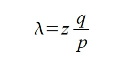
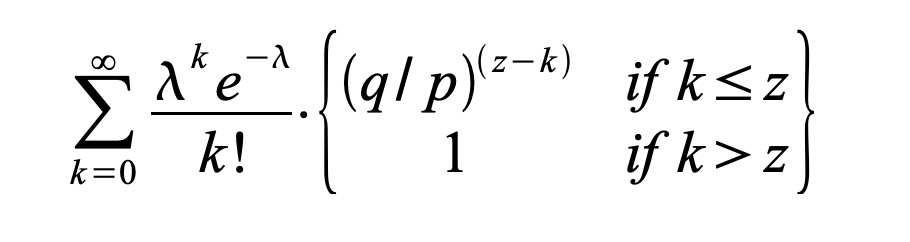
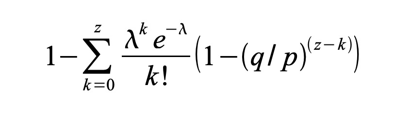

# Bitcoin: A Peer-to-Peer Electronic Cash System

# 比特币: 基于对等网络的电子现金系统

> [比特币白皮书_英文版.pdf](https://bitcoin.org/bitcoin.pdf)

- 作者: Satoshi Nakamoto(聪·中本)
- 邮箱: satoshin@gmx.com
- 网站: www.bitcoin.org


> ## Abstract.
A purely peer-to-peer version of electronic cash would allow online payments to be sent directly from one party to another without going through a financial institution.
Digital signatures provide part of the solution, but the main benefits are lost if a trusted third party is still required to prevent double-spending.
We propose a solution to the double-spending problem using a peer-to-peer network.
The network timestamps transactions by hashing them into an ongoing chain of hash-based proof-of-work, forming a record that cannot be changed without redoing the proof-of-work.
The longest chain not only serves as proof of the sequence of events witnessed, but proof that it came from the largest pool of CPU power.
As long as a majority of CPU power is controlled by nodes that are not cooperating to attack the network, they'll generate the longest chain and outpace attackers.
The network itself requires minimal structure.
Messages are broadcast on a best effort basis, and nodes can leave and rejoin the network at will, accepting the longest proof-of-work chain as proof of what happened while they were gone.
>
> ## 摘要:
比特币是一个纯粹的点对点电子现金系统, 可以通过在线支付方式，直接将资金支付给收款方，而无需银行等金融机构的参与。
数字签名技术是其中的一部分解决方案，但如果还需要引入第三方可信机构来防止双花问题的话，那就有点自废武功，将自身最大的优势给抛弃了。
我们推出了一种新的方案: 使用对等网络来解决双花问题。
这个网络系统，会对交易信息执行哈希运算，并放置到当前正在进行的、基于哈希的工作量证明链上面，从而对该交易标上时间戳，进而形成一条不可更改的记录（除非重做工作量证明，否则都是不可篡改的）。
最长的那条链，不仅能证明其所见证的事件序列，还说明它来自最强大的CPU算力池。
只要大部分的CPU算力由诚实节点控制，不与攻击网络的那些节点协作，就会超过攻击者并生成最长的链。
网络本身只需要最小的结构。
消息以尽力而为的方式进行广播，每个节点都允许随时离开网络，也可以随时加入网络，只要将最长的工作量证明链, 当做自身未参与期间所发生事件的基础即可。


## 1. Introduction

## 1. 简介

Commerce on the Internet has come to rely almost exclusively on financial institutions serving as trusted third parties to process electronic payments. While the system works well enough for most transactions, it still suffers from the inherent weaknesses of the trust based model. Completely non-reversible transactions are not really possible, since financial institutions cannot avoid mediating disputes. The cost of mediation increases transaction costs, limiting the minimum practical transaction size and cutting off the possibility for small casual transactions, and there is a broader cost in the loss of ability to make non-reversible payments for nonreversible services. With the possibility of reversal, the need for trust spreads. Merchants must be wary of their customers, hassling them for more information than they would otherwise need. A certain percentage of fraud is accepted as unavoidable. These costs and payment uncertainties can be avoided in person by using physical currency, but no mechanism exists to make payments over a communications channel without a trusted party.  

互联网商务基本上完全依赖第三方可信金融机构提供的电子支付方式。
虽然对大部分交易场景来说, 这套系统能够良好运行，但基于信任的模型有其固有弱点。
由于金融机构必须得进行调解纠纷，因此想要实现完全不可逆的交易是不可能的。
调解的开销也就增加了交易成本，事实上限制了最小交易规模，并切断了小额临时交易的可能性， 隐形地就损失了不可逆服务和不可逆支付能力的好处。
因为交易可能被撤销/逆转，所以到处都需要解决信任问题。
商家必须警惕他们的客户，向他们索要更多的信息。
一定比例的欺诈行为是不可避免的。
如果使用实体货币倒是可以避免这些成本和付款的不确定性，但在没有受信方的情况下，也就不存在使用电子方式进行付款的机制。

What is needed is an electronic payment system based on cryptographic proof instead of trust, allowing any two willing parties to transact directly with each other without the need for a trusted third party. Transactions that are computationally impractical to reverse would protect sellers from fraud, and routine escrow mechanisms could easily be implemented to protect buyers. In this paper, we propose a solution to the double-spending problem using a peer-to-peer distributed timestamp server to generate computational proof of the chronological order of transactions. The system is secure as long as honest nodes collectively control more CPU power than any cooperating group of attacker nodes.

我们需要一种基于密码证明而不是基于信任的电子支付系统，允许任意两个交易方直接进行交易，而无需第三方可信结构。
在计算上不可逆的交易将保护卖方免受欺诈， 并且可以很容易地通过常规托管机制来保护买方。
在本文中，我们提出了一种解决双花问题的方案，使用对等的分布式时间戳服务器，来生成交易的时间顺序的计算证明。
只要诚实节点共同控制的CPU算力，比协作攻击者的算力高，那么这个系统就是安全的。


## 2. Transactions

## 2. 交易

We define an electronic coin as a chain of digital signatures. Each owner transfers the coin to the next by digitally signing a hash of the previous transaction and the public key of the next owner and adding these to the end of the coin. A payee can verify the signatures to verify the chain of ownership.

我们将电子货币定义为一条数字签名链。 每个币的持有者在转账给下一任时，需要对 “上次交易的哈希值” 和 “下一任所有者的公钥” 进行数字签名，并将它们添加到这个币的末尾。 收款人可以通过检查签名来验证这个链的所有权。



The problem of course is the payee can't verify that one of the owners did not double-spend the coin. A common solution is to introduce a trusted central authority, or mint, that checks every transaction for double spending. After each transaction, the coin must be returned to the mint to issue a new coin, and only coins issued directly from the mint are trusted not to be double-spent. The problem with this solution is that the fate of the entire money system depends on the company running the mint, with every transaction having to go through them, just like a bank.

但这样就存在一个问题： 收款人无法判断币的持有者是否进行了双花（double-spend）。
现有的解决方案一般是引入受信的中央机构或者铸币厂商，这类机构负责检查每一笔交易是否存在双花问题。
每次交易之后，必须将对应的币退给铸币厂, 然后再发行新币，并且大家都只信任直接从铸币厂发行的币不会被双花。
这种解决方案的问题在于，整个货币体系的命运都由经营铸币厂的公司操控， 每笔交易都必须从铸币厂手中过一遍，就像银行一样。

We need a way for the payee to know that the previous owners did not sign any earlier transactions. For our purposes, the earliest transaction is the one that counts, so we don't care about later attempts to double-spend. The only way to confirm the absence of a transaction is to be aware of all transactions. In the mint based model, the mint was aware of all transactions and decided which arrived first. To accomplish this without a trusted party, transactions must be publicly announced [1], and we need a system for participants to agree on a single history of the order in which they were received. The payee needs proof that at the time of each transaction, the majority of nodes agreed it was the first received.

我们需要一种机制，让收款人知道这个币的前任所有者并未在其他的交易中签过名。
就我们的目的而言，最早的交易才算数，所以我们不关心随后进行的双花尝试。
确认有没有这个交易的唯一方法，就是知道所有所有交易信息。
在基于造币厂的模型中，造币厂知道所有交易，并可以确定哪个交易请求先到达。
为了在没有受信方参与的情况下完成这个任务，必须公开宣布所有交易(参见[1])，并且需要一种系统，只要参与就可以接收订单的单一历史并达成一致。
收款人在每次交易时都需要证明，需要超过半数的节点确认这是先收到的交易请求。


## 3. Timestamp Server

The solution we propose begins with a timestamp server. A timestamp server works by taking a hash of a block of items to be timestamped and widely publishing the hash, such as in a newspaper or Usenet post [2-5]. The timestamp proves that the data must have existed at the time, obviously, in order to get into the hash. Each timestamp includes the previous timestamp in its hash, forming a chain, with each additional timestamp reinforcing the ones before it.

## 3. 时间戳服务器

我们推荐的解决方案，是使用时间戳服务器（Timestamp Server）。 时间戳服务器对要打标记的区块计算哈希值并进行广播， 类似于报纸或新闻组（参见[2-5]）。  时间戳证明，为了进入哈希表，数据必须在打标记时必须已经存在。 每个时间戳都在其哈希中包含前一个时间戳，从而形成一个链，每个附加时间戳都会加强之前的时间戳。


## 4. Proof-of-Work

## 4. 工作量证明

To implement a distributed timestamp server on a peer-to-peer basis, we will need to use a proof-of- work system similar to Adam Back's Hashcash [6], rather than newspaper or Usenet posts. The proof-of-work involves scanning for a value that when hashed, such as with SHA-256, the hash begins with a number of zero bits. The average work required is exponential in the number of zero bits required and can be verified by executing a single hash.

为了实现对等的分布式时间戳服务器，我们将需要使用工作量证明系统, 类似于 Adam Back's Hashcash（参见[6]），而不是报纸或新闻组。 工作量证明就是去穷举一个哈希值，例如使用SHA-256之类的算法，规定以很多位前导0开始的二进制数。 根据前导0的位数不同，所需的平均工作量呈指数级增长，而验证工作只需要执行单次哈希运算即可。

For our timestamp network, we implement the proof-of-work by incrementing a nonce in the block until a value is found that gives the block's hash the required zero bits. Once the CPU effort has been expended to make it satisfy the proof-of-work, the block cannot be changed without redoing the work. As later blocks are chained after it, the work to change the block would include redoing all the blocks after it.

在我们的时间戳网络中，通过增加区块中的随机数来实现工作量证明，直到找到一个值，满足给定区块的哈希所需的前导零位数。 一旦花费了CPU工作量来满足工作量证明，在不重做工作的情况下就不能更改这个区块。 当有新的区块链接到其后时，更改这个区块的成本就要包括重新计算之后的所有区块。



The proof-of-work also solves the problem of determining representation in majority decision making. If the majority were based on one-IP-address-one-vote, it could be subverted by anyone able to allocate many IPs. Proof-of-work is essentially one-CPU-one-vote. The majority decision is represented by the longest chain, which has the greatest proof-of-work effort invested in it. If a majority of CPU power is controlled by honest nodes, the honest chain will grow the fastest and outpace any competing chains. To modify a past block, an attacker would have to redo the proof-of-work of the block and all blocks after it and then catch up with and surpass the work of the honest nodes. We will show later that the probability of a slower attacker catching up diminishes exponentially as subsequent blocks are added.

工作量证明还解决了在多数决策中确定代表的问题。 如果是基于给每个IP地址一张票（one-IP-address-one-vote）的投票表决，那么能够分配很多IP的人就可以随时颠覆它。 工作量证明的本质是一个CPU给一票（one-CPU-one-vote）。多数决策由最长的链代表，因为这条链上投入的工作量最大。如果半数以上的CPU算力由诚信节点控制，那么诚信链将以最快的速度增长，并超越任何竞争链。假若想要篡改之前的区块，攻击者必须重做该区块及其后所有区块的工作量证明，然后赶上并超越诚信节点的工作。 稍后我们将说明，随着后续区块的增加，运算速度较慢的攻击者追赶上的概率将呈指数级下降。

To compensate for increasing hardware speed and varying interest in running nodes over time, the proof-of-work difficulty is determined by a moving average targeting an average number of blocks per hour. If they're generated too fast, the difficulty increases.

为了应对硬件算力的提升，以及随时间推移而增加的运行节点数量， 工作量证明的难度，由每小时平均出区块数量的移动平均值确定。 如果生成区块的速度加快，则难度就会增加。


## 5. Network

## 5. 网络

The steps to run the network are as follows:

- 1) New transactions are broadcast to all nodes.
- 2) Each node collects new transactions into a block.
- 3) Each node works on finding a difficult proof-of-work for its block.
- 4) When a node finds a proof-of-work, it broadcasts the block to all nodes.
- 5) Nodes accept the block only if all transactions in it are valid and not already spent.
- 6) Nodes express their acceptance of the block by working on creating the next block in the chain, using the hash of the accepted block as the previous hash.


运行网络的步骤如下：

- 1）新交易被广播到所有节点。
- 2）每个节点将新交易收集到一个区块中。
- 3）每个节点都在为自己的区块寻找一个很难的工作量证明。
- 4）当节点找到工作量证明时，它将区块广播给所有节点。
- 5）只有其中的所有交易都有效，并且对应的币尚未花费时，节点才接受这个区块。
- 6）节点接受该区块的表达方式，就是在创建下一个区块时引用这个区块的哈希值作为输入。

Nodes always consider the longest chain to be the correct one and will keep working on extending it. If two nodes broadcast different versions of the next block simultaneously, some nodes may receive one or the other first. In that case, they work on the first one they received, but save the other branch in case it becomes longer. The tie will be broken when the next proof-of-work is found and one branch becomes longer; the nodes that were working on the other branch will then switch to the longer one.

节点始终将最长的链视为正确的链，并继续在其基础上努力进行扩展。 如果两个节点同时广播了下一个区块的不同版本，则可能会有一部分节点先收到某个广播，另一部分节点却先收到另一个。 在这种情况下，这些节点都在自己先收到的那个分支上运作，但保留另一个分支以备其变得更长。 当下一个工作证明被找到，并且某个分支变得更长时，关系将断开。 然后，在另一个分支上工作的节点将切换到更长的链上。

New transaction broadcasts do not necessarily need to reach all nodes. As long as they reach many nodes, they will get into a block before long. Block broadcasts are also tolerant of dropped messages. If a node does not receive a block, it will request it when it receives the next block and realizes it missed one.

新的交易广播并不需要到达所有节点。只要广播到多个节点，很快就会进入一个区块。 区块广播还可以容忍消息丢失。 如果节点没有收到某个区块，则会在收到下一个区块时， 意识到丢了一个区块，并自动请求上一个区块的数据。


## 6. Incentive

## 6. 激励

By convention, the first transaction in a block is a special transaction that starts a new coin owned by the creator of the block. This adds an incentive for nodes to support the network, and provides a way to initially distribute coins into circulation, since there is no central authority to issue them. The steady addition of a constant of amount of new coins is analogous to gold miners expending resources to add gold to circulation. In our case, it is CPU time and electricity that is expended.

按照惯例，区块中的第一笔交易是特殊交易，它让区块创建者拥有了一些新的币。 这增强了节点支持整个网络的动力，并提供了一种方法来将币初始化并分配到流通环节，因为并没有中央授权机构来发行。 稳定增加一定量的新币，类似于黄金开采商消耗资源来增加黄金的流通量。 在我们的示例中，所花费的是CPU时间和电力资源。

The incentive can also be funded with transaction fees. If the output value of a transaction is less than its input value, the difference is a transaction fee that is added to the incentive value of the block containing the transaction. Once a predetermined number of coins have entered circulation, the incentive can transition entirely to transaction fees and be completely inflation free.

激励措施也可以由交易费用来提供资金。 如果交易的输出值小于其输入值，则差额就是交易费用，这笔费用会加到包含该交易的区块激励值中。 一旦预定数量的币进入流通，激励就可以完全过渡为交易费用，然后就完全没有通货膨胀。

The incentive may help encourage nodes to stay honest. If a greedy attacker is able to assemble more CPU power than all the honest nodes, he would have to choose between using it to defraud people by stealing back his payments, or using it to generate new coins. He ought to find it more profitable to play by the rules, such rules that favour him with more new coins than everyone else combined, than to undermine the system and the validity of his own wealth.

这种激励有助于鼓励节点保持诚信。如果一个贪婪的攻击者能够筹集到比所有诚信节点还要多的CPU算力，他有两种选择： 一种是篡改自己的付款信息把钱偷回来并欺骗其他人，另一种是用这些算力来生成新的代币。 然后他会发现，遵守这些规则获得的收益远比其他方式要多得多，这些规则比其他方式加起来都要更有利于他，也就不用破坏整个系统和自身财富的有效性。

## 7. Reclaiming Disk Space

## 7. 压缩存储空间

Once the latest transaction in a coin is buried under enough blocks, the spent transactions before it can be discarded to save disk space. To facilitate this without breaking the block's hash, transactions are hashed in a Merkle Tree [7][2][5], with only the root included in the block's hash. Old blocks can then be compacted by stubbing off branches of the tree. The interior hashes do not need to be stored.

一旦某个币对应的最新交易都被埋在足够的区块下，之前的交易信息就可以丢弃，以节省磁盘空间。 为了在不破坏区块哈希的情况下简化此过程，在 Merkle Tree 中对事务进行哈希处理（参见[7][2][5]），仅将算出来的根哈希包含在区块的哈希中。  然后可以通过砍掉树的分支来压缩老旧的区块。 内部的哈希值不需要存储。




A block header with no transactions would be about 80 bytes. If we suppose blocks are generated every 10 minutes, 80 bytes * 6 * 24 * 365 = 4.2MB per year. With computer systems typically selling with 2GB of RAM as of 2008, and Moore's Law predicting current growth of 1.2GB per year, storage should not be a problem even if the block headers must be kept in memory.

没有交易信息的区块Header大约只有80个字节。 如果我们假设每10分钟生成一个块，则每年只需要 `80 bytes * 6 * 24 * 365 = 4.2MB`。 截止到2008年，市面上销售的计算机系统一般是2GB内存，考虑摩尔定律预测当前每年增长1.2GB，即使将所有区块的头部都保存到内存，也不会引起存储问题。


## 8. Simplified Payment Verification

## 8. 简化的付款验证流程

It is possible to verify payments without running a full network node. A user only needs to keep a copy of the block headers of the longest proof-of-work chain, which he can get by querying network nodes until he's convinced he has the longest chain, and obtain the Merkle branch linking the transaction to the block it's timestamped in. He can't check the transaction for himself, but by linking it to a place in the chain, he can see that a network node has accepted it, and blocks added after it further confirm the network has accepted it.

无需运行所有的网络节点就可以验证付款。用户只需要保存有最长工作量证明链的区块头信息，就可以通过查询网络节点来获取该副本，直到他确信自己拥有最长的链，然后获取与此交易相关的区块和关联的Merkle分支。 用户自身无法亲自检查交易，但可以链接到链中的某个位置，看到网络节点已接受该交易，并在后续的区块中进一步确认网络已接受了这笔交易。



As such, the verification is reliable as long as honest nodes control the network, but is more vulnerable if the network is overpowered by an attacker. While network nodes can verify transactions for themselves, the simplified method can be fooled by an attacker's fabricated transactions for as long as the attacker can continue to overpower the network. One strategy to protect against this would be to accept alerts from network nodes when they detect an invalid block, prompting the user's software to download the full block and alerted transactions to confirm the inconsistency. Businesses that receive frequent payments will probably still want to run their own nodes for more independent security and quicker verification.

这样，只要诚信节点控制了网络，验证就变得可靠，但如果网络受到攻击者的算力压制，这种验证过程就有弱点了。
尽管网络节点可以自己进行交易验证，但只要攻击者可以一直保持算力优势的网络攻击，简化的验证方法就可能受到虚假交易的欺骗。
防止这种情况发生的一种策略是，当网络节点检测到无效块时，接受它们的警报，提示用户端软件去下载完整的块，并警告交易以确认不一致。
频繁交易的企业可能会希望一直运行自己的节点，以获得更独立的安全性和更快的验证。


## 9. Combining and Splitting Value

## 9. 合并与拆分币值

Although it would be possible to handle coins individually, it would be unwieldy to make a separate transaction for every cent in a transfer. To allow value to be split and combined, transactions contain multiple inputs and outputs. Normally there will be either a single input from a larger previous transaction or multiple inputs combining smaller amounts, and at most two outputs: one for the payment, and one returning the change, if any, back to the sender.

虽然可以单独处理每一个币， 但如果将转账中的每一笔钱都单独作为一次交易进行处理，那就太麻烦了。 为了允许币值被拆分和组合，事务包含多个输入和多个输出。 通常情况下，会有来自前一笔交易的较大的单个输入，或者组合多个较小金额的输入，以及最多支持两个输出: 一个输出用于支付， 如果有找零的话，另一个输出用来找零给支出方。



It should be noted that fan-out, where a transaction depends on several transactions, and those transactions depend on many more, is not a problem here. There is never the need to extract a complete standalone copy of a transaction's history.

应该注意“扇出”的情形， 虽然每次交易依赖于之前的多个交易， 继而又依赖之前的更多交易， 但在这里并不是问题。 因为并不需要提取各个交易的完整历史信息。


## 10. Privacy

## 10. 隐私保护

The traditional banking model achieves a level of privacy by limiting access to information to the parties involved and the trusted third party. The necessity to announce all transactions publicly precludes this method, but privacy can still be maintained by breaking the flow of information in another place: by keeping public keys anonymous. The public can see that someone is sending an amount to someone else, but without information linking the transaction to anyone. This is similar to the level of information released by stock exchanges, where the time and size of individual trades, the "tape", is made public, but without telling who the parties were.

传统的银行业务模型，通过限制用户和第三方机构对信息的访问来实现一定程度上的隐私保护。
必须公开广播所有交易的模式不能使用这种方法，但也可以通过在另一个地方中断信息流来保持隐私： 将公钥保持匿名。
大家都可以看到有人在向其他人汇款，却没办法将交易信息关联到具体的人身上。
这有点类似于证券交易所公布的信息等级，这个等级，公开的信息包括每次交易的时间和数量，即"tape"，但交易双方的信息却不进行公布。




As an additional firewall, a new key pair should be used for each transaction to keep them from being linked to a common owner. Some linking is still unavoidable with multi-input transactions, which necessarily reveal that their inputs were owned by the same owner. The risk is that if the owner of a key is revealed, linking could reveal other transactions that belonged to the same owner.


作为额外的保护措施，每一笔交易都应该使用新的密钥对，以防止将多个交易关联到同一个持有者。
有多个输入的交易却是没办法避免这种关联，因为这些输入地址肯定都是属于同一个持有者的。
风险就是，如果有一个密钥暴露了，则这些关联关系会暴露属于同一个人的其他交易。


## 11. Calculations

## 11. 计算

We consider the scenario of an attacker trying to generate an alternate chain faster than the honest chain. Even if this is accomplished, it does not throw the system open to arbitrary changes, such as creating value out of thin air or taking money that never belonged to the attacker. Nodes are not going to accept an invalid transaction as payment, and honest nodes will never accept a block containing them. An attacker can only try to change one of his own transactions to take back money he recently spent.

我们来看看攻击者想要比诚实链更快地生成备用链这种场景。 即使他攻击成功，也不会让系统面临任意更改的威胁，比如凭空创造代币，或者获取从未属于过攻击者的金钱。 节点不会接受无效的交易数据作为支付信息，诚实节点永远不会接受包含无效数据的区块。 攻击者只有可能更改他自己的某些交易，恶意取回最近支付的资金。

The race between the honest chain and an attacker chain can be characterized as a Binomial Random Walk. The success event is the honest chain being extended by one block, increasing its lead by +1, and the failure event is the attacker's chain being extended by one block, reducing the gap by -1.

诚实链和攻击者链之间的竞赛可以描述为 “二项式随机游走（Binomial Random Walk）”。 成功事件是诚实链扩展了一个区块，将其领先优势+1，失败事件则是攻击者链扩展了一个区块，从而将差距-1。

The probability of an attacker catching up from a given deficit is analogous to a Gambler's Ruin problem. Suppose a gambler with unlimited credit starts at a deficit and plays potentially an infinite number of trials to try to reach breakeven. We can calculate the probability he ever reaches breakeven, or that an attacker ever catches up with the honest chain, as follows [8]:

攻击者追赶给定亏空的可能性类似于赌徒破产问题（Gambler's Ruin problem）。 假设拥有无限信用的赌徒从亏损开始，可以进行无数次的尝试以达到收支平衡。 我们可以计算出他达到收支平衡（或攻击者赶上诚实链）的可能性，如下所示（参见[8]）：

```
p = 诚实节点找到下一个区块的概率
q = 攻击者找到下一个区块的概率
qz = 攻击者在后面z个区块追赶上的概率

{
  if p≤q; then qz = 1;
}
{
  if p>q; then qz = (q/p)^z;
}

```

对应的公式为:



Given our assumption that p > q, the probability drops exponentially as the number of blocks the attacker has to catch up with increases. With the odds against him, if he doesn't make a lucky lunge forward early on, his chances become vanishingly small as he falls further behind.

我们假设 `p > q` 的情况下， 随着区块数量增加，攻击者赶上的概率呈指数下降。 随着他的赔率越来越大，如果他不及早地向前走，那么随着他的落后，其机会就越来越小。

We now consider how long the recipient of a new transaction needs to wait before being sufficiently certain the sender can't change the transaction. We assume the sender is an attacker who wants to make the recipient believe he paid him for a while, then switch it to pay back to himself after some time has passed. The receiver will be alerted when that happens, but the sender hopes it will be too late.

现在，我们来看看新交易的收款方需要等待多长时间，才应该确定付款方无法更改交易。 假设付款方是攻击者，他需要交易完成后达到一定时间才能让收款方相信他已经支付完成，过了这段时间后将其支付的交易取消。 发生这种情况时，收款方会得到通知，但付款方希望为时已晚。

The receiver generates a new key pair and gives the public key to the sender shortly before signing. This prevents the sender from preparing a chain of blocks ahead of time by working on it continuously until he is lucky enough to get far enough ahead, then executing the transaction at that moment. Once the transaction is sent, the dishonest sender starts working in secret on a parallel chain containing an alternate version of his transaction.

收款者生成一个新的密钥对，并在签名之前将公钥提供给发送者。 这可以防止付款人通过不断地进行处理，直到他有幸能够取得足够的领先优势，然后再执行交易，并提前准备区块链。 一旦交易信息发送出去，不诚实的付款方就开始，偷偷在包含其变种交易的并行链上执行计算。

The recipient waits until the transaction has been added to a block and z blocks have been linked after it. He doesn't know the exact amount of progress the attacker has made, but assuming the honest blocks took the average expected time per block, the attacker's potential progress will be a Poisson distribution with expected value:

收款方会一直等待，等到其交易信息被添加到某个区块中， 并在其后链接了 `z` 个区块。 他并不知道攻击者链的确切进展，但可以预期每个诚实区块所花费的平均时间， 攻击者的潜在进度将是具有预期值的泊松分布（Poisson distribution）：

```
r = z * q/p
```



To get the probability the attacker could still catch up now, we multiply the Poisson density for each amount of progress he could have made by the probability he could catch up from that point:

为了获得攻击者之后仍然可以追上的可能性，我们将他可以取得的每一个进展量的泊松密度，乘以他从这一点可以追上的可能性：



Rearranging to avoid summing the infinite tail of the distribution...

重新安排以避免对分布的无限尾求和...




Converting to C code...

转换为C语言函数:

```c
#include <math.h>
double AttackerSuccessProbability(double q, int z)
{
  double p = 1.0 - q;
  double lambda = z * (q / p);
  double sum = 1.0;
  int i, k;
  for (k = 0; k <= z; k++)
  {
    double poisson = exp(-lambda);
    for (i = 1; i <= k; i++)
    poisson *= lambda / i;
    sum -= poisson * (1 - pow(q / p, z - k));
  }
  return sum;
}
```

Running some results, we can see the probability drop off exponentially with z.

执行一些样本数据，可以看到攻击成功的概率随z的增加呈指数下降：

```
q=0.1
z=0 P=1.0000000
z=1 P=0.2045873
z=2 P=0.0509779
z=3 P=0.0131722
z=4 P=0.0034552
z=5 P=0.0009137
z=6 P=0.0002428
z=7 P=0.0000647
z=8 P=0.0000173
z=9 P=0.0000046
z=10 P=0.0000012

q=0.3
z=0 P=1.0000000
z=5 P=0.1773523
z=10 P=0.0416605
z=15 P=0.0101008
z=20 P=0.0024804
z=25 P=0.0006132
z=30 P=0.0001522
z=35 P=0.0000379
z=40 P=0.0000095
z=45 P=0.0000024
z=50 P=0.0000006
```

Solving for P less than 0.1%...

求解P小于0.1％的情形...

```
P < 0.001
q=0.10 z=5
q=0.15 z=8
q=0.20 z=11
q=0.25 z=15
q=0.30 z=24
q=0.35 z=41
q=0.40 z=89
q=0.45 z=340
```


## 12. Conclusion

## 12. 总结

We have proposed a system for electronic transactions without relying on trust. We started with the usual framework of coins made from digital signatures, which provides strong control of ownership, but is incomplete without a way to prevent double-spending. To solve this, we proposed a peer-to-peer network using proof-of-work to record a public history of transactions that quickly becomes computationally impractical for an attacker to change if honest nodes control a majority of CPU power. The network is robust in its unstructured simplicity. Nodes work all at once with little coordination. They do not need to be identified, since messages are not routed to any particular place and only need to be delivered on a best effort basis. Nodes can leave and rejoin the network at will, accepting the proof-of-work chain as proof of what happened while they were gone. They vote with their CPU power, expressing their acceptance of valid blocks by working on extending them and rejecting invalid blocks by refusing to work on them. Any needed rules and incentives can be enforced with this consensus mechanism.

本文提出了一种完全不依赖信任关系的电子交易系统。 我们创建了基于签名机制的数字币通用框架，该框架提供了对所有权的强大控制，但是如果没有防止双花的方法，则是不完整的。 为了解决这个问题，我们提出了一种使用工作量证明机制的对等网络来记录交易的公共历史记录，如果诚实节点控制了大部分CPU算力，则攻击者想要更改记录就会变得不切实际。这个网络的结构极度简单却异常强大。各个节点基本上不需要协调就可以立即运行起来。 由于消息不需要路由到特定的地方，只需要尽最大努力进行传播即可，因此也不需要标识这些节点。 节点可以随意离开并重新加入网络，接受工作量证明链作为离开期间发生的事情的证据。 以CPU算力投票，通过扩展来表示接受有效区块，并通过拒绝对其进行操作来拒绝无效区块。 通过这种共识机制的执行，可以进行任何必要的规则和激励措施。


## References

## 参考文献

[1] W. Dai, "b-money," http://www.weidai.com/bmoney.txt, 1998.
[2] H. Massias, X.S. Avila, and J.-J. Quisquater, "Design of a secure timestamping service with minimal trust requirements," In 20th Symposium on Information Theory in the Benelux, May 1999.
[3] S. Haber, W.S. Stornetta, "How to time-stamp a digital document," In Journal of Cryptology, vol 3, no 2, pages 99-111, 1991.
[4] D. Bayer, S. Haber, W.S. Stornetta, "Improving the efficiency and reliability of digital time-stamping," In Sequences II: Methods in Communication, Security and Computer Science, pages 329-334, 1993.
[5] S. Haber, W.S. Stornetta, "Secure names for bit-strings," In Proceedings of the 4th ACM Conference on Computer and Communications Security, pages 28-35, April 1997.
[6] A. Back, "Hashcash - a denial of service counter-measure," http://www.hashcash.org/papers/hashcash.pdf, 2002.
[7] R.C. Merkle, "Protocols for public key cryptosystems," In Proc. 1980 Symposium on Security and Privacy, IEEE Computer Society, pages 122-133, April 1980.
[8] W. Feller, "An introduction to probability theory and its applications," 1957.


==

- [GitHub中英文对照版翻译](https://github.com/cncounter/translation/tree/master/shusansheng_2019/04_bitcoin_white_paper)
- [比特币白皮书（英文版）.pdf](https://bitcoin.org/bitcoin.pdf)
- [李笑来版本](https://github.com/xiaolai/bitcoin-whitepaper-chinese-translation)
- [The Bitcoin design guide](https://bitcoin.design/guide/)
