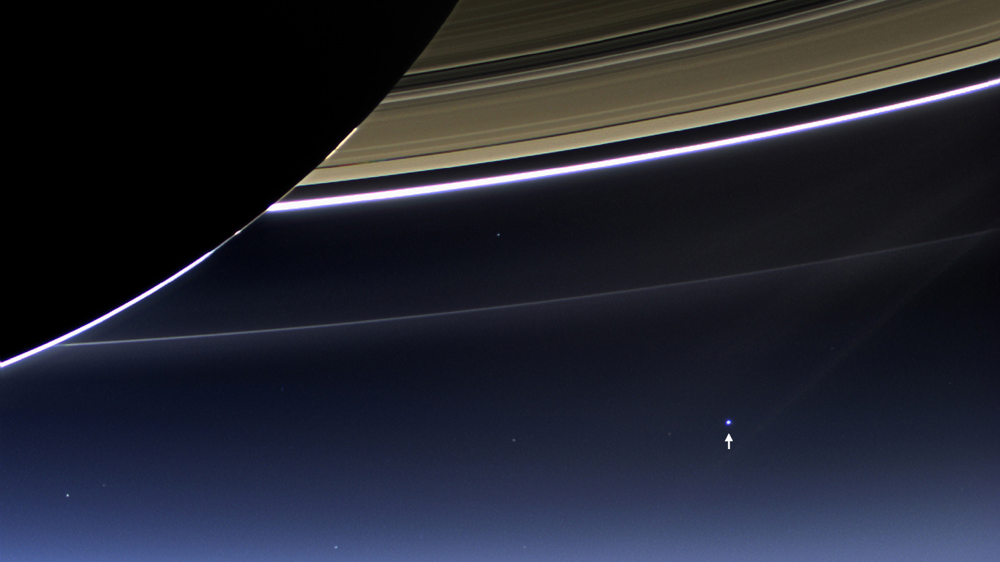
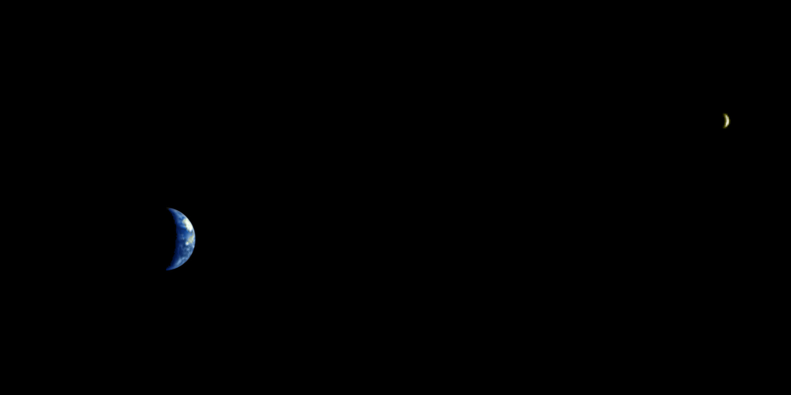

宇宙深处看地月情缘
==

1968年,威廉·安德斯(William Anders of Apollo 8)在首个绕月飞行器阿波罗8号上拍下了这张著名的照片 ——  NASA(美国宇航局)将其命名为“地球升起”(Earthrise),这可能是有史以来人类拍摄的第一张最具影响力的照片, 从外太空看到了美丽地球的彩色照片, 衬托在广袤无边的宇宙背景下, 突然看见我们的地球是这么渺小。如果展开身为人类天马行空般的思维,就会想到地球每天的升起与降落(旋转)其实触发了整个社会环境和人文的发展,直至今日依然深深地影响着整个社会的政治和文化。

《地球升起》有着巨大的影响力,而类似的照片也是很罕见的。 想要将整个地球瞄准,得先飞到地球几千英里以外,遗憾的是, 发射飞船到深层太空并不容易。 除了40年前就结束的阿波罗计划外,人类向地球轨道之外发射的宇宙飞船也屈指可数。 大多数太空发射任务的目标都是将卫星投放到低层地球轨道,又或者将货物运输到国际空间站(International Space Station) —— 但这些地方都离地球很近,也就很难拍到璀璨银河背景下的地球靓照。

这张照片里月球背面与地球一起悬浮在太空中。 由中国的嫦娥五号T1试验飞行器拍摄,距离地球约200000英里.

幸运的是,近年来人类又重拾回到深层太空的兴趣—— 计划先发射一些无人探测器与巡视器(probes and rovers),最终将进行载人飞行。 比如中国的嫦娥计划。 去年嫦娥3号的任务是 [将玉兔探测器送到月球上](http://www.extremetech.com/extreme/175410-chinas-lunar-rover-yutu-says-goodnight-humanity-in-creepy-farewell-letter-before-freezing-to-death) —— 这是人类40年来第一个软着陆在月球上的设备! —— 现在, [嫦娥5号-T1](http://en.wikipedia.org/wiki/Chang%27e_5-T1) 罕见地完成了飞越到月球远端的任务,抓拍了一张令人惊叹的照片: 月亮的远端和地球出现在了同一个镜头中。

在看完月球远端的这张照片以后, 下面还有更多从外太空拍摄的地球照片分享给你 —— 包括著名的《蓝色弹珠》(Blue Marble),以及卡尔·萨根(Carl Sagan)最喜欢的《暗淡蓝点》(Pale Blue Dot),这是有史以来拍摄到的最遥远的地球照片(悲剧的是,可能接下来的几十年里这也是最遥远的地球照片了).

##

蓝色弹珠, 1972年由阿波罗17号的宇航员拍摄

## 蓝色弹珠 ##

虽然《地球升起》是第一张从外太空拍摄的彩色地球照片, 但1972年阿波罗17号拍摄的《蓝色弹珠》可能更有名一些。

这张照片拍摄时距离地球大约28000英里(即45000公里),当时正是阿波罗17号和宇航员们驶向月球的途中。 和NASA的其他早期任务一样,使用的是修改版的70毫米哈苏胶片相机。

NASA后来也将蓝色弹珠用来称呼其他类似的地球照片,这些照片由现代的低空高分辨率卫星图像合成。

地球,在卡西尼号卫星,目前轨道土星。 地球是10点钟亮斑位置(点击图片放大)。
土星光环

这张照片——可能是我最喜欢的——被最近2006年,卡西尼号通过土星的阴影。 卡西尼约130万英里远离土星在这里,和大约900亿英里(15亿公里,远离地球。 太阳直接在土星后面,这就是为什么地球及其环的边缘是如此惊人地照亮。 (它也被大大增强了美国国家航空航天局)。

卡西尼号也 在2013年也采取了类似的照片 ,你更清楚地辨认出地球和月亮:

地球和月球从卡西尼号土星的阴影。 月亮是小“撞”的白色亮点的边缘。

暗淡蓝点(地球),旅行者1号认为这是太阳系的出发——距离地球40亿英里的地方
暗淡蓝点

这张照片,被旅行者1号通过超出冥王星和海王星的轨道,是地球最遥远的形象(除非一些外星种族从远离了我们的照片,当然)。 在这张照片中,1990年被捕,“航行者”号的距离地球约37亿英里或60亿公里。 奇怪的、色彩斑斓的光线没有什么激动人心的,不幸的是,他们衍射图样(爆发)引起的明亮的阳光。

暗淡蓝点是最极端的例子是多么微不足道的我们,提醒我们,我们应该也许让我们狂妄略。 一切人类有史以来所做的是正确的,微小的斑点。 这个相当令人羞辱的实现了卡尔·萨根笔这些淡蓝色点而美丽的思考:

点击观看[Youtube视频: Carl Sagan's Famous 'Pale Blue Dot' Quote in "Cosmos: A Spacetime Odyssey" (HD with subtitles) ](http://www.youtube.com/embed/b58SfRphkKc)可能需要翻墙

在24年以来, 旅行者1号终于离开了太阳系 和几天前,现在的总数 18小时光 从太阳,或者大约120亿英里远。 记住,离地球最近的恒星,因此最近的行星可能存在生命——半人马座阿尔法星,这是大约4光 年 遥远。 现在你看到 为什么我们需要开发经驱动器 越早越好吗?

地球,火星表面,由好奇心
更奇怪的,来自外太空的奇妙的地球的照片

最后,我将留给你一些奇怪的地球的照片,从各种各样的奇怪的位置在整个太阳系。 上面的图片是由美国宇航局 好奇心 罗孚;通常探测器不仰望天空(它的相机不适合这样的努力),但它仍然是一个相当酷的照片。

“全地球上升”,日本“月亮女神号”月球探测器
早在2007年,日本的“月亮女神号”月球探测器重建美国宇航局的原始照片使用其HDTV视频相机。

月球的母马右下方Marginis,被中国“嫦娥5-T1号”
好吧,这不是地球的,但这是一个非常酷的/怪异的月亮,捕捉到几天前,中国的“嫦娥5-T1号”。 母马右下方Marginis——字面上,大海的边缘——是对边缘的月球附近,因此我们通常无法看到它。

看到的地球和月球,火星快车上火星
这鲜明的和美丽的照片被欧洲火星快车探测器早在2003年,当它还在火星上。 宇宙飞船是距离地球约500万英里(800万公里)远的地方。

地球和月球,就像被NASA的伽利略,木星的途中
我和保存最好的(和奇怪吗?)图。 这张照片是一个组合,但规模和相对颜色/反照率(亮度/反射率)是正确的。 早在1992年,木星的伽利略卫星正,但仍然相当接近地球时,它转过身,拍一些漂亮的照片。 我不确定这张照片拍摄从一个奇怪的角度,或如果NASA月球粘贴到形象; NASA官员描述 还不清楚。

所有的照片在这个故事可以点击放大。 我认为几乎所有的高分辨率足够,你可以使用它们桌面壁纸,如果你希望如此。 如果你认为我们错过了一个特别棒的照片来自外太空的地球,在评论中让我们知道!

##

继续阅读: [The Space Shuttle legacy, in pictures](http://www.extremetech.com/extreme/90710-the-space-shuttle-legacy-in-pictures)

原文链接:  [The Earth and Moon, as seen from elsewhere in the universe](http://www.extremetech.com/extreme/193161-the-earth-and-moon-as-seen-from-elsewhere-in-the-universe)

原文日期: 2014年10月23日

翻译日期: 2014年10月24日

翻译人员: [书三生](http://t.qq.com/renfufei)
