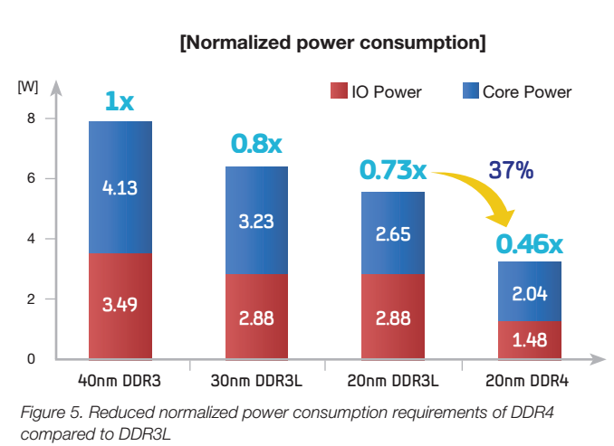

20纳米制程为三星铺平DDR4单条128GB的道路
==

三星宣布了一套建立在20 nm制程技术下的DDR4芯片,能打破现有的存储容量瓶颈,从而允许每个DIMM内存模块容纳更大的内存容量。 目前,服务器和PC机单个插槽最大支持32GB内存,但这个最大容量也只有个象征意义。 新蛋网上单条32GB内存标价510美元,而 4x8GB套装则只需要309美元。 在内存较小时,同样的容量,单条内存要比套装便宜一些.但在单条大容量内存市场,价格则倒转过来。

根据这份新的公告可知,三星正在处于铺设大容量内存的阶段。 这种新的20 nm芯片(三星声明这是真正的20纳米DIMM,而不是20~纳米级的内存)每个模块现在有 8Gbit,单条可以达到 32GB, 但后期将会达到单条128GB。 得益于第4代封装技术 硅通孔技术(TSV,Through -Silicon-Via), 我们都知道, 内存容量瓶颈卡在现在的状态差不多快5年了。

那么问题来了,我问三星直接——是现在准备开始构建128 gb DDR4模块,或者这是一种“首次在几年”的现象? 令我惊奇的是,该公司回答说,“我们已经准备好生产128 gb DDR4模块只要请求。 ”,并不意味着它实际上是将部分市场在短期内,但它确实意味着我们可以看到高端128 gb的容量可以在未来几年。 三星的初始DDR4时速为2.4 ghz,体面地快,尤其是服务器内存。 需要时间DDR4确实是比DDR3更快,但权力储蓄和RAM密度应该立即生效。

DDR4和exascale

真正有趣的使用对于高密度DDR4模块 将在 [超标量计算机](http://www.extremetech.com/computing/185797-forget-moores-law-hot-and-slow-dram-is-a-major-roadblock-to-exascale-and-beyond)  长期和HPC构建。 我们之前已经讨论过的一个问题是如何RAM密度和电源管理变得越来越问题当我们试图构建高效率的超级计算机。 如果三星四的密度DDR4内存,一个32-slot主板从1 tb的内存4 tb。 RAM在这些密度会需要不同的服务器和从英特尔芯片组;该公司当前的15-core Xeon处理器E7v2最高每核心1.5 tb的内存。

三星宣称这些新芯片实现ECC技术比以前的设计和操作电压是1.2 v,总功率降低近50%相比原始40 nm DDR3。 消费者吸收DDR4将为现在——是适度的 [英特尔的X99芯片组](http://www.extremetech.com/computing/188911-intel-haswell-e-review-the-best-consumer-performance-chip-you-can-buy-with-some-caveats) 是唯一的消费者目前硬件支持它,但预计英特尔Skylake添加DDR4支持在2014年。 报告对是否有变化 [AMD的卡里佐](http://www.extremetech.com/computing/178752-amds-next-gen-carrizo-apu-features-leaked-shows-greater-focus-on-power-efficiency) 将DDR3 -或DDR4-based实际上是可能的,该公司将推出两个版本的芯片或只会建立一个内存控制器芯片相结合,就像DDR2-DDR3过渡。

有一些问题,然而,是否DDR4将优先为桌面计算。 完全有可能,我们将会看到这种技术部署在智能手机才真正需要更广泛分享其他计算平台,因为储蓄力量是最重要的设备最小的电池。

现在读: [三星850 Pro评论:3 d NAND和RAM缓存导致的最快,最持久的SSD金钱可以买到的](http://www.extremetech.com/computing/189003-samsung-850-pro-review-3d-nand-and-ram-caching-result-in-the-fastest-most-durable-ssd-money-can-buy)

原文链接: [Samsung’s new 20nm DDR4 clears the way for massive 128GB DIMMs](http://www.extremetech.com/computing/192711-samsungs-new-20nm-ddr4-clears-the-way-for-massive-128gb-dimms)

原文日期: 2014年10月23日

翻译日期: 2014年10月24日

翻译人员: [书三生](http://t.qq.com/renfufei)
