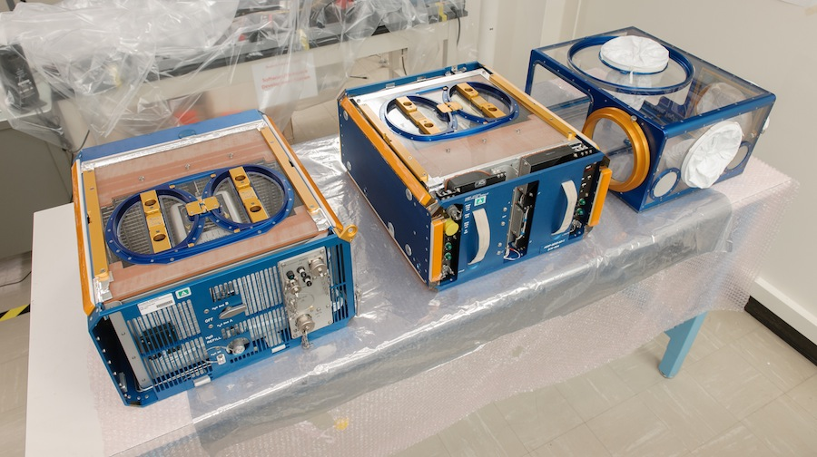

国际空间站即将开通当天送货服务
====

国际空间站预计很快就会开通独有的当天送货服务, 用于将重要的科学样本带回地球。 提供该服务需要使用陆地返回舱(TRV,Terrestrial Return Vehicle)来实现; 着陆舱不带翅膀, 非常小巧, 里面可以存放一些重要的科学标本,并可以通过气闸从空间站降落; 理论上24小时之内就能返回地球表面。 计划是这样的： 平时给空间站运送物资的飞船顺带着将很多着陆舱带到空间站上(ISS, International Space Station, 可以使用 SpaceX Dragon 飞船), 然后空间站的宇航员就可以在需要的时候将样品 "快递" 到地球 —— 有点像重力驱动快递服务(gravity-powered, 可能这也是世界上最可靠的快递了)。

我们只要用大腿想一想就会明白, 将物品送到国际空间站是一件费时费力,还要大量烧钱的任务: 简单来讲, 每次我们都要把几吨重的物品打包放到运输仓, 然后烧掉几百万加仑的燃料(相当于每次烧掉好几亿美金)才能把它们送到离地面几百英里的近地轨道上。 理论上将物品从空间站带回地球要容易很多 —— 地球重力能够搞定这一切, 但依照过去的方式, 要带东西回来只能靠送货上去的那些飞船。 换句话说, 要从空间站往回寄点特产什么的, 得先花几亿美金将飞船送上去才行。

**空间站用着陆舱寄东西给地球**

[领英公司,Intuitive Machines](http://intuitivemachines.com/news/trv/) 制造的返回舱将改变这一状况。 返回舱是一个小小的舱体, 看起来有点像 [天梭](http://www.extremetech.com/tag/space-shuttle) 或者是没有翅膀的 [波音 X-37B 太空飞船](http://www.extremetech.com/extreme/181426-us-militarys-mysterious-x-37b-space-plane-passes-500-days-in-orbit-but-we-still-have-no-clue-what-its-actually-doing-up-there)。 我们现在还不确定返回舱的具体尺寸, 但长度应该不会超过一米。 从上面的概念图大致可以看出, 它的大小跟一个小孩差不多。(但早期的 TRV 肯定不能快递活着的生物啦^_^)。 从图中可以看到, 我们将返回舱装满科学样本, 然后通过气闸, 接着用日本制造的机器手推入太空。 它和其他航天器一样,穿过大气层返回地球, 在最后阶段展开降落伞减慢速度, 然后还会有一个更大的降落伞让它安全地着陆在犹他州(Utah)。

扩展阅读: [SpaceX把首台零重力3D打印机送到空间站](http://www.extremetech.com/extreme/190629-spacex-rocket-launches-to-the-space-station-carrying-the-first-ever-zero-g-3d-printer)

返回地球的旅途大约持续6小时。 国际空间站每天环绕地球15圈左右, 所以花费的总时间能控制在24小时以内。 这一点是非常重要的, 因为空间站是进行很多科学实验的地方, 如果这些实验产生的样本能够直接送回地球,那肯定更受欢迎, 如果要等几星期以后姗姗来迟的常规货舱,也许黄花菜还没凉呢。 就像 [Popular Science](http://www.popsci.com/article/technology/space-station-getting-ups-style-shipping-service) 所说的那样, ISS 实际上是非常重要的科研场所, 主要是失重环境 —— 有些事, 比如 [生物器官打印](http://www.extremetech.com/extreme/147647-the-first-3d-printed-human-stem-cells) 或研发新药, 让细胞不受地球重力的压迫而在三维空间自由生长,也许会有某些惊喜。

**ISS的啮齿动物研究设备**

Intuitive Machines 正和 NASA 以及 CASIS合作开发着陆舱。空间科学促进中心(CASIS)自2011年以来,一直管理着空间站上的美国国家实验室, 受NASA委托负责寻找和挑选最适合在国际空间站上开展的科学实验. 首批返回舱计划在2016年送到国际空间站。 在初期, 陆地返回舱只会被用于带回科学样本, 但显然在将来的某个新版本肯定可以安全地带回活体脊椎动物。

(NASA最近准备将老鼠送到国际空间站, 但现在的计划是将其解刨后,把冻结器官送回地球 —— 但我觉得将活着的动物用返回舱寄回地球要人道一点)。

**更多阅读**: 

[6万英里往上: 新研究认为在2035年可以建成太空电梯](http://www.extremetech.com/extreme/176625-60000-miles-up-geostationary-space-elevator-could-be-built-by-2035-says-new-study)

[认真看待 4K TV 的设计](http://robbreport.com/sony/articles/taking-4K-design-seriously)

[我们战胜气候变化的6大法宝 (第一条绝对让你吃一斤!)](http://decarboni.se/insights/top-6-ways-well-beat-climate-change-number-1-will-surprise-you?utm_source=ob&utm_source=ob)

[可以终止气候变化的5项科技](http://decarboni.se/insights/5-technologies-will-disrupt-climate-change?utm_source=ob&utm_source=ob)

[科学家在实验室成功模拟时空扭曲](http://www.extremetech.com/extreme/192311-scientists-can-now-simulate-curved-space-time-in-the-lab)

原文链接: [The Space Station will soon have a same-day delivery service](http://www.extremetech.com/extreme/192365-the-space-station-will-soon-have-a-same-day-delivery-service)

原文日期: 2014年10月17日

翻译日期: 2014年10月20日

翻译人员: [书三生](http://t.qq.com/renfufei)