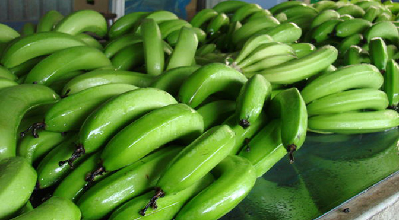
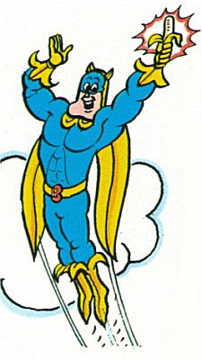

# 超级转基因香蕉研制成功 #

营养不良在全球范围内一直是个大麻烦,但很难得到解决。 人们不仅需要获得足够的食物,食物之间还需要有合理的搭配。 发展中国家的人民能有吃的就不错了,而只维持温饱很可能会导致维生素的缺乏从而危及生命。 令人惊讶的是,由比尔-梅林达·盖茨基金会支持的超级转基因(GM)香蕉(super-banana) 可能是对抗营养不良的关键武器。 是的,那并不是性感的 [盖茨牌安全套。](http://www.extremetech.com/extreme/171417-bill-gates-funds-creation-of-thin-light-impenetrable-graphene-condoms)

那是什么让它变成“超级香蕉“的呢? 这主要是因为这种香蕉富含β-胡萝卜素,人体可以用它来合成维生素A。这听起来也许不像是对抗营养不良的食品,但发展中国家对维生素A的缺乏是一个很大的问题。 世界卫生专家估计每年有 650000 - 700000名儿童死于维生素A缺乏。 另外有300000名儿童虽幸免于难,但代价却是失去了视力。 通过调整了几个基因,科学家们创造了一种可以预防这种恶果的香蕉。

β-胡萝卜素本身是一种大分子碳氢化合物(如上图),颜色为深橙色。 如果你曾经想知道为什么胡萝卜,南瓜,和红薯是橙色的,那就是因为他们含有大量的β-胡萝卜素。 某些种类的香蕉具有更高含量的β-胡萝卜素,但他们不能供人类食用。 昆士兰科技大学(Queensland University of Technology)的科学家利用这些香蕉作为创建超级香蕉基因物质的来源。

像其他所有有机生物体一样, 植物中也有专门控制合成β-胡萝卜素的[基因](http://www.extremetech.com/tag/dna)。 研究者们将不可食用香蕉中的这种基因抽取出来,然后把它插入到我们所熟悉喜爱的香蕉中。 此外还有一些额外的[基因工程](http://www.extremetech.com/tag/genetic-engineering),使得这种基因的表达能力增强, 像变魔术一样, 嘭！ —— 你得到一个含有大量β-胡萝卜素的香蕉,可以用来对抗维生素A缺乏症。 他们表面上和普通香蕉看起来完全一样,但在果皮下面是一片璀璨的金色。

那为什么要克服这么多的困难去创造一种转基因作物,而不是简单地向发展中国家运输胡萝卜呢? 卫生工作者很久以前就意识到,要从外国不断地运送大量的食物给营养不良的地区是很难的, 而让所需食物的地区自己生产粮食和保持增长是更可行的策略和方法。 主要农作物(如许多热带地区的香蕉)就是很理想的作物,因为农民已经知道如何种植他们。

很像是十多年前创造金大米的方法。 那时候,瑞士联邦理工学院和弗莱堡大学的科学家们通过改良使得水稻胚乳(我们所吃的部分)中产生β-胡萝卜素,而不只存在于叶子中。 结果诞生了一个略带橙色的稻米品种, 能让食用者体内维生素A的含量大幅提高.大米是亚洲穷人的主食,就像香蕉在热带地区是主食一样。

super-banana未来一段时期内将在美国进行人体试验,成本大约为1000万美元,由盖茨基金会支付。 研究人员将监测人体在摄入这种香蕉的提取物后维生素A的水平是否上升。 任何与转基因食品相关的事情往往都是有争议的,但这主要是由于对测试和风险因素的误解。 如果有一天某种香蕉可以阻止成千上万的人死亡,可能转基因也是好的。 如果一切按计划进行,转基因水果从2020年起可以在非洲开始种植。

图2 在英国,有一个著名的漫画英雄叫Bananaman,他获得吃香蕉超级冠军。 (那些疯狂的英国人)

原文链接: [Genetically engineered super-banana could save millions of lives](http://www.extremetech.com/extreme/184435-genetically-engineered-super-banana-could-save-millions-of-lives)

原文日期: 2014-06-16

翻译日期: 2014-06-17

翻译人员: [书三生](http://t.qq.com/renfufei)