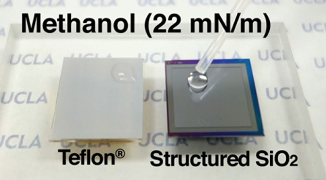

新型超级纳米材料,不吸附任何已知液体
==
# New superomniphobic texture made of nanoscopic nails repels all known liquids

superomniphobic; super-omni-phobic(超级-全方位-不亲附)

如果你曾经住在一个经常下雨的地方的主要运输方式 [开车](http://www.extremetech.com/tag/autos) ,你可能很熟悉Rain-X等产品。 擦一些在你的挡风玻璃,几乎让它解决,你可以开车经过一个倾盆大雨而无需把挡风玻璃雨刷(尽管我们不建议这么做)。 Rain-X是一种疏水性涂料,它不溶于水,给你一个明确的路即使雨刷不能。 虽然疏水性涂料可以击退其他液体,其主要重点是水,你的白色礼服衬衫可能意识到,水并不是唯一的液体泄漏。 加州大学洛杉矶分校的工程师已经创建了一个液体防水的这么多比疏水性涂料的分类更有效 superomniphobic 它是基于表面纹理,而不是设置并遗忘涂层。

酷,早晨的露珠,你会倾向于注意的水珠坐上或滚下来的树叶。 某些植物毛在微观层面上,这就意味着没有足够的接触点表面水浸泡,使液滴的完整由于自身的表面张力。 这也是为什么水珠子不粘锅的锅。 如果你经常做饭,不过,你就会知道,石油没有珠;它有一个低于水的表面张力,因而更难击退。 创建了表面能处理低表面张力液体,如石油,但能够击退液体更低的表面张力,像氟溶剂,用于电气冷却,例如——仍然是难以捉摸的。

If you have ever lived in a frequently rainy area of the world where the main mode of transportation is driving, you’re likely very familiar with products like Rain-X. Rub some of it on your windshield, let it settle, and you can practically drive through a downpour without having to turn your windshield wipers on (though we wouldn’t recommend it). Rain-X is a superhydrophobic coating that repels water, giving you a clear view of the road ahead even when wipers can’t. Though superhydrophobic coatings can repel other liquids, its main focus is water, and as your white dress shirt is probably aware, water isn’t the only liquid that can spill. Engineers at UCLA have created a liquid repellent so much more effective than superhydrophobic coating that it’s classified as superomniphobic — and it’s based on surface texture, rather than a set-and-forget coating.

On a cool, dewy morning, you’ll tend to notice beads of water sitting atop or rolling down leaves. Certain foliage is hairy on a microscopic level, which means the surface doesn’t have enough points of contact with water to soak it in, leaving the droplet intact thanks to its own surface tension. This is also why water beads up on a non-stick cooking pan. If you cook often, though, you’ll know that oil doesn’t bead up; it has a lower surface tension than water, and thus is more difficult to repel. Surfaces have been created that can deal with lower surface tension liquids, such as oil, but being able to repel liquids with an even lower surface tension, like fluorinated solvent — used for electrical cooling, for instance — has remained elusive.

甲醇新卷边,变形superomniphobic表面

通过介绍与成千上万的微观表面容易受骗的钉子,加州大学洛杉矶分校的研究人员CJ金姆和康师傅刘已经创建了一个表面纹理,可以 [击退所有已知的液体](http://newsroom.ucla.edu/releases/ucla-engineers-create-superomniphobic-texture-capable-of-repelling-all-liquids) 。 每个指甲都是比人类头发的宽度,把薄只有100微米,措施负责人,每个直径只有20微米。 每一个指甲都有一个垂直过剩了,看起来类似于台布挂在圆桌的边缘。 过剩浮标液体通过创建一个空气缓冲由约95%,保持液体的表面张力。 指甲是我们老朋友的雕刻出硅-二氧化硅;同样的东西展示在几乎每一个计算机芯片的基础。 [研究论文: [DOI: 10.1126 / science.1254787](http://www.sciencemag.org/content/346/6213/1096) ]

UCLA-engineered纹理击退所有的液体扔,包括油、溶剂、甚至溶剂最低知道液体的表面张力,perfluorohexane。 甚至更好,钉结构可以应用于各种表面,包括金属, 玻璃 和聚合物。 由于表面纳米指甲而不是做的,例如,一个涂层,它的强硬,不会从严酷的气温降低,biofluid或紫外线。

研究人员提起的专利创造,但需要时间去探索和完善。 所以现在,你不能指望很快购买雨衣的结构。 纹理的存在,可以应用于各种各样的表面。 似乎所有的人员需要完善材料的时间。

Methanol beading on the new, textured superomniphobic surface
By covering a surface with thousands of microscopic flathead nails, UCLA researchers CJ Kim and Tingyi Liu have created a surface texture that can repel all known liquids. Each nail is thinner than the width of a human hair and placed just 100 micrometers apart, and each head measures in at just 20 micrometers in diameter. Every nail has a vertical overhang coming off its head, looking similar to a tablecloth hanging over the edge of a round table. The overhang buoys liquids by creating a cushion composed of about 95% air, preserving the liquid’s surface tension. The nails are fashioned out of our old friend silica — silicon dioxide; the same stuff that lays at the base of almost every computer chip ever made. [Research paper: DOI: 10.1126/science.1254787]

The UCLA-engineered texture repelled all liquids thrown at it, including oils, solvents, and even a solvent that has the lowest known surface tension for a liquid, perfluorohexane. Even better, the nailed texture can be applied to a variety of surfaces, including metal, glass, and polymers. Due to the surface being made of nanostructured nails instead of, for example, a coating, it’s tough and wouldn’t degrade from harsh temperatures, biofluid, or ultraviolet light.

The researchers have filed a patent for the creation, but need time to explore and perfect it. So for now, you shouldn’t expect to purchase a raincoat covered in the texture anytime soon. The texture exists, though, and can be applied to a variety of surfaces. It seems all the researchers need to perfect the material is time.

Now read: MIT creates hydrophobic material that could revolutionize fossil fuel and nuclear power plants

现在读: [麻省理工学院创建了疏水性材料,可以彻底改变化石燃料和核能发电厂](http://www.extremetech.com/extreme/138315-mit-creates-hydrophobic-material-that-could-revolutionize-fossil-and-nuclear-power-plants)

原文链接: [New superomniphobic texture made of nanoscopic nails repels all known liquids](http://www.extremetech.com/extreme/195176-new-superomniphobic-texture-made-of-nanoscopic-nails-repels-all-known-liquids)

原文日期: 2014-12-02

翻译日期: 2014-12-03

翻译人员: [书三生](http://t.qq.com/renfufei)