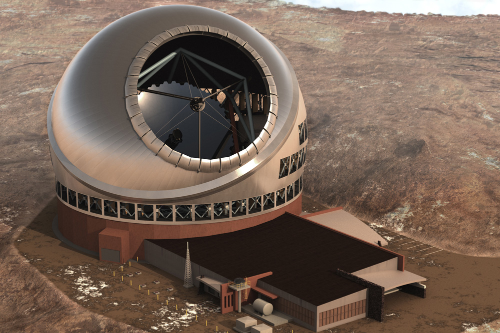
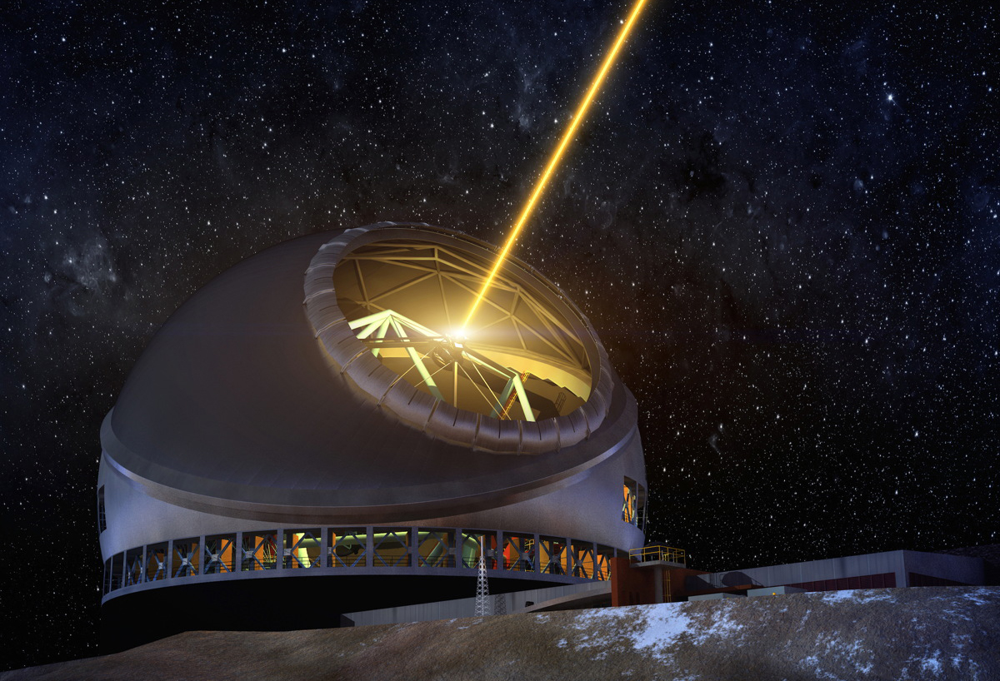
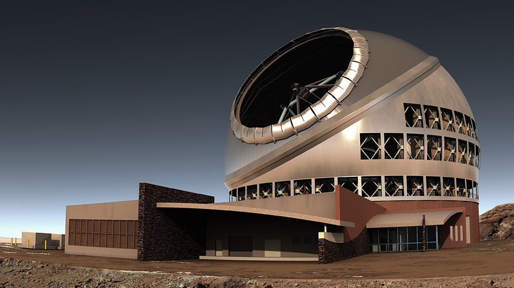

# 30米口径天文望远镜在夏威夷动工 —— 预算14亿美元#

**天文望远镜都是可以旋转的哦!**

经过多年的研究和规划、预算达14亿美金的TMT项目(Thirty Meter Telescope, 30米口径天文望远镜)在夏威夷开工建设。 新一代巨无霸望远镜将赐予科学家们强悍无比的力量 —— 分辨率是哈勃望远镜的 **10倍**, 可以在舒适安静的地球表面观测曲折难解的宇宙深处。 但因为它位于全世界最大的 Mauna Kea volcano 火山山顶, 多年来一直与当地的暴民存在某些冲突,这确实是现代科学进程与古老传统的碰撞.

30米口径望远镜的命名简单又朴素,而且深藏逼格. Thirty Meter Telescope 的总反射面直径达30米(约98英尺), 其新一代 "自适应光学系统(adaptive optics system)" 由492个六边形镜面组成。这应该算是TMT项目最大的创新, 如果项目成功, 大部分 [天文望远镜](http://www.extremetech.com/tag/telescopes) 就不用送入太空, 只要想一想政府项目的腐败和低效, 你就知道发射到太空到底有多昂贵, 是的,大多数时候。

TMT 的自适应光学系统技术来自于凯克天文望远镜(twin Keck telescopes), Keck也位于莫纳克亚山顶,是当前最大的天文望远镜，口径10米。 30米望远镜能够很好地应对地球表面千变万化的气候环境以及大气层的影响, 而这也是我们将哈勃一类的望远镜送到太空的原因; (也包括即将发射的詹姆斯·韦伯太空望远镜-James Webb Telescope)。

**30米口径望远镜上的激光导引星**

为 TMT 开发的自适应光学系统使用了多个变形镜来修正大气层对光线的影响。 从本质上讲,镜子本身的形状可以巧妙地实时校正大气湍流的影响。 科学家称之为 Multi-Conjugate Adaptive Optics(MCAO, 多层共轭自适应光学)。 类似于 Keck, TMT将使用一个波前传感器对入射光进行采样,并确定的变形模式。 望远镜需要某些控件来找到正确的校正方式, 这就是为什么TMT会配备上面这种炫酷的激光装置,一种强大的人造导引星。

扩展阅读: [IBM为世界上最大的million-dish望远镜建造百亿亿次超级计算机](http://www.extremetech.com/extreme/124561-ibm-to-build-exascale-supercomputer-for-the-worlds-largest-million-antennae-telescope)

TMT强大到足以支撑天文学家长期对暗物质,超大质量黑洞和星系形成进行探索和研究。 它还可以辅助进行 [系外行星定位](http://www.extremetech.com/extreme/170628-alien-spotting-by-2020-well-finally-have-the-ability-to-locate-habitable-alien-planets), 直到更专业的韦伯望远镜上线

**30米望远镜复杂的侧面图**

天文学家并不担心自适应光学系统在TMT上出问题 —— 它本质上是一中升级版的技术,已在凯克天文台获得成功(Keck望远镜使用10米的镜面)。 然而,抗议者将会继续反对这个项目,可能会导致项目的推迟。 夏威夷土著认为火山的斜坡上是一个神圣的地方,因此不应该建在上面。 抗议者通过阻断道路畅通从而影响项目动工,但按计划是在[2022年竣工](http://www.tmt.org/)。

TMT在在巨型天文望远镜领域也不是没有对手. 已经有计划宣称将在智利的安第斯山脉建造24米和39米表面采光直径的项目。 这三个巨大的天文望远镜项目,因为装备不同的杀器，预计将有不同的专长。 因为这类望远镜是用来研究宇宙中最大的问题的, 所以即便是有三个那也是远远不够的。

相关阅读: [寻找外星人: 2020年我们将**有能力**找到存在生命的外星行星](http://www.extremetech.com/extreme/170628-alien-spotting-by-2020-well-finally-have-the-ability-to-locate-habitable-alien-planets)

原文链接: [Gargantuan $1.4 billion Thirty Meter Telescope begins construction in Hawaii](http://www.extremetech.com/extreme/191807-gargantuan-1-4-billion-thirty-meter-telescope-begins-construction-in-hawaii)

原文日期: 2014-10-10

翻译日期: 2014-10-12

翻译人员: [书三生](http://t.qq.com/renfufei)
