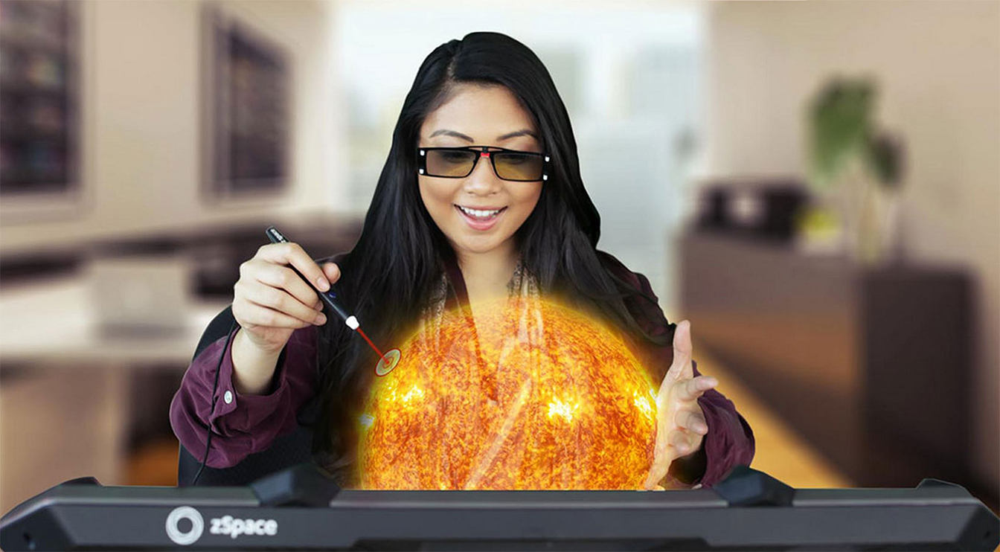

虚拟现实技术成功运行在桌面领域
==

The first time I donned a pair of special glasses and picked up a wired stylus to enter a virtual reality was over 25 years ago. It required extremely expensive hardware, and only allowed for a simple, low-resolution, experience of machining a part on a virtual lathe. But we were all sure that practical applications were just around the corner. It has taken much longer than most of us predicted, but with its new Zvr display, HP is bringing to market a practical and useful VR tool for educators, scientists, and other professionals that need to have accurate, simulated interactions with computer-generated models.

我第一次戴上一副特殊的眼镜,拿起一个手写笔输入连接 [虚拟现实](http://www.extremetech.com/tag/virtual-reality) 是25年前的事了。 它需要非常昂贵的硬件,只允许一个简单的,低分辨率,部分虚拟车床加工的经验。 但我们都知道,实际应用指日可待。 花了更长的时间比我们大多数人的预期,但由于其新Zvr显示,惠普将市场实际和有用的虚拟现实工具教育家、科学家、和其他专业人士,需要准确、模拟与计算机的交互模型。

The heart of the Zvr (if you’ll forgive the pun) is a special-purpose display from VR startup Zspace, which incorporates four cameras for head-tracking, a fully gyroscopic stylus that allows for both precise pointing and true 3D manipulation of objects, and a 3D display that uses special glasses. HP is also offering Zview software for the sharing of 3D content suitable for use on the Zvr.

Zvr的核心(如果你能原谅双关语)是一个从虚拟现实启动Zspace专用显示,这对头部包含四个摄像头,一个完全陀螺手写笔,允许精确的指向和真正的3 d操纵对象,并使用特殊的眼镜的3 d显示。 惠普也提供Zview软件共享Zvr 3 d内容适合使用。

I got to use the Zvr to manipulate a model of a human heart, and was able to quickly and easily select different portions of the heart, and move it around simply by twisting my wrist — the way I would if I were actually holding it in my hand. The result was an experience that felt natural, and was also precise enough that I could imagine how powerful it could be as a learning tool for fields that require a detailed understanding of complex physical objects, such as anatomy or mechanical engineering.

我必须使用Zvr操纵人类心脏模型,并能够快速、轻松地选择不同的部分的心,并在其中移动只需扭我的手腕,我如果我实际上是用我的手捧着它。 感觉自然结果是一种体验,也足够精确,我能想象它可能是多么强大的字段作为一个学习工具,需要详细了解复杂的物理对象,如解剖学或机械工程。

###The stylus makes all the difference

###手写笔使所有的差异

What differentiates the Zvr — the magic behind the Zspace display that powers it — is the integrated 3D stylus. Gesture-based VR interfaces, like those [powered by Leap Motion](http://www.extremetech.com/extreme/161813-leap-motion-review) or Microsoft’s Kinect, suffer from a lack of precision, especially when it comes to twisting and turning objects using motions of your wrist and hand. Obviously, the need for a stylus does limit the use cases for the Zvr. It is not going to help you practice conducting an orchestra, or sculpt a clay statue using both hands. HP and Zspace are positioning the display primarily for science and technology related disciplines — especially for teaching them.

Zvr区分开来——的背后Zspace显示它是集成的3 d手写笔。 基于手势的VR接口,一样 [由跳跃运动](http://www.extremetech.com/extreme/161813-leap-motion-review) 或微软的Kinect,遭受缺乏精度,特别是当它涉及把玩对象和使用你的手和手腕的动作。 显然,需要手写笔并限制Zvr的用例。 它不会帮助你练习指挥一个管弦乐队,或者使用双手雕刻粘土雕像。 惠普和Zspace定位显示主要科学技术相关学科教学——特别是他们。

The high-resolution display and 3D manipulation require a fair amount of compute power. You need an HP Z-Series (or similar) workstation to run it. Along with its large size, that means it is not suitable for any type of mobile application. The viewing angle is also very limited. Even wearing the glasses, when I stood behind the person seated at the display I didn’t get any of the 3D effect. However, when I sat down, the virtual heart on the display popped into a nearly holographic 3D form. HP and Zspace have not announced a price or exact availability date, but they expect it to be in the market this spring. I’m sure it will find a home at quite a few high schools and colleges, but its ultimate success is likely to be tied to whether the VR it brings to the classroom and the lab is worth the price.

高分辨率显示和3D操作需要强大的计算机支持. 您需要一台惠普 Z-系列(或差不多)的工作站来运行它。 连同其庞大的规模,这意味着它不适合任何类型的移动应用程序。 的视角也很有限。 即使戴着眼镜,当我站在后面的人坐在显示我没有得到任何3 d效果。 然而,当我坐下来,钻进一个显示的虚拟心脏近全息三维形式。 惠普和Zspace没有宣布价格或确切的日期,但他们预计今年春天在市场上。 我肯定会找到一个家不少高中和大学,但其最终的成功可能与是否带来的虚拟教室和实验室是值得的。

Now read: [Hyper haptics: Invisible, touchable 3D shapes created with blasts of ultrasound](http://www.extremetech.com/extreme/195394-3d-shapes-with-ultrasound)

继续阅读: [超级触觉: 超声波爆炸形成摸得着却看不见的3D形状](http://www.extremetech.com/extreme/195394-3d-shapes-with-ultrasound)

##

原文链接: [Virtual reality comes to the desktop, thanks to HP and Zspace](http://www.extremetech.com/computing/196837-virtual-reality-comes-to-the-desktop-thanks-to-hp-and-zspace)

相关链接: [CNCounter翻译文章目录](https://github.com/cncounter/translation)

原文日期: 2015年01月06日

翻译日期: 2015年01月07日

翻译人员: [书三生](http://t.qq.com/renfufei)
