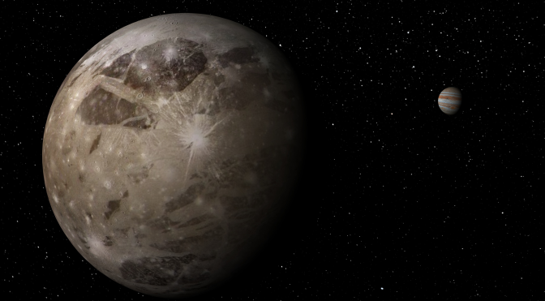
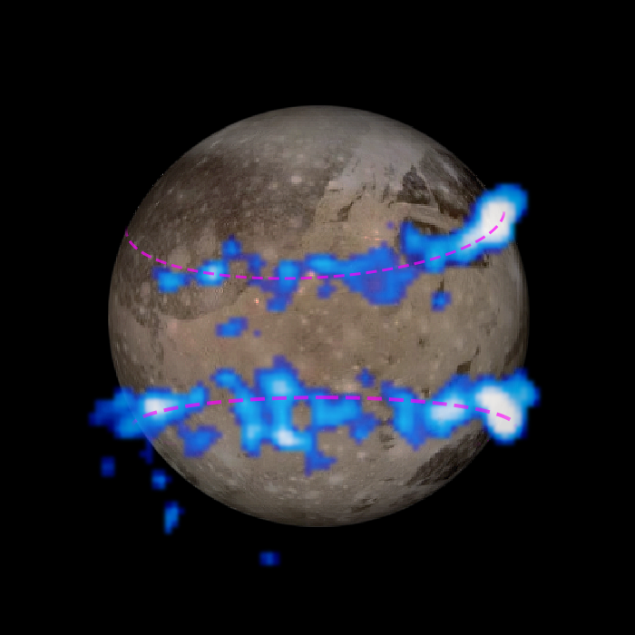
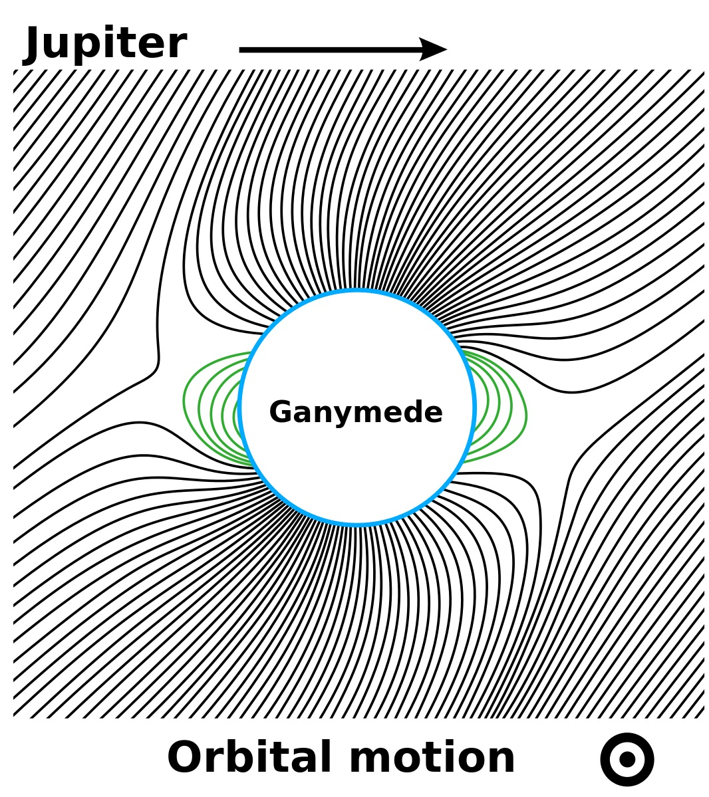
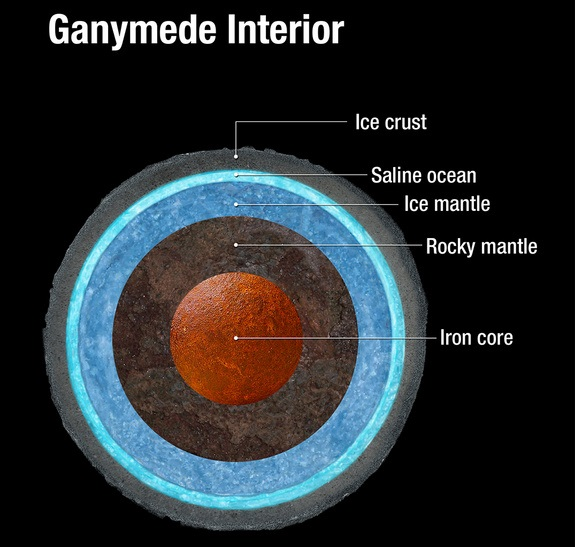

# NASA detects subsurface ocean on solar system’s largest moon

# 美国宇航局在太阳系中最大的卫星探测地下海洋

NASA scientists announced they’ve found evidence that Ganymede, the largest moon in the solar system, has a vast subsurface liquid ocean that contains more water than the Earth’s surface. Ganymede is already unique in other ways — it’s larger than the planet Mercury (but less than half Mercury’s mass), twice the mass of our own moon, and the only satellite known to have its own magnetosphere. Like Europa, Ganymede may have an incredibly thin atmosphere of oxygen. The discovery of a liquid ocean on Ganymede increases the chances that life exists or has existed within its depths.

美国宇航局的科学家们宣布他们已经发现证据表明Ganymede,太阳系中最大的卫星,一个巨大的地下液态海洋比地球表面含有更多的水。 伽倪墨得斯已经是独特的在其他方面——这是比水星(但不到一半汞的质量),两次的质量我们自己的月亮,和唯一的卫星有自己的磁场。 像欧罗巴,伽倪墨得斯可能有一个非常薄的大气层氧气。 发现液体海洋Ganymede就可能有生命存在或已经存在在其深度。

“This discovery marks a significant milestone, highlighting what only Hubble can accomplish,” said John Grunsfeld, associate administrator of NASA’s Science Mission Directorate at NASA Headquarters, Washington. “In its 25 years in orbit, Hubble has made many scientific discoveries in our own solar system. A deep ocean under the icy crust of Ganymede opens up further exciting possibilities for life beyond Earth.”

“这一发现是一个重要的里程碑,强调只有哈勃望远镜可以完成,”约翰·菲尔德说,美国宇航局NASA科学任务理事会副主任总部,华盛顿。 ”在其25年的轨道,哈勃望远镜使得许多科学发现在我们自己的太阳系。 深海的冰冷的外壳下伽倪墨得斯打开了进一步兴奋地外生命的可能性。”

Ganymede’s magnetic field is the reason Hubble was able to [peer across the void](http://www.nasa.gov/press/2015/march/nasa-s-hubble-observations-suggest-underground-ocean-on-jupiters-largest-moon/) and detect the presence of subsurface water. Just as Earth has the northern and southern lights (Aurora Borealis and Aurora Australis), Ganymede has its own auroral belts, as shown below:

伽倪墨得斯的磁场是哈勃望远镜能的原因 [同行的空白](http://www.nasa.gov/press/2015/march/nasa-s-hubble-observations-suggest-underground-ocean-on-jupiters-largest-moon/) 和检测地下水的存在。 正如地球的北部和南部灯(北极光和南极光),它有自己的极光带,如下所示:

Water is what’s known as dimagnetic, meaning it generates a weak magnetic field in opposition to whatever magnetic field is applied to it. The aurora around Ganymede are expected to rock back and forth in response to Jupiter’s magnetic field (Ganymede’s self-generated magnetic field is embedded in Jupiter’s as shown below):

水是所谓的抗磁性,这意味着它生成一个弱磁场反对任何磁场应用于它。 极光在伽倪墨得斯预计来回岩石在木星的磁场(Ganymede的自我产生的磁场是嵌入在木星的如下所示):

image courtesy of [Wikipedia](https://en.wikipedia.org/wiki/Ganymede_(moon))

图片由 [维基百科](https://en.wikipedia.org/wiki/Ganymede_(moon)) 提供

What the scientists found is that the rocking motion across the surface was much reduced compared to what they’d expect to see if there was no water underneath the surface of the moon. Current thinking is that the ocean is an estimated 60 miles deep, but buried 95 miles beneath the icy crust.

科学家们发现,对面的摇摆运动表面降低相比,他们会希望看到如果没有水在月球表面。 目前的想法是,海洋是一个约60英里深,但冰冷的下地壳95英里。

We’ve known for decades that Ganymede contained significant amounts of water ice, but the presence of liquid oceans was less certain. At 95 miles below the surface, the oceans could run quite hot. For reference, the average temperature on the surface at the Kola Superdeep Borehole in July is just 52F / 11C, while the temperature at the bottom of the shaft, 49,000 feet below the surface, was 356F / 180C. At more than 10x the depth, Ganymede’s hypothetical ocean would be insulated from the cold vacuum of space and warmed by the moon’s active core.

我们已经知道了几十年,它包含大量的水冰,但液体海洋的存在是不太确定。 地球表面95英里以下,海洋可能会很热。 作为参考,在可乐的表面平均温度超深层钻孔只是7月52 f / 11 c,而轴的底部的温度,在地表以下49000英尺,是356 f / 180 c。 在深度超过10倍,Ganymede的假想的海洋将会远离寒冷的真空空间和温暖的月亮的活跃的核心。

### Enceladus shares the spotlight

### 恩克拉多斯的焦点

Ganymede isn’t the only water-related news this week. NASA has also detected hot springs and hydrothermal vents operating beneath the icy crust, within subsurface oceans. It’s long been known that Enceladus had significant water reserves, the moon periodically emits particle blasts and we’ve detected cryovolcanoes — volcanos that emit frozen compounds rather than magma — actively on the surface.

本周伽倪墨得斯不是唯一的与水有关的新闻。 NASA还检测到温泉和热液喷口操作在冰壳之下,在地下海洋。 我们很早就知道,土卫二有大量水储备,月亮定期排放粒子爆炸,我们发现cryovolcanoes -岩浆火山释放冻结的化合物,而不是积极的表面上。

Finding hydrothermal vents, however, is still a first since Earth was previously the only planet known to have them. It’s not clear if Enceladus’ core is active or if proximity to Saturn and its orbital resonance with other moons keeps it warm via tidal heating, but either way, it’s another example of how we continue to learn about the planets and moons within the solar system. Recent years have proven that water — essential to human life and and to any future colonization efforts — is far more common within the solar system than was previously believed.

寻找热液喷口,然而,仍然是一个地球以来首次以前已知的唯一星球。 目前还不清楚如果恩克拉多斯的核心是活跃或者接近土星和它的轨道共振与其他卫星通过潮汐加热使它温暖,但无论如何,这是另一个例子,我们如何继续了解太阳系内的行星和卫星。 近年来证明水——人类生活必不可少的,和任何未来殖民努力——是更常见的在比此前认为的太阳系。

原文链接: [NASA detects subsurface ocean on solar system’s largest moon](http://www.extremetech.com/extreme/201093-nasa-detects-subsurface-ocean-on-solar-systems-largest-moon)

