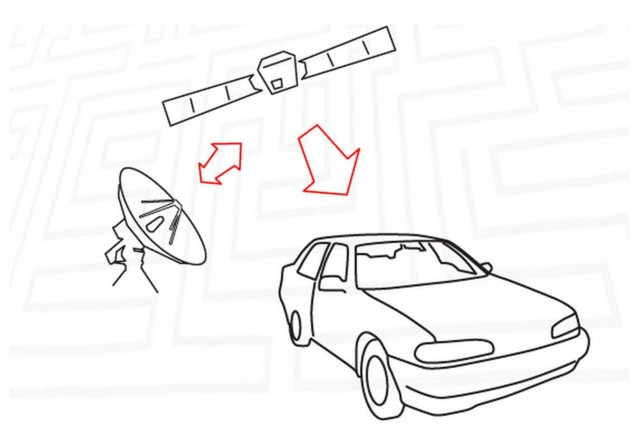
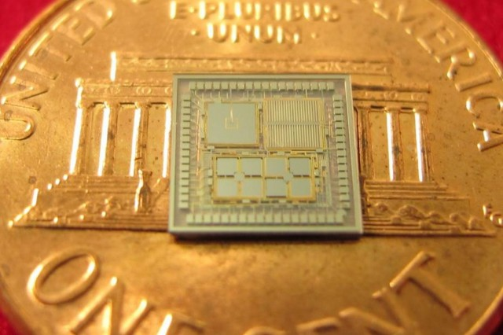
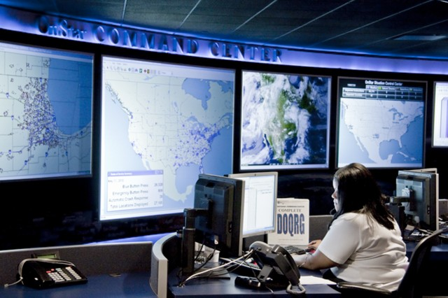
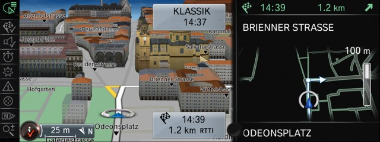

# 带你了解 GPS 的工作原理

迷失在开车是艺术接近了。 GPS汽车导航系统,在仪表板上的便携式导航设备,或在你的智能手机,很容易拉起地图,看你在哪里,或者要去哪里。 最难的部分可能是说话或键控数据中如果你的车有一个笨拙的接口,或如果它不让你输入一个地址在汽车移动,即使你开车经过一个粗略的社区在机场外的一个出租。

Here’s a backgrounder on what GPS is, what it can do for you today in cars, and what’s possible in the near future. GPS will make you safer, route you around traffic delays, help you find nearby services, and help merchants reach out to sell you services you may or may not want.

本文将向您介绍什么是GPS，和汽车集成起来可以做些什么，以及在不远的将来可能会是什么状况。GPS会让你更安全、避开拥堵路段、找到附近的服务，并让服务商联系到你(其中有你喜欢的，也有你讨厌的)。

全球定位系统是如何工作的(简直超乎你的想象)

自1994年以来,24个GPS卫星在绕地球轨道环行13000英里在六组,或飞机。 他们没有固定的开销(同步),但以8000英里每小时的速度由西向东移动,地球轨道(经过同一地点),一天两次。 是一个原子钟。 每颗卫星不断报告:

伪随机码 ,每个卫星的ID。
星历数据, 当前的日期和时间,和卫星是否健康还是不健康(“不健康”可能意味着卫星正在重新定位或再鉴定;不总是一个落魄的人)。
年鉴数据, 在卫星的数据应该在任何时候(每一个GPS卫星也年鉴数据)。
在你的GPS接收机捕获到达时间(到达时间)和飞行时间(TOF)从卫星到接收机。 由于光速(已知),和发送信号时,GPS接收器然后计算地球上你的车,PND,徒步旅行者的GPS或智能手机。 随着你的设备在公路,它计算速度,通常几英里每小时低于汽车的里程表显示(信任GPS速度),和罗盘航向。 它地方,数据在导航系统的移动地图。 卫星信号穿过电离层延迟,地球的上层大气从40 - 600英里高度;GPS系统应用一个校正系数。

需要三个全球定位系统(GPS)信号来确定(由三角形组成的)接收机的位置和第四个也计算高度。 如果接收器捡更多的卫星(12可以看到,另一个打在地球的另一边),位置固定的质量提高。 原子钟的雪堆中,或其他不发挥作用,校正因子传播。

系统中的第一颗GPS卫星在1978年。 目前GPS卫星是好约10年的操作。 体重约2000磅(地上)和17英尺直径包括权力卫星的太阳能电池板。 发射机产生不超过50瓦特输出。 替代品不断建造和发射。 其他国家也有GPS卫星。

更新的GPS系统( 地球上的接收器 )将更准确、更小、更便宜,甚至在室内工作。 DARPA显示芯片小于一分钱,包括三个陀螺仪,三个加速度计,一个内部时钟(上图右)。 其他的研究是提高卫星时钟的时间和精度。 我们的目标是让multi-thousand-dollar GPS系统的准确性为你的汽车信息娱乐系统的主管单位。

如何准确我的GPS接收器吗?

GPS的生命始于一个军事第一卫星系统为了提高飞机的准确性,潜艇,和他们的武器。 直到2000年,平民的可用信号是退化提供更少的准确性。 未加密的时间信号发送到随机抵消非军事用户提供没有比100米精度。 这叫做 选择可用性。 这意味着一辆车的位置可能是由一个或两个街区,和“下一个右转”可能会一块太早或太迟了。

的发展 差分全球定位系统 技术使用陆基参考站纠正股价信号的准确性约15米(2 - 3车长度),在最好的情况下只要10厘米或4英寸,足够好为测量员准确定位的股份。 与此同时,美国联邦航空局,海岸警卫队和交通部要求SA被中断。 2000年克林顿总统命令可选择删除。 这是一去不复返了。 政府的 GPS网站 说,“美国从来没有意图使用可选择了。”

今天,一辆车的GPS接收器精确到10 - 15米。 这是与卫星接收机模块成本只有几美元。 独立的GPS接收器要求精度在3米(10英尺)和高成本单位是几厘米。 25000美元特林布尔全站仪GPS系统可以精确到不到一英寸。 这是什么意思呢? 变异的高精度GPS系统可以远程控制地球的道路施工设备压扁和剃须创建一个巷道。

如果你有一个旧的汽车导航系统,比15米,似乎更准确的导航系统扮演了一个小窍门。 如果你在高速公路上往北,没有其他的路附近,位置图标拍摄到巷道,如果这是一个分裂的公路,拍摄到的。 导航也可以调整本身如果你把一个扭转或一条曲线。 GPS导航还使用一个内部的指南针,运动传感器,速度计精确估计你在哪里在隧道。 (在一个隧道,跨越两个国家,你会看到当前位置图标跨越国家边界内车长度或两个完美的准确性。)

为你的车除了什么GPS移动地图

显然,汽车GPS提供了闪烁的点在地图上显示你的车在哪里。 还有更精彩的。 下面是一些例子:

自动通知。 在一次事故中,如果你的车配备 远程信息处理 如通用汽车安吉星,它会自动远程信息处理呼叫中心报告你的位置,然后调用最近的PSAP(公共安全回答点),或911号。 从福特和同步,电话也可以是一个蓝牙连接手机。 通常也称开车经过911年,但这可能是五分钟后轻轻公路旅行,如果你走过往车辆的路堤,消失在人们的视线中,这可能是永远,如果警察不知道去哪里看。 增强ACN增加了额外的非gps信息,如位置和严重程度的崩溃,如果乘客系上腰带,如果汽车滚过去。 宝马(BMW)和通用汽车正在算法,将预测的一个主人是严重受伤;他们认为算法是准确到足以让他们告诉安全官员派遣医疗后送直升机(5000 - 15000美元)。 所有这一切不能没有GPS信号。

预测前照灯。 首先有前照灯,然后好前照灯(氙、领导、激光),然后可操纵的前大灯,旨在正确的方向盘右转时,现在前车头灯,开始转向正确的(如上图)。 他们使用GPS信号开始把车头灯时你开始调查鹿的角,车辆、行人或禁用一两秒钟前车轮。 福特是驾驶 GPS-aimed前照灯 。
时间范围混合动力车,电动汽车。 汽车要保留一些电池储备,会额外增加力量,左右蓄电池不会运行。 说你的丰田普锐斯是好60英里每小时一英里的驾驶在高速公路上带有轻微的艰苦的斜坡。 如果地图数据加上当前GPS定位汽车当前的充电能力知道2.5英里下坡上坡后,它可以告诉接下来艰苦的旅行英里的汽车电池知道下坡运行将电池充电。
服务。 当你寻找最近的麦当劳汉堡王不是(也许你的孩子认为BK奖品是更好的),这需要GPS。 的一些问题仍在制定当中。 许多第三方应用程序,以及在汽车导航系统中,数据库还不提前考虑,您可能希望服务你,不支持,而不是20英里了。
智能手机应用程序。 如果你的车有嵌入式远程信息处理,它有一个智能手机应用的特性,比如远程启动和远程门解锁。 还有一个gps定位器的应用,引导你到你的车当你忘记它的位置在体育场或商场。
智能车库门。 许多汽车链家车库门开器近期公布。 而不是杂乱汽车挡风玻璃镜子有更多按钮,或虚拟按钮液晶,特斯拉的面具视图。 当GPS感觉车子离家大约半英里,右下角的按钮弹出堆栈中心显示。
调整你的速度计。 联邦法规要求速度计不要低估你的速度无论批准轮胎尺寸的车。 你不想得到一个78 - - - 65年带票当你以为你只有做75;相反,你可能驾驶72或73英里每小时。 集成GPS可以校准你的速度计绝对正确的速度,这一套轮胎在这个通货膨胀。 它可以。 它不。 如果你有一个便携式导航设备,通常显示你的速度。
最佳车道的建议。 今天,好的导航系统有出口走廊视图显示过车道,退出车道,车道,可以是一个。 更加准确的GPS可以感觉到当你需要退出车道。

GPS和无人驾驶汽车

自动驾驶汽车依靠光学传感器(雷达)和3 d地图精确地理解他们和危险的地方。 GPS可以发挥更大的作用的时候精确到英寸,不是米或5米。 这是未来。 至少12英尺的小路上,汽车需要中心本身,而不是动摇一脚从多中心。 汽车后视镜是6 - 7英尺宽。 添加一个容许漂移的脚的中心和你留下一个安全系数1.5 - -2.0英尺。 今天可以处理最好的光学系统,追踪汽车的位置相对于车道标志。

与超精度GPS,它可以作为一个独立的审计师的汽车传感器——例如,如果它认为LDW不再是完美的表演。 在雨天或温和的天气,光学系统降解,或车道标记部分被遮挡,可以帮助汽车维护lane-centering有点长。 最终它将关闭。

雪犁仍能外出至少在糟糕的天气和进取以温和的速度与GPS指导方向盘、或警告司机犁是偏离航向,漂流。 什么是不可能的在60英里每小时在未来五年30英里每小时的速度或许也是可行的。

购买建议

第一个嵌入式汽车导航系统在1990年代中期,宝马7系耗资约2500美元(4000年的2015美元)。 现在一些导航系统成本超过1000美元,很多人500美元或更少,而且他们经常标准在50000元以上的车,因为有一个彩色液晶中心栈已经几乎是强制性的。 嵌入式导航的主要优势是大屏幕(7到10英寸对角线),二级导航显示在仪表板或抬头显示器,和(通常)更大的控制旋钮和按钮比PND或智能手机。 屋顶鲨鱼鳍天线可能会更快地启动时位置修正。 汽车导航系统几乎从未被盗,也没有难看的电线。

智能手机通常有更好的语音识别(“Siri,给我方向英里高球场”),应用程序更便宜或免费的,更新是免费的。 汽车导航更新可能是100 - 200美元。

苹果CarPlay和谷歌的Android汽车 两者的结合优越的方面:嵌入式映射应用你已经知道,像(苹果地图iOS、Android设备上的谷歌地图),汽车液晶显示器上显示,使用汽车的一些按钮和旋钮。

如果你购买车载GPS导航,它知道它有一个半衰期,这意味着它可能会比今天的便携设备,但随着时间的推移,它可能会超越便携式单位。 到目前为止,汽车制造商没有提供主管单位或GPS模块更新。 如果你想要最新的全球定位系统在任何时候都在你的车,租赁,不买。

原文链接: [ExtremeTech explains: How does GPS work?](http://www.extremetech.com/extreme/210893-extremetech-explains-how-does-gps-work)

原文日期: 2015-07-28

翻译日期: 2015-07-29

翻译人员: [书三生](http://t.qq.com/renfufei)