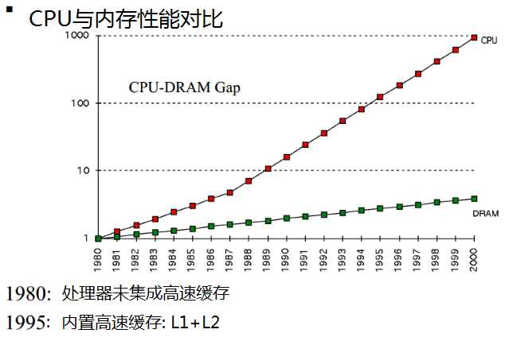
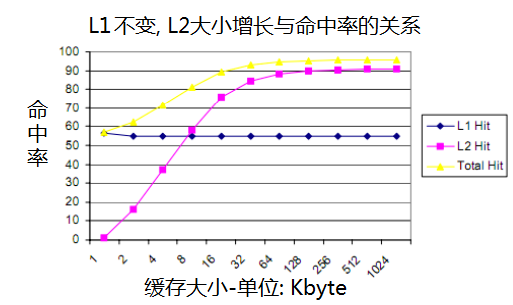

# How L1 and L2 CPU Caches Work, and Why They’re an Essential Part of Modern Chips

# CPU缓存-L1和L2的工作原理

> 说明: L1, 即 Level 1 Cache, 1级缓存; L2, 即2级缓存。

> 漂亮的 Pentium M 处理器晶粒(Pentium_M-die), 可以看到其中排列着大量的缓存颗粒。

The development of caches and caching is one of the most significant events in the history of computing. Virtually every modern CPU core from ultra-low power chips like the ARM Cortex-A5 to the highest-end Intel Core i7 use caches. Even higher-end microcontrollers often have small caches or offer them as options — the performance benefits are too large to ignore, even in ultra low-power designs.

缓存的出现和发展是计算机历史上最重要的事件之一. 

几乎所有的现代CPU核心, 从超低功耗的 ARM Cortex-A5 架构, 到 Intel Core i7 这种顶级处理器, 都使用了缓存。 即使是更高端的微控制器中, 通常也会集成少量的缓存, 或是提供可选项 —— 因为缓存对CPU的性能提升实在是太明显了, 即便是超低功耗的芯片, 在设计时也会加入必要的缓存。

Caching was invented to solve a significant problem. In the early decades of computing, main memory was extremely slow and incredibly expensive — but CPUs weren’t particularly fast, either. Starting in the 1980s, the gap began to widen quickly. Microprocessor clock speeds took off, but memory access times improved far less dramatically. As this gap grew, it became increasingly clear that a new type of fast memory was needed to bridge the gap.

发明缓存主要是为了解决一件非常重要的事情。 

在计算机出现后的最初几十年, 内存的速度非常慢, 价格也非常昂贵, 当然, cpu也同样很慢. 但从1980年代开始, 两者之间的频率差距就迅速扩大了。

处理器的时钟频率迅猛发展, 内存的发展速度却跟不上了. 随着这种差距越来越大, 业界急需一种新型的存储模块来填平这道鸿沟。

> While it only runs up to 2000, the growing discrepancies of the 1980s led to the development of the first CPU caches

> 到2000年左右, 第一代CPU缓存开始出现

## How caching works

## CPU缓存的原理

CPU caches are small pools of memory that store information the CPU is most likely to need next. Which information is loaded into cache depends on sophisticated algorithms and certain assumptions about programming code. The goal of the cache system is to ensure that the CPU has the next bit of data it will need already loaded into cache by the time it goes looking for it (also called a cache hit).

CPU缓存是一块很小的内存池, 其中存放着CPU接下来最有可能访问的信息. 

要将信息加载到缓存中, 需要依赖极端精巧的算法, 以及对程序代码的某种预判. 缓存系统的目标, 是提前将相关的数据或指令加载到缓存中, 确保CPU在需要时直接从缓存中获取(也称为缓存命中)。

A cache miss, on the other hand, means the CPU has to go scampering off to find the data elsewhere. This is where the L2 cache comes into play — while it’s slower, it’s also much larger. Some processors use an inclusive cache design (meaning data stored in the L1 cache is also duplicated in the L2 cache) while others are exclusive (meaning the two caches never share data). If data can’t be found in the L2 cache, the CPU continues down the chain to L3 (typically still on-die), then L4 (if it exists) and main memory (DRAM).

假若未命中缓存, 那么, 就意味着CPU需要到其他地方去寻找数据。

现在, L2高速缓存上场了, 虽然速度比L1要慢, 但容量要大很多倍.

某些处理器使用了包容性缓存设计, 即L1中的数据, 在L2高速缓存中也存在备份。 而另一些处理器则是单份存储, 即两个缓存间不共享数据.

如果在L2缓存中不能找到需要的数据, 则CPU继续往下找, 比如 L3, L4, 以及主内存(DRAM)。

This chart shows the relationship between an L1 cache with a constant hit rate, but a larger L2 cache. Note that the total hit rate goes up sharply as the size of the L2 increases. A larger, slower, cheaper L2 can provide all the benefits of a large L1 — but without the die size and power consumption penalty. Most modern L1 cache rates have hit rates far above the theoretical 50 percent shown here — Intel and AMD both typically field cache hit rates of 95 percent or higher.

该图展示的是: 保持L1高速缓存命中率不变; 增加L2缓存的大小。 可以看到, 醉着 L2 的容量增大, 总命中率会迅速上升。

增加低成本的L2容量, 对性能的提升, 与增加L1容量是等效的 ——  而且不增加太多的芯片尺寸和功耗。 虽然L2速度比L1慢一点, 但容量与成本优势明显, 相对来说性价比很高.

现代CPU中, L1缓存的命中率远高于上图中的`50%`这个数值 —— Intel和AMD的产品的缓存命中率, 一般能达到95%以上。

The next important topic is the set-associativity. Every CPU contains a specific type of RAM called tag RAM. The tag RAM is a record of all the memory locations that can map to any given block of cache. If a cache is fully associative, it means that any block of RAM data can be stored in any block of cache. The advantage of such a system is that the hit rate is high, but the search time is extremely long — the CPU has to look through its entire cache to find out if the data is present before searching main memory.

下一个重要的主题是set-associativity。每个CPU都包含一个特定类型的RAM叫标签内存.The tag RAM is a记录所有的内存,map to任何计划可以给予block of cache。如果缓存is fully associative,it means that任何block of RAM存储地可以在data in any of缓存块.这种系统的优点是,命中率高,但搜索时间非常长,CPU必须浏览整个缓存之前找出如果数据存在搜索主内存。

At the opposite end of the spectrum we have direct-mapped caches. A direct-mapped cache is a cache where each cache block can contain one and only one block of main memory. This type of cache can be searched extremely quickly, but since it maps 1:1 to memory locations, it has a low hit rate. In between these two extremes are *n-*way associative caches. A 2-way associative cache (Piledriver’s L1 is 2-way) means that each main memory block can map to one of two cache blocks. An eight-way associative cache means that each block of main memory could be in one of eight cache blocks.

在光谱的另一端,我们有direct-mapped缓存。direct-mapped缓存是一个缓存,每个缓存块可以包含一个且只有一个内存块.这种类型的缓存可以搜索非常迅速,但由于它1:1映射到内存位置,它有一个低的命中率。在这两个极端之间* n - *联想缓存.双向关联的缓存(大力士的L1出入境)意味着每个内存块可以映射到两个缓存块之一.一个八路联想缓存意味着每个块内存缓存可以在八块。

The next two slides show how hit rate improves with set associativity. Keep in mind that things like hit rate are highly particular — different applications will have different hit rates.

接下来的两个幻灯片展示命中率提高与结合性。记住,比如命中率非常特别的,不同的应用程序将有不同的命中率。

##Why CPU caches keep getting larger

##为什么CPU的缓存越来越大

So why add continually larger caches in the first place? Because each additional memory pool pushes back the need to access main memory and can improve performance in specific cases.

为什么不断地添加更大的缓存?因为每个额外的内存池将需要访问主存了在特定的情况下,可以提高性能。

This chart from [Anandtech’s](http://www.anandtech.com/show/6993/intel-iris-pro-5200-graphics-review-core-i74950hq-tested/3) Haswell review is useful because it actually illustrates the performance impact of adding a huge (128MB) L4 cache as well as the conventional L1/L2/L3 structures. Each stair step represents a new level of cache. The red line is the chip with an L4 — note that for large file sizes, it’s still almost twice as fast as the other two Intel chips.

这个图表(Anandtech)(http://www.anandtech.com/show/6993/intel虹膜- pro - 5200图形回顾核心- i74950hq tested/3)Haswell审查实际上是有用的,因为它说明了添加一个巨大的性能影响(128 mb)L4缓存以及 传统L1 / L2和L3结构。每个楼梯踏步代表一个新级别的缓存.红线是芯片L4 -请注意,对于大文件大小,它仍然是几乎两倍的其他两个英特尔芯片。

It might seem logical, then, to devote huge amounts of on-die resources to cache — but it turns out there’s a diminishing marginal return to doing so. Larger caches are both slower and more expensive. At six transistors per bit of SRAM (6T), cache is also expensive (in terms of die size, and therefore dollar cost). Past a certain point, it makes more sense to spend the chip’s power budget and transistor count on more execution units, better branch prediction, or additional cores. At the top of the story you can see an image of the Pentium M (Centrino/Dothan) chip; the entire left side of the die is dedicated to a massive L2 cache.

似乎逻辑,投入大量的on-die资源缓存,但它有一个边际报酬递减,这样做。更大的缓存既慢又更加昂贵.六点的晶体管每SRAM(6 t),缓存也昂贵(死的大小,因此美元成本).过去的某一点,更有意义花芯片的功率预算和晶体管指望更多的执行单元,更好的分支预测,或额外的内核.故事的顶部你可以看到图像的奔腾M(迅驰/多坍)芯片;整个左死致力于大规模的L2缓存。

## How cache design impacts performance

## 缓存设计如何影响性能

The performance impact of adding a CPU cache is directly related to its efficiency or hit rate; repeated cache misses can have a catastrophic impact on CPU performance. The following example is vastly simplified but should serve to illustrate the point.

添加一个CPU缓存的性能影响是它的效率直接相关或命中率;重复缓存错过对CPU性能会有灾难性的影响.下面的例子是大大简化但要说明这一点。

Imagine that a CPU has to load data from the L1 cache 100 times in a row. The L1 cache has a 1ns access latency and a 100% hit rate. It therefore takes our CPU 100 nanoseconds to perform this operation.

想象一个CPU从L1缓存数据加载100次。L1缓存有1 ns访问延迟和100%的命中率.因此让我们CPU 100纳秒来执行该操作。

> Haswell-E die shot (click to zoom in). The repetitive structures in the middle of the chip are 20MB of shared L3 cache.

> Haswell-E死枪(点击放大)。中间的重复结构的芯片20 mb的L3缓存共享。

Now, assume the cache has a 99 percent hit rate, but the data the CPU actually needs for its 100th access is sitting in L2, with a 10-cycle (10ns) access latency. That means it takes the CPU 99 nanoseconds to perform the first 99 reads and 10 nanoseconds to perform the 100th. A 1 percent reduction in hit rate has just slowed the CPU down by 10 percent.

现在,假设缓存的命中率是99%,但数据的CPU实际上需要坐在L2 100访问,与10-cycle(10 ns)访问延迟.作战需要,大学出版中心the first nanoseconds 99之下reads 99 nanoseconds和10 100th之下。percent减少了1 slowed the rate has just沿线的社区唐氏percent 10。

In the real world, an L1 cache typically has a hit rate between 95 and 97 percent, but the *performance* impact of those two values in our simple example isn’t 2 percent — it’s 14 percent. Keep in mind, we’re assuming the missed data is always sitting in the L2 cache. If the data has been evicted from the cache and is sitting in main memory, with an access latency of 80-120ns, the performance difference between a 95 and 97 percent hit rate could nearly double the total time needed to execute the code.

在现实世界中,通常一个L1缓存命中率在97%到95之间,但* *性能影响这两个值的简单的例子不是2%,而是14%.记住,我们假设错过的总是坐在L2高速缓存的数据.If the data has had been evicted from the cache and is sitting in the main memory, with an access latency of ns, 80-120,The performance difference between 95 and 97 percent hit rate could nearly double the total time men to execute the code.

Back when AMD’s Bulldozer family was compared with Intel’s processors, the topic of cache design and performance impact came up a great deal. It’s not clear [how much of Bulldozer’s lackluster performance](http://www.extremetech.com/computing/100583-analyzing-bulldozers-scaling-single-thread-performance) could be blamed on its relatively slow cache subsystem — in addition to having relatively high latencies, the Bulldozer family also suffered from a high amount of cache *contention.* Each Bulldozer/Piledriver/Steamroller module shared its L1 instruction cache, as shown below:

当AMD推土机家族与英特尔的处理器、缓存设计的主题和性能影响很大.不清楚(推土机的低迷表现的多少)(http://www.extremetech).com/computing/100583-analyzing-bulldozers-scaling-single-thread-performance)可以归咎于其相对缓慢的缓存子系统——除了有相对较高的延迟,推土机的家庭也遭受了大量的缓存*争用。*每个推土机/大力士/压倒对方的L1指令缓存模块共享,如下所示:

A cache is contended when two different threads are writing and overwriting data in the same memory space. It hurts performance of both threads — each core is forced to spend time writing its own preferred data into the L1, only for the other core promptly overwrite that information. AMD’S OLDER Steamroller still gets whacked by this problem, even though AMD increased the L1 code cache to 96KB and made it [three-way associative](http://www.extremetech.com/computing/177099-secrets-of-steamroller-digging-deep-into-amds-next-gen-core)instead of two. Later Ryzen CPUs do not share cache in this fashion and do not suffer from this problem.

缓存是声称在两个不同的线程编写和覆盖数据在同一个内存空间.它伤害了两个线程的性能——每个核心被迫花时间编写自己的首选数据到L1,只为其他核心迅速覆盖信息.AMD的老压倒对方仍然受到这个问题,尽管AMD L1代码缓存增加到96 kb,三方关联(http://www.extremetech.com/computing/177099-secrets-of-steamroller-digging-deep-into-amds-next-gen-core)而不是两个。后来Ryzen cpu不共享缓存以这种方式,没有遭受这个问题。

This graph shows how the hit rate of the Opteron 6276 (an original Bulldozer processor) [dropped off](http://www.anandtech.com/show/5057/the-bulldozer-aftermath-delving-even-deeper) when both cores were active, in at least some tests. Clearly, however, cache contention isn’t the only problem — the 6276 historically struggled to outperform the 6174 even when both processors had equal hit rates.

这个图表显示了命中率的Opteron 6276(一种原始推土机处理器)(下降)(http://www.anandtech.com/show/5057/the-bulldozer-aftermath-delving-even-deeper)当核心都是活跃的,至少在某些测试.很明显,然而,缓存争论并不是唯一的问题——6276年历史上难以超越6174年即使处理器都平等的命中率。

## Caching out

## 缓存了

Cache structure and design are still being fine-tuned as researchers look for ways to squeeze higher performance out of smaller caches. So far, manufacturers like Intel and AMD haven’t dramatically pushed for larger caches or taken designs all the way out to an L4 yet. There are some Intel CPUs with onboard EDRAM that have what amounts to an L4 cache, but this approach is unusual (that’s why we used the Haswell example above, even though that CPU is older at this point. Presumably, the benefits of an L4 cache do not yet outweigh the costs.

缓存结构和设计仍被调整为研究人员寻找方法挤出更高的性能较小的缓存.到目前为止,制造商像Intel和AMD还没有显著推动更大的缓存或采取设计一直L4.有一些英特尔cpu和主板EDRAM相当于一个L4缓存,但这种方法是不寻常的(这就是为什么我们使用上面的Haswell示例,尽管,CPU是老在这一点上。据推测,一个L4缓存的好处还不超过成本。

Regardless, cache design, power consumption, and performance will be critical to the performance of future processors, and substantive improvements to current designs could boost the status of whichever company can implement them.

无论如何,缓存设计,功耗和性能将会对未来处理器的性能至关重要,和实质性改进当前的设计可以提升哪个公司可以实现他们的状态。

Check out our [ExtremeTech Explains](http://www.extremetech.com/tag/extremetech-explains) series for more in-depth coverage of today’s hottest tech topics.

看看我们(ExtremeTech解释)(http://www.extremetech.com/tag/extremetech-explains)系列更深入的报道今天最热门的技术主题。

<https://www.extremetech.com/extreme/188776-how-l1-and-l2-cpu-caches-work-and-why-theyre-an-essential-part-of-modern-chips>

