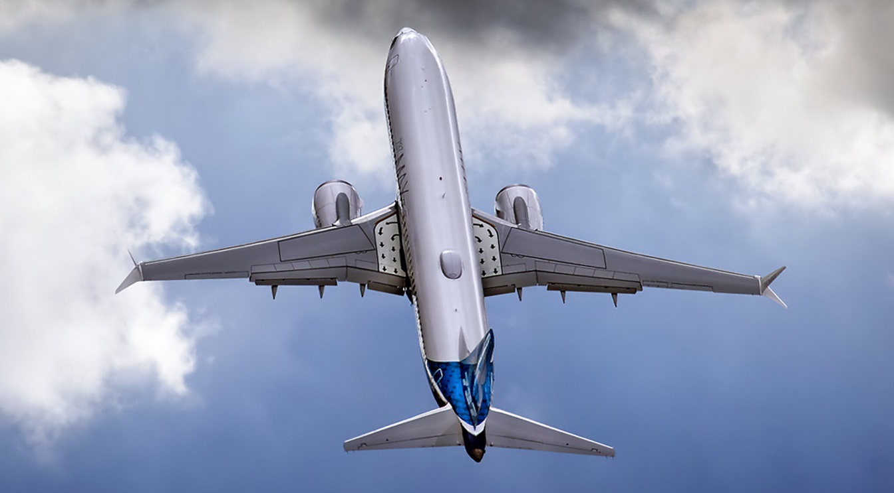
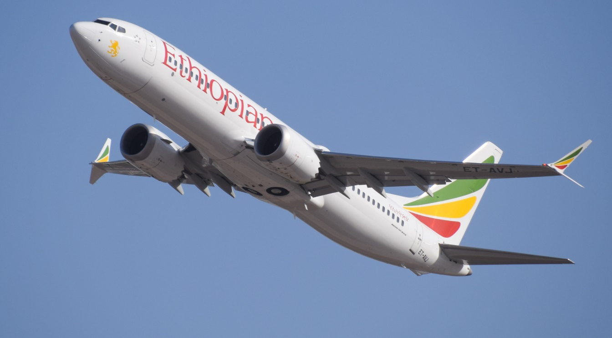

# Downed 737 Max 8s Lacked Safety Features Boeing Only Sells as Extras

# 波音737 Max 8s坠毁幕后

One of the major questions raised concerning Boeing’s 737 Max 8 is whether the MCAS (Maneuvering Characteristics Augmentation System) hardware installed on the plane to help prevent aircraft stalls could have malfunctioned and contributed to the loss of both Lion Air 610 last year and Ethiopian Airlines Flight 302 more recently. While that investigation is ongoing, new information indicates that Boeing sells upgrades to critical flight systems that might have improved their overall safety — but it sells them as value-added profit centers in much the same way you might add a stereo option to a car.

致使波音737 Max 8接连坠毁的元凶, 是飞机上安装的MCAS系统（MCAS, Maneuvering Characteristics Augmentation System, 机动特性增强系统）发生故障,  并导致了去年的狮航610（Lion Air 610）事故、以及最近的埃塞俄比亚航空公司航班（Ethiopian Airlines Flight 302）的损失 最近302。 虽然调查正在进行中，但新的信息表明，波音公司向关键飞行系统出售可能提高其整体安全性的升级 - 但它将它们作为增值利润中心出售，就像你可以为汽车添加立体声选项一样。

虽然这个系统的目的是为了防止飞机失速,其设计存在缺陷, 

> ET-AVJ, the aircraft destroyed in the crash of Flight 302.
>
> ET-AVJ，这架飞机在302航班坠毁时被摧毁。

Boeing sells two MCAS upgrades that weren’t installed on either the Lion Air jet or the Ethiopian Airlines craft, according to the New York Times. The first is the ability to compare data from more than one AOA sensor via a display that would have shown readings from both at the same time. The second was a ‘disagree light’ that would have activated when contradictory data was being received from both sensors. Either might have alerted the pilots that something was wrong with the MCAS system specifically.

据“纽约时报”报道，波音公司出售了两架没有安装在Lion Air喷气式飞机或埃塞俄比亚航空公司飞机上的MCAS升级版。 第一种是通过显示器比较来自多个AOA传感器的数据的能力，该显示器将同时显示来自两者的读数。 第二个是“不同意的光”，当从两个传感器接收到矛盾的数据时，它会激活。 两者都可能已经提醒飞行员特别是MCAS系统出了问题。

Boeing now states it will make the disagree light standard on all 737 Max 8 aircraft, in addition to the planned software updates it will roll out next month. This new information answers questions some of our readers had raised regarding the capabilities of the MCAS with regard to AOA sensors. When initially rolled out, the MCAS only relied on data from a single AOA sensor. There are multiple AOA sensors in a 737 Max 8, including sensors on both sides of the aircraft. After the upcoming April software update, the MCAS will be updated to check both sensors and to disable itself if there is “meaningful disagreement” between the two.

波音公司现在表示，除了计划在下个月推出的软件更新之外，它将在所有737 Max 8飞机上做出不同意的轻型标准。 这些新信息回答了我们的一些读者提出的有关MCAS在AOA传感器方面的能力的问题。 最初推出时，MCAS仅依赖来自单个AOA传感器的数据。 737 Max 8中有多个AOA传感器，包括飞机两侧的传感器。 在即将到来的4月软件更新之后，MCAS将更新以检查两个传感器并在两者之间存在“有意义的分歧”时自行禁用。

The fact that safety equipment that could have prevented the 737 Max 8 crash was left optional and uninstalled will undoubtedly figure prominently in the investigation into how Boeing could have allowed this to happen in the first place. Some FAA employees have stated they faced intra-agency pressure to provide a friendly regulatory environment for Boeing and to speed approval of the 737 Max 8, including allowing Boeing to self-certify its own safety systems. Some of these changes were put in place in the aftermath of 9/11, but the pressure to get the 737 Max 8 to market in order to compete with the Airbus 320neo was reportedly quite high.

事实上，可以防止737 Max 8坠毁的安全设备是可选的，卸载无疑将成为调查波音如何能够首先实现这一目标的重要因素。 一些美国联邦航空局的员工表示，他们面临着机构间的压力，需要为波音公司提供友好的监管环境，并加快批准737 Max 8，包括允许波音公司自行认证自己的安全系统。 其中一些变化是在9/11之后实施的，但据报道，为了与空中客车320neo竞争，将737 Max 8推向市场的压力相当高。

The NYT details how money-making add-ons are a major profit center for airlines. Boeing is known to charge extra for an additional fire extinguisher system in the hold. Japanese regulators require such systems; the FAA does not, despite evidence that a single extinguisher may not be enough to put out fires. Boeing refused to provide a menu of the safety options it sells on aircraft or their prices, but the paper states that such options typically add $800,000 to $2M to the price of an aircraft, representing roughly 5 percent of the total cost of the plane.

纽约时报详细介绍了赚钱附加费如何成为航空公司的主要利润中心。 众所周知，波音公司会额外收取额外的灭火器系统。 日本监管机构要求这样的系统; 尽管有证据表明单个灭火器可能不足以扑灭火灾，但美国联邦航空局没有这样做。 波音公司拒绝提供它在飞机上出售的安全选项或价格，但该报告称这些选择通常会使飞机价格增加80万至200万美元，约占飞机总成本的5％。

It isn’t unusual to see vehicle manufacturers add safety features as extras, either, but the fact that Boeing has lost two brand-new aircraft — and the radically different safety standards used in the airline industry as opposed to the automotive market — are going to shine a harsh light on the company’s practices in this area.

看到汽车制造商增加安全功能也是不寻常的，但波音公司已经失去了两架全新的飞机 - 而且航空业使用的安全标准与汽车市场相比完全不同 - 正在进行中 对该公司在该领域的实践发表强烈反应。

Feature image by Wikipedia: <https://zh.wikipedia.org/wiki/%E6%B3%A2%E9%9F%B3737_MAX>

相关链接:

- <https://www.extremetech.com/extreme/287856-ethiopian-airlines-black-box-data-retrieved-shows-similarities-to-lion-air-crash>
- <https://www.extremetech.com/extreme/287672-trump-grounds-all-737-max-flights-after-ethiopian-airlines-disaster>
- <https://www.extremetech.com/extreme/280521-boeing-737-crash-caused-by-new-safety-system-pilots-werent-told-existed>

原文链接: <https://www.extremetech.com/extreme/288099-downed-787-max-8s-lacked-safety-features-boeing-only-sells-as-extras?utm_source=edit&utm_medium=notification>

原文日期: March 21, 2019 at 12:49 pm

