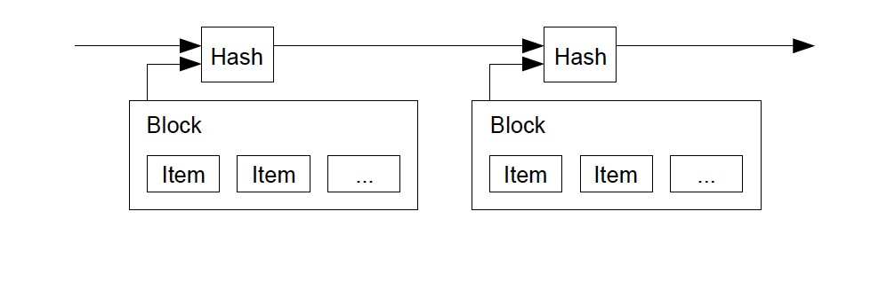

# Bitcoin: A Peer-to-Peer Electronic Cash System

# 比特币: 点对点电子现金系统

> 比特币白皮书(英文版): [bitcoin.pdf](https://bitcoin.org/bitcoin.pdf)

> 作者:
- Satoshi Nakamoto
- satoshin@gmx.com
- www.bitcoin.org

> ## Abstract.

> ## 摘要.

> A purely peer-to-peer version of electronic cash would allow online payments to be sent directly from one party to another without going through a financial institution.
> Digital signatures provide part of the solution, but the main benefits are lost if a trusted third party is still required to prevent double-spending.
> We propose a solution to the double-spending problem using a peer-to-peer network.
> The network timestamps transactions by hashing them into an ongoing chain of hash-based proof-of-work, forming a record that cannot be changed without redoing the proof-of-work.
> The longest chain not only serves as proof of the sequence of events witnessed, but proof that it came from the largest pool of CPU power.
> As long as a majority of CPU power is controlled by nodes that are not cooperating to attack the network, they'll generate the longest chain and outpace attackers.
> The network itself requires minimal structure.
> Messages are broadcast on a best effort basis, and nodes can leave and rejoin the network at will, accepting the longest proof-of-work chain as proof of what happened while they were gone.

> 比特币是一种纯粹的点对点电子现金系统, 可以通过在线支付方式， 直接将资金从一方支付给另一方，而无需通过银行等金融机构。
> 数字签名提供了一部分的解决方案，但如果仍然需要一个可信的第三方来防止双花，那么这个系统最大的优势就会丧失。
> 我们提出了一种通过对等网络来解决双花问题的解决方案。
> 这个网络通过将交易信息散列到正在进行的基于散列的工作量证明链中，对交易进行时间戳标记，从而形成一条记录，除非重做工作量证明，否则无法更改该记录。
> 最长的链不仅可以证明所见证事件的顺序，还可以证明它来自最大的CPU算力。
> 只要大部分CPU算力不被攻击网络的节点控制，它们就会产生最长的链并超过攻击者。
> 网络本身需要的结构很小。
> 消息以尽力而为的方式进行广播，节点可以随意离开并重新加入网络，并接受最长的工作量证明链作为消息消失时发生的证据。


## 1. Introduction

## 1. 简介

Commerce on the Internet has come to rely almost exclusively on financial institutions serving as trusted third parties to process electronic payments. While the system works well enough for most transactions, it still suffers from the inherent weaknesses of the trust based model. Completely non-reversible transactions are not really possible, since financial institutions cannot avoid mediating disputes. The cost of mediation increases transaction costs, limiting the minimum practical transaction size and cutting off the possibility for small casual transactions, and there is a broader cost in the loss of ability to make non-reversible payments for nonreversible services. With the possibility of reversal, the need for trust spreads. Merchants must be wary of their customers, hassling them for more information than they would otherwise need. A certain percentage of fraud is accepted as unavoidable. These costs and payment uncertainties can be avoided in person by using physical currency, but no mechanism exists to make payments over a communications channel without a trusted party.  

互联网商务基本上完全依赖第三方可信金融机构提供的电子支付方式。
虽然对大部分交易场景来说, 这套系统能够良好运行，但基于信任的模型有其固有弱点。
由于金融机构必须得进行调解纠纷，因此想要实现完全不可逆的交易是不可能的。
调解的开销也就增加了交易成本，事实上限制了最小交易规模，并切断了小额临时交易的可能性， 隐形地就损失了不可逆服务和不可逆支付能力的好处。
因为交易可能被撤销/逆转，所以到处都需要解决信任问题。
商家必须警惕他们的客户，向他们索要更多的信息。
一定比例的欺诈行为是不可避免的。
如果使用实体货币倒是可以避免这些成本和付款的不确定性，但在没有受信方的情况下，也就不存在使用电子方式进行付款的机制。

What is needed is an electronic payment system based on cryptographic proof instead of trust, allowing any two willing parties to transact directly with each other without the need for a trusted third party. Transactions that are computationally impractical to reverse would protect sellers from fraud, and routine escrow mechanisms could easily be implemented to protect buyers. In this paper, we propose a solution to the double-spending problem using a peer-to-peer distributed timestamp server to generate computational proof of the chronological order of transactions. The system is secure as long as honest nodes collectively control more CPU power than any cooperating group of attacker nodes.

我们需要一种基于密码证明而不是基于信任的电子支付系统，允许任意两个交易方直接进行交易，而无需第三方可信结构。
在计算上不可逆的交易将保护卖方免受欺诈， 并且可以很容易地通过常规托管机制来保护买方。
在本文中，我们提出了一种解决双花问题的方案，使用对等的分布式时间戳服务器，来生成交易的时间顺序的计算证明。
只要诚实节点共同控制的CPU算力，比协作攻击者的算力高，那么这个系统就是安全的。


## 2. Transactions

## 2. 交易

We define an electronic coin as a chain of digital signatures. Each owner transfers the coin to the next by digitally signing a hash of the previous transaction and the public key of the next owner and adding these to the end of the coin. A payee can verify the signatures to verify the chain of ownership.

我们将电子货币定义为一条数字签名链。 每个币的持有者在转账给下一任时，需要对 “上次交易的哈希值” 和 “下一任所有者的公钥” 进行数字签名，并将它们添加到这个币的末尾。 收款人可以通过检查签名来验证这个链的所有权。


The problem of course is the payee can't verify that one of the owners did not double-spend the coin. A common solution is to introduce a trusted central authority, or mint, that checks every transaction for double spending. After each transaction, the coin must be returned to the mint to issue a new coin, and only coins issued directly from the mint are trusted not to be double-spent. The problem with this solution is that the fate of the entire money system depends on the company running the mint, with every transaction having to go through them, just like a bank.

但这样就存在一个问题： 收款人无法判断币的持有者是否进行了双花（double-spend）。
现有的解决方案一般是引入受信的中央机构或者铸币厂商，这类机构负责检查每一笔交易是否存在双花问题。
每次交易之后，必须将对应的币退给铸币厂, 然后再发行新币，并且大家都只信任直接从铸币厂发行的币不会被双花。
这种解决方案的问题在于，整个货币体系的命运都由经营铸币厂的公司操控， 每笔交易都必须从铸币厂手中过一遍，就像银行一样。

We need a way for the payee to know that the previous owners did not sign any earlier transactions. For our purposes, the earliest transaction is the one that counts, so we don't care about later attempts to double-spend. The only way to confirm the absence of a transaction is to be aware of all transactions. In the mint based model, the mint was aware of all transactions and decided which arrived first. To accomplish this without a trusted party, transactions must be publicly announced [1], and we need a system for participants to agree on a single history of the order in which they were received. The payee needs proof that at the time of each transaction, the majority of nodes agreed it was the first received.

我们需要一种机制，让收款人知道这个币的前任所有者并未在其他的交易中签过名。
就我们的目的而言，最早的交易才算数，所以我们不关心随后进行的双花尝试。
确认有没有这个交易的唯一方法，就是知道所有所有交易信息。
在基于造币厂的模型中，造币厂知道所有交易，并可以确定哪个交易请求先到达。
为了在没有受信方参与的情况下完成这个任务，必须公开宣布所有交易(参见[1])，并且需要一种系统，只要参与就可以接收订单的单一历史并达成一致。
收款人在每次交易时都需要证明，需要超过半数的节点确认这是先收到的交易请求。


## 3. Timestamp Server

The solution we propose begins with a timestamp server. A timestamp server works by taking a hash of a block of items to be timestamped and widely publishing the hash, such as in a newspaper or Usenet post [2-5]. The timestamp proves that the data must have existed at the time, obviously, in order to get into the hash. Each timestamp includes the previous timestamp in its hash, forming a chain, with each additional timestamp reinforcing the ones before it.

## 3. 时间戳服务器

我们推荐的解决方案，是使用时间戳服务器（Timestamp Server）。 时间戳服务器对要打标记的区块计算哈希值并进行广播， 类似于报纸或新闻组帖子（参见[2-5]）。  时间戳证明，为了进入哈希表，数据必须在打标记时必须已经存在。 每个时间戳都在其哈希中包含前一个时间戳，从而形成一个链，每个附加时间戳都会加强之前的时间戳。




## 4. Proof-of-Work

To implement a distributed timestamp server on a peer-to-peer basis, we will need to use a proofof- work system similar to Adam Back's Hashcash [6], rather than newspaper or Usenet posts. The proof-of-work involves scanning for a value that when hashed, such as with SHA-256, the hash begins with a number of zero bits. The average work required is exponential in the number of zero bits required and can be verified by executing a single hash.

For our timestamp network, we implement the proof-of-work by incrementing a nonce in the block until a value is found that gives the block's hash the required zero bits. Once the CPU effort has been expended to make it satisfy the proof-of-work, the block cannot be changed without redoing the work. As later blocks are chained after it, the work to change the block would include redoing all the blocks after it.


The proof-of-work also solves the problem of determining representation in majority decision making. If the majority were based on one-IP-address-one-vote, it could be subverted by anyone able to allocate many IPs. Proof-of-work is essentially one-CPU-one-vote. The majority decision is represented by the longest chain, which has the greatest proof-of-work effort invested in it. If a majority of CPU power is controlled by honest nodes, the honest chain will grow the fastest and outpace any competing chains. To modify a past block, an attacker would have to redo the proof-of-work of the block and all blocks after it and then catch up with and surpass the work of the honest nodes. We will show later that the probability of a slower attacker catching up diminishes exponentially as subsequent blocks are added.

To compensate for increasing hardware speed and varying interest in running nodes over time, the proof-of-work difficulty is determined by a moving average targeting an average number of blocks per hour. If they're generated too fast, the difficulty increases.


## 5. Network

The steps to run the network are as follows:

- 1) New transactions are broadcast to all nodes.
- 2) Each node collects new transactions into a block.
- 3) Each node works on finding a difficult proof-of-work for its block.
- 4) When a node finds a proof-of-work, it broadcasts the block to all nodes.
- 5) Nodes accept the block only if all transactions in it are valid and not already spent.
- 6) Nodes express their acceptance of the block by working on creating the next block in the chain, using the hash of the accepted block as the previous hash.

Nodes always consider the longest chain to be the correct one and will keep working on extending it. If two nodes broadcast different versions of the next block simultaneously, some nodes may receive one or the other first. In that case, they work on the first one they received, but save the other branch in case it becomes longer. The tie will be broken when the next proofof- work is found and one branch becomes longer; the nodes that were working on the other branch will then switch to the longer one.

New transaction broadcasts do not necessarily need to reach all nodes. As long as they reach many nodes, they will get into a block before long. Block broadcasts are also tolerant of dropped messages. If a node does not receive a block, it will request it when it receives the next block and realizes it missed one.


## 6. Incentive

By convention, the first transaction in a block is a special transaction that starts a new coin owned by the creator of the block. This adds an incentive for nodes to support the network, and provides a way to initially distribute coins into circulation, since there is no central authority to issue them. The steady addition of a constant of amount of new coins is analogous to gold miners expending resources to add gold to circulation. In our case, it is CPU time and electricity that is expended.

The incentive can also be funded with transaction fees. If the output value of a transaction is less than its input value, the difference is a transaction fee that is added to the incentive value of the block containing the transaction. Once a predetermined number of coins have entered circulation, the incentive can transition entirely to transaction fees and be completely inflation free.

The incentive may help encourage nodes to stay honest. If a greedy attacker is able to assemble more CPU power than all the honest nodes, he would have to choose between using it to defraud people by stealing back his payments, or using it to generate new coins. He ought to find it more profitable to play by the rules, such rules that favour him with more new coins than everyone else combined, than to undermine the system and the validity of his own wealth.


## 7. Reclaiming Disk Space

Once the latest transaction in a coin is buried under enough blocks, the spent transactions before it can be discarded to save disk space. To facilitate this without breaking the block's hash, transactions are hashed in a Merkle Tree [7][2][5], with only the root included in the block's hash. Old blocks can then be compacted by stubbing off branches of the tree. The interior hashes do not need to be stored.


A block header with no transactions would be about 80 bytes. If we suppose blocks are generated every 10 minutes, 80 bytes * 6 * 24 * 365 = 4.2MB per year. With computer systems typically selling with 2GB of RAM as of 2008, and Moore's Law predicting current growth of 1.2GB per year, storage should not be a problem even if the block headers must be kept in memory.


## 8. Simplified Payment Verification

It is possible to verify payments without running a full network node. A user only needs to keep a copy of the block headers of the longest proof-of-work chain, which he can get by querying network nodes until he's convinced he has the longest chain, and obtain the Merkle branch linking the transaction to the block it's timestamped in. He can't check the transaction for himself, but by linking it to a place in the chain, he can see that a network node has accepted it, and blocks added after it further confirm the network has accepted it.


As such, the verification is reliable as long as honest nodes control the network, but is more vulnerable if the network is overpowered by an attacker. While network nodes can verify transactions for themselves, the simplified method can be fooled by an attacker's fabricated transactions for as long as the attacker can continue to overpower the network. One strategy to protect against this would be to accept alerts from network nodes when they detect an invalid block, prompting the user's software to download the full block and alerted transactions to confirm the inconsistency. Businesses that receive frequent payments will probably still want to run their own nodes for more independent security and quicker verification.


## 9. Combining and Splitting Value

Although it would be possible to handle coins individually, it would be unwieldy to make a separate transaction for every cent in a transfer. To allow value to be split and combined, transactions contain multiple inputs and outputs. Normally there will be either a single input from a larger previous transaction or multiple inputs combining smaller amounts, and at most two outputs: one for the payment, and one returning the change, if any, back to the sender.


It should be noted that fan-out, where a transaction depends on several transactions, and those transactions depend on many more, is not a problem here. There is never the need to extract a complete standalone copy of a transaction's history.


## 10. Privacy

The traditional banking model achieves a level of privacy by limiting access to information to the parties involved and the trusted third party. The necessity to announce all transactions publicly precludes this method, but privacy can still be maintained by breaking the flow of information in another place: by keeping public keys anonymous. The public can see that someone is sending an amount to someone else, but without information linking the transaction to anyone. This is similar to the level of information released by stock exchanges, where the time and size of individual trades, the "tape", is made public, but without telling who the parties were.


As an additional firewall, a new key pair should be used for each transaction to keep them from being linked to a common owner. Some linking is still unavoidable with multi-input transactions, which necessarily reveal that their inputs were owned by the same owner. The risk is that if the owner of a key is revealed, linking could reveal other transactions that belonged to the same owner.


## 11. Calculations

We consider the scenario of an attacker trying to generate an alternate chain faster than the honest chain. Even if this is accomplished, it does not throw the system open to arbitrary changes, such as creating value out of thin air or taking money that never belonged to the attacker. Nodes are not going to accept an invalid transaction as payment, and honest nodes will never accept a block containing them. An attacker can only try to change one of his own transactions to take back money he recently spent.

The race between the honest chain and an attacker chain can be characterized as a Binomial Random Walk. The success event is the honest chain being extended by one block, increasing its lead by +1, and the failure event is the attacker's chain being extended by one block, reducing the gap by -1.

The probability of an attacker catching up from a given deficit is analogous to a Gambler's Ruin problem. Suppose a gambler with unlimited credit starts at a deficit and plays potentially an infinite number of trials to try to reach breakeven. We can calculate the probability he ever reaches breakeven, or that an attacker ever catches up with the honest chain, as follows [8]:


Given our assumption that p > q, the probability drops exponentially as the number of blocks the attacker has to catch up with increases. With the odds against him, if he doesn't make a lucky lunge forward early on, his chances become vanishingly small as he falls further behind.

We now consider how long the recipient of a new transaction needs to wait before being sufficiently certain the sender can't change the transaction. We assume the sender is an attacker who wants to make the recipient believe he paid him for a while, then switch it to pay back to himself after some time has passed. The receiver will be alerted when that happens, but the sender hopes it will be too late.

The receiver generates a new key pair and gives the public key to the sender shortly before signing. This prevents the sender from preparing a chain of blocks ahead of time by working on it continuously until he is lucky enough to get far enough ahead, then executing the transaction at that moment. Once the transaction is sent, the dishonest sender starts working in secret on a parallel chain containing an alternate version of his transaction.

The recipient waits until the transaction has been added to a block and z blocks have been linked after it. He doesn't know the exact amount of progress the attacker has made, but assuming the honest blocks took the average expected time per block, the attacker's potential progress will be a Poisson distribution with expected value:


To get the probability the attacker could still catch up now, we multiply the Poisson density for each amount of progress he could have made by the probability he could catch up from that point:


Rearranging to avoid summing the infinite tail of the distribution...


Converting to C code...

```
#include <math.h>
double AttackerSuccessProbability(double q, int z)
{
  double p = 1.0 - q;
  double lambda = z * (q / p);
  double sum = 1.0;
  int i, k;
  for (k = 0; k <= z; k++)
  {
    double poisson = exp(-lambda);
    for (i = 1; i <= k; i++)
    poisson *= lambda / i;
    sum -= poisson * (1 - pow(q / p, z - k));
  }
  return sum;
}
```

Running some results, we can see the probability drop off exponentially with z.

```
q=0.1
z=0 P=1.0000000
z=1 P=0.2045873
z=2 P=0.0509779
z=3 P=0.0131722
z=4 P=0.0034552
z=5 P=0.0009137
z=6 P=0.0002428
z=7 P=0.0000647
z=8 P=0.0000173
z=9 P=0.0000046
z=10 P=0.0000012
q=0.3
z=0 P=1.0000000
z=5 P=0.1773523
z=10 P=0.0416605
z=15 P=0.0101008
z=20 P=0.0024804
z=25 P=0.0006132
z=30 P=0.0001522
z=35 P=0.0000379
z=40 P=0.0000095
z=45 P=0.0000024
z=50 P=0.0000006
```

Solving for P less than 0.1%...

```
P < 0.001
q=0.10 z=5
q=0.15 z=8
q=0.20 z=11
q=0.25 z=15
q=0.30 z=24
q=0.35 z=41
q=0.40 z=89
q=0.45 z=340
```


## 12. Conclusion

We have proposed a system for electronic transactions without relying on trust. We started with the usual framework of coins made from digital signatures, which provides strong control of ownership, but is incomplete without a way to prevent double-spending. To solve this, we proposed a peer-to-peer network using proof-of-work to record a public history of transactions that quickly becomes computationally impractical for an attacker to change if honest nodes control a majority of CPU power. The network is robust in its unstructured simplicity. Nodes work all at once with little coordination. They do not need to be identified, since messages are not routed to any particular place and only need to be delivered on a best effort basis. Nodes can leave and rejoin the network at will, accepting the proof-of-work chain as proof of what happened while they were gone. They vote with their CPU power, expressing their acceptance of valid blocks by working on extending them and rejecting invalid blocks by refusing to work on them. Any needed rules and incentives can be enforced with this consensus mechanism.


## References

[1] W. Dai, "b-money," http://www.weidai.com/bmoney.txt, 1998.
[2] H. Massias, X.S. Avila, and J.-J. Quisquater, "Design of a secure timestamping service with minimal trust requirements," In 20th Symposium on Information Theory in the Benelux, May 1999.
[3] S. Haber, W.S. Stornetta, "How to time-stamp a digital document," In Journal of Cryptology, vol 3, no 2, pages 99-111, 1991.
[4] D. Bayer, S. Haber, W.S. Stornetta, "Improving the efficiency and reliability of digital time-stamping," In Sequences II: Methods in Communication, Security and Computer Science, pages 329-334, 1993.
[5] S. Haber, W.S. Stornetta, "Secure names for bit-strings," In Proceedings of the 4th ACM Conference on Computer and Communications Security, pages 28-35, April 1997.
[6] A. Back, "Hashcash - a denial of service counter-measure," http://www.hashcash.org/papers/hashcash.pdf, 2002.
[7] R.C. Merkle, "Protocols for public key cryptosystems," In Proc. 1980 Symposium on Security and Privacy, IEEE Computer Society, pages 122-133, April 1980.
[8] W. Feller, "An introduction to probability theory and its applications," 1957.


==
