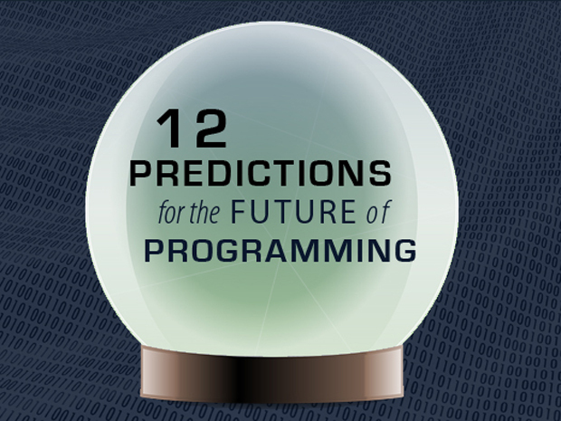
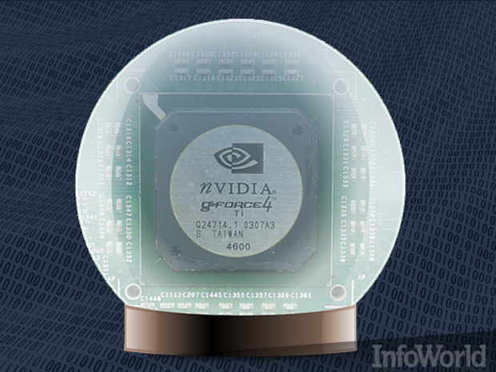

# 编程界12个靠谱的5年预测

## 
## 我们凝望编程水晶球,希望找到确定靠谱的下注目标,帮助程序员做个五年发展规划

技术发展越来越快,构建技术的技术也在持续不断地发展。 如果我们不总结过去的项目经验来提升自己,那么结果只能是挖坑把自己埋了。

为了让您在技术的未来不要看直了眼,我们精心准备了12个看起来非常靠谱的预言,大致预测了未来五年在编程界可能发生的事。 负责本次预测的水晶球主观属性为95%,基于过往的经验和现有的事实,以下的一些猜想可能在未来不会发生,也有可能在五年内不会完全实现, 还有一些已经部分成为事实,但仍需要进一步确认其发展速度是不是和鼓吹的一样快。

你只需快速预览一遍即可,实在是因为变化的速度比我们想象的还要快。  

## GPU将成新一代编程核心

游戏玩家喜欢炫耀自己的显卡,而GPU发展和普及的速度连厂商自己都害怕。 早期的GPU主要用于 图形与图像处理( http://www.infoworld.com/t/application-development/did-these-guys-just-reinvent-the-web-228713 ) , 而现在很多不处理图像的应用已被重写,目的是为了使用GPU的并行架构。 物理学家(Physicists)使用它们来研究问题; 天文学家(astronomers)依靠显卡来模拟星系; 生物学家(biologists)通过GPU来对种群研究进行统计。 这些应用程序只会变得越来越普遍,特别是编译器开始检测代码在GPU上是否可以高效运行之后。 只进行学术研究可能还属于比较有限的运用范围,但如果很多项目都能利用起来这些资源,那它只会越来越流行。

## 数据库将执行日益复杂的分析

Databases will perform increasingly sophisticated analysis

Databases of the future are certain to do more than just store numbers. Many already have sophisticated report engines (aka business intelligence), and these extras will become more powerful, enabling databases to run more sophisticated algorithms on tables, search more efficiently for patterns in data, and do much of the work currently touted by the buzzword "big data."

This power and sophistication will be driven by the cost of moving data around. Leaving the data in the database and letting its engine perform the analysis will be much faster than extracting it to a separate big data package because it will limit the overhead of communication and decrease the amount of programming necessary to extract value from the data store.

数据库的未来肯定会做的不仅仅是存储的数字。 已经有许多复杂的报告引擎(又名商业智能),而这些临时演员将变得更加强大,使数据库表上运行更复杂的算法,更有效地搜索数据中的模式,目前做的工作被流行词“大数据”。

这个能力和复杂程度将由移动数据的成本。 把数据库中的数据,让其引擎执行的分析将远远超过提取到一个单独的大数据计划,因为它会限制通信的开销,减少必要的编程工作量从数据存储中提取价值。

## 无处不在的JavaScript

JavaScript for everything
JavaScript won't be the only language in the programming world, but it will begin to seem that way. JavaScript is inescapable on the browser, which dominates almost everything a client computer does. Now the server side is embracing it with tools like Node.js.

JavaScript will become more dominant in other areas as well. After all, most mobile developers can get the performance they want out of HTML5 applications running in browserlike views. The result may not be as zippy as native code, but JavaScript is good enough and portable to the Web, too.

The browser isn't just colonizing phones; it's eating entire platforms. Chrome OS and Chromebooks are making regular OSes obsolete. Why worry about that layer when JavaScript and the browser can do everything?

JavaScript不会编程世界的唯一语言,但它将开始看起来。 JavaScript是不可避免的在浏览器上,占据几乎所有客户端计算机。 现在,服务器端接受node . js等工具。

JavaScript将其他领域的地位越来越重要。 毕竟,大多数移动开发人员可以得到他们想要的性能的HTML5 browserlike视图中运行的应用程序。 结果可能不是活泼的本机代码,但JavaScript是不够好,移植到网络。

浏览器并不是殖民手机;它是吃整个平台。 常规操作系统Chrome OS和Chrome笔记本。 为什么担心层当JavaScript和浏览器所能做的一切吗?

##Android也无处不在

Android on every device
When the browser doesn't win, Android is close behind. Camera designers, threatened by cellphones with good lenses, put Android on cameras so you can run Instagram on a Nikon. There are Android refrigerators, car stereos, televisions, even headphones. Some complain that the UI is too complicated, but that's missing the point. The UI layer can be simplified. If Android is underneath, the platform will dominate.

Plus, PC manufacturers are feeling left out. Their solution? Run Android on Windows and let people use Android apps on their desktops, too. Some run stock Android emulators, but others are creating brands like "PC Plus." Once Android takes over the PC, it may combine with the browser to push Windows apps into a distant third place on the box.

当浏览器不赢,Android是紧随其后。 相机设计师,受到良好的手机镜头,把Android摄像头所以你可以运行Instagram尼康。 Android有冰箱、汽车音响、电视、甚至耳机。 一些人抱怨UI太复杂,但这是没有抓住问题的要害。 UI层可以简化。 如果Android是下面,平台将占主导地位。

另外,个人电脑制造商正在被排挤在外的感觉。 他们的解决方案吗? 在Windows上运行Android,让人们在他们的桌面上使用Android应用程序,。 一些运行Android模拟器,但其他人则创造品牌” 电脑加 。 “一旦Android接管PC,它可能与浏览器结合,推动Windows应用程序到一个遥远的第三的位置在盒子上。

## 物联网 —— 从概念落地

The Internet of things -- more platforms than ever
One side effect of Android (and Linux) colonizing the world is that more objects will join the Internet of things. Of the many platforms to come, the most important will be the car. Navigation and shopping are just the beginning. When the autonomous cars roll out, there will be even more opportunities for developers to cash in on car location and information.

The key is figuring out which features are essential to each domain. While OSes like Android offer a unifying core, each platform will require customized features. Robotic toys may need content filters to provide age-appropriate content. Thermostats will want to interact with weather forecasts. Building these APIs with the right features will be key.

Android(和副作用之一 Linux )殖民世界更多的对象将加入 物联网 。 的平台, 最重要的是汽车 。 导航和购物只是开始。 当 自动汽车 的推出,将会有更多机会开发人员利用汽车的位置和信息。

关键是找出哪些特性对每个域来说是必不可少的。 等操作系统Android提供了一个统一的核心,每个平台需要定制的功能。 机器人玩具可能需要提供适龄内容内容过滤器。 恒温器 希望与天气预报。 与正确的建立这些api特性将是关键。

## 开源将寻找到新的赚钱方式

Open source will find new ways to squeeze us
For all of the success of open source stacks like Android, Ubuntu, or MySQL, there remains a sticky problem with finding the revenue to support development. Open source code helps hackers, but there aren't many examples of companies building a stable open source ecology that let programmers buy health care or food.

The vast majority of open source companies distribute what might better be called a demonstration version under an open source license. Then some kind of secret sauce is locked away to give the programmers something to bargain with. It's the way of the world. Why buy the cow if you can get the milk for free? The best open source projects will find a way to tighten the screws without scaring away customers.

等所有的开源的成功栈Android,Ubuntu,或MySQL,但仍然是一个棘手的问题找到收入来支持发展。 开源代码帮助黑客,但没有很多公司建立一个稳定的例子开源生态,让程序员买医疗和食物。

绝大多数的开源公司分发可能更好的被称为一个开源许可下演示版本。 然后一些秘密武器被锁定为程序员讨价还价。 这是世界的方式。 为什么要去买一头牛如果你能得到免费的牛奶,? 最好的开源项目将找到一种方法来拧紧螺丝没有吓跑客户。

## WordPress Web应用比比皆是

WordPress Web apps will abound
The biggest mistake the Obama administration made was building its insurance exchange websites from scratch. No one does that any more. Why bother when you can add a plug-in to WordPress? If you're really picky, you could work with Joomla or Drupal. The point isn't which platform, just the fact that there are fewer reasons to create your own Web apps because so much functionality is built into the frameworks.

The game gets more interesting when you hack the code. WordPress has its own editor built in, so you can develop inside WordPress, too. There's no debugger, but you can get around that. If WordPress adds a nice database browser like PHPMyAdmin and provides a bit of basic debugging tools, development will accelerate.

奥巴马政府是最大的错误 从头构建其保险交易所网站 。 没有人呢。 为什么当你可以添加一个WordPress插件吗? 如果你很挑剔,你可以Drupal和Joomla或工作。 点不是哪个站台,就有更少的理由来创建自己的Web应用程序,因为如此多的功能框架。

游戏变得更有趣,当你攻击代码。 WordPress有它自己的内置的编辑器,所以你可以在WordPress开发。 没有调试器,但是你可以绕过。 如果WordPress数据库添加一个好的浏览器PHPMyAdmin和提供一些基本的调试工具,将加速发展。

## 插件技术日趋成熟

Plug-ins will replace full-fledged programs
Basic Web apps aren't the only ones riding the power of code snippets plugged into a bigger framework. Photoshop used to be the dominant engine for reworking images, in part because of its fertile plug-in ecosystem. Now apps like MagicHour have made plug-ins even simpler. Most major platforms offer a good plug-in API, and the ones with the best have fertile ecologies filled with thousands of modules, libraries, and plug-ins.

This burgeoning ecology means programmers will write more snippets and fewer applications. The right bit of glue code can be a million times more powerful than a great, hand-built application with megabytes of binary. A small snippet can leverage everything in the ecology. A big app must do everything on its own.

基本的Web应用程序并不是唯一骑的代码片段插入到一个更大的框架。 Photoshop是占主导地位的引擎用于返工图片,部分原因是其肥沃的插件生态系统。 现在应用程序像MagicHour插件更简单。 大多数主要的平台提供了一个良好的插件API,和最好的肥沃的生态满了成千上万的模块,图书馆,和插件。

这种新兴的生态意味着程序员会写更多的代码片段和更少的应用程序。 正确的胶水代码可以比伟大更强大一百万倍,手工应用程序二进制的字节。 一个小片段可以利用生态学中的一切。 一个很大的应用程序必须做自己的一切。

## 千秋万载的命令行

Long live the command line
While it’s become easier to click your way to a working app, a surprising amount of work is still done in text editors and terminal windows. So, contrary to what you might think, the command line will not go away. In fact, more modern tools will work only with the command line.

Command lines are too flexible and too universal to be supplanted. Pretty GUIs with clicky interfaces and drag-and-drop widgets get attention, but programmers keep reverting to text.

Ease of scripting is at the center of the command line’s continual resurgence, and it will live on because it's simple and extensible. If you have a script, you can easily extend it and glue it into other scripts.

而更容易点击你的工作程序,一个惊人数量的工作仍在文本编辑器和终端窗口。 所以,与你想象的相反,命令行不会消失。 事实上,更现代的只有命令行工具将工作。

命令行太灵活和太普遍取代。 漂亮的gui滴答的接口和拖放部件得到关注,但程序员保持恢复文本。

方便脚本命令行的中心的持续复苏,并将生活,因为它是简单的和可扩展的。 如果你有一个脚本,您可以轻松地扩展它和胶水到其他脚本。

##降低下来将会失败

Dumbing it down will fail

For 50 years, programmers have tried to make it easy for people to learn programming, and for 50 years they've succeeded -- but only at the most basic tasks. That won't prevent well-meaning folks from trying to dumb down programming even more so that everyone will be able to do it. Evangelists will sell big dreams of a world where everyone programs, and they'll wheedle big grants with claims of building competitive workforces.

Alas, true programming means understanding the unseen numbers dancing around in the little box. It means understanding the conventions for creating software and for partitioning responsibility, so the software can run cleanly. Teaching everyone to grok if-then-else clauses is a nice idea, but it's not the same as creating more programmers.

50年来,程序员试图 方便人们学习编程 50年来,他们已经成功,但只有在最基本的任务。 这不会阻止善意的人试图回炉重编程更是如此,每个人都可以做。 布道者将出售大的梦想 一个世界,每个人都计划 ,他们会用甜言蜜语哄骗大资助的建设有竞争力的劳动力。

唉,真正的编程意味着理解看不见的数字舞蹈在小盒子。 这意味着理解为分区创建软件和责任的约定,因此,软件可以顺畅运行。 教大家欣赏if - then - else子句是一个好主意,但它不是一样创造更多的程序员。

## 11. 外包和内包仍将陷入僵局

Outsourcing and insourcing will remain deadlocked
One standard prediction is that all programming work will flow to countries with the cheapest wages.

This bold law of economics is mirrored by the prediction that low-end work will be replaced by automated tools and the real jobs will be for those who understand the business.

Both will be true. Outsourcing teams will win jobs with low bids but also be squeezed by new automated tools. One set of websites makes it easy to hire low-wage workers across the globe. Another set of sites makes it easier to go from 0 to 60 without hiring anyone. Squads that depend on outsourcing contracts will find themselves bidding against internal teams of people who know the business and don't need help.

一个标准预测是所有 编程工作将流向的国家最低工资 。

这大胆的法律经济学是镜像的预测,低端的工作将被自动化工具取代和真正的工作将对那些了解业务。

都是真实的。 外包团队将赢得工作报价较低但也不免要受到新的自动化工具。 一套网站很容易在全球范围内雇佣低工资的工人。 另一组的网站更易于从0加速到60不雇用任何人。 依赖于外包合同的小组将会发现他们投标对内部团队的人知道业务和不需要帮助。

## 12. 管理者将继续误解码农和编码

Management will continue to misunderstand coders and coding
One of the most painful conversations is listening to nonprogrammers in suits make requests. Sometimes these requests work out, but often they end in frustration, as the suits don't get what they want.

The suits could spend the years learning the technology, but it's simpler to hire some youngsters. Their inability to understand basic technology is one of the biggest reasons for age discrimination. The only solution that comes to mind is to search for some unicorn 22-year-old programmer.

The companies that find a way to harness the talents of everyone else are the ones that will find success. They'll work at a sane pace to create stable software that offers just enough features to be useful.

最痛苦的对话 听非编程人员在诉讼请求 。 有时这些请求,但往往以失败告终,因为西装不得到他们想要的东西。

适合可以花几年学习的技术,但它是简单的雇佣一些年轻人。 他们无法理解基本技术是年龄歧视的最大原因之一。 唯一的解决办法,是寻找一些独角兽22岁的程序员。

的公司找到一个方法来利用别人的人才是那些会找到成功。 他们会在一个理智的步伐创造稳定的工作软件,提供足够的功能是有用的。

## 

**原文链接**: [12 predictions, 5 years: The future of programming](http://www.javaworld.com/article/2687317/enterprise-java/application-development-164040-12-predictions-for-the-future-of-programming.html)

原文日期: 2014-09-19

翻译日期: 2014-10-05

翻译人员: [铁锚](http://blog.csdn.net/renfufei)
