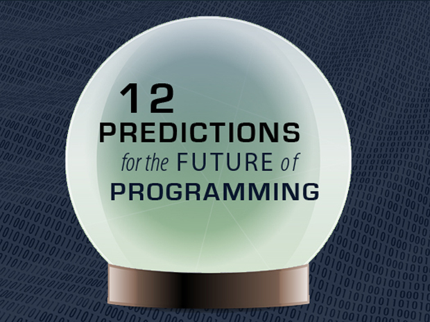

# 编程界12个靠谱的5年预测

## 
## 我们凝望编程水晶球,希望找到确定靠谱的下注目标,帮助程序员做个五年发展规划

技术发展越来越快,构建技术的技术也在持续不断地发展。 如果我们不总结过去的项目经验来提升自己,那么结果只能是挖坑把自己埋了。

为了让您在技术的未来不要看直了眼,我们精心准备了12个看起来非常靠谱的预言,大致预测了未来五年在编程界可能发生的事。 负责本次预测的水晶球主观属性为95%,基于过往的经验和现有的事实,以下的一些猜想可能在未来不会发生,也有可能在五年内不会完全实现, 还有一些已经部分成为事实,但仍需要进一步确认其发展速度是不是和鼓吹的一样快。

你只需快速预览一遍即可,实在是因为变化的速度比我们想象的还要快。  

## GPU将成新一代编程核心

游戏玩家喜欢炫耀自己的显卡,而GPU发展和普及的速度连厂商自己都害怕。 早期的GPU主要用于 图形与图像处理( http://www.infoworld.com/t/application-development/did-these-guys-just-reinvent-the-web-228713 ) , 而现在很多不处理图像的应用已被重写,目的是为了使用GPU的并行架构。 物理学家(Physicists)使用它们来研究问题; 天文学家(astronomers)依靠显卡来模拟星系; 生物学家(biologists)通过GPU来对种群研究进行统计。 这些应用程序只会变得越来越普遍,特别是编译器开始检测代码在GPU上是否可以高效运行之后。 只进行学术研究可能还属于比较有限的运用范围,但如果很多项目都能利用起来这些资源,那它只会越来越流行。

## 数据库将执行日益复杂的分析

Databases will perform increasingly sophisticated analysis

Databases of the future are certain to do more than just store numbers. Many already have sophisticated report engines (aka business intelligence), and these extras will become more powerful, enabling databases to run more sophisticated algorithms on tables, search more efficiently for patterns in data, and do much of the work currently touted by the buzzword "big data."

This power and sophistication will be driven by the cost of moving data around. Leaving the data in the database and letting its engine perform the analysis will be much faster than extracting it to a separate big data package because it will limit the overhead of communication and decrease the amount of programming necessary to extract value from the data store.

未来的数据库肯定不仅仅用来存储数字。很多数据库已经配备了复杂的报表引擎(也就是商业智能),这些附加功能会变得更加强大,使数据库能够对表执行更复杂的算法、更高效地搜索数据中的模式,并承担目前被“大数据”这个流行词所吹捧的许多工作。

这种能力和复杂度的提升,将由数据搬运的成本所驱动。把数据留在数据库里、让数据库引擎直接执行分析,会比把它抽取到单独的大数据套件中快得多,因为这样可以限制通信开销,也减少从数据存储中提取价值所需的编程工作量。

## 无处不在的JavaScript

JavaScript for everything
JavaScript won't be the only language in the programming world, but it will begin to seem that way. JavaScript is inescapable on the browser, which dominates almost everything a client computer does. Now the server side is embracing it with tools like Node.js.

JavaScript will become more dominant in other areas as well. After all, most mobile developers can get the performance they want out of HTML5 applications running in browserlike views. The result may not be as zippy as native code, but JavaScript is good enough and portable to the Web, too.

The browser isn't just colonizing phones; it's eating entire platforms. Chrome OS and Chromebooks are making regular OSes obsolete. Why worry about that layer when JavaScript and the browser can do everything?

JavaScript 不会成为编程世界里唯一的语言,但看起来会越来越像那么回事。在浏览器上,JavaScript 是不可或缺的,而浏览器几乎主导了客户端计算机所做的一切。如今,服务器端也通过 Node.js 之类的工具接纳了它。

JavaScript 在其他领域也会占据更主导的地位。毕竟,大多数移动开发者只要运行在类浏览器视图(browserlike views)中的 HTML5 应用,就能获得他们想要的性能。结果可能不像原生代码那样飞快,但 JavaScript 已经足够好,而且还能移植到 Web 上。

浏览器不只是在占领手机,它正在吞噬整个平台。Chrome OS 和 Chromebook 正让常规操作系统走向过时。既然 JavaScript 和浏览器能做一切,又何必去操心那一层呢?

## Android 也无处不在

Android on every device
When the browser doesn't win, Android is close behind. Camera designers, threatened by cellphones with good lenses, put Android on cameras so you can run Instagram on a Nikon. There are Android refrigerators, car stereos, televisions, even headphones. Some complain that the UI is too complicated, but that's missing the point. The UI layer can be simplified. If Android is underneath, the platform will dominate.

Plus, PC manufacturers are feeling left out. Their solution? Run Android on Windows and let people use Android apps on their desktops, too. Some run stock Android emulators, but others are creating brands like "PC Plus." Once Android takes over the PC, it may combine with the browser to push Windows apps into a distant third place on the box.

当浏览器没能胜出时,Android 就紧随其后。相机厂商受到配有好镜头的手机的威胁,于是把 Android 装到相机上,这样你就能在尼康相机上运行 Instagram。如今有 Android 冰箱、汽车音响、电视机,甚至耳机。有人抱怨 UI 太复杂,但这是没抓住重点。UI 层可以简化。只要底层是 Android,这个平台就会占据主导。

此外,PC 制造商感觉自己被冷落了。他们有什么办法?在 Windows 上运行 Android,让人们也能在桌面上使用 Android 应用。有些厂商运行原生的 Android 模拟器,另一些则打造出“PC Plus”之类的品牌。一旦 Android 接管了 PC,它可能还会与浏览器结合,把 Windows 应用挤到这台机器上遥远第三的位置。

## 物联网 —— 从概念落地

The Internet of things -- more platforms than ever
One side effect of Android (and Linux) colonizing the world is that more objects will join the Internet of things. Of the many platforms to come, the most important will be the car. Navigation and shopping are just the beginning. When the autonomous cars roll out, there will be even more opportunities for developers to cash in on car location and information.

The key is figuring out which features are essential to each domain. While OSes like Android offer a unifying core, each platform will require customized features. Robotic toys may need content filters to provide age-appropriate content. Thermostats will want to interact with weather forecasts. Building these APIs with the right features will be key.

Android(以及 Linux)殖民世界的一个副作用,就是会有更多的物体加入物联网。在即将到来的众多平台中,最重要的将是汽车。导航和购物只是开始。当自动驾驶汽车推出后,开发者还会有更多机会靠汽车的位置和信息来赚钱。

关键在于弄清楚哪些特性对每个领域是必不可少的。虽然像 Android 这样的操作系统提供了一个统一的核心,但每个平台都需要定制化的功能。机器人玩具可能需要内容过滤器,以提供适合年龄的内容。恒温器则会希望与天气预报交互。用恰当的特性来构建这些 API 将是关键。

## 开源将寻找到新的赚钱方式

Open source will find new ways to squeeze us
For all of the success of open source stacks like Android, Ubuntu, or MySQL, there remains a sticky problem with finding the revenue to support development. Open source code helps hackers, but there aren't many examples of companies building a stable open source ecology that let programmers buy health care or food.

The vast majority of open source companies distribute what might better be called a demonstration version under an open source license. Then some kind of secret sauce is locked away to give the programmers something to bargain with. It's the way of the world. Why buy the cow if you can get the milk for free? The best open source projects will find a way to tighten the screws without scaring away customers.

像 Android、Ubuntu 或 MySQL 这样的开源技术栈尽管取得了种种成功,但要找到足以支撑开发的收入,始终是个棘手的问题。开源代码对黑客有帮助,但很少有公司能建立起稳定的开源生态,让程序员靠它买得起医疗保险或食物。

绝大多数开源公司分发的,其实是(也许更该称为)开源许可下的演示版本,然后把某种“秘方”锁起来,好让程序员有点讨价还价的筹码。这就是世道。既然能免费喝到牛奶,又何必去买一头牛呢?最优秀的开源项目会找到一种办法:既拧紧螺丝,又不把客户吓跑。

## WordPress Web应用比比皆是

WordPress Web apps will abound
The biggest mistake the Obama administration made was building its insurance exchange websites from scratch. No one does that any more. Why bother when you can add a plug-in to WordPress? If you're really picky, you could work with Joomla or Drupal. The point isn't which platform, just the fact that there are fewer reasons to create your own Web apps because so much functionality is built into the frameworks.

The game gets more interesting when you hack the code. WordPress has its own editor built in, so you can develop inside WordPress, too. There's no debugger, but you can get around that. If WordPress adds a nice database browser like PHPMyAdmin and provides a bit of basic debugging tools, development will accelerate.

奥巴马政府犯下的最大错误,就是从头开始构建其保险交易所网站。现在没人再这么干了。既然给 WordPress 加个插件就行,又何必费这个劲?如果你真的很挑剔,也可以用 Joomla 或 Drupal。重点不在于用哪个平台,而在于:创建自己 Web 应用的理由越来越少了,因为太多功能都已内建在框架里。

当你改写代码时,这场游戏会变得更有意思。WordPress 内置了自己的编辑器,所以你也能在 WordPress 里做开发。它没有调试器,但你总有办法绕过去。如果 WordPress 能加入一个像 PHPMyAdmin 那样好用的数据库浏览器,再提供一些基本的调试工具,开发速度就会加快。

## 插件技术日趋成熟

Plug-ins will replace full-fledged programs
Basic Web apps aren't the only ones riding the power of code snippets plugged into a bigger framework. Photoshop used to be the dominant engine for reworking images, in part because of its fertile plug-in ecosystem. Now apps like MagicHour have made plug-ins even simpler. Most major platforms offer a good plug-in API, and the ones with the best have fertile ecologies filled with thousands of modules, libraries, and plug-ins.

This burgeoning ecology means programmers will write more snippets and fewer applications. The right bit of glue code can be a million times more powerful than a great, hand-built application with megabytes of binary. A small snippet can leverage everything in the ecology. A big app must do everything on its own.

借助插入更大框架中的代码片段来获得威力的,并不只有基础的 Web 应用。Photoshop 曾是图像处理领域占主导地位的引擎,部分原因就是它有肥沃的插件生态。如今像 MagicHour 这样的应用让插件变得更简单。大多数主流平台都提供了良好的插件 API,其中最好的平台拥有肥沃的生态,充斥着成千上万的模块、库和插件。

这种蓬勃发展的生态意味着程序员会写更多的代码片段、更少的完整应用。一段恰到好处的胶水代码,可能比一个体积达若干 MB、精心手工打造的应用强大一百万倍。一个小片段就能利用整个生态里的一切;而一个大应用什么都得自己来做。

## 千秋万载的命令行

Long live the command line
While it’s become easier to click your way to a working app, a surprising amount of work is still done in text editors and terminal windows. So, contrary to what you might think, the command line will not go away. In fact, more modern tools will work only with the command line.

Command lines are too flexible and too universal to be supplanted. Pretty GUIs with clicky interfaces and drag-and-drop widgets get attention, but programmers keep reverting to text.

Ease of scripting is at the center of the command line’s continual resurgence, and it will live on because it's simple and extensible. If you have a script, you can easily extend it and glue it into other scripts.

虽然如今点几下鼠标就能做出一个可用的应用,但仍有数量惊人的工作是在文本编辑器和终端窗口里完成的。所以,与你可能以为的相反,命令行不会消失。事实上,越来越多现代工具只能在命令行下使用。

命令行太灵活、太通用,不可能被取代。界面可点、控件可拖拽的漂亮 GUI 很吸引眼球,但程序员们总是会回归文本。

脚本编写的便利性,正是命令行持续复兴的核心原因;它会继续存在下去,因为命令行简单且可扩展。只要你有一个脚本,就能轻松扩展它,再把它粘合到其他脚本里。

## 降低下来将会失败

Dumbing it down will fail

For 50 years, programmers have tried to make it easy for people to learn programming, and for 50 years they've succeeded -- but only at the most basic tasks. That won't prevent well-meaning folks from trying to dumb down programming even more so that everyone will be able to do it. Evangelists will sell big dreams of a world where everyone programs, and they'll wheedle big grants with claims of building competitive workforces.

Alas, true programming means understanding the unseen numbers dancing around in the little box. It means understanding the conventions for creating software and for partitioning responsibility, so the software can run cleanly. Teaching everyone to grok if-then-else clauses is a nice idea, but it's not the same as creating more programmers.

50 年来,程序员们一直努力让人们学习编程变得更容易;50 年来他们确实做到了——但只限于最基础的任务。这并不能阻止那些好心人进一步简化编程,好让人人都能学会。布道者们会兜售“人人都会编程”的美梦,还会以打造有竞争力的劳动力为说辞,用花言巧语哄来大笔资助。

唉,真正的编程意味着理解那个小盒子里跳动着的、看不见的数字,意味着理解创建软件和分配职责的约定,这样软件才能干净地运行。教每个人看懂 if-then-else 语句是个好主意,但这和培养出更多程序员并不是一回事。

## 11. 外包和内包仍将陷入僵局

Outsourcing and insourcing will remain deadlocked
One standard prediction is that all programming work will flow to countries with the cheapest wages.

This bold law of economics is mirrored by the prediction that low-end work will be replaced by automated tools and the real jobs will be for those who understand the business.

Both will be true. Outsourcing teams will win jobs with low bids but also be squeezed by new automated tools. One set of websites makes it easy to hire low-wage workers across the globe. Another set of sites makes it easier to go from 0 to 60 without hiring anyone. Squads that depend on outsourcing contracts will find themselves bidding against internal teams of people who know the business and don't need help.

一个常见的预测是:所有编程工作都会流向工资最低的国家。

与这条大胆的经济学定律相呼应的,是另一个预测:低端工作将被自动化工具取代,而真正的工作会留给那些懂业务的人。

两者都会成真。外包团队会以低价赢得项目,但也会被新的自动化工具挤压。有一类网站让你能轻松雇佣全球的低薪工人;另一类网站则让你无需雇任何人就能“从 0 飙到 60”。依赖外包合同的小团队会发现,自己的竞标对手是内部团队——那些人懂业务,而且根本不需要外援。

## 12. 管理者将继续误解码农和编码

Management will continue to misunderstand coders and coding
One of the most painful conversations is listening to nonprogrammers in suits make requests. Sometimes these requests work out, but often they end in frustration, as the suits don't get what they want.

The suits could spend the years learning the technology, but it's simpler to hire some youngsters. Their inability to understand basic technology is one of the biggest reasons for age discrimination. The only solution that comes to mind is to search for some unicorn 22-year-old programmer.

The companies that find a way to harness the talents of everyone else are the ones that will find success. They'll work at a sane pace to create stable software that offers just enough features to be useful.

最让人痛苦的对话之一,就是听那些穿西装、不懂编程的人提需求。有时这些需求能成,但往往以沮丧收场,因为那些穿西装的人得不到他们想要的东西。

穿西装的人本可以花上几年学技术,但直接雇些年轻人更省事。他们无法理解基本技术,这正是年龄歧视最大的成因之一。想来想去,唯一的“解决办法”竟然是去找一个 22 岁的独角兽程序员。

那些能找到办法善用其他所有人才能的公司,才会取得成功。它们会以合理的节奏工作,打造出稳定的软件,功能不多不少、刚好够用。

## 

**原文链接**: [12 predictions, 5 years: The future of programming](http://www.javaworld.com/article/2687317/enterprise-java/application-development-164040-12-predictions-for-the-future-of-programming.html)

原文日期: 2014-09-19

翻译日期: 2014-10-05

翻译人员: [铁锚](http://blog.csdn.net/renfufei)
