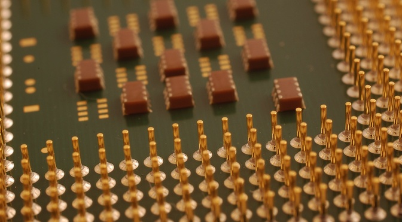
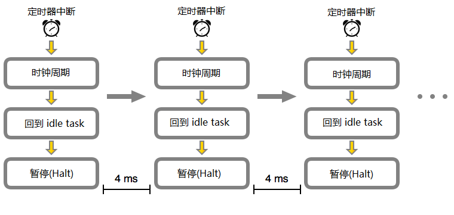
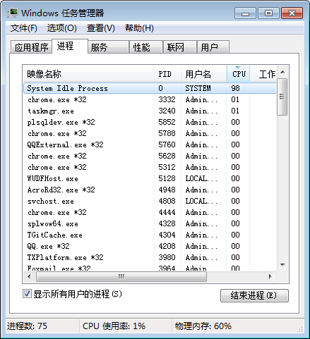
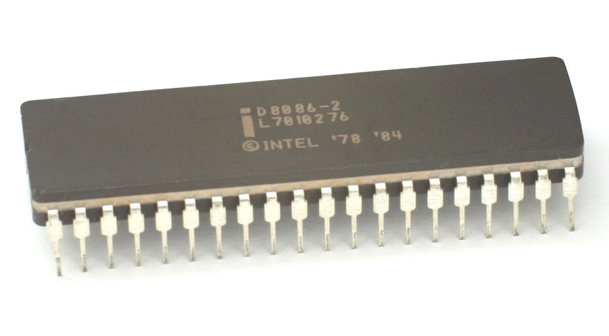

CPU的空闲处理机制
==

CPU在绝大部分时间是什么都不干的。 大多数技术专家都知道这个事实,但对于 CPU 是如何从空闲状态切换到工作状态,忙完后又回到空闲状态的相应机制,我们还没有详细讨论过。 对现代处理器来说这种机制变得越来越重要; 今天大部分芯片设计的一个目标是将处理器尽快地切换到低功率状态。

Gustavo Duarte 写的 [一篇详细文章](http://duartes.org/gustavo/blog/post/what-does-an-idle-cpu-do/) 指出, CPU 空闲时(idle CPU)并不是什么都不干(doing nothing) —— 而是在运行空闲任务(idle tasks)。 CPU整体设计就是完成当前操作后尽可能快速地返回到空闲状态, 但系统必须要有某种方法/方式来唤醒芯片,让它去关注其他某些东西。 其中的一种方式是使用系统计时器(system timer)。

如 Duarte 文中所述, 阻止CPU消耗太多电量的一种方法是内置更长的时钟周期(tick periods)。 通过这种方式,CPU在唤醒之前需要度过更长的空闲时间,然后执行基本任务,接着再次睡眠。

### 什么是空闲任务(idle task)? ###

人类,懒懒的任务听起来像一个矛盾。 理解CPU等效的关键是CPU总是必须的 做 的东西,即使这东西实际上是什么。 的哲学相反的所谓的“忙等待”,讲述一个CPU,不断评估条件,看看这是真的。

x86芯片运行Windows,这个函数的形式停止(停止)指令和Windows系统空闲进程。 Windows安排空闲进程运行在一个CPU核心只有当没有其他线程的资格,CPU上执行。 如果你看一个Windows系统上运行的进程的列表,你会经常看到系统空闲进程运行在一个较高的百分比。 不像在清单上的其他进程,然而,这实际上是一个衡量的 小 CPU是工作,没有多少。 停止指令是为了消耗尽可能少的力量,减少CPU进入这种状态可以节省大量的能源。

停止的历史

停止指令其实很老——这是实现 第一个8086个处理器 月初,但它不支持操作系统。 你们中的一些老前辈可能记得,曾经有一段时间,甚至连基本的停止功能并不总是按照预期运行。 回到昔日的超频,有一个基本的CPU效用称为雨,实际上增加了芯片花费空闲的时间(和改进的保暖内衣裤和在此过程中能耗)。 随着时间的流逝,我们看到越来越多的复杂程度从硬件制造商和软件开发商。

这是一个方面,Windows 8创新- 好吧,尝试创新 ,但有一些奇怪的结果。 它允许更长的进程间蜱虫在默认情况下,但这也导致了一些问题与Google Chrome等程序,自动设置操作系统允许的最短的蜱虫率,为了改善系统响应。 这种行为已经修复了在以后的版本中,但可能导致了一些Windows 8电脑显示较低的电池寿命。

英特尔8086处理器,从8086年。 是的,cpu是当时简单的事情——只有大约20000个晶体管。
这也是一个可调的地方蜱虫,加上没有水晶型支持系统计时器,让微软措手不及。 现在的软件调整前端总线速度Windows 8的方式与操作系统的计时闲荡,导致 错误的基准测试结果 。 这种行为其实 坚持Windows 10 ,尽管它仍然是一个小众的问题——你必须调整系统的前端总线的时钟在操作系统产生错误的结果。

原来的博客主要关心的是桌面操作系统,race-to-idle是最现代的CPU架构的关键组件。 AMD和英特尔在年度基础上进行迭代,经常推出更新,可能只移动性能略有酒吧,但显著提高能耗通过实现更好的时钟门控和更快的权力模式转变。

扩展阅读: [磁盘驱动器(硬盘)的工作原理](http://www.extremetech.com/computing/88078-how-a-hard-drive-works)

原文链接: [What does a CPU do when it’s doing nothing?](http://www.extremetech.com/computing/193628-what-does-a-cpu-do-when-its-doing-nothing)

原文日期: 2014-11-07

翻译日期: 2014-11-10

翻译人员: [铁锚](http://blog.csdn.net/renfufei)

