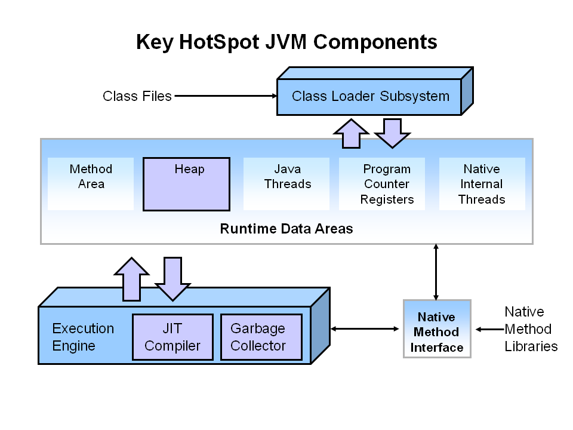

G1垃圾收集器入门简介
==
 
## 概述 ##

#### 目的 ####

本教程介绍如何使用G1垃圾收集器,以及如何在 Hotspot JVM 中使用G1。 您将了解 G1 收集器的内部功能, 切换为 G1 收集器的关键命令行参数, 以及记录其操作的选项开关。

#### 需要的时间 ####

大约 1 个小时

#### 简介 ####

本文涵盖了Java虚拟机(JVM, Java Virtual Machine)中 G1 的基础知识。

1. 第一部分, 简单概述JVM的同时介绍了垃圾收集和性能.
1. 接下来回顾了 Hotspot JVM 中 CMS 收集器是如何工作的. 
1. 接着再一步一步地指导在 Hotspot JVM 中使用G1进行垃圾回收的工作方式.
1. 之后的一个小节介绍 G1 垃圾收集器可用的命令行参数.
1. 最后,您将了解如何配置使G1收集器记录日志.

#### 硬件与软件环境需求 ####

下面是 硬件与软件环境需求 清单:

- 一台PC机, 运行 Windows XP 以上操作系统, Mac OS X 或者 Linux 都可以. 注意,因为作者在Windows 7上进行开发和测试, 尚未在所有平台上完成测试。 但在 OS X和Linux 上应该也是正常的。最好配置了多核CPU.
- Java 7 Update 9 或更高版本
- 最新的 Java 7 Demos and Samples Zip 文件

#### 准备条件 ####

在开始学习本教程之前, 你需要:

- 下载并安装最新的 Java JDK (JDK 7 u9 或 以后的版本): [Java 7 JDK 下载页面](http://www.oracle.com/technetwork/java/javase/downloads/jdk7-downloads-1880260.html)

- 下载并安装 Demos and Samples (示例与样例) zip 文件, 下载页面和JDK相同. 然后解压到合适的位置. 如: `C:\javademos`

## Java 技术 和 JVM ##

### Java 概述 ###

Java 是 Sun Microsystems 公司在1995年发布的一门编程语言. 同时也是一个运行Java程序的底层平台. 提供工具、游戏和企业应用程序支持。Java 运行在全世界超过8.5亿的PC,以及数十亿的智能设备上,包括 mobile 和 TV. Java 是由许多关键部件组成的一个整体, 统称为Java平台。

#### JRE(Java Runtime Edition) ####

一般来说下载了Java以后, 你就得到了一个Java运行时: Java Runtime Environment (JRE). JRE 由Java虚拟机 Java Virtual Machine (JVM), Java 平台核心类(core classes), 以及 Java平台支持库组成. 必须有这三大组件的支持才能在你的电脑上运行 Java 程序. 例如 Java 7, 可以在操作系统上作为桌面应用程序运行, 还可以通过 Java Web Start 从Web上安装, 或者是作为嵌入式Web程序在浏览器中运行 (通过  JavaFX).

#### Java 编程语言 ####

Java 是一门面向对象编程语言(object-oriented programming language), 包涵以下特性.

- Platform Independence - Java 应用程序被编译为字节码(bytecode)存放到 class 文件中, 由JVM加载. 因为程序在 JVM 中运行, 所以可以跨平台运行在各种操作系统/设备上.
- Object-Oriented - Java 是一门面向对象的语言, 继承了 C 和 C++ 的很多特性,并在此基础上进行扩充和优化.
- Automatic Garbage Collection - Java对内存进行 自动分配(allocates) 和自动释放(deallocates). 所以程序不再执行这一繁琐的任务(其实自动内存回收,更多的好处是减少了编程需要重复处理的这种细节,另一个例子是对JDBC的封装).
- Rich Standard Library - Java包含大量的标准对象,可以执行诸如输入输出(input/output), 网络操作以及日期处理等任务.

#### JDK(Java Development Kit) ####

JDK 是用来开发Java程序的一系列工具集. 通过JDK, 你可以编译用Java语言书写的程序, 并在 JVM 中运行. 另外, JDK 还提供了打包(packaging)和分发(distributing)程序的工具.

JDK 和 JRE 使用同样的 Java Application Programming Interfaces ([Java API](http://docs.oracle.com/javase/7/docs/api/)).Java API 是预先打包好以供程序员用来开发程序的类库集合. 通过 Java API 使得很多常规任务可以很轻松的就完成,如 字符串操作(string manipulation), 时间日期处理(date/time processing), 网络编程(networking), 以及实现各种数据结构(data structures, 如 lists, maps, stacks, and queues).

#### JVM(Java Virtual Machine) ####

Java Virtual Machine (JVM) 是一台抽象的计算机(abstract computing machine). JVM 本质是一个程序, 但在运行于JVM上的程序看来, 他就像一台真实机器一样. 这样, Java程序就能使用相同的接口和库. 每种特定操作系统上的 JVM 实现, 都将 Java  程序指令转换为本地机器的指令(instructions)和命令(commands). 由此,实现了Java程序的平台独立性.

Java虚拟机的第一个原型实现,由 Sun Microsystems, Inc. 完成, 在一台手持设备上用软件模拟了 Java虚拟机指令集, 类似于今天的  PDA(Personal Digital Assistant). Oracle 当前在移动设备,桌面系统和服务器上都提供了Java虚拟机实现, 但Java虚拟机不限制使用任何特定的技术,硬件,或操作系统。JVM也不一定都是基于软件的,你可以直接在硬件CPU上实现JVM指令, 还可以芯片上实现,或者采用 microcode 的方式来实现.

Java 虚拟机完全不关心Java语言的细节, 只识别 class 文件这种特定的二进制格式. 一个 class 文件包含 Java虚拟机指令(或称之为字节码 bytecode) 及符号变量表(symbol table), 还有一些辅助信息.

基于安全性考虑, Java虚拟机对 class 文件中的代码执行 强语法检查和组成结构规范限制. 既然虚拟机有这种特征, 那么任何一门编程语言,只要能编译为合法的 class 文件，都可以加载到 Java虚拟机 里面执行。由于具有通用性,跨平台特性, 其他语言的实现者可以把Java虚拟机作为该语言的加载执行工具。(1) [The Java Virtual Machine](http://docs.oracle.com/javase/specs/jvms/se7/html/jvms-1.html)

 
### 探索 JVM 体系架构 ###

#### Hotspot 架构 ####

HotSpot JVM 有一个稳定强悍的架构, 支持强大的功能与特性, 具备实现高性能和大规模可伸缩性的能力。例如,HotSpot JVM JIT编译器能动态进行优化生成。换句话说,他们运行Java程序时,会针对底层系统架构动态生成高性能的本地机器指令。此外,通过成熟的演进和运行时环境的持续工程,加上多线程垃圾收集器,HotSpot JVM即使实在大型计算机系统上也能获得很高的伸缩性.

JVM 的主要组件包括: 类加载器(class loader), 运行时数据区(runtime data areas), 以及执行引擎(execution engine).

#### Hotspot 关键部分 ####

与性能(performance)有关的部分是 JVM 最重要的组件,下图中用高亮的颜色来显示.

对JVM进行性能调优时有三大组件需要重点关注。堆(Heap)是存放对象的内存空间。这个区域由JVM启动时选择的垃圾收集器进行管理。大多数调优参数都是调整堆内存的大小,以及根据实际情况选择最合适的垃圾收集器. JIT编译器也对性能有很大的影响, 但新版本的JVM调优中很少需要关注.
 
### 性能基础 ###

大多数情况下对 Java 程序进行调优, 主要关注两个目标之一:  响应速度(responsiveness) 和/或 吞吐量(throughput). 下面的教程中我们将回顾这些概念.

#### 响应能力(Responsiveness) ####

响应能力就是程序或系统对一个请求的响应有多迅速. 比如: 

- 程序UI响应速度有多灵敏
- 网站页面响应有多快
- 数据库查询有多快

对响应速度要求很高的系统, 较大的暂停时间(large pause times) 是不可接受的. 重点是在非常短的时间周期内快速响应.

#### 吞吐量(Throughput) ####

吞吐量关注在一个特定时间段内应用系统的最大工作量。衡量吞吐量的指标/示例包括:

- 给定时间内完成的事务数.
- 每小时批处理系统能完成的作业(jobs)数量.
- 每小时能完成多少次数据库查询

对于关心吞吐量的应用系统, 暂停时间长(High pause times)也是可以接受的。由于高吞吐量应用以很长的时间周期为基准来进行评判,所以快速响应时间一般不纳入考虑.

## G1 垃圾收集器(Garbage Collector) ##
### G1 垃圾收集器 ###

G1 (Garbage-First)是一款面向服务器的垃圾收集器,主要针对配备多颗处理器及大容量内存的机器. 以极高概率满足GC暂停时间要求的同时,还具备高吞吐量特征. 在Oracle JDK 7 update 4 及以上版本中得到完全支持, 专为以下应用程序设计:

- Can operate concurrently with applications threads like the CMS collector.
- Compact free space without lengthy GC induced pause times.
- Need more predictable GC pause durations.
- Do not want to sacrifice a lot of throughput performance.
- Do not require a much larger Java heap.

G1 is planned as the long term replacement for the Concurrent Mark-Sweep Collector (CMS). Comparing G1 with CMS, there are differences that make G1 a better solution. One difference is that G1 is a compacting collector. G1 compacts sufficiently to completely avoid the use of fine-grained free lists for allocation, and instead relies on regions. This considerably simplifies parts of the collector, and mostly eliminates potential fragmentation issues. Also, G1 offers more predictable garbage collection pauses than the CMS collector, and allows users to specify desired pause targets.

#### G1 Operational Overview ####

The older garbage collectors (serial, parallel, CMS) all structure the heap into three sections: young generation, old generation, and permanent generation of a fixed memory size.

All memory objects end up in one of these three sections.

The G1 collector takes a different approach.

The heap is partitioned into a set of equal-sized heap regions, each a contiguous range of virtual memory. Certain region sets are assigned the same roles (eden, survivor, old) as in the older collectors, but there is not a fixed size for them. This provides greater flexibility in memory usage.

When performing garbage collections, G1 operates in a manner similar to the CMS collector. G1 performs a concurrent global marking phase to determine the liveness of objects throughout the heap. After the mark phase completes, G1 knows which regions are mostly empty. It collects in these regions first, which usually yields a large amount of free space. This is why this method of garbage collection is called Garbage-First. As the name suggests, G1 concentrates its collection and compaction activity on the areas of the heap that are likely to be full of reclaimable objects, that is, garbage. G1 uses a pause prediction model to meet a user-defined pause time target and selects the number of regions to collect based on the specified pause time target.

The regions identified by G1 as ripe for reclamation are garbage collected using evacuation. G1 copies objects from one or more regions of the heap to a single region on the heap, and in the process both compacts and frees up memory. This evacuation is performed in parallel on multi-processors, to decrease pause times and increase throughput. Thus, with each garbage collection, G1 continuously works to reduce fragmentation, working within the user defined pause times. This is beyond the capability of both the previous methods. CMS (Concurrent Mark Sweep ) garbage collector does not do compaction. ParallelOld garbage collection performs only whole-heap compaction, which results in considerable pause times.

It is important to note that G1 is not a real-time collector. It meets the set pause time target with high probability but not absolute certainty. Based on data from previous collections, G1 does an estimate of how many regions can be collected within the user specified target time. Thus, the collector has a reasonably accurate model of the cost of collecting the regions, and it uses this model to determine which and how many regions to collect while staying within the pause time target.

**Note:** G1 has both concurrent (runs along with application threads, e.g., refinement, marking, cleanup) and parallel (multi-threaded, e.g., stop the world) phases. Full garbage collections are still single threaded, but if tuned properly your applications should avoid full GCs.

#### G1 Footprint ####

If you migrate from the ParallelOldGC or CMS collector to G1, you will likely see a larger JVM process size. This is largely related to "accounting" data structures such as Remembered Sets and Collection Sets.

**Remembered Sets** or RSets track object references into a given region. There is one RSet per region in the heap. The RSet enables the parallel and independent collection of a region. The overall footprint impact of RSets is less than 5%.

**Collection Sets** or CSets the set of regions that will be collected in a GC. All live data in a CSet is evacuated (copied/moved) during a GC. Sets of regions can be Eden, survivor, and/or old generation. CSets have a less than 1% impact on the size of the JVM.

#### Recommended Use Cases for G1 ####

The first focus of G1 is to provide a solution for users running applications that require large heaps with limited GC latency. This means heap sizes of around 6GB or larger, and stable and predictable pause time below 0.5 seconds.

Applications running today with either the CMS or the ParallelOldGC garbage collector would benefit switching to G1 if the application has one or more of the following traits.

- Full GC durations are too long or too frequent.
- The rate of object allocation rate or promotion varies significantly.
- Undesired long garbage collection or compaction pauses (longer than 0.5 to 1 second)

**Note:** If you are using CMS or ParallelOldGC and your application is not experiencing long garbage collection pauses, it is fine to stay with your current collector. Changing to the G1 collector is not a requirement for using the latest JDK.

 
## Reviewing GC with the CMS ##

### Reviewing Generational GC and CMS ###
The Concurrent Mark Sweep (CMS) collector (also referred to as the concurrent low pause collector) collects the tenured generation. It attempts to minimize the pauses due to garbage collection by doing most of the garbage collection work concurrently with the application threads. Normally the concurrent low pause collector does not copy or compact the live objects. A garbage collection is done without moving the live objects. If fragmentation becomes a problem, allocate a larger heap.

**Note:** CMS collector on young generation uses the same algorithm as that of the parallel collector.

#### CMS Collection Phases ####

The CMS collector performs the following phases on the old generation of the heap:

<table>

<tr>
<th>Phase</th>
<th>Description</th>
</tr>

<tr>
<td>(1) Initial Mark</td>
<td>
(Stop the World Event)	Objects in old generation are “marked” as reachable including those objects which may be reachable from young generation. Pause times are typically short in duration relative to minor collection pause times.
</td>
</tr>

<tr>
<td>(2) Concurrent Marking
</td>
<td>Traverse the tenured generation object graph for reachable objects concurrently while Java application threads are executing. Starts scanning from marked objects and transitively marks all objects reachable from the roots. The mutators are executing during the concurrent phases 2, 3, and 5 and any objects allocated in the CMS generation during these phases (including promoted objects) are immediately marked as live.
</td>
</tr>

<tr>
<td>(3) Remark
</td>
<td>(Stop the World Event)	Finds objects that were missed by the concurrent mark phase due to updates by Java application threads to objects after the concurrent collector had finished tracing that object.
</td>
</tr>

<tr>
<td>(4) Concurrent Sweep
</td>
<td>Collects the objects identified as unreachable during marking phases. The collection of a dead object adds the space for the object to a free list for later allocation. Coalescing of dead objects may occur at this point. Note that live objects are not moved.
</td>
</tr>

<tr>
<td>(5) Resetting
</td>
<td>Prepare for next concurrent collection by clearing data structures.
</td>
</tr>

</table>

	
#### Reviewing Garbage Collection Steps ####

Next, let's review CMS Collector operations step by step.

##### 1. Heap Structure for CMS Collector #####

The heap is split into three spaces.

images/slide1.png

Young generation is split into Eden and two survivor spaces. Old generation is one contiguous space. Object collection is done in place. No compaction is done unless there is a full GC.

##### 2. How Young GC works in CMS #####

The young generation is colored light green and the old generation in blue. This is what the CMS might look like if your application has been running for a while. Objects are scattered around the old generation area.

With CMS, old generation objects are deallocated in place. They are not moved around. The space is not compacted unless there is a full GC.

##### 3. Young Generation Collection #####

Live objects are copied from the Eden space and survivor space to the other survivor space. Any older objects that have reached their aging threshold are promoted to old generation.

##### 4. After Young GC #####

After a young GC, the Eden space is cleared and one of the survivor spaces is cleared.

Newly promoted objects are shown in dark blue on the diagram. The green objects are surviving young generation objects that have not yet been promoted to old generation.

##### 5. Old Generation Collection with CMS #####

Two stop the world events take place: initial mark and remark. When the old generation reaches a certain occupancy rate, the CMS is kicked off.

(1) Initial mark is a short pause phase where live (reachable) objects are marked. (2) Concurrent marking finds live objects while the application continues to execute. Finally, in the (3) remark phase, objects are found that were missed during (2) concurrent marking in the previous phase.

##### 6. Old Generation Collection - Concurrent Sweep #####

Objects that were not marked in the previous phase are deallocated in place. There is no compaction.

**Note:** Unmarked objects == Dead Objects

#### 7. Old Generation Collection - After Sweeping ####

After the (4) Sweeping phase, you can see that a lot of memory has been freed up. You will also notice that no compaction has been done.

Finally, the CMS collector will move through the (5) resetting phase and wait for the next time the GC threshold is reached.

 
## The G1 Garbage Collector Step by Step ##
### The G1 Garbage Collector Step by Step ###
The G1 collector takes a different approach to allocating the heap. The pictures that follow review the G1 system step by step.

#### 1. G1 Heap Structure ####

The heap is one memory area split into many fixed sized regions.

Region size is chosen by the JVM at startup. The JVM generally targets around 2000 regions varying in size from 1 to 32Mb.

#### 2. G1 Heap Allocation ####

In reality, these regions are mapped into logical representations of Eden, Survivor, and old generation spaces.

The colors in the picture shows which region is associated with which role. Live objects are evacuated (i.e., copied or moved) from one region to another. Regions are designed to be collected in parallel with or without stopping all other application threads.

As shown regions can be allocated into Eden, survivor, and old generation regions. In addition, there is a fourth type of object known as Humongous regions. These regions are designed to hold objects that are 50% the size of a standard region or larger. They are stored as a set of contiguous regions. Finally the last type of regions would be the unused areas of the heap.

**Note:** At the time of this writing, collecting humongous objects has not been optimized. Therefore, you should avoid creating objects of this size.

#### 3. Young Generation in G1 ####

The heap is split into approximately 2000 regions. Minimum size is 1Mb and maximum size is 32Mb. Blue regions hold old generation objects and green regions hold young generation objects.

Note that the regions are not required to be contiguous like the older garbage collectors.

#### 4. A Young GC in G1 ####

Live objects are evacuated (i.e., copied or moved) to one or more survivor regions. If the aging threshold is met, some of the objects are promoted to old generation regions.

This is a stop the world (STW) pause. Eden size and survivor size is calculated for the next young GC. Accounting information is kept to help calculate the size. Things like the pause time goal are taken into consideration.

This approach makes it very easy to resize regions, making them bigger or smaller as needed.

#### 5. End of a Young GC with G1 ####

Live objects have been evacuated to survivor regions or to old generation regions.

Recently promoted objects are shown in dark blue. Survivor regions in green.

In summary, the following can be said about the young generation in G1:

- The heap is a single memory space split into regions.
- Young generation memory is composed of a set of non-contiguous regions. This makes it easy to resize when needed.
- Young generation garbage collections, or young GCs, are stop the world events. All application threads are stopped for the operation.
- The young GC is done in parallel using multiple threads.
- Live objects are copied to new survivor or old generation regions.

### Old Generation Collection with G1 ###

Like the CMS collector, the G1 collector is designed to be a low pause collector for old generation objects. The following table describes the G1 collection phases on old generation.

#### G1 Collection Phases - Concurrent Marking Cycle Phases ####

The G1 collector performs the following phases on the old generation of the heap. Note that some phases are part of a young generation collection.

<table>

<tr>
<th>Phase
</th>
<th>Description
</th>
</tr/>

<tr>
<td>(1) Initial Mark
</td>
<td>
(Stop the World Event)	This is a stop the world event. With G1, it is piggybacked on a normal young GC. Mark survivor regions (root regions) which may have references to objects in old generation.
</td>
</tr/>

<tr>
<td>
(2) Root Region Scanning
</td>
<td>	Scan survivor regions for references into the old generation. This happens while the application continues to run. The phase must be completed before a young GC can occur.
</td>
</tr/>

<tr>
<td>
(3) Concurrent Marking
</td>
<td>	Find live objects over the entire heap. This happens while the application is running. This phase can be interrupted by young generation garbage collections.
</td>
</tr/>

<tr>
<td>
(4) Remark
</td>
<td>
(Stop the World Event)	Completes the marking of live object in the heap. Uses an algorithm called snapshot-at-the-beginning (SATB) which is much faster than what was used in the CMS collector.
</td>
</tr/>

<tr>
<td>
(5) Cleanup
</td>
<td>
(Stop the World Event and Concurrent)	
Performs accounting on live objects and completely free regions. (Stop the world)
Scrubs the Remembered Sets. (Stop the world)
Reset the empty regions and return them to the free list. (Concurrent)
</td>
</tr/>

<tr>
<td>
(*) Copying
</td>
<td>
(Stop the World Event)	These are the stop the world pauses to evacuate or copy live objects to new unused regions. This can be done with young generation regions which are logged as [GC pause (young)]. Or both young and old generation regions which are logged as [GC Pause (mixed)].
</td>
</tr/>

</table>

#### G1 Old Generation Collection Step by Step ####

With the phases defined, let's look at how they interact with the old generation in the G1 collector.

##### 6. Initial Marking Phase #####

Initial marking of live object is piggybacked on a young generation garbage collection. In the logs this is noted as GC pause (young)(inital-mark).

##### 7. Concurrent Marking Phase #####

If empty regions are found (as denoted by the "X"), they are removed immediately in the Remark phase. Also, "accounting" information that determines liveness is calculated.

##### 8. Remark Phase #####

Empty regions are removed and reclaimed. Region liveness is now calculated for all regions.

##### 9. Copying/Cleanup Phase #####

G1 selects the regions with the lowest "liveness", those regions which can be collected the fastest. Then those regions are collected at the same time as a young GC. This is denoted in the logs as `[GC pause (mixed)]`. So both young and old generations are collected at the same time.

##### 10. After Copying/Cleanup Phase #####

The regions selected have been collected and compacted into the dark blue region and the dark green region shown in the diagram.

#### Summary of Old Generation GC ####

In summary, there are a few key points we can make about the G1 garbage collection on the old generation.

* Concurrent Marking Phase
  - Liveness information is calculated concurrently while the application is running.
  - This liveness information identifies which regions will be best to reclaim during an evacuation pause.
  - There is no sweeping phase like in CMS.
* Remark Phase
  - Uses the Snapshot-at-the-Beginning (SATB) algorithm which is much faster then what was used with CMS.
  - Completely empty regions are reclaimed.
* Copying/Cleanup Phase
  - Young generation and old generation are reclaimed at the same time.
  - Old generation regions are selected based on their liveness.
 
## Command Line Options and Best Practices ##
### Command Line Options and Best Practices ###
In this section let's take a look at the various command line options for G1.

#### Basic Command Line ####

To enable the G1 Collector use: -XX:+UseG1GC

Here is a sample command line for starting the Java2Demo included in the JDK demos and samples download:

**java -Xmx50m -Xms50m -XX:+UseG1GC -XX:MaxGCPauseMillis=200 -jar c:\javademos\demo\jfc\Java2D\Java2demo.jar**

#### Key Command Line Switches ####

**-XX:+UseG1GC** - Tells the JVM to use the G1 Garbage collector.

**-XX:MaxGCPauseMillis=200** - Sets a target for the maximum GC pause time. This is a soft goal, and the JVM will make its best effort to achieve it. Therefore, the pause time goal will sometimes not be met. The default value is 200 milliseconds.

**-XX:InitiatingHeapOccupancyPercent=45** - Percentage of the (entire) heap occupancy to start a concurrent GC cycle. It is used by G1 to trigger a concurrent GC cycle based on the occupancy of the entire heap, not just one of the generations. A value of 0 denotes 'do constant GC cycles'. The default value is 45 (i.e., 45% full or occupied).

#### Best Practices ####

There are a few best practices you should follow when using G1.

##### Do not Set Young Generation Size #####

Explicitly setting young generation size via -Xmn meddles with the default behavior of the G1 collector.

- G1 will no longer respect the pause time target for collections. So in essence, setting the young generation size disables the pause time goal.
- G1 is no longer able to expand and contract the young generation space as needed. Since the size is fixed, no changes can be made to the size.

##### Response Time Metrics #####

Instead of using average response time (ART) as a metric to set the `XX:MaxGCPauseMillis=<N>`, consider setting value that will meet the goal 90% of the time or more. This means 90% of users making a request will not experience a response time higher than the goal. Remember, the pause time is a goal and is not guaranteed to always be met.

##### What is an Evacuation Failure?

A promotion failure that happens when a JVM runs out of heap regions during the GC for either survivors and promoted objects. The heap can't expand because it is already at max. This is indicated in the GC logs when using `-XX:+PrintGCDetails` by **to-space overflow**. This is expensive!

- GC still has to continue so space has to be freed up.
- Unsuccessfully copied objects have to be tenured in place.
- Any updates to RSets of regions in the CSet have to be regenerated.
- All of these steps are expensive.

##### How to avoid Evacuation Failure

To avoid evacuation failure, consider the following options.

- Increase heap size
  * Increase the **-XX:G1ReservePercent=n**, the default is 10.
  * G1 creates a false ceiling by trying to leave the reserve memory free in case more 'to-space' is desired.
- Start the marking cycle earlier
- Increase the number of marking threads using the **-XX:ConcGCThreads=n** option.

##### Complete List of G1 GC Switches

This is the complete list of G1 GC switches. Remember to use the best practices outlined above.

<table>

<tr>
<th>Option and Default Value
</th>
<th>	Description
</th>
</tr>

<tr>
<td>-XX:+UseG1GC
</td>
<td>	Use the Garbage First (G1) Collector
</td>
</tr>

<tr>
<td>
-XX:MaxGCPauseMillis=n	
</td>
<td>Sets a target for the maximum GC pause time. This is a soft goal, and the JVM will make its best effort to achieve it.
</td>
</tr>

<tr>
<td>
-XX:InitiatingHeapOccupancyPercent=n	
</td>
<td>Percentage of the (entire) heap occupancy to start a concurrent GC cycle. It is used by GCs that trigger a concurrent GC cycle based on the occupancy of the entire heap, not just one of the generations (e.g., G1). A value of 0 denotes 'do constant GC cycles'. The default value is 45.
</td>
</tr>

<tr>
<td>
-XX:NewRatio=n	
</td>
<td>Ratio of new/old generation sizes. The default value is 2.
</td>
</tr>

<tr>
<td>
-XX:SurvivorRatio=n	
</td>
<td>Ratio of eden/survivor space size. The default value is 8.
</td>
</tr>

<tr>
<td>
-XX:MaxTenuringThreshold=n	
</td>
<td>Maximum value for tenuring threshold. The default value is 15.
</td>
</tr>

<tr>
<td>
-XX:ParallelGCThreads=n
</td>
<td>	Sets the number of threads used during parallel phases of the garbage collectors. The default value varies with the platform on which the JVM is running.
</td>
</tr>

<tr>
<td>
-XX:ConcGCThreads=n	
</td>
<td>Number of threads concurrent garbage collectors will use. The default value varies with the platform on which the JVM is running.
</td>
</tr>

<tr>
<td>
-XX:G1ReservePercent=n
</td>
<td>	Sets the amount of heap that is reserved as a false ceiling to reduce the possibility of promotion failure. The default value is 10.
</td>
</tr>

<tr>
<td>
-XX:G1HeapRegionSize=n	
</td>
<td>With G1 the Java heap is subdivided into uniformly sized regions. This sets the size of the individual sub-divisions. The default value of this parameter is determined ergonomically based upon heap size. The minimum value is 1Mb and the maximum value is 32Mb.
</td>
</tr>

</table>

 
## Logging GC with G1 ##
### Logging GC with G1 ###
The final topic we need to cover is using logging information to analyze performance with the G1 collector. This section provides a quick overview of the switches you can use to collect data and the information that is printed in the logs.

#### Setting the Log Detail ####

You can set the detail to three different levels of detail.

**(1) -verbosegc** (which is equivalent to **-XX:+PrintGC**) sets the detail level of the log to *fine*.

**Sample Output**

	[GC pause (G1 Humongous Allocation) (young) (initial-mark) 24M- >21M(64M), 0.2349730 secs]
	[GC pause (G1 Evacuation Pause) (mixed) 66M->21M(236M), 0.1625268 secs]    

**(2) -XX:+PrintGCDetails** sets the detail level to *finer*. The options shows the following information:

- Average, Min, and Max time are displayed for each phase.
- Root Scan, RSet Updating (with processed buffers information), RSet Scan, Object Copy, Termination (with number of attempts).
- Also shows “other” time such as time spent choosing CSet, reference processing, reference enqueuing and freeing CSet.
- Shows the Eden, Survivors and Total Heap occupancies.

**Sample Output**

	[Ext Root Scanning (ms): Avg: 1.7 Min: 0.0 Max: 3.7 Diff: 3.7]
	[Eden: 818M(818M)->0B(714M) Survivors: 0B->104M Heap: 836M(4096M)->409M(4096M)]

**(3) -XX:+UnlockExperimentalVMOptions -XX:G1LogLevel=finest** sets the detail level to its *finest*. Like finer but includes individual worker thread information.

	[Ext Root Scanning (ms): 2.1 2.4 2.0 0.0
	           Avg: 1.6 Min: 0.0 Max: 2.4 Diff: 2.3]
	       [Update RS (ms):  0.4  0.2  0.4  0.0
	           Avg: 0.2 Min: 0.0 Max: 0.4 Diff: 0.4]
	           [Processed Buffers : 5 1 10 0
	           Sum: 16, Avg: 4, Min: 0, Max: 10, Diff: 10]

#### Determining Time ####

A couple of switches determine how time is displayed in the GC log.

**(1) -XX:+PrintGCTimeStamps** - Shows the elapsed time since the JVM started.

**Sample Output**

    1.729: [GC pause (young) 46M->35M(1332M), 0.0310029 secs]

**(2) -XX:+PrintGCDateStamps** - Adds a time of day prefix to each entry.

    2012-05-02T11:16:32.057+0200: [GC pause (young) 46M->35M(1332M), 0.0317225 secs]

#### Understanding G1 Log ####

To understand the log, this section defines a number of terms using actual GC log output. The following examples show output from the log with explanations of the terms and values you will find in it.

**Note:** For more information check out [Poonam Bajaj's Blog post on G1 GC logs](https://blogs.oracle.com/poonam/entry/understanding_g1_gc_logs).

#### G1 Logging Terms Index ####

- Clear CT
- CSet
- External Root Scanning
- Free CSet
- GC Worker End
- GC Worker Other
- Object Copy
- Other
- Parallel Time
- Ref Eng
- Ref Proc
- Scanning Remembered Sets
- Termination Time
- Update Remembered Set
- Worker Start

##### Parallel Time

	414.557: [GC pause (young), 0.03039600 secs] [Parallel Time: 22.9 ms]
	[GC Worker Start (ms): 7096.0 7096.0 7096.1 7096.1 706.1 7096.1 7096.1 7096.1 7096.2 7096.2 7096.2 7096.2
	       Avg: 7096.1, Min: 7096.0, Max: 7096.2, Diff: 0.2]

`Parallel Time` – Overall elapsed time of the main parallel part of the pause

`Worker Start` – Timestamp at which the workers start

**Note:** The logs are ordered on thread id and are consistent on each entry

##### External Root Scanning

	[Ext Root Scanning (ms): 3.1 3.4 3.4 3.0 4.2 2.0 3.6 3.2 3.4 7.7 3.7 4.4
	     Avg: 3.8, Min: 2.0, Max: 7.7, Diff: 5.7]

`External root scanning` - The time taken to scan the external root (e.g., things like system dictionary that point into the heap.)

##### Update Remembered Set

	[Update RS (ms): 0.1 0.0 0.0 0.0 0.0 0.0 0.0 0.0 0.0 0.0 0.0 0.0 Avg: 0.0, Min: 0.0, Max: 0.1, Diff: 0.1]
	   [Processed Buffers : 26 0 0 0 0 0 0 0 0 0 0 0
	    Sum: 26, Avg: 2, Min: 0, Max: 26, Diff: 26]

`Update Remembered Set` - Any buffers that are completed but have not yet been processed by the concurrent refinement thread before the start of the pause have to be updated. Time depends on density of the cards. The more cards, the longer it will take.

##### Scanning Remembered Sets

	[Scan RS (ms): 0.4 0.2 0.1 0.3 0.0 0.0 0.1 0.2 0.0 0.1 0.0 0.0 Avg: 0.1, Min: 0.0, Max: 0.4, Diff: 0.3]F

`Scanning Remembered Sets` - Look for pointers that point into the Collection Set.

##### Object Copy

	[Object Copy (ms): 16.7 16.7 16.7 16.9 16.0 18.1 16.5 16.8 16.7 12.3 16.4 15.7 Avg: 16.3, Min: 12.3, Max:  18.1, Diff: 5.8]

`Object copy` – The time that each individual thread spent copying and evacuating objects.

##### Termination Time

	[Termination (ms): 0.0 0.0 0.0 0.0 0.0 0.0 0.0 0.0 0.0 0.0 0.0
	0.0 Avg: 0.0, Min: 0.0, Max: 0.0, Diff: 0.0] [Termination Attempts : 1 1 1 1 1 1 1 1 1 1 1 1 Sum: 12, Avg: 1, Min: 1, Max: 1, Diff: 0]

`Termination time` - When a worker thread is finished with its particular set of objects to copy and scan, it enters the termination protocol. It looks for work to steal and once it's done with that work it again enters the termination protocol. Termination attempt counts all the attempts to steal work.

##### GC Worker End

	[GC Worker End (ms): 7116.4 7116.3 7116.4 7116.3 7116.4 7116.3 7116.4 7116.4 7116.4 7116.4 7116.3 7116.3
	    Avg: 7116.4, Min: 7116.3, Max: 7116.4, Diff:   0.1]
	[GC Worker (ms): 20.4 20.3 20.3 20.2 20.3 20.2 20.2 20.2 20.3 20.2 20.1 20.1
	     Avg: 20.2, Min: 20.1, Max: 20.4, Diff: 0.3]

`GC worker end time` – Timestamp when the individual GC worker stops.

`GC worker time` – Time taken by individual GC worker thread.

##### GC Worker Other

	[GC Worker Other (ms): 2.6 2.6 2.7 2.7 2.7 2.7 2.7 2.8 2.8 2.8 2.8 2.8
	    Avg: 2.7, Min: 2.6, Max: 2.8, Diff: 0.2]

`GC worker other` – The time (for each GC thread) that can't be attributed to the worker phases listed previously. Should be quite low. In the past, we have seen excessively high values and they have been attributed to bottlenecks in other parts of the JVM (e.g., increases in the Code Cache occupancy with Tiered).

##### Clear CT

	[Clear CT: 0.6 ms]

Time taken to clear the card table of RSet scanning meta-data

##### Other

	[Other: 6.8 ms]

Time taken for various other sequential phases of the GC pause.

##### CSet

	[Choose CSet: 0.1 ms]

Time taken finalizing the set of regions to collect. Usually very small; slightly longer when having to select old.

##### Ref Proc

	[Ref Proc: 4.4 ms]

Time spent processing soft, weak, etc. references deferred from the prior phases of the GC.

##### Ref Enq

	[Ref Enq: 0.1 ms]

Time spent placing soft, weak, etc. references on to the pending list.

##### Free CSet

	[Free CSet: 2.0 ms]

Time spent freeing the set of regions that have just been collected, including their remembered sets.

 
## 总结 ##

In this OBE, you have been given an overview of the G1 garbage collector included in the Java JVM. First you learned how the Heap and the Garbage Collector are key parts of any Java JVM. Next your reviewed how garbage collection works using the CMS collector and the G1 collector. Next you learned about the G1 command line switches and the best practices for using them. Finally, you learned about logging object and data included in the GC logs.

In this tutorial, you have learned:

- The components of the Java JVM
- An overview of the G1 Collector
- A review of the CMS collector
- A review of the G1 collector
- Command line switches and best practices
- Logging with G1

### 相关资源 ###

更多相关信息请参考以下网站链接.

- [Java HotSpot VM Options](http://www.oracle.com/technetwork/java/javase/tech/vmoptions-jsp-140102.html)
- [The Garbage First(G1) Garbage Collector](http://www.oracle.com/technetwork/java/javase/tech/g1-intro-jsp-135488.html)
- [Poonam Bajaj G1 GC Blog Post](https://blogs.oracle.com/poonam/entry/understanding_g1_gc_logs)
- [Java SE 7: Develop Rich Client Applications](http://education.oracle.com/pls/web_prod-plq-dad/db_pages.getpage?page_id=609&p_org_id=1001&lang=US&get_params=dc:D67232GC10,p_preview:N)
- [Java Performance - Charlie Hunt and Binu John](http://www.amazon.com/Java-Performance-Charlie-Hunt/dp/0137142528/ref=sr_1_1)
- [Oracle Learning Library](http://www.oracle.com/oll)

### 作者信息 ###

- 课程开发者: Michael J Williams
- 校对: Krishnanjani Chitta
- 翻译: [铁锚 http://blog.csdn.net/renfufei](http://blog.csdn.net/renfufei)

原文链接: [http://www.oracle.com/webfolder/technetwork/tutorials/obe/java/G1GettingStarted/index.html](http://www.oracle.com/webfolder/technetwork/tutorials/obe/java/G1GettingStarted/index.html)

