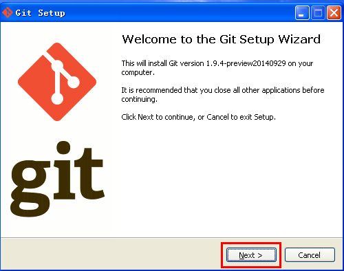
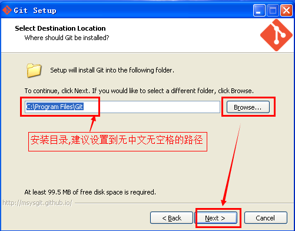
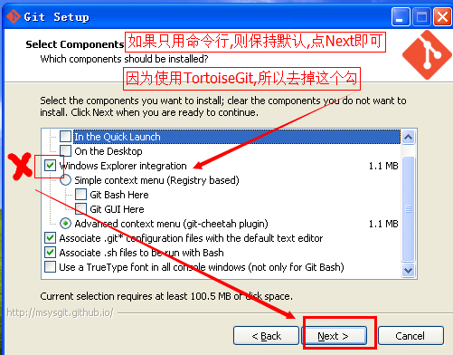
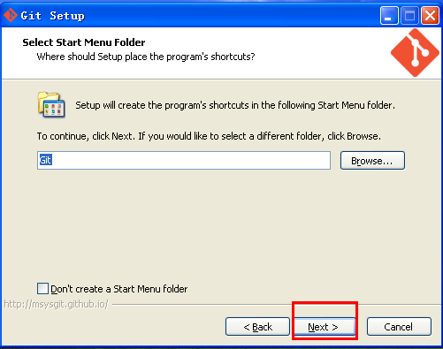
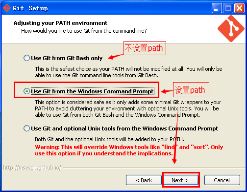
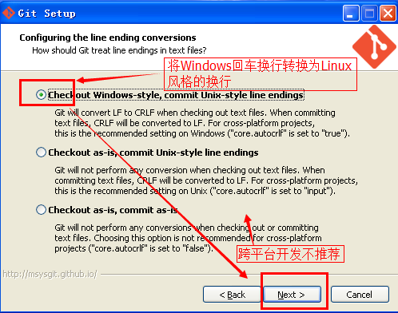
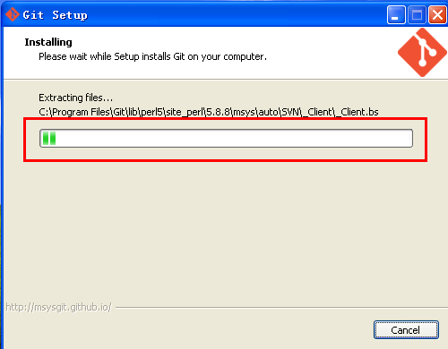
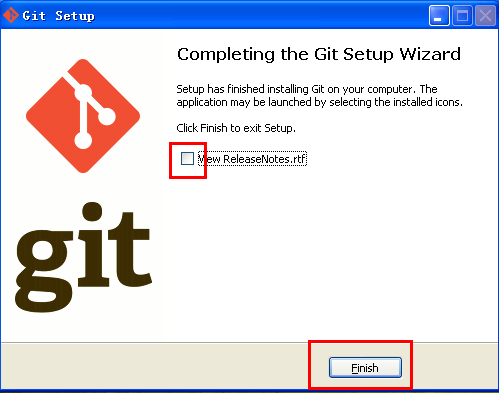
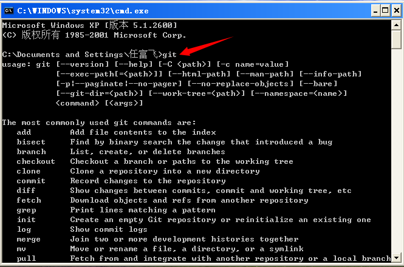

Git安装与配置
==

## 下载Git安装包
0.TortoiseGit-1.8中文版与Git安装包: [http://download.csdn.net/download/renfufei/8204699](http://download.csdn.net/download/renfufei/8204699)

1. 首先打开 Git 的官方网站: [http://git-scm.com/](http://git-scm.com/)
2. 然后找到下载页面: [http://git-scm.com/downloads](http://git-scm.com/downloads)
3. 找到Windows版本的下载页面: [http://git-scm.com/download/win](http://git-scm.com/download/win)
4. 因为准备使用TortoiseGit做图形客户端,所以就不选择Git GUI 版本. 打开Windows的下载页面后,应该会自动弹出下载框，选择保存即可. 如果没有弹出,可以右键点击页面中的 [click here to download manually.](https://github.com/msysgit/msysgit/releases/download/Git-1.9.4-preview20140929/Git-1.9.4-preview20140929.exe),选择另存为即可.
5. 建议将下载好的软件安装包统一分类放到某个目录,如: `E:\SOFT_N\Tools_ALL\Git_ALL`, 方便以后查找使用.
6. 文件通过浏览器下载完成后,需要修改文件的锁定属性,特别是 **.zip** 文件和 **.chm** 文件(否则打开chm会显示404). 右键点击下载的文件,选择属性,然后点击"解除锁定"按钮,确定即可. 如下图所示:

去除文件锁定(非必须)

7.然后鼠标双击安装文件, 如果有Windows拦截警告，允许即可

8.然后出现安装向导界面,点击下一步(Next)即可:

安装向导界面

9.接着出现授权信息界面， Next即可:

授权信息界面

10.选择安装路径

11.选择文件关联,如果你不清楚,直接默认,下一步即可. 如果你想要右键菜单清爽一点,就把下图中的那个勾给去掉. 这里把所有勾去掉也是可以的,更清爽(我就是这么干的).

12.接着出现开始菜单文件夹,默认,下一步即可:

13.然后是是否配置Path的配置,选择中间一个,可以通过 Windows命令行(CMD)调用 git 命令。 然后点击下一步.

14.选择回车换行的格式。默认即可.(检出时转换为Windows风格,提交时转换为Linux风格.)

回车换行风格(CRLF-LF)

15.然后是安装进度界面

16.安装完成. 去掉那个查看版本说明的复选框,点击完成(Finish)按钮即可.

17.可以在cmd里面测试是否设置了Path,是否安装成功.
在CMD中输入 `git` 或者 `git --version` 试试:

18.如果按照前面的步骤安装下来,那么 git 程序所在的路径已经添加到系统 PATH 中(path就相当于系统自动查找路径列表),所以可以直接在任意路径的 cmd 下执行 git 命令. 如果没有添加,则需要 cd 切换到Git所在的 bin 目录下,才能执行 git 命令.

19.设置你自己的昵称与email

设置本地机器默认commit的昵称与Email. 请使用有意义的名字与email.

	git config --global user.name "tiemaocsdn"
	git config --global user.email "tiemaocsdn@qq.com"

这个姓名与Email只用于日志标识.实际推送到GitHub等在线仓库时,要用有操作权限的账号登录.

查看git配置可以使用 `-l` 参数(l 就是 list 的首字母,L的小写):

	git config -l

在某个项目根路径下面可以设置单独的Email与姓名.

	git config user.name "tiemaocsdn"
	git config user.email "tiemaocsdn@qq.com"

可以看到, 配置单个项目时,少了 `--global` 参数.

## 相关网站:##

- Git下载页面: [http://git-scm.com/download/](http://git-scm.com/download/)

- Win7_8下的Git: [https://windows.github.com/](https://windows.github.com/)(这应该是Github在windows下的官方软件,但不支持XP)

##相关文章

1. [目录](GitHelp.md)
1. [安装及配置Git](01_GitInstall.md)
1. [安装及配置TortoiseGit](02_TortoiseGit.md)
1. [基本使用方法](03_Usage.md)
1. [MarkDown示例](04_MarkDownDemo.md)

日期: 2014-11-27

作者: [铁锚: http://blog.csdn.net/renfufei](http://blog.csdn.net/renfufei)
