TortoiseGit安装与配置
==

TortoiseGit 简称 tgit, 中文名海龟Git. 海龟Git只支持神器 Windows 系统, 有一个前辈海龟SVN, TortoiseSVN和TortoiseGit都是非常优秀的开源的版本库客户端. 分为32位版与64位版.并且支持各种语言,包括简体中文(Chinese, simplified; zh_CN).

**注意:** XP系统已经不支持最新的安装包,请尽量使用 Win7 或更高版本的操作系统.

## 下载

**0.** TortoiseGit-1.8中文版与Git安装包:  [http://download.csdn.net/download/renfufei/8204699](http://download.csdn.net/download/renfufei/8204699)

1. TortoiseGit下载页面: [http://download.tortoisegit.org/tgit/](http://download.tortoisegit.org/tgit/)

**2.**打开下载页面后, 找到对应的 Latest stable release (最新稳定版) 目录,如当前为 [1.8.12.0版本](http://download.tortoisegit.org/tgit/1.8.12.0/) , 点击进入对应的页面. 

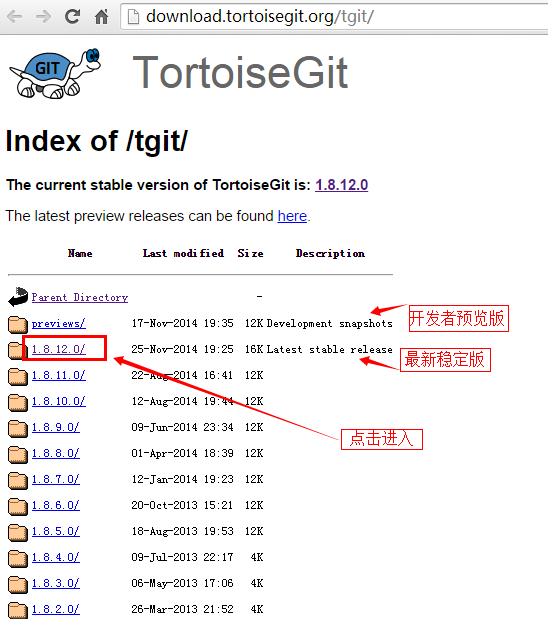

选择一个版本

**3.**进入具体版本页面后,根据Windows操作系统版本选择相应的程序安装包和中文语言包.

比如, 32位系统(带32bit,或者 x86, i586等标识).

- 32位程序安装包下载地址: [http://download.tortoisegit.org/tgit/1.8.12.0/TortoiseGit-1.8.12.0-32bit.msi](http://download.tortoisegit.org/tgit/1.8.12.0/TortoiseGit-1.8.12.0-32bit.msi)
- 32位中文语言包下载地址: [http://download.tortoisegit.org/tgit/1.8.12.0/TortoiseGit-LanguagePack-1.8.12.0-32bit-zh_CN.msi](http://download.tortoisegit.org/tgit/1.8.12.0/TortoiseGit-LanguagePack-1.8.12.0-32bit-zh_CN.msi)

同样, 64位系统(带64bit,或者 x86_64, x64等标识).

- 64位程序安装包下载地址: [http://download.tortoisegit.org/tgit/1.8.12.0/TortoiseGit-1.8.12.0-64bit.msi](http://download.tortoisegit.org/tgit/1.8.12.0/TortoiseGit-1.8.12.0-64bit.msi)
- 64位中文语言包下载地址: [http://download.tortoisegit.org/tgit/1.8.12.0/TortoiseGit-1.8.12.0-64bit.msi](http://download.tortoisegit.org/tgit/1.8.12.0/TortoiseGit-1.8.12.0-64bit.msi)

版本下载页面如下所示:

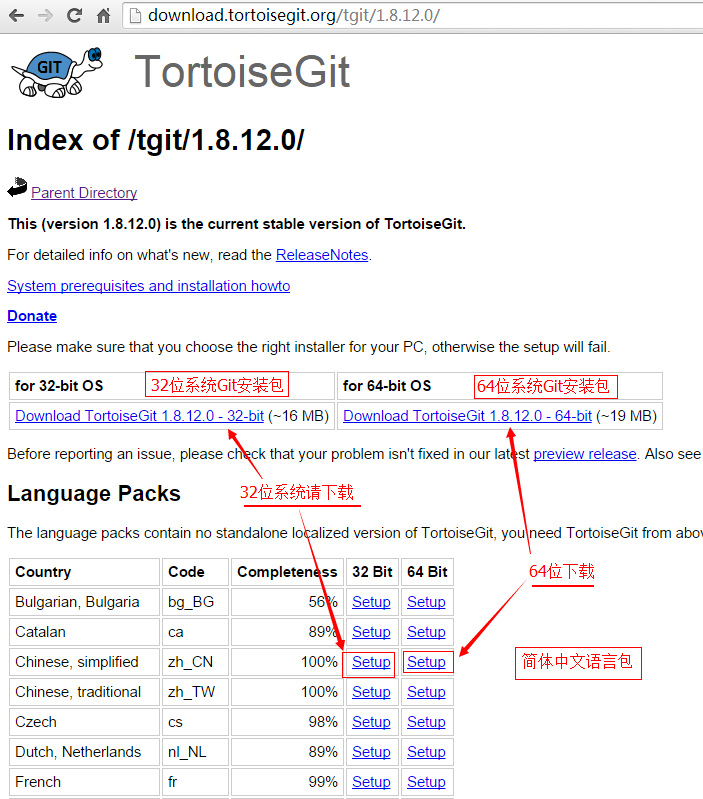

请下载对应的安装包和语言包,放到某个目录下. 然后像上一节所说的 Git 安装包一样, 查看下载完成的文件属性,解除锁定.

## 安装

**4.** 我们需要先安装程序包,然后安装语言包(LanguagePack). 因为TortoiseGit 只是一个程序壳,必须依赖一个 Git Core,也就是上一节我们安装的 Git. 所以安装前请确定已完成[上一节的操作](01_GitInstall.md). 下面以64位版本为演示(64,32位除文件名不一样,其他的操作都一致)

**5.** 双击安装程序 `TortoiseGit-1.8.12.0-64bit.msi`. 弹出安装向导界面:

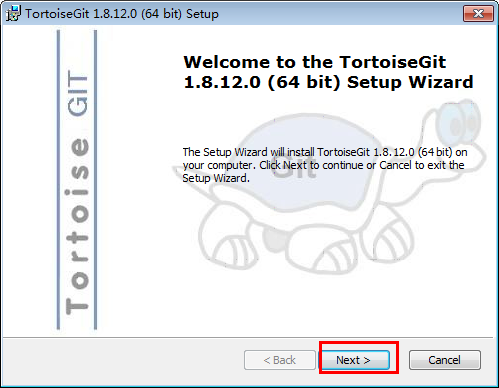

**6.**下一步,进入版权信息界面. 直接点击下一步(Next)即可.

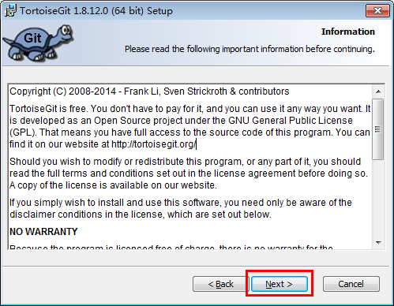

**6.1**下一步,选择SSH客户端. 可以选择 TortoiseGitPlink(位于TortoiseGit安装目录/bin 下), 也可以选择 Git 默认的SSH客户端,位于 Git安装目录/bin/ssh.exe(如果配置了 Path,那直接是 ssh.exe)

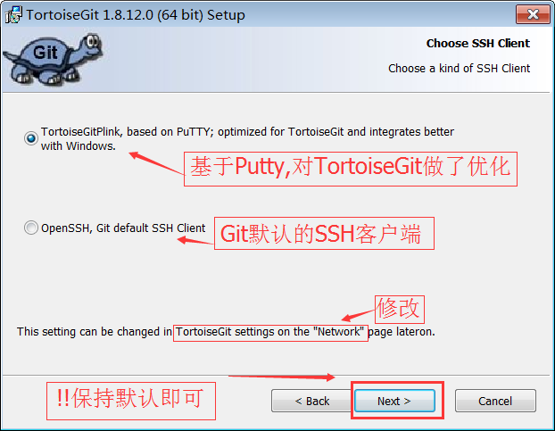

**7.** 接着是选择安装目录,可以保持默认,或者安装到开发环境目录下,安装的程序组件保持默认即可：

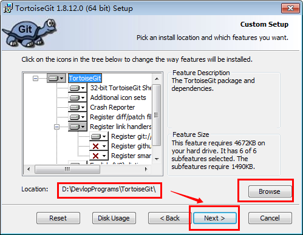

**8.**下一步到确认安装界面,点击 Install按钮安装即可,如下图所示:

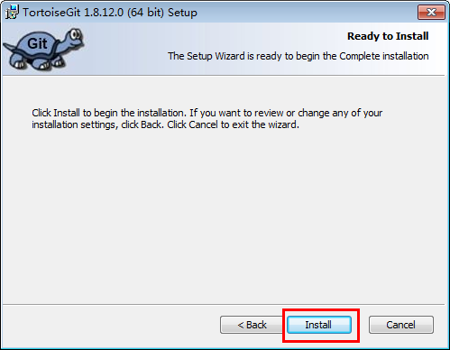

**9.**安装完成,点击 Finish 按钮即可:

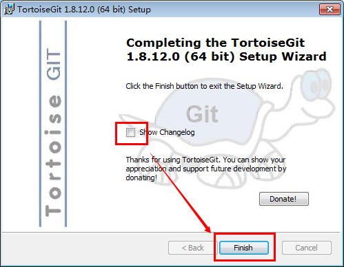

**9.1** 如果以前有老版本,则选择覆盖,关闭旧程序并尝试重启即可

**10.** 安装语言包

双击打开 `TortoiseGit-LanguagePack-1.8.12.0-64bit-zh_CN.msi` ,则弹出语言包安装向导:

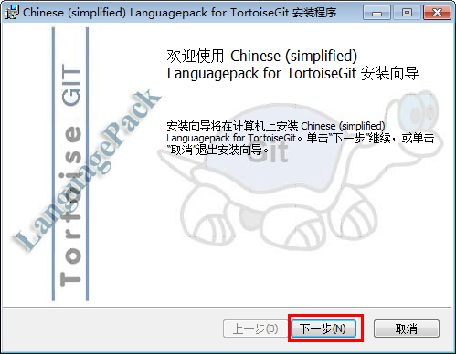

**11.** 点击下一步(Alt+N), 语言包会自动安装完成:

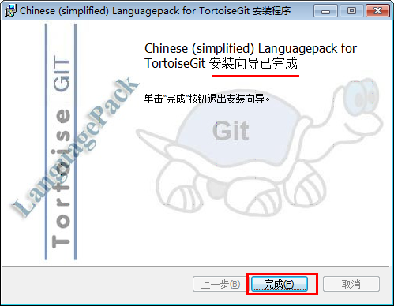

点击完成按钮即可

## 配置

**1.** 首先,请选定一个存放Git项目的目录,这样管理方便. 如: `F:\STUDY\GIT_STUDY` , 然后在资源管理器中打开.

**2.** 在空白处点击鼠标右键, 选择 --> TortoiseGit --> Settings, 然后就可以看到配置界面:
 
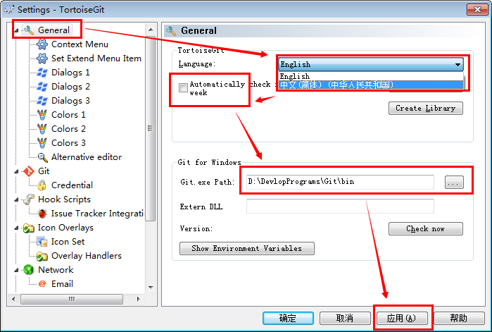

**3.** 选中General,在右边的 Language中选择中文. 不勾选自动升级的复选框,可能还需要指定 Git.exe 文件的路径,如 "`D:\DevlopPrograms\Git\bin`". 完成后,点击应用,确定关闭对话框.(当然,你也可以继续使用英文)

**4.** 再次点击鼠标右键,可以看到弹出菜单中已经变成中文. 原来的 **Settings** 变成 **设置**;  **Clone** 变为 **克隆**.

**5.** 配置右键菜单. 在设置对话框中,点选左边的"右键菜单",然后在右边将所有的复选框都去掉,这样右键菜单显得比较干净:

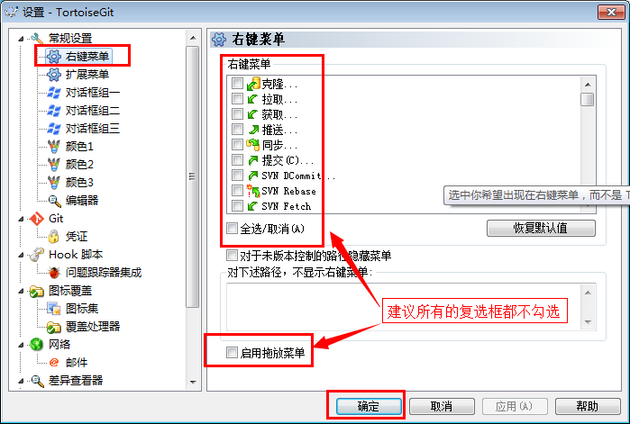

**6.**设置记住密码

进入设置, 点选左边的Git标签.可以发现,右边可以配置用户的名字与Email信息. 如下图所示:

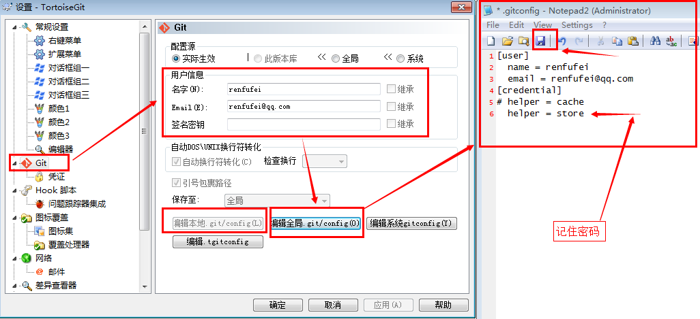

因为当前还没有本地项目,所以 “`编辑本地 .git/config(L)`” 按钮处于灰色不可用状态,如果在某个本地Git项目下打开配置对话框,那么这个按钮就可用,然后就可以编辑此项目的一些属性。

点击 “`编辑全局 .git/config(O)`”按钮,会使用记事本打开全局配置文件,在全局配置文件中,在后面加上下面的内容:

	[credential]
	helper = store

完成后保存,关闭记事本,确定即可。

则当你推送项目到GitHub等在线仓库时,会记住你输入的用户名和密码(这里不是用户的姓名和Email哦.)

如果你编辑的是 `本地 .git/config(L)`，其实这个翻译为**本地**有点问题,应该叫**`局部`**,也就是在某个项目下面设置,只对此项目有效.配置是一样的.

- **用户名**: 就是你注册的账号,如: tiemaocsdn
- **密码**:   当然是注册时填写的密码: *********
- **Email**: 是你的联系邮箱,给别人联系你时使用
- **用户姓名/昵称**: 可以随便取,但最好有点意义

## 示例

克隆一个项目:

在工作目录下,如 “`F:\STUDY\GIT_STUDY`”中,鼠标右键点击空白处,选择:  TortoiseGit --> 克隆...(clone...) ；则会弹出克隆对话框,如下图所示:

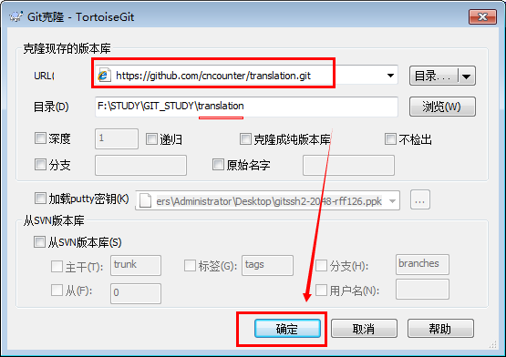

在URL中填写项目的访问地址,如:

	https://github.com/cncounter/translation.git

本地目录,你也可以自己选择,一般默认即可.然后点击"确定"按钮,开始克隆项目. 根据项目大小,时间会不一样. 克隆完成后,如果没有错误,会给出提示:

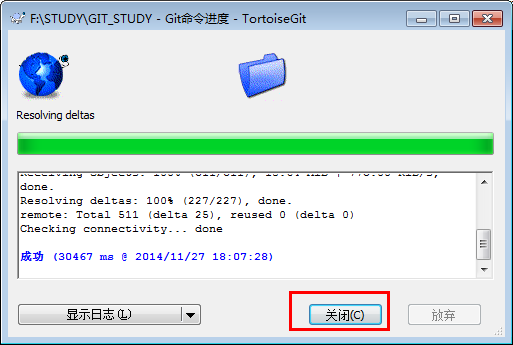

- **克隆**: 就类似于拷贝,但是因为 SVN,Git之类的版本库存储时都是一个(数据)库,所以叫克隆.
- **Git项目的URL**: 可以在线访问Git项目页面,在右侧可以看到 SSH, HTTPS, SVN的访问路径.

例如:

- 页面地址: [https://github.com/cncounter/translation](https://github.com/cncounter/translation)
- HTTPS :   [https://github.com/cncounter/translation.git](https://github.com/cncounter/translation.git)
- SSH : [git@github.com:cncounter/translation.git](git@github.com:cncounter/translation.git)
- SVN : [https://github.com/cncounter/translation](https://github.com/cncounter/translation)

可以发现,大同小异. 如下图所示:

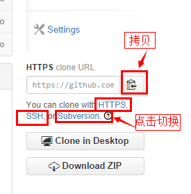

##相关文章

1. [目录](GitHelp.md)
1. [安装及配置Git](01_GitInstall.md)
1. [安装及配置TortoiseGit](02_TortoiseGit.md)
1. [基本使用方法](03_Usage.md)
1. [MarkDown示例](04_MarkDownDemo.md)
1. [解决 TortoiseGit 诡异的 Bad file number 问题](05_BadFileNumber.md)

日期: 2014-11-27

作者: [铁锚: http://blog.csdn.net/renfufei](http://blog.csdn.net/renfufei)
