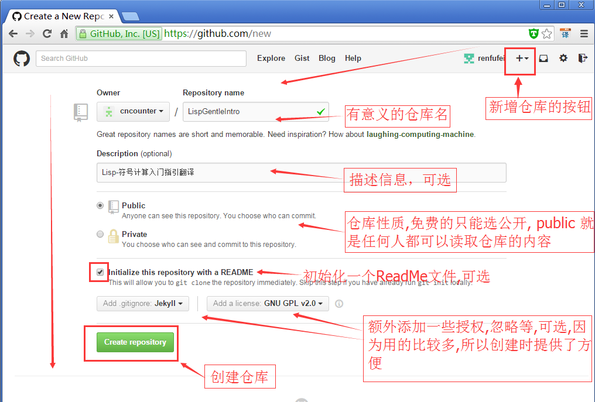
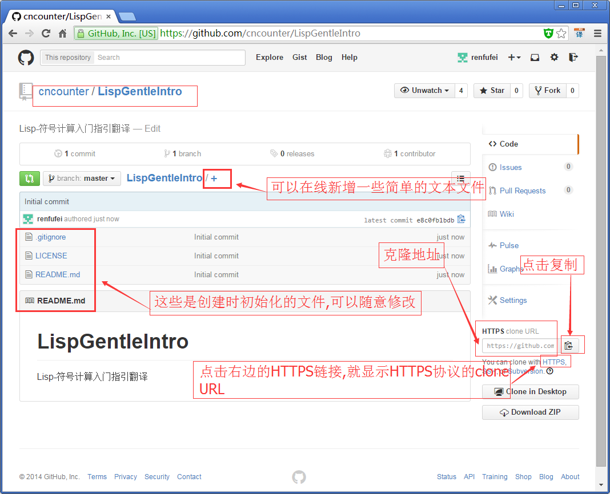
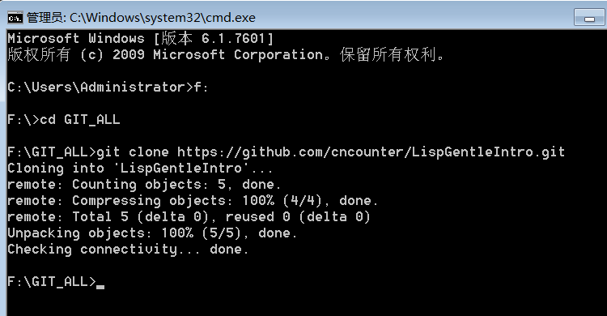

Git与TortoiseGit基本操作
==

#

## 1. GitHub操作

本节先简单介绍 git 的使用与操作, 然后再介绍 TortoiseGit 的使用与操作.

先看看SVN的操作吧,  最常见的是 检出(Check out ...), 更新 (Update ...), 以及 提交(Commit ...); 相当于有一个服务器端, 可以多个客户端进行访问和操作.

Git是SVN以后的新一代的版本控制系统/协议. 适合于大规模的开源软件多人协作的开发. 有一个总仓库(如GitHub,CSDN,OSchina等提供), 每个客户端都有一个本地仓库(这个本地仓库有点对应于SVN的服务端仓库), 以及一个可以看见的本地项目.

让我们想想,至少需要有哪些功能.以 GitHub为例,首先,必须得有一个线上仓库(Repository), 这首先得新建一个仓库.

要创建仓库,必须得先**注册账号**. 请参考: [创建GitHub技术博客全攻略: http://blog.csdn.net/renfufei/article/details/37725057](http://blog.csdn.net/renfufei/article/details/37725057)

然后,登录 GitHub, 在右上角找到 New Repository 或者 加号下拉按钮(+),点击进入新建仓库页面: [https://github.com/new](https://github.com/new), 如下图所示:

依次填写仓库名,以及其他信息后,点击 "**Create repository**" 按钮,即可创建一个在线仓库. 因为这个仓库是挂在你的账号下的,所以可以是任意合法的字符,只要和你的其他仓库不冲突即可.

仓库创建成功后,就会进入仓库预览页面, 如下图所示:

然后，我们可以点击右边的 HTTPS 链接, 上方的文本框里面就显示了 HTTPS协议下的仓库访问地址, 可以点击进去全选,也可以点击右边的复制按钮复制到剪贴板. 例如,刚刚创建的项目访问路径是:

	https://github.com/cncounter/LispGentleIntro.git

是一个以  https:// 开始,以 .git 结尾的 URL,根据提示,叫做 clone URL. 

好了,仓库创建完成,可以进入下一步了.

## 2. Git使用与操作

如果你偏爱命令行,那么可以简单参考下这一小节. 否则,请往下翻,直接看 **[TortoiseGit使用与操作](#tgitoperate)**

### 2.1 克隆项目(Clone ...)

Win+R 快捷键打开运行对话框,输入 `cmd` 回车, 在 cmd 中(其实在 GitBash中也可以), cd 切换到存放git项目的目录, 如:

	Microsoft Windows [版本 6.1.7601]
	版权所有 (c) 2009 Microsoft Corporation。保留所有权利。
	
	C:\Users\Administrator>F:
	
	F:\>cd GIT_ALL
	
	F:\GIT_ALL>

然后执行命令: `git clone https://github.com/cncounter/LispGentleIntro.git` ,就会把项目克隆到当前目录下, 项目的目录名字默认为 **LispGentleIntro**.

	F:\GIT_ALL>git clone https://github.com/cncounter/LispGentleIntro.git
	Cloning into 'LispGentleIntro'...
	remote: Counting objects: 5, done.
	remote: Compressing objects: 100% (4/4), done.
	remote: Total 5 (delta 0), reused 0 (delta 0)
	Unpacking objects: 100% (5/5), done.
	Checking connectivity... done.

命令行截图如下:

然后可以 `cd` 切换到 LispGentleIntro 目录, 新增或者修改某些文件.这里只是模拟一下操作. 实际情况可能是 使用 Eclipse 导入项目(不要拷贝,Copy...)进行一些编辑, 然后将当前目录下的所有有变动的文件告诉索引库,接着提交到本地仓库.

	F:\GIT_ALL>cd LispGentleIntro
	
	F:\GIT_ALL\LispGentleIntro>echo some content >> cncounter.txt
	
	F:\GIT_ALL\LispGentleIntro>echo by cncounter >> README.md
	
	F:\GIT_ALL\LispGentleIntro>git add .
	
	F:\GIT_ALL\LispGentleIntro>git commit -m "add some info."
	[master 86d090f] add some info.
	 2 files changed, 4 insertions(+)
	 create mode 100644 cncounter.txt

提交到本地仓库有什么好处呢? 本地仓库就是一个版本管理库,我们在编写代码时,如果写错了,那么可能需要 Ctrl+Z 来撤销,撤销撤销,如果很多,而且跨文件,就很麻烦,可能需要Copy文件什么的。 这时候本地仓库就很有用了. 修改到某个阶段,然后就提交到本地仓库. 可以有效防止丢失,方便回退. 而且,提交到本地仓库不会影响别人看到的内容(只有本机可见).

如果完成到一定程度,那么可以推送到远端在线仓库. 推送之前,请确保你已经设置了全局的 `user.name` 和 `user.email`, 如果没有设置,或者不想使用全局的信息,可以在当前项目下设置:

	F:\GIT_ALL\LispGentleIntro>git config user.name "renfufei"
	
	F:\GIT_ALL\LispGentleIntro>git config user.email "renfufei@qq.com"

接着,可以执行推送(push), 推送就是将已经提交到本地仓库的那部分内容给推到远端在线仓库.(修改了,但没提交的那部分内容,不会被推送). 执行 `git push` 命令即可:

## 3. <a name="tgitoperate">TortoiseGit使用与操作</a>

## 4. 更复杂的操作

当然,多人协作过程中,避免不了会有各种意外情况需要处理,比如冲突,合并,变基等等, 关于这些复杂的操作,请参考: [GotGitHub系列: http://www.worldhello.net/gotgithub/01-explore-github/010-what-is-github.html](http://www.worldhello.net/gotgithub/01-explore-github/010-what-is-github.html)

## 5. 相关文章

1. [目录](GitHelp.md)
1. [安装及配置Git](01_GitInstall.md)
1. [安装及配置TortoiseGit](02_TortoiseGit.md)
1. [基本使用方法](03_Usage.md)
1. [MarkDown示例](04_MarkDownDemo.md)
1. [解决 TortoiseGit 诡异的 Bad file number 问题](05_BadFileNumber.md)

日期: 2014-11-27

作者: [铁锚: http://blog.csdn.net/renfufei](http://blog.csdn.net/renfufei)
