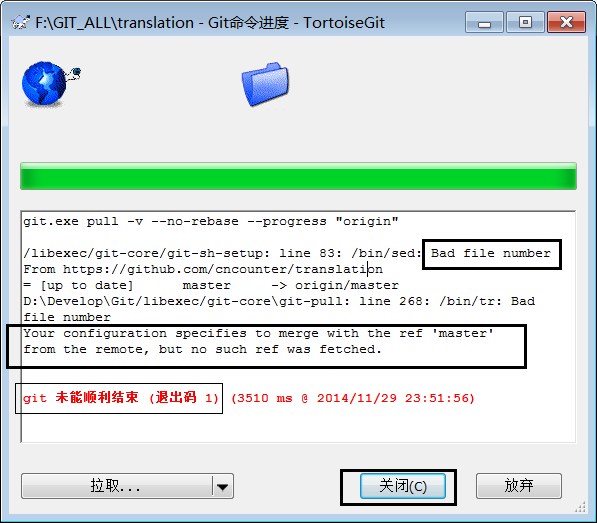
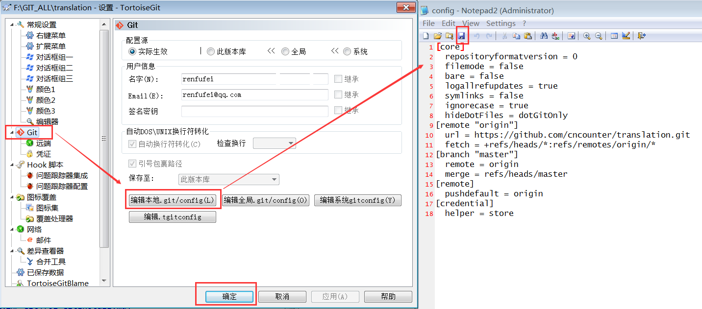
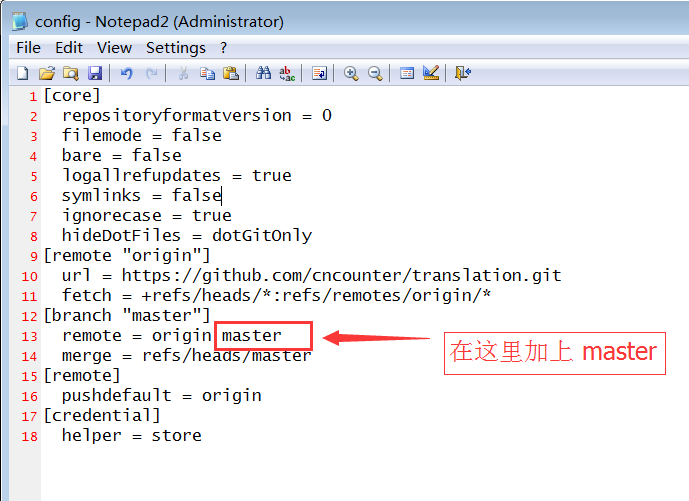
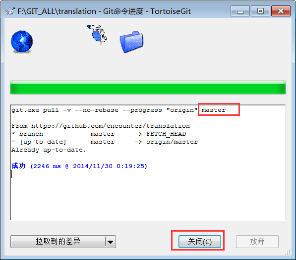

解决 TortoiseGit 诡异的 Bad file number 问题
==

##问题描述

昨天,以及今天(2014-11-29),使用 TortoiseGit 时碰到了一个诡异的问题. 卸载，清理注册表,重装，重启，各种折腾以后,还是不能解决. 但是23.45分一过,突然灵光一闪,解决了.

问题是这样的. 使用命令行的 `git push`, `git fetch`, `git pull` 什么的都没问题. 但是使用 TortoiseGit 执行拉取(pull ...) 命令时, 就给报错, 报错信息如下:

	git.exe pull -v --no-rebase --progress "origin"
	
	/libexec/git-core/git-sh-setup: line 83: /bin/sed: Bad file number
	From https://github.com/cncounter/translation
	= [up to date]      master     -> origin/master
	D:\Develop\Git/libexec/git-core\git-pull: line 268: /bin/tr: Bad file number
	Your configuration specifies to merge with the ref 'master'
	from the remote, but no such ref was fetched.
	
	
	git 未能顺利结束 (退出码 1) (3510 ms @ 2014/11/29 23:51:56)

死活各种折腾,根据提示,说: 你的配置指定了去合并(merge)远端的'master',但没有获取(fetch)到这个引用(ref).

然后各种测试,各种折腾，总算发现了一点规律. 如果 GitHub 在线仓库只有一个分支, 也就是 master 时， Pull 拉取就不报错, 如果在线的远端仓库有多个分支，如 `master` 加上 `gh-pages` 时,一拉取就报这个错. 但使用 git 命令行就没有这个问题. 那么问题来了, 肯定是 TortoiseGit 的哪里配置不对.

想去想来,突然想在 局部仓库的配置文件中修改下, 先看看会报错的这种配置:

	[core]
		repositoryformatversion = 0
		filemode = false
		bare = false
		logallrefupdates = true
		symlinks = false
		ignorecase = true
		hideDotFiles = dotGitOnly
	[remote "origin"]
		url = https://github.com/cncounter/translation.git
		fetch = +refs/heads/*:refs/remotes/origin/*
	[branch "master"]
		remote = origin
		merge = refs/heads/master
	[remote]
		pushdefault = origin
	[credential]
		helper = store

###查看方法:

- 打开Git项目根目录, 找到 .git 文件夹,进去里面编辑 `config` 这个文件,注意此文件没有后缀.
- 还可以在项目根目录下点击鼠标右键, 选择 TortoiseGit --> Settings(设置 S), 然后选择左边的 Git --> 右边的 **编辑本地.git/config** 按钮,即可打开这个文件,如下图所示:

那么，看看一个正常的pull拉取操作会有哪些日志输出呢?
	
	git.exe pull -v --no-rebase --progress "origin" master
	
	From https://github.com/renfufei/asynquence
	* branch            master     -> FETCH_HEAD
	= [up to date]      master     -> origin/master
	Already up-to-date.
	
	成功 (5959 ms @ 2014/11/30 0:11:27)

一对比就发现第一行 git pull ..... 最后面少了一个 master. 于是想着在 config 文件里面加上这个 master 看看行不行.

修改后的配置如下:

	[core]
		repositoryformatversion = 0
		filemode = false
		bare = false
		logallrefupdates = true
		symlinks = false
		ignorecase = true
		hideDotFiles = dotGitOnly
	[remote "origin"]
		url = https://github.com/cncounter/translation.git
		fetch = +refs/heads/*:refs/remotes/origin/*
	[branch "master"]
		remote = origin master
		merge = refs/heads/master
	[remote]
		pushdefault = origin
	[credential]
		helper = store

需要注意的是,因为远端有多个分支,所以这个配置文件里,相应的就多了一个小节 `[branch "master"]`,而 这个小节下面的 remote = origion, 现在加上 master 变为:

		[branch "master"]
		remote = origin master
		merge = refs/heads/master 

如下图所示:

保存,再次测试,OK，可以正常拉取:

	git.exe pull -v --no-rebase --progress "origin" master
	
	From https://github.com/cncounter/translation
	* branch            master     -> FETCH_HEAD
	= [up to date]      master     -> origin/master
	Already up-to-date.
	
	成功 (2246 ms @ 2014/11/30 0:19:25)

注意看到, 在第一行 git.exe pull .... 最后面多出了一个 master:

好了,问题完美解决.

### 总结

有些日子，不适合写代码，也不适合调程序, 但适合填坑, 也许坑填的多了,时间一转,问题就解决了。

##相关文章

1. [目录](GitHelp.md)
1. [安装及配置Git](01_GitInstall.md)
1. [安装及配置TortoiseGit](02_TortoiseGit.md)
1. [基本使用方法](03_Usage.md)
1. [MarkDown示例](04_MarkDownDemo.md)
1. [解决 TortoiseGit 诡异的 Bad file number 问题](05_BadFileNumber.md)

日期: 2014-11-27

作者: [铁锚: http://blog.csdn.net/renfufei](http://blog.csdn.net/renfufei)
