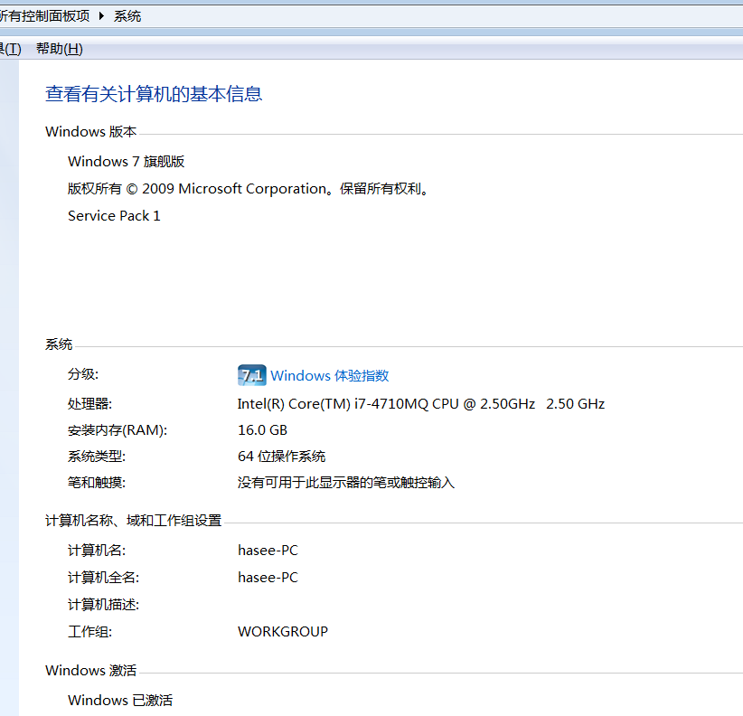
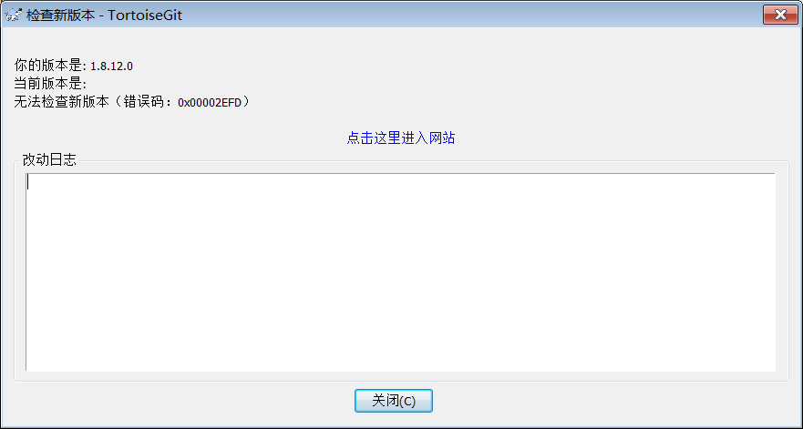
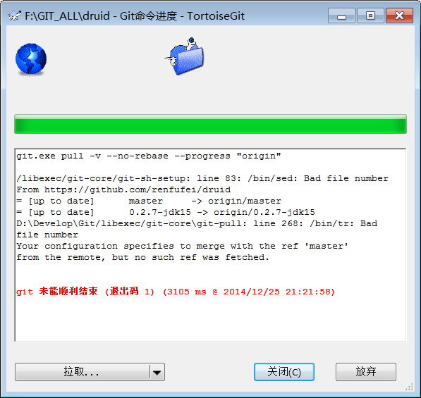

TortoiseGit的BUG描述
==

版本信息如下:

	TortoiseGit 1.8.12.0 (D:\Develop\TortoiseGit\bin\) 
	git version 1.9.4.msysgit.2 (D:\Develop\Git\bin) 

下载链接为: [http://download.csdn.net/download/renfufei/8204699](http://download.csdn.net/download/renfufei/8204699)

我的笔记本操作系统以及配置信息如下:

	Win7旗舰版SP1,64位:

准备更新时,提示信息如下所示:
(原因可能是大陆的GFW屏蔽)

相关文件拷贝到 files_git_1.9.4 目录下.

Pull时报如下信息:

	git.exe pull -v --no-rebase --progress "origin"
	
	/libexec/git-core/git-sh-setup: line 83: /bin/sed: Bad file number
	From https://github.com/renfufei/druid
	= [up to date]      master     -> origin/master
	= [up to date]      0.2.7-jdk15 -> origin/0.2.7-jdk15
	D:\Develop\Git/libexec/git-core\git-pull: line 268: /bin/tr: Bad file number
	Your configuration specifies to merge with the ref 'master'
	from the remote, but no such ref was fetched.
	
	
	git 未能顺利结束 (退出码 1) (3105 ms @ 2014/12/25 21:21:58)

截图如下所示:

所使用的本地 git config(L)配置信息如下:

	[core]
		repositoryformatversion = 0
		filemode = false
		bare = false
		logallrefupdates = true
		symlinks = false
		ignorecase = true
		hideDotFiles = dotGitOnly
	[remote "origin"]
		url = https://github.com/renfufei/druid.git
		fetch = +refs/heads/*:refs/remotes/origin/*
		puttykeyfile = 
	[branch "master"]
		remote = origin
		merge = refs/heads/master

全局git信息如下:

	[user]
		name = renfufei
		email = renfufei@qq.com
	[push]
		default = simple

系统gitconfig信息如下:

	[core]
		symlinks = false
		autocrlf = true
	[color]
		diff = auto
		status = auto
		branch = auto
		interactive = true
	[pack]
		packSizeLimit = 2g
	[help]
		format = html
	[http]
		sslCAinfo = /bin/curl-ca-bundle.crt
	[sendemail]
		smtpserver = /bin/msmtp.exe
	
	[diff "astextplain"]
		textconv = astextplain
	[rebase]
		autosquash = true

然后升级为 git 1.9.5; 再次pull,报同样的错误.

修改本地配置文件,

	[branch "master"]
		remote = origin
		merge = refs/heads/master

修改为:

	[branch "master"]
	#	remote = origin
		merge = refs/heads/master

或者

	[branch "master"]
		remote = origin master
		merge = refs/heads/master

则可以成功 pull.