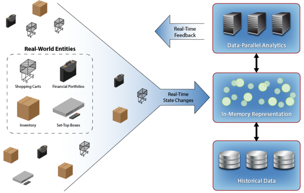
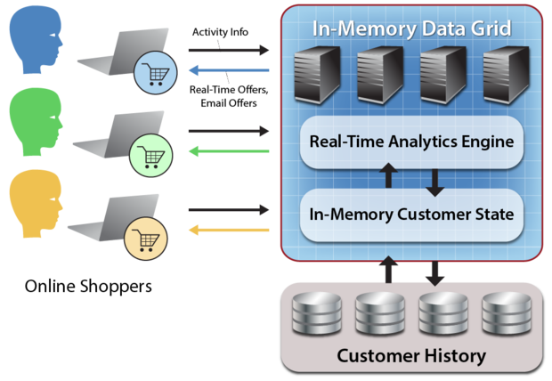

内存计算带来可操作的实时智能系统
==

## 副标题: 内存数据网格填平了实现作战情报的一些大坑 ##

操作系统管理我们的财务状况,购物、设备等等。 添加实时分析这些系统使他们能够立即响应不断变化的条件和提供立即的、有针对性的反馈。 这种分析的使用被称为作战情报,和需要快速增长。

例如,金融交易应用程序必须迅速应对市场环境波动随着市场通过交易系统数据流。 电子商务系统必须协调订单与库存的变化在一个激动人心的基础上,和他们需要快速应对的购物行为提供个性化的推荐。 智能grid-monitoring系统需要不断分析遥测外,还可以从许多别的来源获得预测和应对电网意想不到的变化。

在所有的这些例子中,生活,快速变化的数据集生产活动,正在进行的操作。 的优势应对这种实时数据实时——给消费者促销活动基于他们的购物车的内容,例如——都是引人注目的,触手可及。 内存中的计算和方式来表述数据并行处理的组合分析,一个商品服务器集群上运行,允许系统不断跟踪和分析实时数据,提取重要的模式,产生即时反馈,引导系统的行为。 这一技术可以发现在一个类别的软件称为内存数据网格(IMDGs)已经发展在过去的十年里,协助管理运营系统。

内存数据网格是什么?

IMDGs存储数据在内存和分配在一个商品服务器集群(或虚拟服务器在云环境中)。 使用面向对象的数据存储模型,IMDGs提供api用于读取和更新数据对象具有非常低的延迟,通常在不到一毫秒的时间,这取决于对象的大小。 这使得操作系统能够使用IMDGs存储、访问和更新日新月异,“活”的数据追踪系统的状态,同时保持快速访问时间甚至随着存储工作负载。

IMDGs有“弹性”存储,您可以增加或减少存储容量和吞吐量只需添加或删除服务器。 此外,他们将内存数据存储与高可用性,它是连续可用的。 服务器可以失败,恢复——或者是加减从集群——在不影响操作。

也许最重要的是,IMDGs可以利用集群的计算能力来执行对存储数据的方式来表述数据并行处理计算。 因为数据和计算能力居住在一起,从而避免运动数据,IMDGs可以提供快速的结果(通常是在不到一秒)以最小的开销。 这使得IMDGs适合快速分析操作系统的状态,并提供即时反馈。

可以使用一个内存中的数据网格模型各种实际系统,如网上购物、股票交易、库存管理、和看电视,并提供即时反馈,一个操作系统。
建模操作系统作战情报

操作系统通常包含大量的高度动态实体,如股票投资组合在一个金融交易系统中,在线购物者浏览一个电子商务的网站,或观众控制机顶盒的有线电视网络。 这些实体创建一个流必须相关的事件,富含离线数据(例如,客户偏好或历史),和分析发现模式和趋势。

如果这个分析是在实时完成,反馈可以提供给操作系统,增强其功能,并提高其有效性。 例如,股票交易可以触发捕捉市场波动,购物者可以提供相关的,个性化的推荐,和有线电视观众可以接到特殊促销活动基于他们浏览偏好和当前的选择。

流行的方法实现实时分析重点分析传入的数据流,并对数据在这些流。 例子包括复杂事件处理中使用金融服务和流处理使用 apache风暴 最初设计的并行平台,分析Twitter信息流。

然而,专注于事件处理并没有提供一个完整的框架建模现实世界的实体的行为,除了事件流,都必须考虑历史和上下文。 使用一个内存模型的真实世界的实体管理的操作系统,IMDG可以关联传入的事件和丰富他们的离线信息保持全面的上下文,可以进行实时分析。 这一分析的输出然后可以直接回到美联储系统增值业务。 它还可以提供人员监控系统。

使用IMDGs实现作战情报

IMDGs确切地提供所需的技术实现主动实体在一个操作系统的内存模型,不断跟踪传入的事件从这些实体,丰富相关的历史信息和结构化并行分析聚合行为。 这个内存中表示利用IMDG面向对象的组织代表实体内存数据存储模型。

因为IMDG弹性和高可用性,它可以处理高度可变负载和运行在一个至关重要的操作系统。 IMDG方式来表述数据并行处理的计算引擎使它能够快速分析模型中的状态更改并提供即时反馈系统,而捕获总趋势新兴跨所有实体。

ScaleOut软件
一个典型用例是内存数据网格建模在线购物者和提供个性化推荐。 内存数据网格
考虑人口的点击流数据的分析网上购物者提供个性化的推荐。 IMDG可以维护一个内存模型的个人消费者,不断更新的点击流数据。 使用面向对象的方法,IMDG代表每个购物者的基于内存的对象,其中包含一个动态的集合以时间为顺序的点击流事件以及偏好和历史购物模式(从二级存储)。

这种面向对象的观点允许容易传入的事件相关,并且提供了连续的基础,购物活动的方式来表述数据并行处理分析,既能产生直接的、个性化的建议为个人消费者和寻找新兴的趋势在所有消费者最受欢迎的物品(如识别或评估响应销售)。

IMDG也提供了一个自然的软件架构,跟踪事件从有线电视机顶盒观众打开和关闭电视机和切换频道。 内存模型为每个机顶盒传入的事件相关,净化他们根据规则删除无趣的活动(如随机信道切换),和丰富他们的编程信息和已知的观众信息(历史、特点和偏好)。

这个集成设置每个观众提供了基础的数据进行增销建议程序或感兴趣的包,和分析可以并行执行所有活动的观众。 给你一个想法的力量IMDG,最近的一次模拟的性能结果10米生活有线电视机顶盒证明一个内存模型(大约80 gb的数据,包括副本)能够关联和丰富每秒25 k事件并完成所有10米的平行分析机顶盒每10秒一群12商品服务器托管在Amazon EC2。

总结

将实时智能操作系统的地方巨大需求计算引擎。 引擎必须能够摄取大量的传入的事件,关联和丰富的数据,然后快速分析。 必须提供反馈的机会存在利用分析,通常在毫秒或秒。

与弹性、基于内存的存储和计算方式来表述数据并行处理专门设计用于在操作系统中,IMDGs实施作战情报提供一个高效的平台。 主机的能力一个内存中的一个真实系统的模型,跟踪变化发生时,实时分析模型简化这个任务和提供所需的性能。 作战情报的好处只是开始被意识到。 是令人难以置信的机会。

原文链接: [In-memory computing brings real-time intelligence to operational systems](http://www.javaworld.com/article/2848034/data-storage/in-memory-computing-brings-real-time-intelligence-to-operational-systems.html)

原文日期: 2014-11-13

翻译日期: 2014-11-16

翻译人员: [铁锚: http://blog.csdn.net/renfufei](http://blog.csdn.net/renfufei)

CNCounter翻译文章目录: [https://github.com/cncounter/translation](https://github.com/cncounter/translation)
