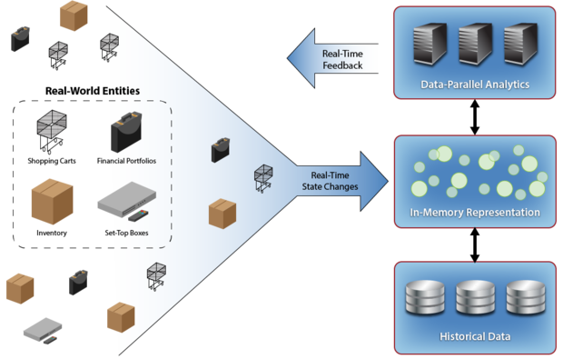
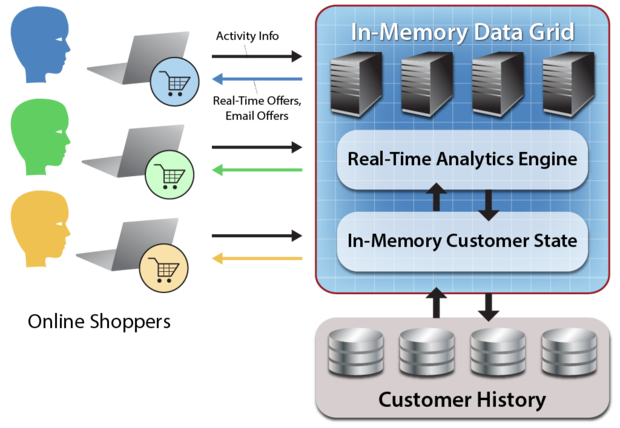

内存计算为运营系统带来实时智能
==

## 副标题: 内存数据网格填补了运营智能的关键空白 ##

运营系统管理着我们的财务、购物、设备等等。为这些系统加入实时分析，使它们能够立即响应不断变化的条件，并提供即时、有针对性的反馈。这种对分析的使用被称为运营智能(operational intelligence)，并且正在快速增长。

例如，金融交易应用程序必须在市场数据流经交易系统时迅速应对市场波动。电子商务系统必须时刻协调订单与库存的变化，还需要快速响应购物行为以提供个性化推荐。智能电网监控系统必须持续分析遥测数据以及其他来源的数据，以预测并应对电网的意外变化。

在所有这些例子中，实时、快速变化的数据集都是由持续进行的运营活动产生的。实时地响应这些实时数据所带来的优势——例如，根据消费者购物车的内容向他们提供促销活动——是引人注目的，也是触手可及的。内存计算与一种表达数据并行分析的方式相结合，运行在商用服务器集群上，使系统能够持续跟踪和分析实时数据，提取重要的模式，产生即时反馈，并引导系统的行为。这类技术可见于称为内存数据网格(in-memory data grids, IMDGs)的一类软件中，它们在过去的十年里不断发展，帮助管理运营系统。

内存数据网格是什么？

IMDG 将数据存储在内存中，并分布在一个商用服务器集群（或云环境中的虚拟服务器）上。IMDG 采用面向对象的数据存储模型，提供 API 用于读取和更新数据对象，延迟非常低，通常不到一毫秒，具体取决于对象的大小。这使得运营系统能够使用 IMDG 存储、访问和更新快速变化的、“活的”数据，以追踪系统的状态，同时即使存储工作负载不断增长也能保持快速访问。

IMDG 具有“弹性”存储，只需添加或移除服务器，就可以增加或减少存储容量和吞吐量。此外，它们将内存数据存储与高可用性结合起来，是持续可用的。服务器可以出现故障并恢复——或者从集群中添加或移除——而不会影响运营。

也许最重要的是，IMDG 可以利用集群的计算能力，对存储的数据执行数据并行处理计算。由于数据和计算能力驻留在一起，避免了数据移动，IMDG 可以以最小的开销提供快速的结果（通常不到一秒）。这使得 IMDG 适合快速分析运营系统的状态，并提供即时反馈。

可以用内存数据网格对各种实际系统建模，如网上购物、股票交易、库存管理和电视收视，并向运营系统提供即时反馈。

建模运营系统以实现运营智能

运营系统通常包含大量高度动态的实体，例如金融交易系统中的股票投资组合、浏览电子商务网站的在线购物者，或有线电视网络中控制机顶盒的观众。这些实体会产生一个事件流，必须将这些事件关联起来，用离线数据（例如客户偏好或历史记录）加以丰富，并进行分析以发现模式和趋势。

如果这种分析是实时完成的，就可以将反馈提供给运营系统，以增强其能力并提高其有效性。例如，股票交易可以捕捉市场波动，购物者可以得到相关的个性化推荐，有线电视观众可以根据其浏览偏好和当前的选择获得特别促销。

实现实时分析的流行方法侧重于分析传入的数据流，并对这些流中的数据进行分析。例子包括金融服务中使用的复杂事件处理(complex event processing)，以及使用 Apache Storm 的流处理(stream processing)——它最初是为在并行平台上分析 Twitter 信息流而设计的。

然而，仅仅专注于事件处理，并不能提供一个完整的框架来对现实世界实体的行为建模——除了事件流之外，还必须考虑历史和上下文。使用运营系统所管理的现实世界实体的内存模型，IMDG 可以关联传入的事件，并用离线信息加以丰富，以保持全面的上下文，从而进行实时分析。这种分析的输出随后可以直接回馈给增值的运营系统，也可以提供给监控系统的人员。

使用 IMDG 实现运营智能

IMDG 恰好提供了所需的技术，可以在运营系统的内存模型中实现这些主动实体，持续跟踪来自这些实体的事件，用相关的历史信息加以丰富，并对并行分析进行结构化以聚合其行为。这种内存中的表示利用了 IMDG 面向对象的组织方式，在内存数据存储模型中表示实体。

由于 IMDG 具有弹性(elasticity)和高可用性，它可以处理高度可变的负载，并在关键任务运营系统中运行。IMDG 的数据并行处理计算引擎使它能够快速分析模型中的状态变化，并向系统提供即时反馈，同时捕捉所有实体中涌现的总体趋势。

ScaleOut软件

一个典型的用例是用内存数据网格对在线购物者建模并提供个性化推荐。 内存数据网格

考虑对网上购物者群体的点击流(clickstream)数据进行分析，以提供个性化推荐。IMDG 可以维护每个消费者的内存模型，并不断用点击流数据更新它。采用面向对象的方法，IMDG 将每个购物者表示为一个内存对象，其中包含一个按时间排序的动态点击流事件集合，以及偏好和历史购物模式（来自二级存储）。

这种面向对象的视角便于关联传入的事件，并为对购物活动进行持续的数据并行分析提供了基础，既能针对个人消费者产生即时、个性化的建议，又能发现在所有消费者中涌现的趋势（例如识别最受欢迎的商品，或评估对促销活动的响应）。

IMDG 还提供了一种自然的软件架构，用于跟踪观众开关电视和切换频道时来自有线电视机顶盒的事件。内存模型会关联每个机顶盒的传入事件，根据规则进行清洗以去除无趣的活动（如随机切换频道），并用节目信息和已知的观众信息（历史、特征和偏好）加以丰富。

这种集成的设置，为向每个观众推荐感兴趣的节目或套餐（增销）提供了数据基础，并且可以对所有活跃观众并行执行分析。为了让你对 IMDG 的能力有个概念：最近一次针对 1000 万有线电视机顶盒的性能模拟结果表明，一个内存模型（约 80 GB 数据，包括副本）能够每秒关联并丰富 25K 个事件，并在 Amazon EC2 上由 12 台商用服务器组成的集群上，每 10 秒完成对所有 1000 万台机顶盒的并行分析。

总结

向运营系统提供实时智能，对计算引擎提出了巨大的需求。引擎必须能够摄取大量传入的事件，关联并丰富数据，然后快速分析。反馈必须在利用该分析的机会窗口内提供，通常是在毫秒或秒级。

凭借弹性的内存存储，以及专为运营系统使用而设计的数据并行处理计算方式，IMDG 为实现运营智能提供了一个高效的平台。能够在内存中承载真实系统的模型、跟踪变化的发生，并实时分析该模型，简化了这项任务并提供所需的性能。运营智能的好处才刚刚开始被认识到，其机会令人难以置信。

原文链接: [In-memory computing brings real-time intelligence to operational systems](http://www.javaworld.com/article/2848034/data-storage/in-memory-computing-brings-real-time-intelligence-to-operational-systems.html)

原文日期: 2014-11-13

翻译日期: 2014-11-16

翻译人员: [铁锚: http://blog.csdn.net/renfufei](http://blog.csdn.net/renfufei)

CNCounter翻译文章目录: [https://github.com/cncounter/translation](https://github.com/cncounter/translation)
