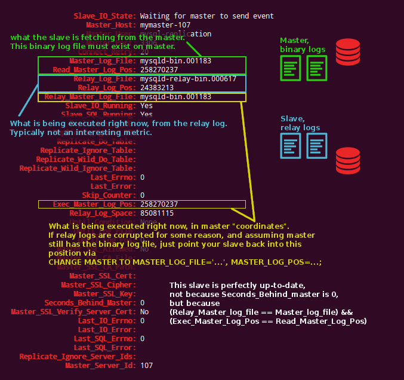
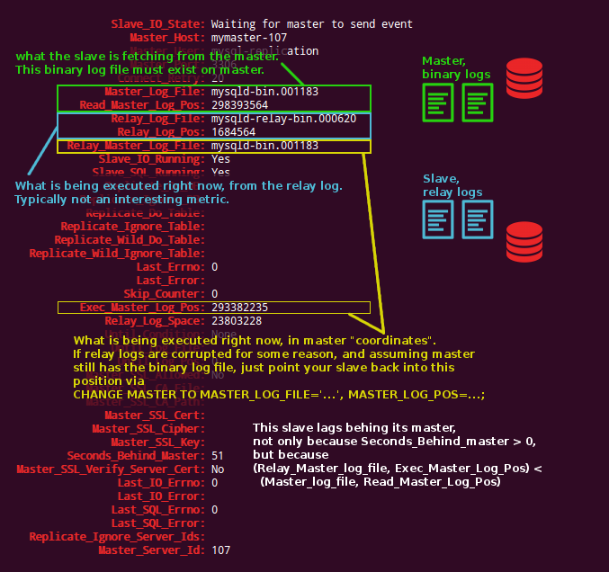

# 一次性搞定 `SHOW SLAVE STATUS` 的解读

> 解析日志文件的位置

诚然, GTID(全局事务标识符)已经在 MySQL 5.6中得到支持, 此外,还可以通过 Tungsten replicator 软件来实现(2009年以后一直有谷歌在维护,不是吗?)。

但有一部分人还在使用MySQL 5.5的标准副本方式, 那么这些二进制日志文件在哪儿呢?  `SHOW SLAVE STATUS`命令输出的的结果经常混淆我们, 而且是一次又一次。

本文尝试用可视化的方式来解读 SHOW SLAVE STATUS。

## 关于 binary logs 和 relay logs

主库(master)将日志写入二进制文件。 典型的日志文件是 `mysql-bin.#####` 或者 `mysqld-bin.#####`(其中 `#####` 代表一串数字)。

从节点(slave, 从库) 连接到对应的主节点(master, 主库), 从主库的二进制日志中读取条目。 从节点将这些条目写入自己的中继日志(relay logs)。  典型的中继日志文件是 `mysql-relay.#####` 或者 `mysqld-relay.#####`(其中 `#####` 代表一串数字)。

从节点的中继日志,与主节点的二进制日志并没有名称或者数量上的对应关系。 中继日志的存储位置, 和主节点二进制日志的存储位置也没有任何关系。 文件会自动刷入磁盘并滚动; 根据配置可以有不同大小。 当然, 从节点追踪当前的 relay-log 条目: 知道它匹配主节点的哪个二进制条目。 

> 这是一个很重要的知识点。

从节点(通过 `IO_THREAD` 线程)获取条目并写入中继日志, 读取中继日志, 并通过 `SQL_THREAD` 线程重放这些条目)。

所以在每个时间点上, 我们都对以下这些“坐标”感兴趣:

- 通过主节点的哪些地方获取数据? 从哪个文件, 哪个位置获取。
- 将信息写到哪里? (这里隐含使用最新的中继日志文件, 以及它的大小决定)
- 当前执行的 slave 查询的位置, 在 relay-log 中的坐标。 从节点读取的位置, 要远比写入位置小。
- 当前执行的 slave 查询的位置, 在主节点 binary-log 中的坐标。 这个信息告诉我们, 主从同步之间的距离有多远。

从 `SHOW SLAVE STATUS` 的输出内容中, 我们如何解读上面这些信息? 

下面以两张图片为示例。 

第一张图片, 演示了跟上主节点的slave状态。

下面这张图片, 演示了落后的 slave 状态。

希望这对你有所帮助。

原文链接: [The "once and for all" SHOW SLAVE STATUS log files & positions explained](http://code.openark.org/blog/mysql/the-once-and-for-all-show-slave-status-log-files-positions-explained)

原文日期: 2014年03月06日

翻译日期: 2014年10月17日

翻译人员: [铁锚: http://blog.csdn.net/renfufei](http://blog.csdn.net/renfufei)
