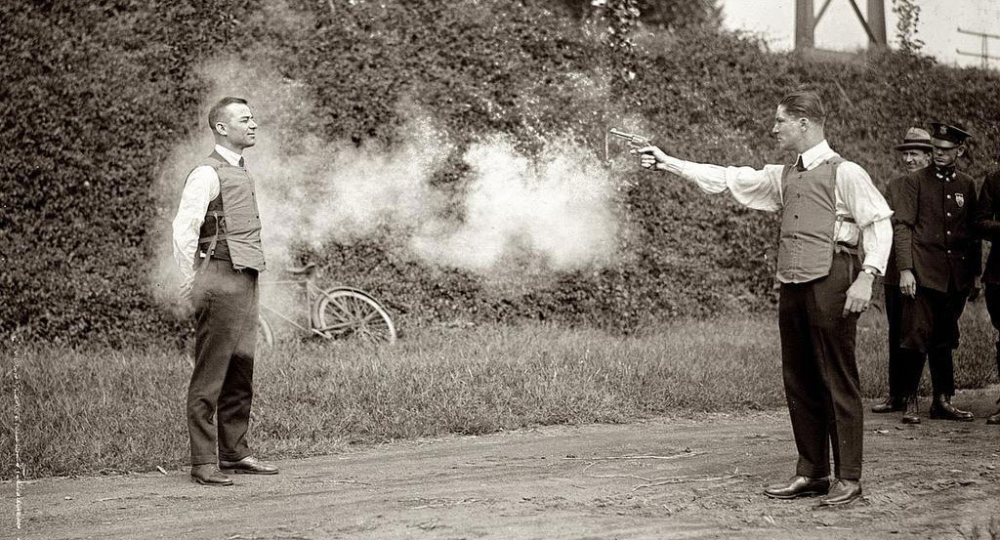

生产环境线上测试的惨淡人生
====

对生产环境进行测试是不得不做的事,但又是谁都不想做的事情,对吗? 如果一个粗心,可能会瞬间产生某些难以预料的损害. 如果一切顺利,你会觉得 "为什么还要冒这个险呢?我应该在模拟环境做这种事,然后收工!" 好吧,我们不能在生产环境绕过自动测试与人工测试,下面这张图似乎就代表了做生产环境测试的那种感觉:

图上是第一件防弹背心用来测试…… 以及一个活生生的人。 如果你看不懂这张照片与生产测试之间的相似点, 那很可能你没有幽默感。在测试生产环境时请小心行事,俗语有言: 粗心一点就是搬起石头砸自己的脚!

