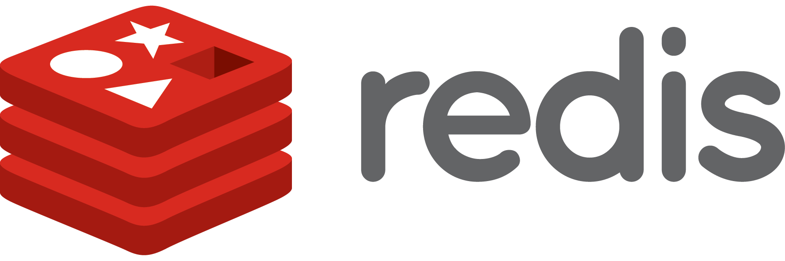
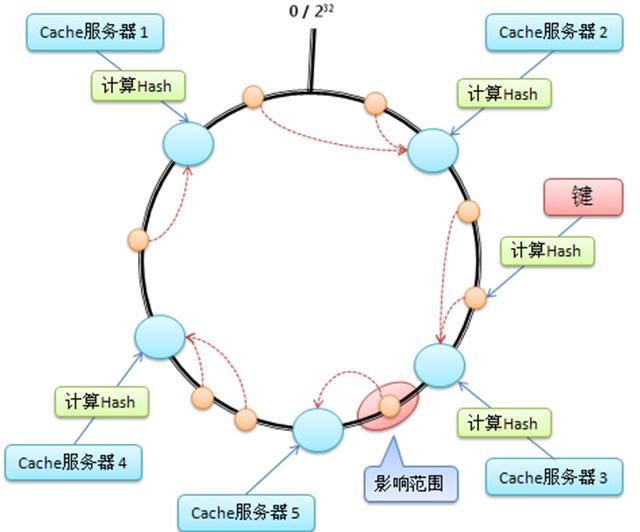

为何在缓存领域Redis取代了Memcached
==

### Redis支持多种数据结构的新兴存储系统,而Memcached仍留一席之地 ###

Memcached还是Redis? 这个问题几乎总是出现在任何讨论压缩性能的一个现代的、数据库驱动的Web应用程序。 需要提高性能时,缓存经常使用的第一步,Memcached和Redis通常第一个地方。

相似之处

让我们开始与相似之处。 Memcached和Redis都是内存中,键值数据存储。 他们都属于数据管理解决方案的NoSQL的家庭,和都是基于相同的键值数据模型。 他们都保持所有数据在内存,这当然使得它们非常有用,因为缓存层。 在性能方面,这两个数据存储也非常相似,表现出几乎相同的特征(指标)对吞吐量和延迟。

除了内存中,键值数据存储,Memcached和Redis都是成熟的、广受欢迎的开源项目。 Memcached最初是在2003年由Brad Fitzpatrick LiveJournal网站。 从那时起,Memcached已经重写C(最初的实现是在Perl)和公共领域,它已成为现代Web应用程序的基石。 Memcached是当前发展关注的稳定和优化,而不是添加新特性。

Redis由塞尔瓦托礼宾部主管,2009年礼宾部主管仍然领先今天开发人员和项目的唯一的维护者。 Redis有时被描述为“Memcached,“这一点也不令人惊讶,考虑到部分Redis建成以应对使用Memcached的经验教训。 Redis比Memcached有更多的功能,这使得它更加灵活和强大但也更复杂。

所使用的许多公司和在无数的任务关键型生产环境中,Memcached和Redis都是由客户端库中实现所有可能的编程语言,并且都包含在众多的开发者使用的库和包。 事实上,它是一种罕见的Web堆栈,不包括对Memcached或Redis的内置支持。

Memcached和Redis为什么如此受欢迎? 他们不仅是非常有效的,他们也相对简单。 开始使用Memcached或Redis被认为是容易为开发人员工作。 只需要几分钟时间来设立和使用应用程序。 因此一个小投资的时间和精力可以立即,戏剧性的对性能的影响——通常通过数量级。 一个简单的解决方案与一个巨大的好处:尽可能接近魔法。

何时使用Memcached

因为Redis更新,更多的功能与Memcached相比,Redis几乎总是更好的选择。 但是有两个特定场景Memcached可能是更可取的。 第一个是缓存小和静态数据,比如HTML代码片段。 Memcached的内部内存管理,而不像Redis的复杂,更有效率,因为Memcached将消耗相对较少的内存资源的元数据。 字符串,唯一的Memcached支持的数据类型,非常适合存储数据,只是被阅读,因为字符串不需要进一步的处理。

第二个场景,在该场景中,Memcached仍然有轻微的优势Redis是水平扩展。 部分原因在于它的设计和部分简单功能,Memcached是容易得多。 说,有几个测试并接受方法扩展Redis在单个服务器之外,和即将到来的3.0版(阅读 候选发布版笔记 )将包括内置集群正是出于这个目的。

何时使用Redis

除非你是在约束下工作(如遗留应用程序),需要使用Memcached,或你的用例匹配一个上面的两个场景中,你会总是想用Redis。 通过使用Redis作为缓存,您将获得大量的电力,如调整缓存内容的能力和耐久性,整体效率的提高。

Redis的优势是很明显的缓存管理的方方面面。 缓存使用一种称为数据的机制驱逐删除旧数据从内存为了使新数据的空间。 Memcached的数据回收机制使用LRU(最近最少使用)算法和武断就清除数据相似大小的新数据。 Redis,相比之下,允许细粒度控制驱逐虽然选择六个不同的拆迁政策。 Redis还采用了一些更复杂的内存管理方法和驱逐候选人的选择。

Redis给你更大的灵活性可以缓存的对象。 而Memcached限制关键名称250字节,值限制为1 mb,只能和普通的字符串,Redis允许关键名称和值512 mb,一样大,他们是二进制安全。 Redis有六个数据类型,使更多的智能缓存数据的缓存和操纵,开放的世界的可能性,应用程序开发人员。

而不是存储对象序列化的字符串,开发人员可以使用一个Redis散列来存储一个对象的字段和值,使用一个密钥管理它们。 Redis散列可以节省开发人员需要获取整个字符串,反序列化,更新一个值,re-serialize对象,在缓存中整个字符串替换新值为每一个琐碎的更新,这意味着降低资源消耗和提高性能。 Redis提供其他数据类型,比如列表和集,可用于实现更为复杂的缓存管理模式。

Redis的另一个重要优点是它存储的数据不透明,这意味着服务器可以直接操纵它。 相当大的份额160多命令可以在Redis致力于数据处理操作和嵌入逻辑数据存储本身通过服务器端脚本。 这些内置命令和用户脚本给你的灵活性在Redis直接处理数据处理任务,而无需船舶数据通过网络到另一个系统进行处理。

Redis提供可选和可调数据持久性,旨在引导后缓存计划关闭或计划外故障。 虽然我们倾向于认为缓存中的数据稳定,瞬态数据持久化到磁盘可以在缓存场景中很有价值的。 有缓存的数据用于加载后立即重新启动缓存预热时间允许短得多,而且消除了负载参与重新填充和重新计算缓存内容从主数据存储。

最后但并非最不重要,Redis提供复制。 复制可以用于实现一个高度可用的缓存设置,可以承受失败和提供不间断服务的应用程序。 考虑缓存失败瀑布只有略短的应用程序对用户体验的影响应用程序的性能,有一个行之有效的解决方案,保证了缓存的内容和服务可用性在大多数情况下是一个主要的优势。

 
开源软件继续提供一些现有的最佳技术。 时通过缓存来提高应用程序的性能,Redis和Memcached是建立和production-proven解决方案和自然的候选人。 然而,鉴于其丰富的功能和更先进的设计,Redis应该是你的第一选择在几个场景。

伊塔玛哈伯 ( @itamarhaber ) Redis首席开发人员提倡实验室,提供Memcached和Redis作为开发人员完全托管的云服务。 他多样的经验包括软件产品开发和管理和领导角色在Xeround Etagon Amicada,M.N. 年代有限公司伊塔玛拥有工商管理硕士联合Kellogg-Recanati计划由西北和特拉维夫大学,以及在计算机科学学士。  

**相关阅读:**

- [使用Memcached提升Java企业应用性能,Part 1:体系结构和配置](http://www.javaworld.com/article/2078565/open-source-tools/use-memcached-for-java-enterprise-performance--part-1--architecture-and-setup.html)
- [使用Memcached提升Java企业应用性能,Part 2:数据库驱动的 web apps](http://www.javaworld.com/article/2078584/open-source-tools/use-memcached-for-java-enterprise-performance--part-2--database-driven-web-apps.html)
- [Cache之争: Azure和AWS更新缓存服务](http://www.javaworld.com/article/2078868/java-app-dev/cache-warfare--azure-and-aws-get-updated-caching-services.html)

##

原文链接: [Why Redis beats Memcached for caching](http://www.javaworld.com/article/2836878/developer-tools-ide/why-redis-beats-memcached-for-caching.html)

原文日期: 2014-10-15

翻译日期: 2014-10-23

翻译人员: [铁锚](http://blog.csdn.net/renfufei)
