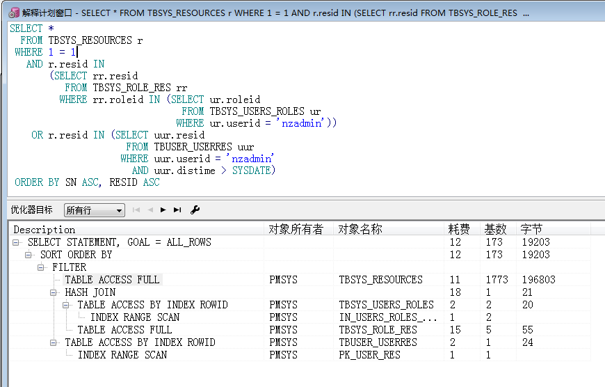
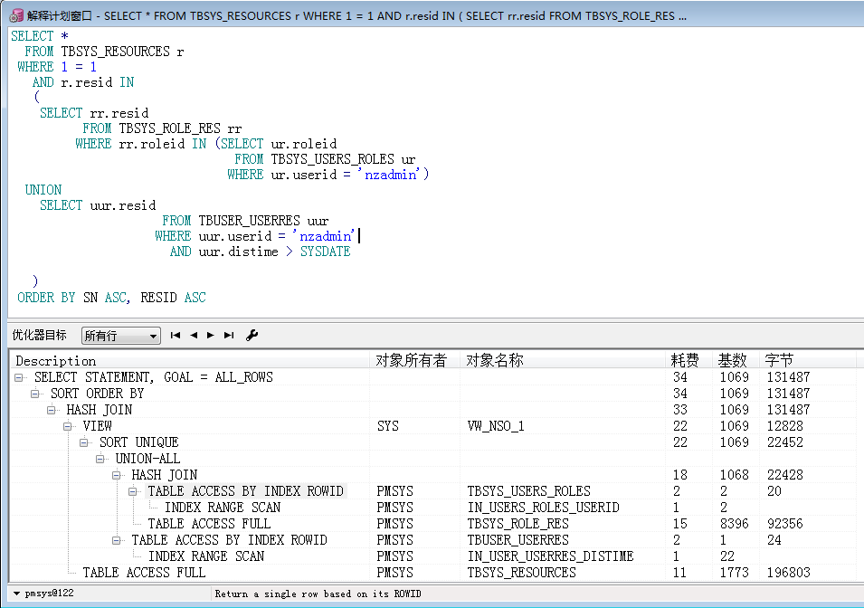
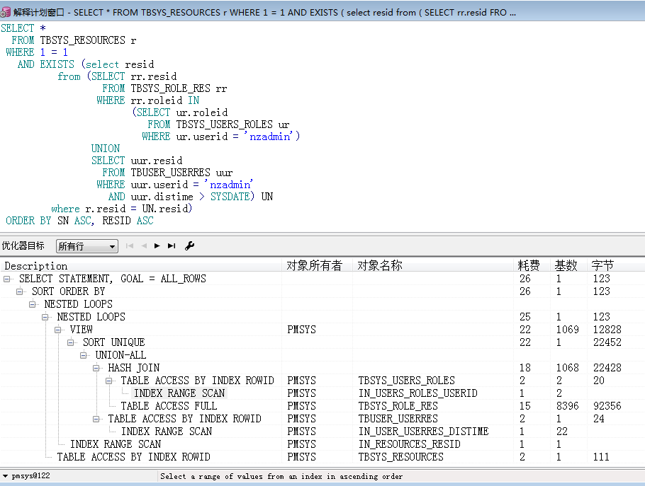

Oracle中 SQL 执行太慢的元凶: OR 
======

# 1.使用OR的登录语句 #

	SELECT *
	  FROM TBSYS_RESOURCES r
	 WHERE 1 = 1
	   AND r.resid IN
	       (SELECT rr.resid
	          FROM TBSYS_ROLE_RES rr
	         WHERE rr.roleid IN (SELECT ur.roleid
	                               FROM TBSYS_USERS_ROLES ur
	                              WHERE ur.userid = 'nzadmin'))
	    OR r.resid IN (SELECT uur.resid
	                     FROM TBUSER_USERRES uur
	                    WHERE uur.userid = 'nzadmin'
	                      AND uur.distime > SYSDATE)
	 ORDER BY SN ASC, RESID ASC

- 耗时 1.311秒 ~ 1.6秒

## 1.1 查询计划 ##

**查询计划截图:**

**分析原因:** 是因为其中有2次全表扫描,而这么慢的原因在于 `... OR ...` ; 与 `1=1` 关系不是很大，虽然也有一点影响(或者可能是数据量小的原因)

# 2.使用 UNION 优化内部 #

	SELECT *
	  FROM TBSYS_RESOURCES r
	 WHERE 1 = 1
	   AND r.resid IN
	   (
			SELECT rr.resid
	          FROM TBSYS_ROLE_RES rr
	         WHERE rr.roleid IN (SELECT ur.roleid
	                               FROM TBSYS_USERS_ROLES ur
	                              WHERE ur.userid = 'nzadmin')
	  UNION
	    SELECT uur.resid
	                     FROM TBUSER_USERRES uur
	                    WHERE uur.userid = 'nzadmin'
	                      AND uur.distime > SYSDATE
	   
	   )
	 ORDER BY SN ASC, RESID ASC

- 耗时: 0.031秒 ~ 0.046秒

## 2.1 查询计划 ##

**查询计划截图:**

将 `OR` 修改为 `UNION` 实现后，快了25-50倍。

# 3.使用 EXISTS #

	SELECT *
	  FROM TBSYS_RESOURCES r
	 WHERE 1 = 1
	   AND EXISTS (select resid
	          from (SELECT rr.resid
	                  FROM TBSYS_ROLE_RES rr
	                 WHERE rr.roleid IN
	                       (SELECT ur.roleid
	                          FROM TBSYS_USERS_ROLES ur
	                         WHERE ur.userid = 'nzadmin')
	                UNION
	                SELECT uur.resid
	                  FROM TBUSER_USERRES uur
	                 WHERE uur.userid = 'nzadmin'
	                   AND uur.distime > SYSDATE
	                
	                ) UN
	         where r.resid = UN.resid)
	 ORDER BY SN ASC, RESID ASC

- 耗时 0.031秒 ~ 0.047秒

## 3.1 查询计划 ##

**查询计划截图:**

根据初浅的结论得出, Oracle 10g, 11g已经自动开启了半连接优化， 所以 **IN** 和 **EXISTS** 的效率差不多

当然,数据量不是很大,所以可能有偏差.

而且， 存在进一步优化的空间,但是呢,已经满足业务需求,而且时间宝贵,项目多得做不完,没法子,留待以后研究吧
