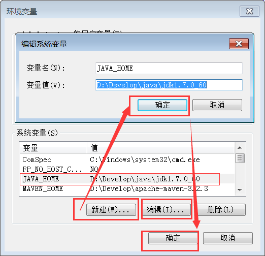
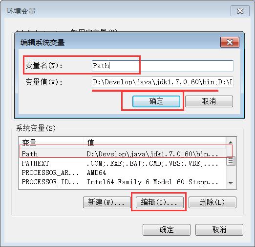

Windows下载安装JDK
==

JDK在Oracle官网下载,大致是找到 Java For Developers,然后选择即可. 推荐下载JDK7的最新版本, 请根据操作系统进行选择,例如 Windows x86 是32位的, Windows x64是64位的:

下载页面: [http://www.oracle.com/technetwork/java/javase/downloads/jdk7-downloads-1880260.html](http://www.oracle.com/technetwork/java/javase/downloads/jdk7-downloads-1880260.html)

32位JDK7下载链接: [http://download.oracle.com/otn-pub/java/jdk/7u71-b14/jdk-7u71-windows-i586.exe](http://download.oracle.com/otn-pub/java/jdk/7u71-b14/jdk-7u71-windows-i586.exe)

64位JDK7下载链接: [http://download.oracle.com/otn-pub/java/jdk/7u71-b14/jdk-7u71-windows-x64.exe](http://download.oracle.com/otn-pub/java/jdk/7u71-b14/jdk-7u71-windows-x64.exe)

JDK安装没有什么好说的, 设置 Path,以及 JAVA_HOME 即可:

如: 

	JAVA_HOME

值为:

	D:\Develop\java\jdk1.7.0_60

如下图所示:

设置 Path,使用英文逗号分隔,添加上 java对应的bin目录:

	Path
值为
	D:\Develop\java\jdk1.7.0_60\bin;

建议设置到最前面.如下图所示:

