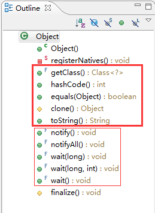

Object类源码分析
==

Object类是所有类继承层次中的根.

每个类最终的超类(superclass)都是 Object.

所有对象, 包括数组(array),都具有Object类中方法的实现.

类的完全限定名: `java.lang.Object`

基础定义:	`public class Object`

## registerNatives()

类开始的地方,是一个私有的native静态方法:

    private static native void registerNatives();
    static {
        registerNatives();
    }

并且指定了静态块在类被加载后进行注册. 源码对此方法没有注释,根据Java命名规范和约定,猜测是注册本地方法,也就是和JVM进行通信,调用一些钩子函数之类的东西.

Object类中只有这么一个 static 方法,其余的都是实例方法, 也就是具体对象

## getClass()

然后是实例的 getClass() 方法, 此方法定义是 `final` 的: 

	public final native Class<?> getClass();

注释信息: 

返回当前对象(this,谁调用就是谁)的运行时类.

返回的 Class 对象就是该对象的类定义中 `static synchronized` 方法的默认锁资源.

实际的返回类型是 `Class<? extends |X|>`, 但在调用 getClass 时 `|X|` 已经被类型擦除了(只存在于编译期检查, Java的运行期没有泛型). 例如,下面的代码中就不需要类型转换:

	Number n = 0;                             
	Class<? extends Number> c = n.getClass();

## hashCode()

返回此对象的 hash code (散列码). 返回值类型为 `int`. 

- Returns a hash code value for the object. This method is
supported for the benefit of hash tables such as those provided by
{@link java.util.HashMap}.

默认实现是native方法,代码如下:

    public native int hashCode();

当然,你也可以在自己的类中覆写此方法. hashCode()方法是为了支持哈希表(hash tables)而提供的,比如 `java.util.HashMap`.

对 `hashCode` 方法的实现, 一般约定如下:

The general contract of {@code hashCode} is:

- 对同一个对象, 多次调用 `hashCode` 方法, 其返回值应该一致。 所以 hash code 的计算, 不应该依赖于运行过程中会变化的那些字段。 特别是在 equals 方法中使用到的那些会变化的字段。对于多个 JVM 实例中逻辑上相等的对象, hashCode 方法的返回值允许不一致。

- 如果 `equals()` 方法判定两个对象相等,那么这两个对象的 `hashCode()` 方法必须返回相同的哈希码.

- 两个不相等的对象, 可以返回相同 hash code 值, 即 hash 值允许冲突,甚至一个类的所有对象 hash code 全部一模一样都是允许的, 如 `return 1;`。

为了实用, `Object` 类的 `hashCode` 方法, 为不同的对象返回不同的整数 hash code。一般JVM是将对象的内部地址(internal
address) 转换为整数, 但Java语言规范并没有强制要求这样实现。

详细讨论参见: [http://stackoverflow.com/a/3796963](http://stackoverflow.com/a/3796963)

从中可以看到, `Object` 类的native方法 `hashCode()`中, 使用了一个状态位来标记是否缓存了 hash code 值。

## equals()

判断其他对象是否 "等于" 此对象.

默认实现如下:

    public boolean equals(Object obj) {
        return (this == obj);
    }

也就是判断是不是同样的内存地址. 如果没有重写 equals方法,则只有 this 等于 this.(原因是同一个对象可能会有多个引用指向它).

Indicates whether some other object is "equal to" this one.

The {@code equals} method implements an equivalence relation
on non-null object references:

- It is <i>reflexive</i>: for any non-null reference value
    {@code x}, {@code x.equals(x)} should return
    {@code true}.
- It is <i>symmetric</i>: for any non-null reference values
    {@code x} and {@code y}, {@code x.equals(y)}
    should return {@code true} if and only if
    {@code y.equals(x)} returns {@code true}.
- It is <i>transitive</i>: for any non-null reference values
    {@code x}, {@code y}, and {@code z}, if
    {@code x.equals(y)} returns {@code true} and
    {@code y.equals(z)} returns {@code true}, then
    {@code x.equals(z)} should return {@code true}.
- It is <i>consistent</i>: for any non-null reference values
    {@code x} and {@code y}, multiple invocations of
    {@code x.equals(y)} consistently return {@code true}
    or consistently return {@code false}, provided no
    information used in {@code equals} comparisons on the
    objects is modified.
- For any non-null reference value {@code x},
    {@code x.equals(null)} should return {@code false}.

The {@code equals} method for class {@code Object} implements
the most discriminating possible equivalence relation on objects;
that is, for any non-null reference values {@code x} and
{@code y}, this method returns {@code true} if and only
if {@code x} and {@code y} refer to the same object
({@code x == y} has the value {@code true}).

Note that it is generally necessary to override the {@code hashCode}
method whenever this method is overridden, so as to maintain the
general contract for the {@code hashCode} method, which states
that equal objects must have equal hash codes.

## clone()

创建并返回此对象的一个拷贝.

一般约定:

- 表达式 `x.clone() != x` 的值为 `true`
- `x.clone().getClass() == x.getClass()` 的值也为 `true`

但也不是绝对要求,请根据实际情况决定.

典型的约定是:

- `x.clone().equals(x)` 的值为 `true`

但也不是绝对性要求,具体情况有时候会比较复杂,请根据需求和设计而定.

    protected native Object clone() throws 
		CloneNotSupportedException;

## toString()

toString方法的默认实现很简单,可以看到, 就是获取类名,加上 @, 再加上 hashCode()转换为16进制后的表现形式:

    public String toString() {
        return getClass().getName() 
		+ "@" 
		+ Integer.toHexString(hashCode());
    }

## notify()

    public final native void notify();

## notifyAll()

    public final native void notifyAll();

## wait()

    public final native void wait(long timeout) 
		throws InterruptedException;

然后

    public final void wait() throws InterruptedException {
        wait(0);
    }

此外,

    public final void wait(long timeout, int nanos) 
		throws InterruptedException {
        if (timeout < 0) {
            throw new IllegalArgumentException(
				"timeout value is negative");
        }

        if (nanos < 0 || nanos > 999999) {
            throw new IllegalArgumentException(
              "nanosecond timeout value out of range");
        }

        if (nanos >= 500000 
			|| (nanos != 0 && timeout == 0)) {
            timeout++;
        }

        wait(timeout);
    }

## finalize()

    protected void finalize() throws Throwable { }

## 示例

## 总结

在Eclipse中可以看到如下的 OutLine:

可以看到, Object也有一个自动生成的无参构造方法. 

看来Sun和Oracle都希望我们快速编码,非必要时就不去定义默认的那个无参构造方法.

这是Java追求的目标之一,就是节省程序员的时间和精力,当然,同时也节省了软件开发的成本. 这些成本总是需要企业或者老板支付的.

自动垃圾回收, Spring, 以及很多框架的设计目的都是为了减少重复而又没有太大价值的代码. 反观备受冷落的 EJB,很明显就是加重了程序员和企业的开发运行成本.

Object类源码中总共有12个方法,没有属性域. 这样的设计保证了没有多余的内存被占用.

其中,静态方法1个,而且是私有的,不需要我们关心.

然后是5个常用方法:

以及5个同步块中的等待和通知方法:

最后还有一个一般不使用的方法:

 `finalize()`.

JDK与Hotspot源代码链接: 

- OpenJDK网站: <https://openjdk.java.net>
- 源码仓库: <https://hg.openjdk.java.net/>
- JDK8源码目录: <https://hg.openjdk.java.net/jdk8>

`Object.c` 文件在线预览地址: <https://hg.openjdk.java.net/jdk8/jdk8/jdk/file/687fd7c7986d/src/share/native/java/lang/Object.c>

其中, HashCode等方法的实现, 位于JVM的实现代码中, 参考: <https://hg.openjdk.java.net/jdk8/jdk8/hotspot/file/87ee5ee27509/src/share/vm/prims/jvm.cpp#l505>

FastHashCode 的实现代码: <https://hg.openjdk.java.net/jdk8/jdk8/hotspot/file/87ee5ee27509/src/share/vm/runtime/synchronizer.cpp#l601>

